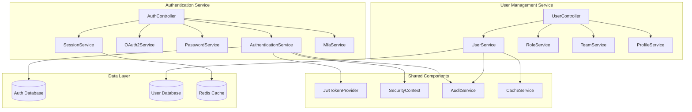

# Design Document

## Overview

This design document outlines the comprehensive optimization of the Authentication Service and User Management Service to implement the full API specification as documented in the CRM Platform API Documentation. The design focuses on creating production-ready, secure, and scalable services that support OAuth2, MFA, session management, RBAC, and team management.

## Architecture

### Service Architecture



### Component Responsibilities

#### Authentication Service Components

**AuthController**
- Handles all authentication-related HTTP requests
- Implements OAuth2 endpoints, login/logout, MFA, session management
- Provides comprehensive API documentation with Swagger annotations
- Implements security logging and monitoring

**AuthenticationService**
- Core authentication logic including credential validation
- Session management and token generation
- Account lockout and rate limiting
- Integration with User Service for profile data

**OAuth2Service**
- OAuth2 authorization code and client credentials flows
- Token exchange, refresh, and revocation
- Client application management
- Scope-based authorization

**PasswordService**
- Password reset request and confirmation
- Password change with validation
- Password policy enforcement
- Secure token generation and validation

**SessionService**
- Active session management across devices
- Session validation and termination
- Device tracking and location detection
- Session security monitoring

**MfaService**
- TOTP setup and verification
- Backup code generation and management
- MFA method configuration
- Device trust management

#### User Management Service Components

**UserController**
- Handles all user management HTTP requests
- Implements CRUD operations, role management, team operations
- Provides comprehensive filtering and pagination
- Implements audit logging for user operations

**UserService**
- Core user management business logic
- Profile management and validation
- User lifecycle management (activation, deactivation, deletion)
- Integration with authentication service

**RoleService**
- Role assignment and removal
- Permission calculation and validation
- Role hierarchy management
- Effective permissions computation

**TeamService**
- Team creation and management
- Member addition and removal
- Team permissions and settings
- Team statistics and reporting

**ProfileService**
- Detailed profile management
- Avatar upload and processing
- Preference management
- Privacy settings

## Components and Interfaces

### Data Models

#### Authentication Service Models

```java
// UserCredentials Entity
@Entity
public class UserCredentials {
    private UUID id;
    private UUID userId;
    private UUID tenantId;
    private String email;
    private String passwordHash;
    private boolean emailVerified;
    private int failedLoginAttempts;
    private LocalDateTime lockedUntil;
    private LocalDateTime lastLoginAt;
    private boolean mfaEnabled;
    private String mfaSecret;
    private List<String> backupCodes;
    // ... other fields
}

// UserSession Entity
@Entity
public class UserSession {
    private UUID id;
    private UUID userId;
    private String tokenId;
    private String refreshToken;
    private LocalDateTime expiresAt;
    private LocalDateTime refreshExpiresAt;
    private String ipAddress;
    private String userAgent;
    private String deviceType;
    private String location;
    private SessionStatus status;
    // ... other fields
}

// OAuth2Client Entity
@Entity
public class OAuth2Client {
    private String clientId;
    private String clientSecret;
    private String name;
    private List<String> redirectUris;
    private List<String> scopes;
    private GrantType[] grantTypes;
    private UUID tenantId;
    // ... other fields
}
```

#### User Management Service Models

```java
// User Entity (Enhanced)
@Entity
public class User {
    private UUID id;
    private UUID tenantId;
    private String email;
    private String firstName;
    private String lastName;
    private String phoneNumber;
    private String jobTitle;
    private String department;
    private String profileImageUrl;
    private String timezone;
    private String language;
    private String dateFormat;
    private String timeFormat;
    private UserStatus status;
    private boolean onboardingCompleted;
    private LocalDateTime lastActivityAt;
    private UUID managerId;
    private Set<String> roles;
    private Map<String, Object> customFields;
    // ... notification preferences and other fields
}

// Team Entity
@Entity
public class Team {
    private UUID id;
    private UUID tenantId;
    private String name;
    private String description;
    private String department;
    private UUID managerId;
    private Set<UUID> memberIds;
    private Set<String> permissions;
    private Map<String, Object> settings;
    private TeamStatus status;
    // ... other fields
}

// Role Entity
@Entity
public class Role {
    private UUID id;
    private UUID tenantId;
    private String name;
    private String description;
    private Set<String> permissions;
    private RoleType type;
    private boolean isDefault;
    // ... other fields
}
```

### API Response Structure

```java
// Standardized API Response
public class ApiResponse<T> {
    private boolean success;
    private T data;
    private ApiResponseMeta meta;
    private List<ApiError> errors;
    
    public static <T> ApiResponse<T> success(T data) {
        return new ApiResponse<>(true, data, createMeta(), null);
    }
    
    public static <T> ApiResponse<T> error(List<ApiError> errors) {
        return new ApiResponse<>(false, null, createMeta(), errors);
    }
}

// Response Metadata
public class ApiResponseMeta {
    private String timestamp;
    private String version;
    private String requestId;
    private PaginationMeta pagination;
    private RateLimitMeta rateLimit;
    private String processingTime;
}
```

### Service Interfaces

```java
// Authentication Service Interface
public interface AuthenticationService {
    LoginResponse authenticate(LoginRequest request, HttpServletRequest httpRequest);
    LoginResponse refreshToken(RefreshTokenRequest request, HttpServletRequest httpRequest);
    Map<String, Object> logout(String authorization, LogoutRequest request, HttpServletRequest httpRequest);
    RegistrationResponse register(RegistrationRequest request, HttpServletRequest httpRequest);
    Map<String, Object> verifyEmail(EmailVerificationRequest request, HttpServletRequest httpRequest);
    Map<String, Object> resendVerificationEmail(ResendVerificationRequest request, HttpServletRequest httpRequest);
}

// OAuth2 Service Interface
public interface OAuth2Service {
    void authorize(OAuth2AuthorizationRequest request, HttpServletRequest httpRequest, HttpServletResponse httpResponse);
    OAuth2TokenResponse exchangeToken(OAuth2TokenRequest request, HttpServletRequest httpRequest);
    OAuth2TokenResponse refreshToken(RefreshTokenRequest request, HttpServletRequest httpRequest);
    void revokeToken(RevokeTokenRequest request, HttpServletRequest httpRequest);
    UserInfo getUserInfo(String authorization);
}

// User Service Interface
public interface UserService {
    UserResponse createUser(CreateUserRequest request);
    Optional<UserResponse> getUserById(UUID userId);
    UserResponse updateUser(UUID userId, UpdateUserRequest request);
    void deleteUser(UUID userId, DeleteUserRequest request);
    Page<UserResponse> listUsers(UserFilterRequest filter, Pageable pageable);
    void activateUser(UUID userId);
    void deactivateUser(UUID userId, DeactivateUserRequest request);
}
```

## Data Models

### Database Schema Design

#### Authentication Service Schema

```sql
-- User Credentials Table
CREATE TABLE user_credentials (
    id UUID PRIMARY KEY DEFAULT gen_random_uuid(),
    user_id UUID NOT NULL,
    tenant_id UUID NOT NULL,
    email VARCHAR(255) NOT NULL,
    password_hash VARCHAR(255) NOT NULL,
    email_verified BOOLEAN DEFAULT FALSE,
    failed_login_attempts INTEGER DEFAULT 0,
    locked_until TIMESTAMP WITH TIME ZONE,
    last_login_at TIMESTAMP WITH TIME ZONE,
    mfa_enabled BOOLEAN DEFAULT FALSE,
    mfa_secret VARCHAR(255),
    backup_codes TEXT[],
    created_at TIMESTAMP WITH TIME ZONE DEFAULT NOW(),
    updated_at TIMESTAMP WITH TIME ZONE DEFAULT NOW(),
    
    CONSTRAINT uk_user_credentials_email_tenant UNIQUE(email, tenant_id),
    CONSTRAINT fk_user_credentials_tenant FOREIGN KEY (tenant_id) REFERENCES tenants(id)
);

-- User Sessions Table
CREATE TABLE user_sessions (
    id UUID PRIMARY KEY DEFAULT gen_random_uuid(),
    user_id UUID NOT NULL,
    tenant_id UUID NOT NULL,
    token_id VARCHAR(255) NOT NULL UNIQUE,
    refresh_token VARCHAR(255) NOT NULL UNIQUE,
    expires_at TIMESTAMP WITH TIME ZONE NOT NULL,
    refresh_expires_at TIMESTAMP WITH TIME ZONE NOT NULL,
    ip_address INET,
    user_agent TEXT,
    device_type VARCHAR(50),
    browser VARCHAR(100),
    location VARCHAR(255),
    status VARCHAR(20) DEFAULT 'ACTIVE',
    last_accessed_at TIMESTAMP WITH TIME ZONE DEFAULT NOW(),
    created_at TIMESTAMP WITH TIME ZONE DEFAULT NOW(),
    
    CONSTRAINT fk_user_sessions_tenant FOREIGN KEY (tenant_id) REFERENCES tenants(id)
);

-- OAuth2 Clients Table
CREATE TABLE oauth2_clients (
    client_id VARCHAR(255) PRIMARY KEY,
    client_secret VARCHAR(255) NOT NULL,
    name VARCHAR(255) NOT NULL,
    description TEXT,
    redirect_uris TEXT[] NOT NULL,
    scopes TEXT[] NOT NULL,
    grant_types TEXT[] NOT NULL,
    tenant_id UUID NOT NULL,
    is_active BOOLEAN DEFAULT TRUE,
    created_at TIMESTAMP WITH TIME ZONE DEFAULT NOW(),
    updated_at TIMESTAMP WITH TIME ZONE DEFAULT NOW(),
    
    CONSTRAINT fk_oauth2_clients_tenant FOREIGN KEY (tenant_id) REFERENCES tenants(id)
);
```

#### User Management Service Schema

```sql
-- Enhanced Users Table
CREATE TABLE users (
    id UUID PRIMARY KEY DEFAULT gen_random_uuid(),
    tenant_id UUID NOT NULL,
    email VARCHAR(255) NOT NULL,
    first_name VARCHAR(100),
    last_name VARCHAR(100),
    phone_number VARCHAR(20),
    job_title VARCHAR(150),
    department VARCHAR(100),
    profile_image_url TEXT,
    timezone VARCHAR(50) DEFAULT 'UTC',
    language VARCHAR(10) DEFAULT 'en',
    date_format VARCHAR(20) DEFAULT 'YYYY-MM-DD',
    time_format VARCHAR(10) DEFAULT '24h',
    status VARCHAR(20) DEFAULT 'ACTIVE',
    onboarding_completed BOOLEAN DEFAULT FALSE,
    last_activity_at TIMESTAMP WITH TIME ZONE,
    manager_id UUID,
    employee_id VARCHAR(50),
    start_date DATE,
    work_location VARCHAR(100),
    bio TEXT,
    skills TEXT[],
    social_profiles JSONB,
    custom_fields JSONB,
    notification_preferences JSONB,
    privacy_settings JSONB,
    created_at TIMESTAMP WITH TIME ZONE DEFAULT NOW(),
    updated_at TIMESTAMP WITH TIME ZONE DEFAULT NOW(),
    
    CONSTRAINT uk_users_email_tenant UNIQUE(email, tenant_id),
    CONSTRAINT fk_users_tenant FOREIGN KEY (tenant_id) REFERENCES tenants(id),
    CONSTRAINT fk_users_manager FOREIGN KEY (manager_id) REFERENCES users(id)
);

-- Teams Table
CREATE TABLE teams (
    id UUID PRIMARY KEY DEFAULT gen_random_uuid(),
    tenant_id UUID NOT NULL,
    name VARCHAR(255) NOT NULL,
    description TEXT,
    department VARCHAR(100),
    manager_id UUID,
    permissions TEXT[],
    settings JSONB,
    status VARCHAR(20) DEFAULT 'ACTIVE',
    created_at TIMESTAMP WITH TIME ZONE DEFAULT NOW(),
    updated_at TIMESTAMP WITH TIME ZONE DEFAULT NOW(),
    
    CONSTRAINT uk_teams_name_tenant UNIQUE(name, tenant_id),
    CONSTRAINT fk_teams_tenant FOREIGN KEY (tenant_id) REFERENCES tenants(id),
    CONSTRAINT fk_teams_manager FOREIGN KEY (manager_id) REFERENCES users(id)
);

-- Team Members Table
CREATE TABLE team_members (
    id UUID PRIMARY KEY DEFAULT gen_random_uuid(),
    team_id UUID NOT NULL,
    user_id UUID NOT NULL,
    role VARCHAR(50) DEFAULT 'member',
    permissions TEXT[],
    joined_at TIMESTAMP WITH TIME ZONE DEFAULT NOW(),
    added_by UUID,
    
    CONSTRAINT uk_team_members UNIQUE(team_id, user_id),
    CONSTRAINT fk_team_members_team FOREIGN KEY (team_id) REFERENCES teams(id) ON DELETE CASCADE,
    CONSTRAINT fk_team_members_user FOREIGN KEY (user_id) REFERENCES users(id) ON DELETE CASCADE,
    CONSTRAINT fk_team_members_added_by FOREIGN KEY (added_by) REFERENCES users(id)
);

-- Roles Table
CREATE TABLE roles (
    id UUID PRIMARY KEY DEFAULT gen_random_uuid(),
    tenant_id UUID NOT NULL,
    name VARCHAR(100) NOT NULL,
    description TEXT,
    permissions TEXT[] NOT NULL,
    role_type VARCHAR(20) DEFAULT 'CUSTOM',
    is_default BOOLEAN DEFAULT FALSE,
    created_at TIMESTAMP WITH TIME ZONE DEFAULT NOW(),
    updated_at TIMESTAMP WITH TIME ZONE DEFAULT NOW(),
    
    CONSTRAINT uk_roles_name_tenant UNIQUE(name, tenant_id),
    CONSTRAINT fk_roles_tenant FOREIGN KEY (tenant_id) REFERENCES tenants(id)
);

-- User Roles Table
CREATE TABLE user_roles (
    id UUID PRIMARY KEY DEFAULT gen_random_uuid(),
    user_id UUID NOT NULL,
    role_id UUID NOT NULL,
    assigned_at TIMESTAMP WITH TIME ZONE DEFAULT NOW(),
    assigned_by UUID,
    expires_at TIMESTAMP WITH TIME ZONE,
    reason TEXT,
    
    CONSTRAINT uk_user_roles UNIQUE(user_id, role_id),
    CONSTRAINT fk_user_roles_user FOREIGN KEY (user_id) REFERENCES users(id) ON DELETE CASCADE,
    CONSTRAINT fk_user_roles_role FOREIGN KEY (role_id) REFERENCES roles(id) ON DELETE CASCADE,
    CONSTRAINT fk_user_roles_assigned_by FOREIGN KEY (assigned_by) REFERENCES users(id)
);
```

## Error Handling

### Error Response Structure

```java
public class ApiError {
    private String code;
    private String message;
    private String field;
    private Object value;
    private String constraint;
    private Map<String, Object> context;
}
```

### Error Categories

1. **Authentication Errors**
   - INVALID_CREDENTIALS
   - TOKEN_EXPIRED
   - ACCOUNT_LOCKED
   - MFA_REQUIRED
   - EMAIL_NOT_VERIFIED

2. **Authorization Errors**
   - INSUFFICIENT_PERMISSIONS
   - INVALID_SCOPE
   - TENANT_ACCESS_DENIED

3. **Validation Errors**
   - REQUIRED_FIELD
   - INVALID_FORMAT
   - CONSTRAINT_VIOLATION
   - DUPLICATE_VALUE

4. **Business Logic Errors**
   - USER_NOT_FOUND
   - TEAM_NOT_FOUND
   - ROLE_NOT_FOUND
   - INVALID_OPERATION

## Testing Strategy

### Unit Testing
- Service layer testing with mocked dependencies
- Repository layer testing with test containers
- DTO validation testing
- Security component testing

### Integration Testing
- API endpoint testing with TestRestTemplate
- Database integration testing
- OAuth2 flow testing
- MFA workflow testing

### Security Testing
- Authentication bypass testing
- Authorization testing
- Input validation testing
- Session management testing
- Rate limiting testing

### Performance Testing
- Load testing for authentication endpoints
- Concurrent session testing
- Database performance testing
- Cache performance testing

## Security Considerations

### Authentication Security
- Password hashing with bcrypt
- JWT token signing and validation
- Session token rotation
- Rate limiting and account lockout
- Secure password reset flows

### Authorization Security
- Role-based access control
- Permission validation
- Tenant isolation
- API scope validation
- Resource-level authorization

### Data Security
- Sensitive data encryption
- PII data masking
- Audit trail logging
- Secure token storage
- Data retention policies

### Communication Security
- HTTPS enforcement
- CORS configuration
- CSRF protection
- Request/response validation
- Security headers