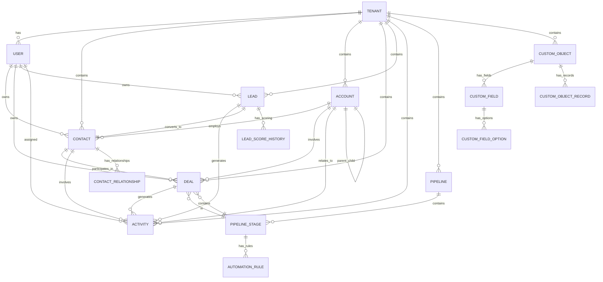

# Design Document

## Overview

This design document outlines the architecture and implementation approach for a comprehensive CRM microservices platform. The system follows a cloud-native, microservices architecture built with Java Spring Boot, featuring core infrastructure services and business domain services, all containerized with Docker and orchestrated for multi-environment deployment.

The platform implements enterprise-grade patterns including service discovery, API gateway routing, JWT authentication, multi-tenant data isolation, event-driven communication, and comprehensive observability.

## Architecture

### High-Level Architecture

The system follows a layered microservices architecture:

```
┌─────────────────────────────────────────────────────────────┐
│                    Client Applications                       │
│              (Web App, Mobile App, APIs)                    │
└─────────────────────────────────────────────────────────────┘
                              │
┌─────────────────────────────────────────────────────────────┐
│                     API Gateway Layer                       │
│                  (Kong/Spring Cloud Gateway)                │
└─────────────────────────────────────────────────────────────┘
                              │
┌─────────────────────────────────────────────────────────────┐
│                   Infrastructure Services                   │
│    Auth Service │ Tenant Service │ Users Service │ Config   │
└─────────────────────────────────────────────────────────────┘
                              │
┌─────────────────────────────────────────────────────────────┐
│                    Business Services                        │
│ Contacts │ Deals │ Leads │ Accounts │ Activities │ Pipelines │
└─────────────────────────────────────────────────────────────┘
                              │
┌─────────────────────────────────────────────────────────────┐
│                      Data Layer                             │
│    PostgreSQL │ Redis │ Message Queues │ File Storage      │
└─────────────────────────────────────────────────────────────┘
```

### Service Discovery Architecture

Using Netflix Eureka for service discovery with the following topology:

```
Discovery Server (Eureka)
├── API Gateway (registers as 'api-gateway')
├── Auth Service (registers as 'auth-service')
├── Tenant Service (registers as 'tenant-service')
├── Users Service (registers as 'users-service')
├── Contacts Service (registers as 'contacts-service')
├── Deals Service (registers as 'deals-service')
├── Leads Service (registers as 'leads-service')
├── Accounts Service (registers as 'accounts-service')
├── Activities Service (registers as 'activities-service')
└── Pipelines Service (registers as 'pipelines-service')
```

### Multi-Tenant Architecture

Implementing tenant isolation at multiple levels:

1. **Database Level**: Separate schemas per tenant with tenant_id in all tables
2. **Application Level**: Tenant context propagation through request headers
3. **Security Level**: JWT tokens include tenant claims for authorization
4. **Configuration Level**: Tenant-specific configurations and feature flags

## Components and Interfaces

### Core Infrastructure Services

#### 1. Discovery Server (Eureka)
**Technology**: Spring Cloud Netflix Eureka
**Port**: 8761
**Responsibilities**:
- Service registration and discovery
- Health monitoring of registered services
- Load balancing information
- Service metadata management

**Configuration**:
```yaml
server:
  port: 8761
eureka:
  instance:
    hostname: localhost
  client:
    register-with-eureka: false
    fetch-registry: false
  server:
    enable-self-preservation: false
```

#### 2. API Gateway
**Technology**: Spring Cloud Gateway
**Port**: 8080
**Responsibilities**:
- Request routing to appropriate services
- Authentication and authorization
- Rate limiting and throttling
- Request/response transformation
- CORS handling
- Circuit breaker integration

**Key Routes**:
```yaml
spring:
  cloud:
    gateway:
      routes:
        - id: auth-service
          uri: lb://auth-service
          predicates:
            - Path=/api/v1/auth/**
        - id: contacts-service
          uri: lb://contacts-service
          predicates:
            - Path=/api/v1/contacts/**
          filters:
            - name: AuthenticationFilter
```

#### 3. Auth Service
**Technology**: Spring Boot + Spring Security + JWT
**Port**: 8081
**Database**: PostgreSQL (auth_db)
**Responsibilities**:
- User authentication (OAuth2/JWT)
- Token generation and validation
- Password management
- Session management
- Security audit logging

**Key Endpoints**:
- `POST /api/v1/auth/login` - User authentication
- `POST /api/v1/auth/refresh` - Token refresh
- `POST /api/v1/auth/logout` - User logout
- `GET /api/v1/auth/validate` - Token validation
- `POST /api/v1/auth/password/reset` - Password reset

**Database Schema**:
```sql
CREATE TABLE users (
    id BIGSERIAL PRIMARY KEY,
    username VARCHAR(100) UNIQUE NOT NULL,
    email VARCHAR(255) UNIQUE NOT NULL,
    password_hash VARCHAR(255) NOT NULL,
    tenant_id BIGINT NOT NULL,
    status VARCHAR(20) DEFAULT 'ACTIVE',
    created_at TIMESTAMP DEFAULT CURRENT_TIMESTAMP,
    updated_at TIMESTAMP DEFAULT CURRENT_TIMESTAMP
);

CREATE TABLE user_sessions (
    id BIGSERIAL PRIMARY KEY,
    user_id BIGINT REFERENCES users(id),
    token_id VARCHAR(255) UNIQUE NOT NULL,
    expires_at TIMESTAMP NOT NULL,
    created_at TIMESTAMP DEFAULT CURRENT_TIMESTAMP
);
```

#### 4. Tenant Service
**Technology**: Spring Boot + JPA
**Port**: 8082
**Database**: PostgreSQL (tenant_db)
**Responsibilities**:
- Tenant management and provisioning
- Tenant configuration management
- Feature flag management per tenant
- Tenant-specific settings
- Billing and subscription management

**Key Endpoints**:
- `POST /api/v1/tenants` - Create tenant
- `GET /api/v1/tenants/{id}` - Get tenant details
- `PUT /api/v1/tenants/{id}/config` - Update tenant configuration
- `GET /api/v1/tenants/{id}/features` - Get tenant features
- `PUT /api/v1/tenants/{id}/features` - Update tenant features

**Database Schema**:
```sql
CREATE TABLE tenants (
    id BIGSERIAL PRIMARY KEY,
    name VARCHAR(255) NOT NULL,
    domain VARCHAR(255) UNIQUE NOT NULL,
    status VARCHAR(20) DEFAULT 'ACTIVE',
    subscription_tier VARCHAR(50) DEFAULT 'BASIC',
    max_users INTEGER DEFAULT 10,
    created_at TIMESTAMP DEFAULT CURRENT_TIMESTAMP,
    updated_at TIMESTAMP DEFAULT CURRENT_TIMESTAMP
);

CREATE TABLE tenant_configurations (
    id BIGSERIAL PRIMARY KEY,
    tenant_id BIGINT REFERENCES tenants(id),
    config_key VARCHAR(255) NOT NULL,
    config_value TEXT,
    created_at TIMESTAMP DEFAULT CURRENT_TIMESTAMP,
    UNIQUE(tenant_id, config_key)
);
```

#### 5. Users Service
**Technology**: Spring Boot + JPA
**Port**: 8083
**Database**: PostgreSQL (users_db)
**Responsibilities**:
- User profile management
- Role and permission management
- User preferences
- Team and department management
- User activity tracking

**Key Endpoints**:
- `POST /api/v1/users` - Create user
- `GET /api/v1/users/{id}` - Get user profile
- `PUT /api/v1/users/{id}` - Update user profile
- `GET /api/v1/users/{id}/roles` - Get user roles
- `PUT /api/v1/users/{id}/roles` - Update user roles

### Business Domain Services

#### 6. Contacts Service
**Technology**: Spring Boot + JPA + Redis
**Port**: 8084
**Database**: PostgreSQL (contacts_db)
**Cache**: Redis
**Responsibilities**:
- Contact CRUD operations
- Contact relationship management
- Contact deduplication
- Contact search and filtering
- Contact import/export

**Key Endpoints**:
- `POST /api/v1/contacts` - Create contact
- `GET /api/v1/contacts/{id}` - Get contact
- `PUT /api/v1/contacts/{id}` - Update contact
- `DELETE /api/v1/contacts/{id}` - Delete contact
- `GET /api/v1/contacts/search` - Search contacts
- `POST /api/v1/contacts/{id}/relationships` - Create relationship

**Database Schema**:
```sql
CREATE TABLE contacts (
    id BIGSERIAL PRIMARY KEY,
    tenant_id BIGINT NOT NULL,
    first_name VARCHAR(100) NOT NULL,
    last_name VARCHAR(100) NOT NULL,
    email VARCHAR(255),
    phone VARCHAR(50),
    company VARCHAR(255),
    job_title VARCHAR(255),
    address JSONB,
    custom_fields JSONB,
    created_by BIGINT NOT NULL,
    created_at TIMESTAMP DEFAULT CURRENT_TIMESTAMP,
    updated_at TIMESTAMP DEFAULT CURRENT_TIMESTAMP,
    INDEX idx_contacts_tenant_email (tenant_id, email),
    INDEX idx_contacts_tenant_name (tenant_id, last_name, first_name)
);
```

#### 7. Deals Service
**Technology**: Spring Boot + JPA + Kafka
**Port**: 8085
**Database**: PostgreSQL (deals_db)
**Messaging**: Apache Kafka
**Responsibilities**:
- Deal lifecycle management
- Pipeline management
- Deal forecasting
- Deal analytics
- Stage automation

**Key Endpoints**:
- `POST /api/v1/deals` - Create deal
- `GET /api/v1/deals/{id}` - Get deal
- `PUT /api/v1/deals/{id}` - Update deal
- `POST /api/v1/deals/{id}/move-stage` - Move deal stage
- `GET /api/v1/deals/forecast` - Get forecast data

#### 8. Leads Service
**Technology**: Spring Boot + JPA + Redis
**Port**: 8086
**Database**: PostgreSQL (leads_db)
**Cache**: Redis (for lead scoring)
**Responsibilities**:
- Lead capture and management
- Lead scoring and qualification
- Lead nurturing workflows
- Lead conversion tracking
- Lead assignment and routing

#### 9. Accounts Service
**Technology**: Spring Boot + JPA
**Port**: 8087
**Database**: PostgreSQL (accounts_db)
**Responsibilities**:
- Account hierarchy management
- Account relationship mapping
- Territory management
- Account analytics
- Account-based workflows

#### 10. Activities Service
**Technology**: Spring Boot + JPA + RabbitMQ
**Port**: 8088
**Database**: PostgreSQL (activities_db)
**Messaging**: RabbitMQ
**Responsibilities**:
- Task management
- Event scheduling
- Communication logging
- Activity timeline
- Reminder and notification system

#### 11. Pipelines Service
**Technology**: Spring Boot + JPA
**Port**: 8089
**Database**: PostgreSQL (pipelines_db)
**Responsibilities**:
- Pipeline configuration
- Stage management
- Automation rules
- Pipeline analytics
- Workflow orchestration

## Data Models

### Core Entity Relationships



### Advanced Database Schema Design

#### Core Entity Schema with UUID and Optimizations

```sql
-- Tenants table with advanced configuration
CREATE TABLE tenants (
    id UUID PRIMARY KEY DEFAULT gen_random_uuid(),
    name VARCHAR(255) NOT NULL,
    subdomain VARCHAR(100) UNIQUE NOT NULL,
    plan_type VARCHAR(50) NOT NULL DEFAULT 'basic',
    status VARCHAR(20) NOT NULL DEFAULT 'active',
    settings JSONB DEFAULT '{}',
    max_users INTEGER DEFAULT 10,
    max_storage_gb INTEGER DEFAULT 100,
    created_at TIMESTAMP WITH TIME ZONE DEFAULT NOW(),
    updated_at TIMESTAMP WITH TIME ZONE DEFAULT NOW(),
    
    CONSTRAINT valid_plan_type CHECK (plan_type IN ('basic', 'professional', 'enterprise')),
    CONSTRAINT valid_status CHECK (status IN ('active', 'suspended', 'cancelled'))
);

-- Contacts table with comprehensive fields and indexing
CREATE TABLE contacts (
    id UUID PRIMARY KEY DEFAULT gen_random_uuid(),
    tenant_id UUID NOT NULL REFERENCES tenants(id) ON DELETE CASCADE,
    account_id UUID REFERENCES accounts(id) ON DELETE SET NULL,
    first_name VARCHAR(100) NOT NULL,
    last_name VARCHAR(100) NOT NULL,
    email VARCHAR(255),
    phone VARCHAR(50),
    mobile VARCHAR(50),
    title VARCHAR(100),
    department VARCHAR(100),
    mailing_address JSONB,
    social_profiles JSONB DEFAULT '{}',
    lead_source VARCHAR(100),
    contact_status VARCHAR(50) DEFAULT 'active',
    lead_score INTEGER DEFAULT 0,
    do_not_call BOOLEAN DEFAULT FALSE,
    do_not_email BOOLEAN DEFAULT FALSE,
    email_opt_out BOOLEAN DEFAULT FALSE,
    preferred_contact_method VARCHAR(20) DEFAULT 'email',
    timezone VARCHAR(50),
    language VARCHAR(10) DEFAULT 'en-US',
    tags TEXT[],
    notes TEXT,
    custom_fields JSONB DEFAULT '{}',
    owner_id UUID NOT NULL,
    created_at TIMESTAMP WITH TIME ZONE DEFAULT NOW(),
    updated_at TIMESTAMP WITH TIME ZONE DEFAULT NOW(),
    created_by UUID NOT NULL,
    updated_by UUID NOT NULL,
    
    CONSTRAINT valid_contact_status CHECK (contact_status IN ('active', 'inactive', 'deceased')),
    CONSTRAINT valid_email CHECK (email IS NULL OR email ~ '^[A-Za-z0-9._%+-]+@[A-Za-z0-9.-]+\.[A-Za-z]{2,}$'),
    CONSTRAINT valid_lead_score CHECK (lead_score >= 0 AND lead_score <= 100),
    CONSTRAINT contact_name_not_empty CHECK (TRIM(first_name) != '' AND TRIM(last_name) != '')
);

-- Advanced indexing for contacts
CREATE UNIQUE INDEX idx_contacts_email_tenant ON contacts(tenant_id, email) WHERE email IS NOT NULL;
CREATE INDEX idx_contacts_tenant_id ON contacts(tenant_id);
CREATE INDEX idx_contacts_account_id ON contacts(account_id);
CREATE INDEX idx_contacts_name ON contacts(tenant_id, last_name, first_name);
CREATE INDEX idx_contacts_owner ON contacts(owner_id);
CREATE INDEX idx_contacts_status ON contacts(tenant_id, contact_status);
CREATE INDEX idx_contacts_lead_score ON contacts(tenant_id, lead_score DESC);
CREATE INDEX idx_contacts_tags ON contacts USING GIN(tags);
CREATE INDEX idx_contacts_custom_fields ON contacts USING GIN(custom_fields);
CREATE INDEX idx_contacts_created_at ON contacts(tenant_id, created_at);
CREATE INDEX idx_contacts_updated_at ON contacts(tenant_id, updated_at);

-- Deals table with comprehensive pipeline support
CREATE TABLE deals (
    id UUID PRIMARY KEY DEFAULT gen_random_uuid(),
    tenant_id UUID NOT NULL REFERENCES tenants(id) ON DELETE CASCADE,
    account_id UUID REFERENCES accounts(id) ON DELETE SET NULL,
    contact_id UUID REFERENCES contacts(id) ON DELETE SET NULL,
    pipeline_id UUID NOT NULL REFERENCES pipelines(id),
    stage_id UUID NOT NULL REFERENCES pipeline_stages(id),
    name VARCHAR(255) NOT NULL,
    amount DECIMAL(15,2),
    currency VARCHAR(3) DEFAULT 'USD',
    probability DECIMAL(5,2),
    expected_close_date DATE,
    actual_close_date DATE,
    deal_type VARCHAR(50),
    lead_source VARCHAR(100),
    next_step TEXT,
    description TEXT,
    is_closed BOOLEAN DEFAULT FALSE,
    is_won BOOLEAN DEFAULT FALSE,
    tags TEXT[],
    custom_fields JSONB DEFAULT '{}',
    owner_id UUID NOT NULL,
    created_at TIMESTAMP WITH TIME ZONE DEFAULT NOW(),
    updated_at TIMESTAMP WITH TIME ZONE DEFAULT NOW(),
    created_by UUID NOT NULL,
    updated_by UUID NOT NULL,
    
    CONSTRAINT valid_amount CHECK (amount IS NULL OR amount >= 0),
    CONSTRAINT valid_probability CHECK (probability IS NULL OR (probability >= 0 AND probability <= 100)),
    CONSTRAINT valid_currency CHECK (currency ~ '^[A-Z]{3}$'),
    CONSTRAINT valid_deal_type CHECK (deal_type IS NULL OR deal_type IN ('new_business', 'existing_business', 'renewal')),
    CONSTRAINT valid_closed_won CHECK (NOT is_won OR is_closed),
    CONSTRAINT close_date_consistency CHECK (NOT is_closed OR actual_close_date IS NOT NULL)
);

-- Custom Objects Framework
CREATE TABLE custom_objects (
    id UUID PRIMARY KEY DEFAULT gen_random_uuid(),
    tenant_id UUID NOT NULL REFERENCES tenants(id) ON DELETE CASCADE,
    name VARCHAR(100) NOT NULL,
    label VARCHAR(255) NOT NULL,
    plural_label VARCHAR(255) NOT NULL,
    description TEXT,
    api_name VARCHAR(100) NOT NULL,
    is_active BOOLEAN DEFAULT TRUE,
    allow_reports BOOLEAN DEFAULT TRUE,
    allow_activities BOOLEAN DEFAULT TRUE,
    record_name_field VARCHAR(100),
    icon VARCHAR(50),
    color VARCHAR(7),
    created_at TIMESTAMP WITH TIME ZONE DEFAULT NOW(),
    updated_at TIMESTAMP WITH TIME ZONE DEFAULT NOW(),
    created_by UUID NOT NULL,
    updated_by UUID NOT NULL,
    
    CONSTRAINT unique_custom_object_name UNIQUE (tenant_id, name),
    CONSTRAINT unique_custom_object_api_name UNIQUE (tenant_id, api_name),
    CONSTRAINT valid_api_name CHECK (api_name ~ '^[a-z][a-z0-9_]*[a-z0-9]$'),
    CONSTRAINT valid_color CHECK (color IS NULL OR color ~ '^#[0-9A-Fa-f]{6}$')
);

CREATE TABLE custom_fields (
    id UUID PRIMARY KEY DEFAULT gen_random_uuid(),
    tenant_id UUID NOT NULL REFERENCES tenants(id) ON DELETE CASCADE,
    object_type VARCHAR(100) NOT NULL,
    custom_object_id UUID REFERENCES custom_objects(id) ON DELETE CASCADE,
    field_name VARCHAR(100) NOT NULL,
    field_label VARCHAR(255) NOT NULL,
    field_type VARCHAR(50) NOT NULL,
    data_type VARCHAR(50) NOT NULL,
    is_required BOOLEAN DEFAULT FALSE,
    is_unique BOOLEAN DEFAULT FALSE,
    is_indexed BOOLEAN DEFAULT FALSE,
    default_value TEXT,
    help_text TEXT,
    field_order INTEGER DEFAULT 0,
    validation_rules JSONB DEFAULT '{}',
    display_options JSONB DEFAULT '{}',
    is_active BOOLEAN DEFAULT TRUE,
    created_at TIMESTAMP WITH TIME ZONE DEFAULT NOW(),
    updated_at TIMESTAMP WITH TIME ZONE DEFAULT NOW(),
    created_by UUID NOT NULL,
    updated_by UUID NOT NULL,
    
    CONSTRAINT unique_field_per_object UNIQUE (tenant_id, object_type, field_name),
    CONSTRAINT valid_field_type CHECK (field_type IN (
        'text', 'textarea', 'number', 'decimal', 'currency', 'percent',
        'date', 'datetime', 'boolean', 'picklist', 'multipicklist',
        'email', 'phone', 'url', 'lookup', 'master_detail'
    )),
    CONSTRAINT valid_data_type CHECK (data_type IN (
        'varchar', 'text', 'integer', 'decimal', 'boolean', 'date', 
        'timestamp', 'jsonb', 'uuid'
    ))
);
```

### Multi-Tenant Data Isolation with Row-Level Security

```sql
-- Enable RLS on all tenant-specific tables
ALTER TABLE contacts ENABLE ROW LEVEL SECURITY;
ALTER TABLE deals ENABLE ROW LEVEL SECURITY;
ALTER TABLE leads ENABLE ROW LEVEL SECURITY;
ALTER TABLE accounts ENABLE ROW LEVEL SECURITY;
ALTER TABLE activities ENABLE ROW LEVEL SECURITY;

-- Create RLS policies for tenant isolation
CREATE POLICY tenant_isolation_contacts ON contacts
    USING (tenant_id = current_setting('app.current_tenant_id')::UUID);

CREATE POLICY tenant_isolation_deals ON deals
    USING (tenant_id = current_setting('app.current_tenant_id')::UUID);

-- Function to set tenant context
CREATE OR REPLACE FUNCTION set_tenant_context(tenant_uuid UUID)
RETURNS void AS $$
BEGIN
    PERFORM set_config('app.current_tenant_id', tenant_uuid::text, true);
END;
$$ LANGUAGE plpgsql;

-- Audit trail table for all changes
CREATE TABLE audit_log (
    id UUID PRIMARY KEY DEFAULT gen_random_uuid(),
    tenant_id UUID NOT NULL,
    table_name VARCHAR(100) NOT NULL,
    record_id UUID NOT NULL,
    operation VARCHAR(10) NOT NULL,
    old_values JSONB,
    new_values JSONB,
    changed_fields TEXT[],
    user_id UUID NOT NULL,
    timestamp TIMESTAMP WITH TIME ZONE DEFAULT NOW(),
    ip_address INET,
    user_agent TEXT,
    
    CONSTRAINT valid_operation CHECK (operation IN ('INSERT', 'UPDATE', 'DELETE'))
);

CREATE INDEX idx_audit_log_tenant ON audit_log(tenant_id);
CREATE INDEX idx_audit_log_table_record ON audit_log(table_name, record_id);
CREATE INDEX idx_audit_log_timestamp ON audit_log(timestamp);
CREATE INDEX idx_audit_log_user ON audit_log(user_id);
```

### API Response Format Standards

Based on the comprehensive API documentation, all services implement consistent response formats:

```json
{
  "success": boolean,
  "data": object | array,
  "meta": {
    "timestamp": "ISO8601",
    "version": "string",
    "requestId": "string",
    "processingTime": "string",
    "pagination": {
      "page": number,
      "limit": number,
      "total": number,
      "totalPages": number,
      "hasNext": boolean,
      "hasPrev": boolean
    },
    "aggregations": object,
    "filters": object,
    "rateLimit": {
      "limit": number,
      "remaining": number,
      "resetAt": "ISO8601"
    }
  },
  "errors": [
    {
      "code": "string",
      "message": "string",
      "field": "string",
      "value": "string",
      "constraint": "string"
    }
  ]
}
```

## Error Handling

### Standardized Error Response Format

All services return consistent error responses:

```json
{
  "success": false,
  "timestamp": "2025-01-24T10:30:00Z",
  "path": "/api/v1/contacts",
  "method": "POST",
  "status": 400,
  "error": "Bad Request",
  "message": "Validation failed",
  "details": [
    {
      "field": "email",
      "code": "INVALID_FORMAT",
      "message": "Invalid email format"
    }
  ],
  "traceId": "abc123def456"
}
```

### Exception Hierarchy

```java
// Base exception for all business exceptions
public abstract class CrmBusinessException extends RuntimeException {
    private final String errorCode;
    private final Map<String, Object> details;
}

// Service-specific exceptions
public class ContactNotFoundException extends CrmBusinessException { }
public class DuplicateContactException extends CrmBusinessException { }
public class InvalidTenantException extends CrmBusinessException { }
public class AuthenticationException extends CrmBusinessException { }
```

### Global Exception Handler

```java
@RestControllerAdvice
public class GlobalExceptionHandler {
    
    @ExceptionHandler(CrmBusinessException.class)
    public ResponseEntity<ErrorResponse> handleBusinessException(
            CrmBusinessException ex, HttpServletRequest request) {
        // Create standardized error response
    }
    
    @ExceptionHandler(ValidationException.class)
    public ResponseEntity<ErrorResponse> handleValidationException(
            ValidationException ex, HttpServletRequest request) {
        // Handle validation errors
    }
}
```

## Testing Strategy

### Testing Pyramid

1. **Unit Tests (70%)**
   - Service layer business logic
   - Repository layer data access
   - Utility and helper classes
   - Mock external dependencies

2. **Integration Tests (20%)**
   - Database integration with TestContainers
   - Message broker integration
   - Service-to-service communication
   - API endpoint testing

3. **End-to-End Tests (10%)**
   - Complete user workflows
   - Cross-service functionality
   - Performance and load testing

### Testing Technologies

- **JUnit 5**: Unit testing framework
- **Mockito**: Mocking framework
- **TestContainers**: Integration testing with real databases
- **WireMock**: HTTP service mocking
- **Spring Boot Test**: Spring context testing
- **RestAssured**: API testing

### Test Configuration

```java
// Base test configuration
@SpringBootTest
@TestPropertySource(properties = {
    "spring.datasource.url=jdbc:h2:mem:testdb",
    "spring.jpa.hibernate.ddl-auto=create-drop"
})
@Testcontainers
public abstract class BaseIntegrationTest {
    
    @Container
    static PostgreSQLContainer<?> postgres = new PostgreSQLContainer<>("postgres:13");
    
    @DynamicPropertySource
    static void configureProperties(DynamicPropertyRegistry registry) {
        registry.add("spring.datasource.url", postgres::getJdbcUrl);
        registry.add("spring.datasource.username", postgres::getUsername);
        registry.add("spring.datasource.password", postgres::getPassword);
    }
}
```

## Deployment Architecture

### Docker Containerization

Each service has optimized Docker images with multi-stage builds:

```dockerfile
# Multi-stage Dockerfile example
FROM openjdk:17-jdk-slim as builder
WORKDIR /app
COPY pom.xml .
COPY src ./src
RUN ./mvnw clean package -DskipTests

FROM openjdk:17-jre-slim
WORKDIR /app
COPY --from=builder /app/target/*.jar app.jar
EXPOSE 8080
HEALTHCHECK --interval=30s --timeout=3s --start-period=5s --retries=3 \
  CMD curl -f http://localhost:8080/actuator/health || exit 1
ENTRYPOINT ["java", "-jar", "app.jar"]
```

### Docker Compose Orchestration

Separate compose files for different environments:

- `docker-compose.yml` - Base services
- `docker-compose.dev.yml` - Development overrides
- `docker-compose.staging.yml` - Staging configuration
- `docker-compose.prod.yml` - Production configuration

### Environment Configuration

```yaml
# docker-compose.yml
version: '3.8'
services:
  discovery-server:
    build: ./discovery-server
    ports:
      - "8761:8761"
    environment:
      - SPRING_PROFILES_ACTIVE=docker
    healthcheck:
      test: ["CMD", "curl", "-f", "http://localhost:8761/actuator/health"]
      interval: 30s
      timeout: 10s
      retries: 3

  api-gateway:
    build: ./api-gateway
    ports:
      - "8080:8080"
    depends_on:
      - discovery-server
    environment:
      - SPRING_PROFILES_ACTIVE=docker
      - EUREKA_CLIENT_SERVICE_URL_DEFAULTZONE=http://discovery-server:8761/eureka
```

### Comprehensive API Design Specifications

#### RESTful API Standards

All services implement consistent RESTful API patterns with:

**Standard HTTP Headers:**
```http
Authorization: Bearer {jwt_token}
X-Tenant-ID: {tenant_id}
X-API-Version: v1
Content-Type: application/json
X-Request-ID: {unique_request_id}
```

**Advanced Filtering Support:**
- Query parameter filtering: `?company=Acme&tags=prospect,enterprise`
- Date range filtering: `?createdAfter=2024-01-01T00:00:00Z&createdBefore=2024-01-31T23:59:59Z`
- Custom field filtering: `?customFields.industry=Technology&customFields.leadScore=>80`
- Complex search: `POST /contacts/search` with JSON query body

**Bulk Operations:**
- Bulk create/update/delete with progress tracking
- Validation-only mode for data verification
- Error handling with detailed failure reports
- Asynchronous processing with job status endpoints

**Pagination and Sorting:**
- Cursor-based pagination for large datasets
- Offset-based pagination for smaller datasets
- Multi-field sorting: `?sort=lastName:asc,createdAt:desc`
- Aggregation data in response metadata

#### GraphQL Integration

**Federated Schema Design:**
```graphql
# Unified queries across services
type Query {
  contact(id: ID!): Contact
  contacts(filter: ContactFilter, sort: SortInput, pagination: PaginationInput): ContactConnection
  customerOverview(customerId: ID!): CustomerOverview
  salesDashboard(userId: ID!): SalesDashboard
}

# Real-time subscriptions
type Subscription {
  dealUpdated(pipelineId: ID): Deal
  newActivity(userId: ID!): Activity
  leadScoreChanged(leadId: ID!): LeadScore
}
```

**Advanced Query Patterns:**
- Complex filtering with nested relationships
- Computed fields for derived data
- Real-time subscriptions for live updates
- Efficient data fetching with field selection

#### Webhook and Event Streaming

**Webhook Configuration:**
```json
{
  "url": "https://client.example.com/webhooks/crm",
  "events": ["contact.created", "deal.stage_changed", "lead.converted"],
  "secret": "webhook_secret_key",
  "retryPolicy": {
    "maxRetries": 3,
    "backoffMultiplier": 2
  }
}
```

**Event Streaming with Kafka:**
- Domain events for all entity changes
- Event sourcing for audit trails
- Real-time data synchronization
- Integration with external systems

### Monitoring and Observability

#### Metrics Collection
- **Micrometer**: Application metrics with custom business metrics
- **Prometheus**: Metrics storage with alerting rules
- **Grafana**: Comprehensive dashboards for business and technical metrics

#### Distributed Tracing
- **Spring Cloud Sleuth**: Automatic trace correlation across services
- **Zipkin**: Trace visualization and performance analysis
- **Custom spans**: Business operation tracking

#### Logging
- **Structured Logging**: JSON format with correlation IDs
- **ELK Stack**: Centralized log aggregation and analysis
- **Log Levels**: Environment-specific log level configuration

#### Health Checks and Monitoring
```java
@Component
public class CustomHealthIndicator implements HealthIndicator {
    
    @Override
    public Health health() {
        // Custom health check logic
        return Health.up()
                .withDetail("database", checkDatabaseHealth())
                .withDetail("external-service", checkExternalServiceHealth())
                .withDetail("cache", checkCacheHealth())
                .withDetail("message-queue", checkMessageQueueHealth())
                .build();
    }
}
```

**Business Metrics:**
- API response times and error rates
- Database query performance
- Business KPIs (deals created, conversion rates)
- User activity and engagement metrics

**Alerting Rules:**
- High error rates (>5% in 5 minutes)
- Slow response times (>2s 95th percentile)
- Database connection issues
- Memory and CPU usage thresholds

### Security Implementation

#### JWT Token Management
```java
@Component
public class JwtTokenProvider {
    
    public String createToken(User user, Tenant tenant) {
        Claims claims = Jwts.claims().setSubject(user.getId().toString());
        claims.put("tenant_id", tenant.getId().toString());
        claims.put("roles", user.getRoles());
        claims.put("permissions", user.getPermissions());
        
        return Jwts.builder()
                .setClaims(claims)
                .setIssuedAt(new Date())
                .setExpiration(new Date(System.currentTimeMillis() + tokenValidityInMilliseconds))
                .signWith(SignatureAlgorithm.HS512, secretKey)
                .compact();
    }
}
```

#### Rate Limiting Implementation
```java
@Component
public class RateLimitingFilter implements Filter {
    
    @Override
    public void doFilter(ServletRequest request, ServletResponse response, FilterChain chain) {
        String tenantId = extractTenantId(request);
        String userId = extractUserId(request);
        
        if (!rateLimiter.tryAcquire(tenantId, userId)) {
            throw new RateLimitExceededException("Rate limit exceeded");
        }
        
        chain.doFilter(request, response);
    }
}
```

This comprehensive design provides a solid foundation for implementing a scalable, maintainable CRM microservices platform following enterprise best practices and modern cloud-native patterns with advanced API capabilities, comprehensive monitoring, and robust security.