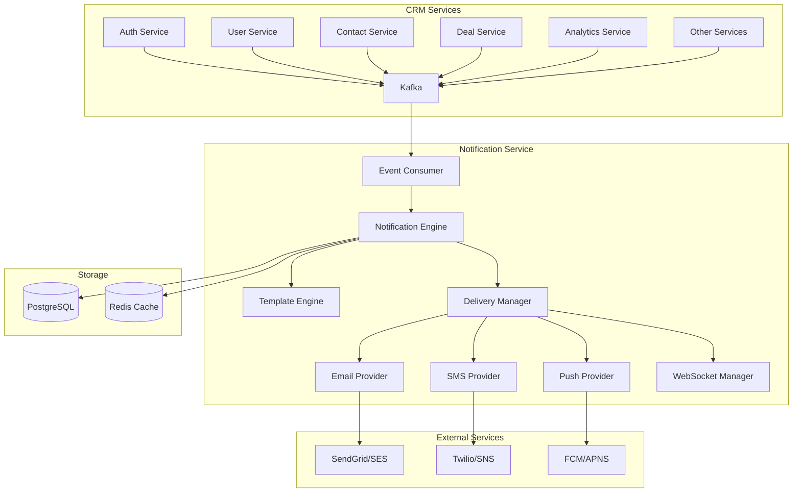

# Notification Service Design Document

## Overview

The notification service is a Spring Boot microservice that acts as a centralized notification hub for the CRM platform. It consumes events from all other services via Kafka topics and delivers notifications through multiple channels including email, SMS, push notifications, and real-time in-app notifications via WebSocket.

The service follows the existing CRM platform patterns with multi-tenant support, comprehensive audit logging, and integration with the platform's monitoring and security infrastructure.

## Architecture

### High-Level Architecture



### Service Integration

The notification service integrates with existing platform components:

- **Discovery Server**: Service registration and discovery
- **API Gateway**: Route management and load balancing
- **Kafka**: Event consumption from all services
- **PostgreSQL**: Notification data persistence
- **Redis**: Caching and real-time data
- **Monitoring Stack**: Prometheus metrics and logging

## Components and Interfaces

### Core Components

#### 1. Event Consumer Layer
- **KafkaEventConsumer**: Consumes events from multiple Kafka topics
- **EventProcessor**: Processes and validates incoming events
- **EventRouter**: Routes events to appropriate notification handlers

#### 2. Notification Engine
- **NotificationService**: Core business logic for notification processing
- **NotificationRuleEngine**: Evaluates rules to determine notification requirements
- **UserPreferenceService**: Manages user notification preferences
- **NotificationHistoryService**: Tracks notification delivery and status

#### 3. Template Engine
- **TemplateService**: Manages notification templates
- **TemplateRenderer**: Renders templates with dynamic content
- **LocalizationService**: Handles multi-language template support

#### 4. Delivery Manager
- **DeliveryService**: Orchestrates notification delivery
- **ChannelManager**: Manages different delivery channels
- **RetryService**: Handles failed delivery retries
- **DeliveryStatusTracker**: Tracks delivery status and metrics

#### 5. Channel Providers
- **EmailProvider**: Email delivery via SendGrid/SES
- **SmsProvider**: SMS delivery via Twilio/SNS
- **PushProvider**: Push notifications via FCM/APNS
- **WebSocketProvider**: Real-time in-app notifications

### API Interfaces

#### REST Endpoints

```java
@RestController
@RequestMapping("/api/v1/notifications")
public class NotificationController {
    
    // User notification preferences
    @GetMapping("/preferences")
    @PostMapping("/preferences")
    @PutMapping("/preferences")
    
    // Notification history
    @GetMapping("/history")
    @GetMapping("/history/{id}")
    @PutMapping("/history/{id}/read")
    
    // Template management (admin)
    @GetMapping("/templates")
    @PostMapping("/templates")
    @PutMapping("/templates/{id}")
    @DeleteMapping("/templates/{id}")
    
    // Notification rules (admin)
    @GetMapping("/rules")
    @PostMapping("/rules")
    @PutMapping("/rules/{id}")
    @DeleteMapping("/rules/{id}")
    
    // Metrics and monitoring
    @GetMapping("/metrics")
    @GetMapping("/health")
}
```

#### WebSocket Interface

```java
@Controller
public class NotificationWebSocketController {
    
    @MessageMapping("/notifications/subscribe")
    @SendToUser("/queue/notifications")
    public void subscribeToNotifications(Principal user);
    
    @MessageMapping("/notifications/mark-read")
    public void markNotificationAsRead(NotificationReadRequest request);
}
```

#### Kafka Event Consumption

```java
@Component
public class NotificationEventConsumer {
    
    @KafkaListener(topics = "user-activity", groupId = "notification-service")
    public void handleUserActivity(UserActivityEvent event);
    
    @KafkaListener(topics = "contact-events", groupId = "notification-service")
    public void handleContactEvent(ContactEvent event);
    
    @KafkaListener(topics = "deal-events", groupId = "notification-service")
    public void handleDealEvent(DealEvent event);
    
    @KafkaListener(topics = "auth-events", groupId = "notification-service")
    public void handleAuthEvent(AuthEvent event);
    
    @KafkaListener(topics = "system-alerts", groupId = "notification-service")
    public void handleSystemAlert(SystemAlertEvent event);
}
```

## Data Models

### Core Entities

#### Notification
```java
@Entity
@Table(name = "notifications")
public class Notification {
    private UUID id;
    private UUID tenantId;
    private UUID userId;
    private String type;
    private String title;
    private String content;
    private String channel;
    private NotificationStatus status;
    private NotificationPriority priority;
    private Map<String, Object> metadata;
    private LocalDateTime scheduledAt;
    private LocalDateTime sentAt;
    private LocalDateTime readAt;
    private Integer retryCount;
    private String errorMessage;
    private UUID createdBy;
    private LocalDateTime createdAt;
    private LocalDateTime updatedAt;
}
```

#### NotificationPreference
```java
@Entity
@Table(name = "notification_preferences")
public class NotificationPreference {
    private UUID id;
    private UUID userId;
    private UUID tenantId;
    private String notificationType;
    private boolean emailEnabled;
    private boolean smsEnabled;
    private boolean pushEnabled;
    private boolean inAppEnabled;
    private String frequency; // IMMEDIATE, HOURLY, DAILY, WEEKLY
    private LocalDateTime quietHoursStart;
    private LocalDateTime quietHoursEnd;
    private String timezone;
    private LocalDateTime createdAt;
    private LocalDateTime updatedAt;
}
```

#### NotificationTemplate
```java
@Entity
@Table(name = "notification_templates")
public class NotificationTemplate {
    private UUID id;
    private UUID tenantId;
    private String name;
    private String type;
    private String channel;
    private String language;
    private String subject;
    private String content;
    private String htmlContent;
    private Map<String, Object> variables;
    private boolean isActive;
    private UUID createdBy;
    private LocalDateTime createdAt;
    private LocalDateTime updatedAt;
}
```

#### NotificationRule
```java
@Entity
@Table(name = "notification_rules")
public class NotificationRule {
    private UUID id;
    private UUID tenantId;
    private String name;
    private String eventType;
    private String conditions; // JSON conditions
    private String notificationType;
    private List<String> channels;
    private NotificationPriority priority;
    private UUID templateId;
    private boolean isActive;
    private UUID createdBy;
    private LocalDateTime createdAt;
    private LocalDateTime updatedAt;
}
```

### Database Schema

```sql
-- Notifications table
CREATE TABLE notifications (
    id UUID PRIMARY KEY DEFAULT gen_random_uuid(),
    tenant_id UUID NOT NULL,
    user_id UUID NOT NULL,
    type VARCHAR(100) NOT NULL,
    title VARCHAR(255) NOT NULL,
    content TEXT NOT NULL,
    channel VARCHAR(50) NOT NULL,
    status VARCHAR(20) NOT NULL DEFAULT 'PENDING',
    priority VARCHAR(20) NOT NULL DEFAULT 'NORMAL',
    metadata JSONB,
    scheduled_at TIMESTAMP,
    sent_at TIMESTAMP,
    read_at TIMESTAMP,
    retry_count INTEGER DEFAULT 0,
    error_message TEXT,
    created_by UUID,
    created_at TIMESTAMP NOT NULL DEFAULT CURRENT_TIMESTAMP,
    updated_at TIMESTAMP NOT NULL DEFAULT CURRENT_TIMESTAMP
);

-- Notification preferences table
CREATE TABLE notification_preferences (
    id UUID PRIMARY KEY DEFAULT gen_random_uuid(),
    user_id UUID NOT NULL,
    tenant_id UUID NOT NULL,
    notification_type VARCHAR(100) NOT NULL,
    email_enabled BOOLEAN DEFAULT true,
    sms_enabled BOOLEAN DEFAULT false,
    push_enabled BOOLEAN DEFAULT true,
    in_app_enabled BOOLEAN DEFAULT true,
    frequency VARCHAR(20) DEFAULT 'IMMEDIATE',
    quiet_hours_start TIME,
    quiet_hours_end TIME,
    timezone VARCHAR(50) DEFAULT 'UTC',
    created_at TIMESTAMP NOT NULL DEFAULT CURRENT_TIMESTAMP,
    updated_at TIMESTAMP NOT NULL DEFAULT CURRENT_TIMESTAMP,
    UNIQUE(user_id, tenant_id, notification_type)
);

-- Notification templates table
CREATE TABLE notification_templates (
    id UUID PRIMARY KEY DEFAULT gen_random_uuid(),
    tenant_id UUID,
    name VARCHAR(255) NOT NULL,
    type VARCHAR(100) NOT NULL,
    channel VARCHAR(50) NOT NULL,
    language VARCHAR(10) DEFAULT 'en',
    subject VARCHAR(255),
    content TEXT NOT NULL,
    html_content TEXT,
    variables JSONB,
    is_active BOOLEAN DEFAULT true,
    created_by UUID,
    created_at TIMESTAMP NOT NULL DEFAULT CURRENT_TIMESTAMP,
    updated_at TIMESTAMP NOT NULL DEFAULT CURRENT_TIMESTAMP
);

-- Notification rules table
CREATE TABLE notification_rules (
    id UUID PRIMARY KEY DEFAULT gen_random_uuid(),
    tenant_id UUID,
    name VARCHAR(255) NOT NULL,
    event_type VARCHAR(100) NOT NULL,
    conditions JSONB,
    notification_type VARCHAR(100) NOT NULL,
    channels TEXT[], -- Array of channel names
    priority VARCHAR(20) DEFAULT 'NORMAL',
    template_id UUID,
    is_active BOOLEAN DEFAULT true,
    created_by UUID,
    created_at TIMESTAMP NOT NULL DEFAULT CURRENT_TIMESTAMP,
    updated_at TIMESTAMP NOT NULL DEFAULT CURRENT_TIMESTAMP,
    FOREIGN KEY (template_id) REFERENCES notification_templates(id)
);
```

## Error Handling

### Error Categories

1. **Event Processing Errors**
   - Invalid event format
   - Missing required fields
   - Event deserialization failures

2. **Delivery Errors**
   - External service unavailability
   - Invalid recipient information
   - Rate limiting from providers

3. **Template Errors**
   - Template not found
   - Template rendering failures
   - Missing template variables

4. **Configuration Errors**
   - Invalid notification rules
   - Missing user preferences
   - Invalid channel configuration

### Error Handling Strategy

```java
@Component
public class NotificationErrorHandler {
    
    public void handleEventProcessingError(Exception e, Object event) {
        // Log error with correlation ID
        // Send to dead letter queue if necessary
        // Alert administrators for critical errors
    }
    
    public void handleDeliveryError(Exception e, Notification notification) {
        // Implement exponential backoff retry
        // Try alternative channels if configured
        // Update notification status
    }
    
    public void handleTemplateError(Exception e, String templateId) {
        // Log template error
        // Use fallback template if available
        // Alert template administrators
    }
}
```

### Retry Logic

```java
@Component
public class RetryService {
    
    @Retryable(value = {DeliveryException.class}, 
               maxAttempts = 3, 
               backoff = @Backoff(delay = 1000, multiplier = 2))
    public void retryDelivery(Notification notification) {
        // Implement delivery retry with exponential backoff
    }
    
    @Recover
    public void recoverFromDeliveryFailure(DeliveryException e, Notification notification) {
        // Handle final delivery failure
        // Try alternative channels
        // Update notification status to FAILED
    }
}
```

## Testing Strategy

### Unit Testing
- Service layer testing with mocked dependencies
- Template rendering testing
- Rule engine testing
- Event processing testing

### Integration Testing
- Kafka event consumption testing
- Database integration testing
- External service integration testing
- WebSocket communication testing

### End-to-End Testing
- Complete notification flow testing
- Multi-channel delivery testing
- User preference application testing
- Error handling and recovery testing

### Performance Testing
- High-volume event processing
- Concurrent notification delivery
- Database performance under load
- Memory usage and garbage collection

### Test Configuration

```java
@TestConfiguration
public class NotificationTestConfig {
    
    @Bean
    @Primary
    public EmailProvider mockEmailProvider() {
        return Mockito.mock(EmailProvider.class);
    }
    
    @Bean
    @Primary
    public SmsProvider mockSmsProvider() {
        return Mockito.mock(SmsProvider.class);
    }
    
    @Bean
    @Primary
    public KafkaTemplate<String, Object> mockKafkaTemplate() {
        return Mockito.mock(KafkaTemplate.class);
    }
}
```

## Security Considerations

### Authentication and Authorization
- JWT token validation for API endpoints
- Role-based access control for admin functions
- Tenant isolation for all operations

### Data Protection
- Encryption of sensitive notification content
- PII handling compliance (GDPR)
- Secure storage of user preferences

### External Service Security
- API key management for external providers
- TLS encryption for all external communications
- Rate limiting and abuse prevention

## Monitoring and Observability

### Metrics
- Notification processing rates
- Delivery success/failure rates
- Channel-specific performance metrics
- Template usage statistics
- User engagement metrics

### Logging
- Structured logging with correlation IDs
- Event processing audit trail
- Delivery status logging
- Error logging with stack traces

### Health Checks
- Kafka connectivity
- Database connectivity
- External service availability
- WebSocket connection status

### Alerting
- High error rates
- External service failures
- Queue backlog alerts
- Performance degradation alerts