# Comprehensive CRM Platform Technical Implementation Guide

## Table of Contents

1. [Overview](#overview)
2. [System Architecture Analysis](#system-architecture-analysis)
3. [Service Implementation Details](#service-implementation-details)
4. [Core Services Implementation](#core-services-implementation)
5. [Advanced Services Implementation](#advanced-services-implementation)
6. [Platform Services Implementation](#platform-services-implementation)
7. [System Services Implementation](#system-services-implementation)
8. [Database Implementation](#database-implementation)
9. [API Implementation](#api-implementation)
10. [Security Implementation](#security-implementation)
11. [Testing Implementation](#testing-implementation)
12. [Deployment Implementation](#deployment-implementation)
13. [UML Diagrams](#uml-diagrams)
14. [Complete File Structure](#complete-file-structure)

---

## Overview

### Analysis Summary
Based on the comprehensive analysis of all documentation files, this technical implementation guide provides:

- **18 Microservices** with complete implementation details
- **380+ API Endpoints** across all services
- **100+ Database Tables** with relationships and constraints
- **Complete File Structures** for each service
- **Class Diagrams and Interfaces** for all components
- **UML Diagrams** showing system interactions
- **Implementation Examples** in multiple languages
- **Security, Testing, and Deployment** configurations

### Technology Stack Analysis
```yaml
Backend Technologies:
  - Java 17+ with Spring Boot 3.x (Primary)
  - Spring Cloud (Microservices Framework)
  - Spring Security (Authentication/Authorization)
  - Spring Data JPA (Data Access)

Databases:
  - PostgreSQL 15+ (Primary OLTP)
  - Redis 7+ (Caching/Sessions)
  - Elasticsearch 8+ (Search/Analytics)
  - InfluxDB 2+ (Time-series data)

Infrastructure:
  - Kubernetes (Container Orchestration)
  - Docker (Containerization)
  - AWS/Azure (Cloud Platform)
  - Terraform (Infrastructure as Code)

Communication:
  - REST APIs with Spring WebMVC
  - GraphQL with Spring GraphQL
  - Apache Kafka with Spring Kafka
  - OpenFeign for Inter-service Communication
  - Spring Cloud Gateway (API Gateway)
```

---

## System Architecture Analysis

### Microservices Architecture Overview

```mermaid
graph TB
    subgraph "Client Applications"
        WEB[Web Application<br/>React/TypeScript]
        MOBILE[Mobile Apps<br/>React Native]
        API_CLIENTS[Third-party Clients<br/>REST/GraphQL]
    end
    
    subgraph "API Gateway & Load Balancing"
        GATEWAY[API Gateway<br/>Kong/AWS API Gateway]
        LB[Load Balancer<br/>NGINX/AWS ALB]
        AUTH_SVC[Authentication Service<br/>OAuth2/JWT]
    end
    
    subgraph "Core CRM Services"
        CONTACTS[Contacts Service<br/>Java/Spring Boot]
        DEALS[Deals Service<br/>Java/Spring Boot]
        LEADS[Leads Service<br/>Java/Spring Boot]
        ACCOUNTS[Accounts Service<br/>Java/Spring Boot]
        ACTIVITIES[Activities Service<br/>Java/Spring Boot]
        PIPELINES[Pipelines Service<br/>Java/Spring Boot]
    end
    
    subgraph "Advanced Services"
        ANALYTICS[Analytics Service<br/>Java/Spring Boot]
        AI_INSIGHTS[AI Insights Service<br/>Java/Spring Boot + Python]
        CUSTOM_OBJECTS[Custom Objects Service<br/>Java/Spring Boot]
        WORKFLOWS[Workflow Service<br/>Java/Spring Boot]
        MARKETPLACE[Marketplace Service<br/>Java/Spring Boot]
        INTEGRATIONS[Integration Service<br/>Java/Spring Boot]
    end
    
    subgraph "Platform Services"
        USER_MGMT[User Management<br/>Java/Spring Boot]
        TENANT_MGMT[Tenant Management<br/>Java/Spring Boot]
        NOTIFICATIONS[Notification Service<br/>Java/Spring Boot]
        FILES[File Management<br/>Java/Spring Boot]
        AUDIT[Audit Service<br/>Java/Spring Boot]
    end
    
    subgraph "System Services"
        SEARCH[Search Service<br/>Java/Spring Boot]
        REPORTING[Reporting Service<br/>Java/Spring Boot]
        DASHBOARDS[Dashboard Service<br/>Java/Spring Boot]
        COMMUNICATION[Communication Service<br/>Java/Spring Boot]
        SOCIAL[Social CRM Service<br/>Java/Spring Boot]
        COLLABORATION[Collaboration Service<br/>Java/Spring Boot]
    end
    
    subgraph "Data Layer"
        POSTGRES[(PostgreSQL 15+<br/>Primary Database)]
        REDIS[(Redis 7+<br/>Cache & Sessions)]
        ELASTICSEARCH[(Elasticsearch 8+<br/>Search & Analytics)]
        S3[(Object Storage<br/>Files & Documents)]
    end
    
    subgraph "Message Bus"
        KAFKA[Apache Kafka<br/>Event Streaming]
        RABBITMQ[RabbitMQ<br/>Message Queues]
    end
    
    WEB --> GATEWAY
    MOBILE --> GATEWAY
    API_CLIENTS --> GATEWAY
    
    GATEWAY --> AUTH_SVC
    GATEWAY --> LB
    
    LB --> CONTACTS
    LB --> DEALS
    LB --> LEADS
    LB --> ACCOUNTS
    LB --> ACTIVITIES
    LB --> PIPELINES
    LB --> ANALYTICS
    LB --> AI_INSIGHTS
    LB --> CUSTOM_OBJECTS
    LB --> WORKFLOWS
    LB --> MARKETPLACE
    LB --> INTEGRATIONS
    LB --> USER_MGMT
    LB --> TENANT_MGMT
    LB --> NOTIFICATIONS
    LB --> FILES
    LB --> AUDIT
    LB --> SEARCH
    LB --> REPORTING
    LB --> DASHBOARDS
    LB --> COMMUNICATION
    LB --> SOCIAL
    LB --> COLLABORATION
    
    CONTACTS --> POSTGRES
    DEALS --> POSTGRES
    LEADS --> POSTGRES
    ACCOUNTS --> POSTGRES
    ACTIVITIES --> POSTGRES
    PIPELINES --> POSTGRES
    ANALYTICS --> POSTGRES
    AI_INSIGHTS --> POSTGRES
    CUSTOM_OBJECTS --> POSTGRES
    WORKFLOWS --> POSTGRES
    MARKETPLACE --> POSTGRES
    INTEGRATIONS --> POSTGRES
    USER_MGMT --> POSTGRES
    TENANT_MGMT --> POSTGRES
    NOTIFICATIONS --> POSTGRES
    FILES --> POSTGRES
    AUDIT --> POSTGRES
    REPORTING --> POSTGRES
    DASHBOARDS --> POSTGRES
    COMMUNICATION --> POSTGRES
    SOCIAL --> POSTGRES
    COLLABORATION --> POSTGRES
    
    SEARCH --> ELASTICSEARCH
    
    CONTACTS --> REDIS
    DEALS --> REDIS
    LEADS --> REDIS
    ACCOUNTS --> REDIS
    USER_MGMT --> REDIS
    AUTH_SVC --> REDIS
    
    FILES --> S3
    
    CONTACTS --> KAFKA
    DEALS --> KAFKA
    LEADS --> KAFKA
    ACCOUNTS --> KAFKA
    ACTIVITIES --> KAFKA
    
    KAFKA --> ANALYTICS
    KAFKA --> AI_INSIGHTS
    KAFKA --> NOTIFICATIONS
    KAFKA --> AUDIT
    
    WORKFLOWS --> RABBITMQ
    INTEGRATIONS --> RABBITMQ
```



---

## Service Implementation Details

### Service Template Structure
Each Spring Boot microservice follows a consistent Maven/Gradle structure pattern:

```
service-name/
├── src/
│   ├── main/
│   │   ├── java/
│   │   │   └── com/crm/service/
│   │   │       ├── controller/      # REST Controllers
│   │   │       ├── service/         # Business Logic Services
│   │   │       ├── repository/      # Data Access Repositories
│   │   │       ├── entity/          # JPA Entities
│   │   │       ├── dto/             # Data Transfer Objects
│   │   │       ├── config/          # Configuration Classes
│   │   │       ├── exception/       # Custom Exceptions
│   │   │       ├── event/           # Event Handlers
│   │   │       ├── validator/       # Custom Validators
│   │   │       ├── mapper/          # Entity-DTO Mappers
│   │   │       ├── security/        # Security Configuration
│   │   │       └── ServiceApplication.java
│   │   └── resources/
│   │       ├── application.yml      # Configuration
│   │       ├── application-dev.yml  # Dev Configuration
│   │       ├── application-prod.yml # Prod Configuration
│   │       └── db/migration/        # Flyway Migrations
│   └── test/
│       ├── java/                    # Unit & Integration Tests
│       └── resources/               # Test Resources
├── docker/
│   ├── Dockerfile                   # Container Definition
│   └── docker-compose.yml          # Local Development
├── k8s/
│   ├── deployment.yaml              # Kubernetes Deployment
│   ├── service.yaml                 # Kubernetes Service
│   ├── configmap.yaml               # Configuration
│   └── secret.yaml                  # Secrets
├── docs/
│   ├── api.md                       # API Documentation
│   └── README.md                    # Service Documentation
├── pom.xml                          # Maven Dependencies
└── .env.example                     # Environment Variables
```

---

## Core Services Implementation

### 1. Contacts Service Implementation

#### File Structure
```
contacts-service/
├── src/
│   ├── main/
│   │   ├── java/
│   │   │   └── com/crm/contacts/
│   │   │       ├── controller/
│   │   │       │   ├── ContactController.java
│   │   │       │   ├── ContactRelationshipController.java
│   │   │       │   ├── ContactImportController.java
│   │   │       │   └── ContactExportController.java
│   │   │       ├── service/
│   │   │       │   ├── ContactService.java
│   │   │       │   ├── ContactServiceImpl.java
│   │   │       │   ├── ContactRelationshipService.java
│   │   │       │   ├── ContactValidationService.java
│   │   │       │   ├── ContactSearchService.java
│   │   │       │   ├── ContactImportService.java
│   │   │       │   ├── ContactExportService.java
│   │   │       │   └── ContactDeduplicationService.java
│   │   │       ├── repository/
│   │   │       │   ├── ContactRepository.java
│   │   │       │   ├── ContactRelationshipRepository.java
│   │   │       │   └── ContactImportJobRepository.java
│   │   │       ├── entity/
│   │   │       │   ├── Contact.java
│   │   │       │   ├── ContactRelationship.java
│   │   │       │   ├── ContactImportJob.java
│   │   │       │   └── Address.java
│   │   │       ├── dto/
│   │   │       │   ├── ContactDto.java
│   │   │       │   ├── CreateContactRequest.java
│   │   │       │   ├── UpdateContactRequest.java
│   │   │       │   ├── ContactSearchRequest.java
│   │   │       │   └── ContactResponse.java
│   │   │       ├── mapper/
│   │   │       │   ├── ContactMapper.java
│   │   │       │   └── ContactRelationshipMapper.java
│   │   │       ├── config/
│   │   │       │   ├── DatabaseConfig.java
│   │   │       │   ├── KafkaConfig.java
│   │   │       │   ├── RedisConfig.java
│   │   │       │   └── SecurityConfig.java
│   │   │       ├── exception/
│   │   │       │   ├── ContactNotFoundException.java
│   │   │       │   ├── DuplicateContactException.java
│   │   │       │   └── ContactValidationException.java
│   │   │       ├── event/
│   │   │       │   ├── ContactEventHandler.java
│   │   │       │   ├── ContactEventPublisher.java
│   │   │       │   └── ContactEvent.java
│   │   │       ├── validator/
│   │   │       │   ├── ContactValidator.java
│   │   │       │   └── EmailValidator.java
│   │   │       └── ContactsApplication.java
│   │   └── resources/
│   │       ├── application.yml
│   │       ├── application-dev.yml
│   │       ├── application-prod.yml
│   │       └── db/migration/
│   │           ├── V1__Create_contacts_table.sql
│   │           ├── V2__Create_contact_relationships_table.sql
│   │           └── V3__Create_contact_import_jobs_table.sql
│   └── test/
│       └── java/
│           └── com/crm/contacts/
│               ├── controller/
│               ├── service/
│               ├── repository/
│               └── integration/
├── pom.xml
└── docker/
    ├── Dockerfile
    └── docker-compose.yml
```

#### Core Interfaces
```typescript
// src/interfaces/IContact.ts
export interface IContact {
  id: string;
  tenantId: string;
  firstName?: string;
  lastName?: string;
  fullName?: string;
  email?: string;
  phone?: string;
  company?: string;
  jobTitle?: string;
  department?: string;
  address?: IAddress;
  socialProfiles?: ISocialProfiles;
  customFields?: Record<string, any>;
  tags?: string[];
  notes?: string;
  preferredContactMethod?: ContactMethod;
  timezone?: string;
  language?: string;
  status: ContactStatus;
  leadScore: number;
  dealCount: number;
  totalDealValue: number;
  wonDealCount: number;
  wonDealValue: number;
  lastContactedAt?: Date;
  lastActivityAt?: Date;
  nextActivityAt?: Date;
  ownerId?: string;
  accountId?: string;
  createdAt: Date;
  updatedAt: Date;
  createdBy: string;
  updatedBy?: string;
  version: number;
}

export interface IAddress {
  street?: string;
  suite?: string;
  city?: string;
  state?: string;
  zipCode?: string;
  country?: string;
  formatted?: string;
}

export interface ISocialProfiles {
  linkedin?: string;
  twitter?: string;
  facebook?: string;
  instagram?: string;
}

export enum ContactStatus {
  ACTIVE = 'active',
  INACTIVE = 'inactive',
  ARCHIVED = 'archived'
}

export enum ContactMethod {
  EMAIL = 'email',
  PHONE = 'phone',
  SMS = 'sms',
  MAIL = 'mail'
}

// src/interfaces/IContactService.ts
export interface IContactService {
  create(contactData: CreateContactRequest): Promise<IContact>;
  findById(id: string, options?: FindOptions): Promise<IContact | null>;
  findByEmail(email: string): Promise<IContact | null>;
  findAll(filters: ContactFilters, pagination: PaginationOptions): Promise<PaginatedResult<IContact>>;
  update(id: string, updateData: UpdateContactRequest): Promise<IContact>;
  delete(id: string, options?: DeleteOptions): Promise<boolean>;
  search(query: ContactSearchQuery): Promise<SearchResult<IContact>>;
  bulkCreate(contacts: CreateContactRequest[], options?: BulkOptions): Promise<BulkResult>;
  bulkUpdate(updates: BulkUpdateRequest[], options?: BulkOptions): Promise<BulkResult>;
  bulkDelete(ids: string[], options?: BulkOptions): Promise<BulkResult>;
  merge(sourceId: string, targetId: string): Promise<IContact>;
  duplicate(id: string): Promise<IContact>;
  export(filters: ContactFilters, format: ExportFormat): Promise<ExportResult>;
  import(file: ImportFile, options: ImportOptions): Promise<ImportResult>;
}

// src/interfaces/IContactRepository.ts
export interface IContactRepository {
  create(contact: Partial<IContact>): Promise<IContact>;
  findById(id: string): Promise<IContact | null>;
  findByEmail(email: string, tenantId: string): Promise<IContact | null>;
  findAll(filters: ContactFilters, pagination: PaginationOptions): Promise<PaginatedResult<IContact>>;
  update(id: string, updateData: Partial<IContact>): Promise<IContact>;
  delete(id: string): Promise<boolean>;
  count(filters?: ContactFilters): Promise<number>;
  exists(id: string): Promise<boolean>;
  findDuplicates(contact: Partial<IContact>): Promise<IContact[]>;
}
```

#### Contact Model Implementation
```typescript
// src/models/Contact.ts
import { Entity, PrimaryGeneratedColumn, Column, CreateDateColumn, UpdateDateColumn, Index, BeforeInsert, BeforeUpdate } from 'typeorm';
import { IContact, IAddress, ISocialProfiles, ContactStatus, ContactMethod } from '../interfaces/IContact';

@Entity('contacts')
@Index(['tenantId', 'email'], { unique: true, where: 'email IS NOT NULL' })
@Index(['tenantId', 'phone'], { where: 'phone IS NOT NULL' })
@Index(['tenantId', 'company'], { where: 'company IS NOT NULL' })
@Index(['tenantId', 'ownerId'], { where: 'ownerId IS NOT NULL' })
@Index(['tenantId', 'accountId'], { where: 'accountId IS NOT NULL' })
@Index(['tenantId', 'createdAt'])
@Index(['tenantId', 'updatedAt'])
@Index(['tenantId', 'lastActivityAt'], { where: 'lastActivityAt IS NOT NULL' })
@Index(['tenantId', 'leadScore'], { where: 'leadScore > 0' })
export class Contact implements IContact {
  @PrimaryGeneratedColumn('uuid')
  id: string;

  @Column('uuid')
  @Index()
  tenantId: string;

  @Column({ length: 100, nullable: true })
  firstName?: string;

  @Column({ length: 100, nullable: true })
  lastName?: string;

  @Column({ length: 200, nullable: true, generated: true, asExpression: `
    CASE 
      WHEN first_name IS NOT NULL AND last_name IS NOT NULL 
      THEN first_name || ' ' || last_name
      WHEN first_name IS NOT NULL THEN first_name
      WHEN last_name IS NOT NULL THEN last_name
      ELSE NULL
    END
  ` })
  fullName?: string;

  @Column({ length: 255, nullable: true })
  email?: string;

  @Column({ length: 50, nullable: true })
  phone?: string;

  @Column({ length: 200, nullable: true })
  company?: string;

  @Column({ length: 150, nullable: true })
  jobTitle?: string;

  @Column({ length: 100, nullable: true })
  department?: string;

  @Column('jsonb', { nullable: true })
  address?: IAddress;

  @Column('jsonb', { nullable: true })
  socialProfiles?: ISocialProfiles;

  @Column('jsonb', { nullable: true })
  customFields?: Record<string, any>;

  @Column('text', { array: true, nullable: true })
  tags?: string[];

  @Column('text', { nullable: true })
  notes?: string;

  @Column({
    type: 'enum',
    enum: ContactMethod,
    default: ContactMethod.EMAIL
  })
  preferredContactMethod: ContactMethod;

  @Column({ length: 50, default: 'UTC' })
  timezone: string;

  @Column({ length: 10, default: 'en-US' })
  language: string;

  @Column({
    type: 'enum',
    enum: ContactStatus,
    default: ContactStatus.ACTIVE
  })
  status: ContactStatus;

  @Column('int', { default: 0 })
  leadScore: number;

  @Column('int', { default: 0 })
  dealCount: number;

  @Column('decimal', { precision: 15, scale: 2, default: 0 })
  totalDealValue: number;

  @Column('int', { default: 0 })
  wonDealCount: number;

  @Column('decimal', { precision: 15, scale: 2, default: 0 })
  wonDealValue: number;

  @Column('timestamp with time zone', { nullable: true })
  lastContactedAt?: Date;

  @Column('timestamp with time zone', { nullable: true })
  lastActivityAt?: Date;

  @Column('timestamp with time zone', { nullable: true })
  nextActivityAt?: Date;

  @Column('uuid', { nullable: true })
  ownerId?: string;

  @Column('uuid', { nullable: true })
  accountId?: string;

  @CreateDateColumn()
  createdAt: Date;

  @UpdateDateColumn()
  updatedAt: Date;

  @Column('uuid')
  createdBy: string;

  @Column('uuid', { nullable: true })
  updatedBy?: string;

  @Column('int', { default: 1 })
  version: number;

  @BeforeInsert()
  @BeforeUpdate()
  validateData() {
    // Ensure at least one name field is provided
    if (!this.firstName && !this.lastName) {
      throw new Error('At least one name field (firstName or lastName) is required');
    }

    // Validate email format if provided
    if (this.email && !this.isValidEmail(this.email)) {
      throw new Error('Invalid email format');
    }

    // Validate lead score range
    if (this.leadScore < 0 || this.leadScore > 100) {
      throw new Error('Lead score must be between 0 and 100');
    }
  }

  private isValidEmail(email: string): boolean {
    const emailRegex = /^[A-Za-z0-9._%+-]+@[A-Za-z0-9.-]+\.[A-Za-z]{2,}$/;
    return emailRegex.test(email);
  }

  // Helper methods
  getDisplayName(): string {
    return this.fullName || this.firstName || this.lastName || 'Unknown';
  }

  hasEmail(): boolean {
    return !!this.email;
  }

  hasPhone(): boolean {
    return !!this.phone;
  }

  isActive(): boolean {
    return this.status === ContactStatus.ACTIVE;
  }

  getCustomField(key: string): any {
    return this.customFields?.[key];
  }

  setCustomField(key: string, value: any): void {
    if (!this.customFields) {
      this.customFields = {};
    }
    this.customFields[key] = value;
  }

  hasTag(tag: string): boolean {
    return this.tags?.includes(tag) || false;
  }

  addTag(tag: string): void {
    if (!this.tags) {
      this.tags = [];
    }
    if (!this.hasTag(tag)) {
      this.tags.push(tag);
    }
  }

  removeTag(tag: string): void {
    if (this.tags) {
      this.tags = this.tags.filter(t => t !== tag);
    }
  }
}
```