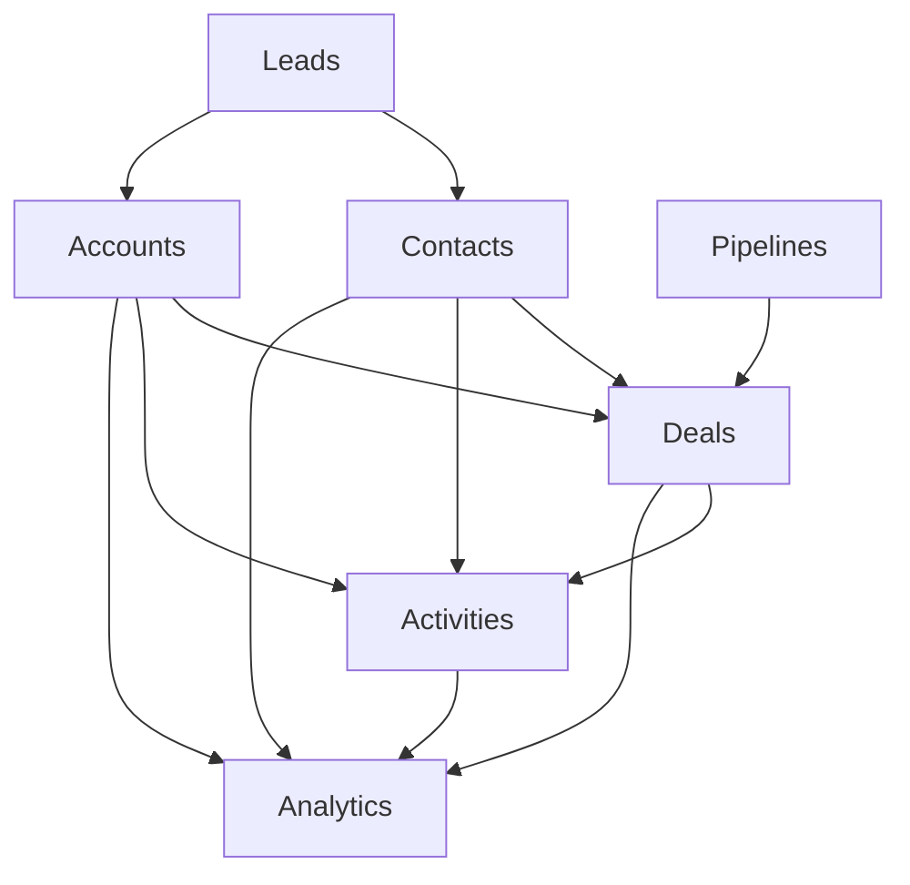
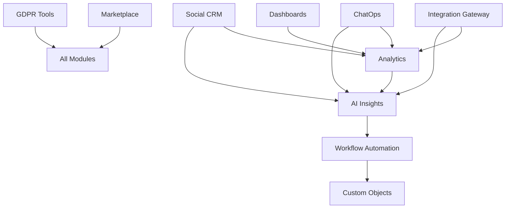

# Requirements and Planning

## Table of Contents
- [Overview](#overview)
- [Business Goals and Objectives](#business-goals-and-objectives)
- [Technical Goals](#technical-goals)
- [Competitive Analysis](#competitive-analysis)
- [Target Users and Stakeholder Personas](#target-users-and-stakeholder-personas)
- [Core CRM Modules](#core-crm-modules)
- [Advanced and Unique Modules](#advanced-and-unique-modules)
- [Non-Functional Requirements](#non-functional-requirements)

## Overview

This document outlines the comprehensive requirements and planning for a next-generation, enterprise-grade CRM platform built on Java microservices architecture. The platform aims to compete with industry leaders while introducing innovative features that differentiate it in the market. This document serves as the foundation for all subsequent technical design and implementation decisions.

## Business Goals and Objectives

### Primary Business Objectives

**Market Position and Revenue Goals:**
- Capture 5% market share in the enterprise CRM segment within 3 years
- Achieve $100M ARR by year 3 with a focus on mid-market and enterprise customers
- Establish a strong presence in North American and European markets initially
- Build a sustainable SaaS business model with 95%+ customer retention rates

**Competitive Differentiation:**
- Deliver superior user experience through modern, intuitive interfaces
- Provide advanced AI-driven insights and automation capabilities
- Offer unmatched customization and extensibility through our platform approach
- Enable seamless integration with existing business ecosystems
- Deliver enterprise-grade security and compliance out of the box

**Customer Success Objectives:**
- Reduce customer onboarding time by 60% compared to traditional CRM solutions
- Increase sales team productivity by 40% through intelligent automation
- Provide 360-degree customer visibility across all touchpoints
- Enable data-driven decision making through advanced analytics and reporting
- Support global operations with multi-language, multi-currency, and multi-timezone capabilities

### Strategic Business Initiatives

**Innovation Leadership:**
- Invest 25% of engineering resources in R&D for cutting-edge features
- Establish partnerships with AI/ML technology providers
- Create an open ecosystem through marketplace and API-first approach
- Pioneer new CRM paradigms like conversational CRM and predictive sales

**Market Expansion:**
- Target vertical-specific solutions (healthcare, financial services, manufacturing)
- Develop industry-specific templates and workflows
- Build strategic partnerships with system integrators and consultants
- Establish a global partner network for localization and support

**Operational Excellence:**
- Achieve 99.9% uptime SLA with global infrastructure
- Maintain sub-2-second response times for all user interactions
- Implement world-class customer support with 24/7 availability
- Establish comprehensive security and compliance certifications (SOC2, GDPR, HIPAA)

## Technical Goals

### Scalability and Performance Targets

**User and Data Scale:**
- Support 100,000+ concurrent users per tenant
- Handle 10M+ records per entity type per tenant
- Process 1M+ API requests per minute across the platform
- Support 10,000+ tenants on a single deployment
- Enable horizontal scaling to accommodate 10x growth

**Performance Benchmarks:**
- API response times: 95th percentile under 200ms
- Database query performance: 95th percentile under 100ms
- Real-time notifications: delivered within 500ms
- Search operations: results returned within 1 second
- Report generation: complex reports completed within 30 seconds

**Availability and Reliability:**
- 99.9% uptime SLA with planned maintenance windows
- Recovery Time Objective (RTO): 15 minutes
- Recovery Point Objective (RPO): 5 minutes
- Zero-downtime deployments for all updates
- Automated failover and disaster recovery capabilities

### Innovation and Technology Leadership

**AI and Machine Learning Integration:**
- Implement predictive lead scoring with 85%+ accuracy
- Provide intelligent data enrichment and deduplication
- Enable natural language processing for email and communication analysis
- Deliver automated workflow suggestions based on user behavior patterns
- Support voice-to-text and conversational interfaces

**Modern Architecture Principles:**
- Cloud-native microservices architecture with container orchestration
- Event-driven architecture for real-time data synchronization
- API-first design enabling headless CRM capabilities
- Serverless computing for elastic scaling of compute-intensive operations
- Edge computing support for global performance optimization

**Developer Experience and Extensibility:**
- Comprehensive REST and GraphQL APIs with 100% feature coverage
- SDK availability in Java, Python, JavaScript, and .NET
- Visual workflow builder with custom logic support
- Plugin architecture supporting third-party extensions
- Webhook system for real-time integrations

### Security and Compliance Excellence

**Enterprise Security Standards:**
- Zero-trust security model with end-to-end encryption
- Multi-factor authentication and single sign-on (SSO) support
- Role-based access control (RBAC) with fine-grained permissions
- Advanced threat detection and automated response capabilities
- Regular security audits and penetration testing

**Compliance and Data Protection:**
- GDPR compliance with automated data subject rights management
- SOC 2 Type II certification for security and availability
- HIPAA compliance for healthcare industry customers
- Data residency controls for global privacy regulations
- Comprehensive audit trails for all data access and modifications

## Competitive Analysis

### Market Landscape Overview

The CRM market is dominated by established players, but there are significant opportunities for innovation and differentiation. Our analysis focuses on the top three competitors and identifies key areas where we can establish competitive advantages.

### Salesforce Analysis

**Strengths:**
- Market leader with 19.8% market share and strong brand recognition
- Comprehensive ecosystem with AppExchange marketplace (5,000+ apps)
- Strong enterprise relationships and extensive partner network
- Robust customization capabilities through Apex and Lightning Platform
- Advanced AI capabilities through Einstein platform

**Weaknesses:**
- Complex user interface leading to poor user adoption rates
- High total cost of ownership, especially for mid-market customers
- Steep learning curve requiring extensive training and certification
- Performance issues with large data volumes and complex customizations
- Limited mobile experience compared to modern standards

**Our Competitive Response:**
- Deliver intuitive, modern UI/UX that requires minimal training
- Provide transparent, value-based pricing with no hidden costs
- Offer superior performance through modern microservices architecture
- Create mobile-first experience with offline capabilities
- Simplify customization through visual tools and pre-built templates

### HubSpot Analysis

**Strengths:**
- Excellent user experience with intuitive, modern interface
- Strong inbound marketing integration and content management
- Freemium model enabling easy customer acquisition
- Comprehensive educational resources and community support
- Effective marketing automation and lead nurturing capabilities

**Weaknesses:**
- Limited enterprise-grade features and scalability
- Weak customization options for complex business processes
- Basic reporting and analytics compared to enterprise needs
- Limited third-party integration capabilities
- Pricing escalates quickly as feature usage increases

**Our Competitive Response:**
- Combine HubSpot's ease of use with enterprise-grade capabilities
- Provide advanced customization without complexity
- Offer comprehensive analytics and business intelligence features
- Enable extensive third-party integrations through our platform approach
- Deliver predictable, scalable pricing for growing businesses

### Zoho CRM Analysis

**Strengths:**
- Comprehensive business suite with integrated applications
- Competitive pricing, especially for small and medium businesses
- Strong international presence with localization support
- Decent customization capabilities and workflow automation
- Good mobile applications with offline functionality

**Weaknesses:**
- User interface feels dated compared to modern standards
- Limited advanced features like AI and predictive analytics
- Integration challenges between different Zoho applications
- Performance issues with large datasets and complex queries
- Limited marketplace and third-party ecosystem

**Our Competitive Response:**
- Deliver modern, responsive user interface across all devices
- Provide advanced AI and analytics capabilities as standard features
- Ensure seamless integration between all platform components
- Optimize performance for enterprise-scale data and operations
- Build thriving marketplace ecosystem with extensive third-party integrations

### Competitive Differentiation Strategy

**Unique Value Propositions:**

1. **AI-First Approach:** Unlike competitors who added AI as an afterthought, our platform is built with AI capabilities integrated into every module from the ground up.

2. **Developer-Centric Platform:** Provide the most comprehensive API coverage and developer tools in the industry, enabling unlimited customization and integration possibilities.

3. **Conversational CRM:** Pioneer the next generation of CRM interaction through natural language processing, voice interfaces, and intelligent chatbots.

4. **Predictive Intelligence:** Move beyond reporting historical data to providing actionable insights and predictions about future customer behavior and business outcomes.

5. **Unified Customer Experience:** Eliminate data silos by providing a single, unified view of customer interactions across all channels and touchpoints.

**Market Positioning:**
- **Primary Target:** Mid-market to enterprise companies seeking modern, scalable CRM solutions
- **Secondary Target:** Fast-growing companies that have outgrown basic CRM tools but find enterprise solutions too complex
- **Positioning Statement:** "The only CRM platform that combines enterprise-grade capabilities with consumer-grade user experience, powered by AI and built for the modern business."
## Targe
t Users and Stakeholder Personas

### Primary User Personas

#### Sales Representative - "Alex the Closer"

**Demographics:**
- Age: 28-45
- Experience: 3-10 years in B2B sales
- Education: Bachelor's degree, often in business or communications
- Tech Savviness: Moderate to high, comfortable with mobile and web applications

**Goals and Motivations:**
- Exceed quarterly sales targets and earn commission bonuses
- Build and maintain strong relationships with prospects and customers
- Efficiently manage pipeline and prioritize high-value opportunities
- Access customer information quickly during calls and meetings
- Collaborate effectively with marketing and support teams

**Pain Points:**
- Spending too much time on data entry instead of selling
- Difficulty accessing customer information while mobile or in meetings
- Lack of visibility into marketing-generated leads and their quality
- Inconsistent follow-up processes leading to missed opportunities
- Complex CRM systems that slow down rather than accelerate sales activities

**User Journey:**
1. **Morning Routine:** Reviews daily dashboard with prioritized tasks and opportunities
2. **Lead Management:** Qualifies new leads from marketing and assigns follow-up activities
3. **Opportunity Management:** Updates deal stages, adds notes from customer interactions
4. **Customer Meetings:** Accesses customer history and prepares for calls using mobile app
5. **Pipeline Review:** Analyzes forecast and identifies at-risk deals requiring attention
6. **Collaboration:** Shares customer insights with marketing and requests support assistance

**Success Metrics:**
- 25% increase in deals closed per quarter
- 40% reduction in time spent on administrative tasks
- 90% mobile app usage for field activities
- 95% data accuracy in customer records

#### Marketing Manager - "Sarah the Strategist"

**Demographics:**
- Age: 30-50
- Experience: 5-15 years in B2B marketing
- Education: Bachelor's or Master's in Marketing, Communications, or related field
- Tech Savviness: High, experienced with marketing automation and analytics tools

**Goals and Motivations:**
- Generate high-quality leads that convert to sales opportunities
- Demonstrate marketing ROI and attribution across all channels
- Create personalized customer experiences at scale
- Align marketing activities with sales objectives and feedback
- Build comprehensive customer profiles for targeted campaigns

**Pain Points:**
- Lack of visibility into lead quality and sales conversion rates
- Difficulty tracking customer journey across multiple touchpoints
- Inconsistent lead handoff processes between marketing and sales
- Limited ability to personalize communications based on customer behavior
- Challenges in measuring marketing campaign effectiveness and ROI

**User Journey:**
1. **Campaign Planning:** Analyzes customer segments and creates targeted campaign strategies
2. **Lead Generation:** Launches multi-channel campaigns and monitors performance metrics
3. **Lead Nurturing:** Sets up automated workflows based on customer behavior and engagement
4. **Sales Alignment:** Reviews lead quality feedback and adjusts scoring criteria
5. **Performance Analysis:** Creates reports on campaign ROI and customer acquisition costs
6. **Customer Insights:** Analyzes customer data to identify trends and optimization opportunities

**Success Metrics:**
- 30% improvement in lead-to-opportunity conversion rates
- 50% increase in marketing-attributed revenue
- 60% reduction in lead response time
- 85% lead scoring accuracy based on sales feedback

#### Customer Support Specialist - "Mike the Problem Solver"

**Demographics:**
- Age: 25-40
- Experience: 2-8 years in customer service or technical support
- Education: High school to Bachelor's degree, often with technical certifications
- Tech Savviness: Moderate to high, comfortable with multiple software systems

**Goals and Motivations:**
- Resolve customer issues quickly and effectively
- Maintain high customer satisfaction scores
- Access complete customer history to provide personalized support
- Collaborate with sales and technical teams for complex issues
- Identify opportunities for account expansion and retention

**Pain Points:**
- Incomplete customer information leading to longer resolution times
- Difficulty escalating issues to appropriate technical or sales resources
- Lack of visibility into customer's business context and relationship history
- Manual processes for case management and follow-up activities
- Limited ability to identify proactive support opportunities

**User Journey:**
1. **Case Intake:** Receives customer inquiry and accesses complete customer profile
2. **Issue Diagnosis:** Reviews interaction history and identifies similar past issues
3. **Resolution Process:** Collaborates with internal teams and provides solutions
4. **Follow-up:** Ensures customer satisfaction and documents resolution details
5. **Proactive Support:** Identifies potential issues and reaches out to prevent problems
6. **Knowledge Sharing:** Updates knowledge base and shares insights with team

**Success Metrics:**
- 40% reduction in average case resolution time
- 95% customer satisfaction score
- 30% increase in first-call resolution rate
- 20% improvement in proactive support case identification

### Secondary User Personas

#### Sales Manager - "David the Director"

**Demographics:**
- Age: 35-55
- Experience: 8-20 years in sales, with 3+ years in management
- Education: Bachelor's or Master's degree in Business or related field
- Tech Savviness: Moderate, focused on analytics and reporting tools

**Goals and Motivations:**
- Achieve team sales targets and revenue objectives
- Coach and develop sales team members effectively
- Forecast accurately and manage pipeline health
- Identify process improvements and best practices
- Ensure CRM adoption and data quality across the team

**Pain Points:**
- Lack of real-time visibility into team performance and pipeline health
- Difficulty identifying coaching opportunities and skill gaps
- Inconsistent sales processes across team members
- Time-consuming manual reporting and forecast preparation
- Challenges in measuring individual and team productivity

**User Journey:**
1. **Team Performance Review:** Analyzes individual and team metrics on management dashboard
2. **Pipeline Management:** Reviews forecast accuracy and identifies at-risk opportunities
3. **Coaching Sessions:** Uses activity data to provide targeted feedback to team members
4. **Process Optimization:** Identifies bottlenecks and implements process improvements
5. **Strategic Planning:** Analyzes market trends and adjusts team strategies accordingly
6. **Reporting:** Prepares executive reports on team performance and market insights

#### Marketing Director - "Lisa the Leader"

**Demographics:**
- Age: 35-55
- Experience: 10-20 years in marketing, with 5+ years in leadership
- Education: Bachelor's or Master's degree in Marketing, MBA preferred
- Tech Savviness: High, experienced with marketing technology stack

**Goals and Motivations:**
- Drive revenue growth through effective marketing strategies
- Optimize marketing spend and demonstrate clear ROI
- Build integrated marketing and sales processes
- Develop comprehensive customer insights and segmentation
- Lead digital transformation initiatives

**User Journey:**
1. **Strategic Planning:** Reviews market data and develops comprehensive marketing strategies
2. **Budget Management:** Allocates resources across channels based on performance data
3. **Team Leadership:** Manages marketing team and coordinates with sales leadership
4. **Performance Analysis:** Analyzes campaign effectiveness and customer acquisition metrics
5. **Customer Insights:** Develops customer personas and journey mapping
6. **Technology Optimization:** Evaluates and implements marketing technology solutions

### Administrative Personas

#### System Administrator - "Tom the Tech Expert"

**Demographics:**
- Age: 30-50
- Experience: 5-15 years in IT administration or systems management
- Education: Bachelor's degree in IT, Computer Science, or related technical field
- Tech Savviness: Very high, expert in enterprise software systems

**Goals and Motivations:**
- Ensure system reliability, security, and optimal performance
- Manage user access, permissions, and data governance
- Implement integrations with existing business systems
- Provide technical support and training to end users
- Maintain compliance with security and regulatory requirements

**Pain Points:**
- Complex configuration requirements for enterprise features
- Difficulty managing integrations with legacy systems
- Time-consuming user management and permission administration
- Challenges in monitoring system performance and troubleshooting issues
- Limited visibility into system usage and adoption metrics

**User Journey:**
1. **System Monitoring:** Reviews system health, performance metrics, and security alerts
2. **User Management:** Provisions new users, manages permissions, and handles access requests
3. **Integration Management:** Configures and maintains connections with external systems
4. **Data Governance:** Implements data quality rules and manages backup/recovery processes
5. **Support Activities:** Troubleshoots user issues and provides technical guidance
6. **System Optimization:** Analyzes usage patterns and implements performance improvements

#### Developer/Integration Specialist - "Rachel the Builder"

**Demographics:**
- Age: 25-45
- Experience: 3-12 years in software development or systems integration
- Education: Bachelor's degree in Computer Science, Engineering, or related field
- Tech Savviness: Very high, expert in APIs, programming languages, and integration patterns

**Goals and Motivations:**
- Build custom integrations and extend CRM functionality
- Develop automated workflows and business process improvements
- Create custom reports and analytics solutions
- Implement third-party applications and marketplace solutions
- Ensure data consistency and system interoperability

**Pain Points:**
- Limited API documentation and developer resources
- Complexity in understanding system architecture and data models
- Challenges in testing and debugging custom integrations
- Lack of development and staging environments
- Insufficient monitoring and logging for custom implementations

**User Journey:**
1. **Requirements Analysis:** Understands business needs and technical requirements
2. **API Exploration:** Reviews documentation and tests API endpoints
3. **Development:** Builds custom integrations, workflows, or applications
4. **Testing:** Validates functionality in development and staging environments
5. **Deployment:** Implements solutions in production with proper monitoring
6. **Maintenance:** Monitors performance and updates integrations as needed

### Partner Personas

#### Implementation Partner - "Steve the Consultant"

**Demographics:**
- Age: 35-55
- Experience: 10-20 years in CRM consulting and implementation
- Education: Bachelor's or Master's degree in Business or Technology
- Tech Savviness: High, experienced with multiple CRM platforms

**Goals and Motivations:**
- Successfully implement CRM solutions for clients
- Demonstrate expertise and build long-term client relationships
- Efficiently configure systems to meet specific business requirements
- Provide training and change management support
- Identify opportunities for additional services and solutions

**Pain Points:**
- Complexity in understanding platform capabilities and limitations
- Time-consuming configuration and customization processes
- Difficulty accessing technical support during implementations
- Challenges in training clients on new system features
- Limited resources for ongoing support and maintenance

**User Journey:**
1. **Client Assessment:** Analyzes business requirements and technical environment
2. **Solution Design:** Creates implementation plan and system configuration
3. **System Configuration:** Sets up CRM instance with custom fields, workflows, and integrations
4. **Data Migration:** Transfers existing data and validates accuracy
5. **User Training:** Provides comprehensive training to client teams
6. **Go-Live Support:** Assists with launch and provides ongoing optimization

### Stakeholder Interaction Patterns

#### Cross-Functional Collaboration Workflows

**Sales and Marketing Alignment:**
- Lead handoff processes with automated notifications and feedback loops
- Shared dashboards for pipeline visibility and campaign performance
- Collaborative lead scoring and qualification criteria management
- Joint planning sessions using shared customer insights and analytics

**Sales and Support Integration:**
- Customer escalation workflows with complete interaction history
- Shared customer health scores and satisfaction metrics
- Collaborative account management for expansion opportunities
- Integrated communication channels for seamless customer experience

**Management and Team Coordination:**
- Hierarchical reporting with drill-down capabilities for detailed analysis
- Automated performance alerts and coaching opportunity identification
- Shared goal tracking and team performance dashboards
- Collaborative forecasting with bottom-up and top-down planning

#### Decision-Making Authority Matrix

| Decision Type | Primary Authority | Secondary Input | Final Approval |
|---------------|------------------|-----------------|----------------|
| System Configuration | System Admin | IT Director | CIO |
| User Access Management | System Admin | Department Managers | IT Director |
| Custom Development | Developer | Business Users | IT Director |
| Process Changes | Department Managers | End Users | Executive Team |
| Integration Decisions | IT Director | System Admin | CIO |
| Data Governance | Data Steward | System Admin | Chief Data Officer |## Core
 CRM Modules

### Contacts Module

**Purpose:** Centralized management of all individual contacts with comprehensive profile information and interaction tracking.

**Core Entities:**
- **Contact Record:** Personal and professional information, communication preferences, social profiles
- **Contact Relationships:** Hierarchical relationships, influence mapping, decision-maker identification
- **Communication History:** Email, phone, meeting logs with sentiment analysis
- **Engagement Scoring:** Activity-based scoring with predictive engagement indicators

**Key Workflows:**
1. **Contact Creation and Enrichment:**
   - Automatic data enrichment from external sources (LinkedIn, company databases)
   - Duplicate detection and merge workflows with conflict resolution
   - Data validation and standardization processes
   - GDPR consent management and privacy controls

2. **Relationship Mapping:**
   - Organizational chart visualization with reporting structures
   - Influence network analysis and stakeholder identification
   - Contact role assignment and decision-making authority tracking
   - Relationship strength scoring based on interaction frequency and quality

3. **Communication Tracking:**
   - Automatic email and calendar integration with activity logging
   - Call logging with voice-to-text transcription and sentiment analysis
   - Meeting notes integration with action item extraction
   - Social media interaction monitoring and engagement tracking

**Data Fields:**
- Personal: Name, title, department, phone, email, social profiles
- Professional: Company, role, responsibilities, reporting structure
- Preferences: Communication channels, time zones, language preferences
- Engagement: Last contact date, interaction frequency, engagement score
- Custom: Industry-specific fields, tags, and user-defined attributes

### Deals Module

**Purpose:** Complete opportunity lifecycle management from initial qualification through closed-won, with advanced forecasting and pipeline analytics.

**Core Entities:**
- **Opportunity Record:** Deal details, value, probability, timeline, competitive information
- **Deal Stages:** Customizable pipeline stages with exit criteria and required actions
- **Forecasting Data:** Probability weighting, commit categories, historical trending
- **Competitive Intelligence:** Competitor tracking, win/loss analysis, positioning strategies

**Key Workflows:**
1. **Opportunity Creation and Qualification:**
   - Lead-to-opportunity conversion with qualification criteria validation
   - Automatic deal scoring based on historical win/loss patterns
   - Required field validation and data completeness checking
   - Territory and ownership assignment based on predefined rules

2. **Pipeline Management:**
   - Stage progression with automated workflow triggers
   - Deal health monitoring with at-risk identification
   - Collaborative selling with team member assignment and task distribution
   - Approval workflows for discounting and special terms

3. **Forecasting and Analytics:**
   - Real-time forecast roll-up with confidence intervals
   - Historical trending analysis with seasonality adjustments
   - Win/loss analysis with competitive intelligence integration
   - Pipeline velocity tracking and bottleneck identification

**Data Fields:**
- Basic: Name, value, close date, stage, probability, source
- Details: Products/services, quantity, pricing, terms, conditions
- Stakeholders: Decision makers, influencers, champions, detractors
- Competition: Competitors, competitive position, differentiation factors
- Forecasting: Commit category, risk factors, upside potential

### Leads Module

**Purpose:** Systematic lead capture, qualification, and conversion management with intelligent routing and nurturing capabilities.

**Core Entities:**
- **Lead Record:** Prospect information, source attribution, qualification status
- **Lead Scoring:** Multi-dimensional scoring with behavioral and demographic factors
- **Qualification Criteria:** BANT (Budget, Authority, Need, Timeline) and custom frameworks
- **Conversion Tracking:** Lead-to-opportunity conversion metrics and attribution

**Key Workflows:**
1. **Lead Capture and Routing:**
   - Multi-channel lead capture (web forms, email, phone, events, referrals)
   - Intelligent lead routing based on territory, product interest, and capacity
   - Automatic lead assignment with load balancing and skill matching
   - Lead response time tracking with SLA monitoring and escalation

2. **Lead Qualification and Scoring:**
   - Progressive profiling with incremental information gathering
   - Behavioral scoring based on website activity, email engagement, content consumption
   - Demographic scoring using firmographic and technographic data
   - Predictive lead scoring using machine learning algorithms

3. **Lead Nurturing and Conversion:**
   - Automated nurturing campaigns based on lead score and behavior
   - Personalized content recommendations and delivery
   - Sales-ready lead identification and handoff processes
   - Conversion tracking with attribution and ROI analysis

**Data Fields:**
- Contact: Name, title, company, phone, email, location
- Qualification: Budget, authority, need, timeline, decision process
- Scoring: Behavioral score, demographic score, overall lead score
- Source: Original source, campaign attribution, referral information
- Status: Qualification stage, disposition, next actions, follow-up date

### Accounts Module

**Purpose:** Comprehensive account management with hierarchical structures, relationship mapping, and strategic account planning capabilities.

**Core Entities:**
- **Account Record:** Company information, financial data, strategic importance
- **Account Hierarchy:** Parent-child relationships, subsidiary management, global account structures
- **Account Team:** Role-based team assignments with collaboration tools
- **Account Planning:** Strategic plans, goals, initiatives, and success metrics

**Key Workflows:**
1. **Account Creation and Management:**
   - Company data enrichment from external sources (D&B, ZoomInfo, company websites)
   - Account hierarchy establishment with parent-child relationship mapping
   - Territory assignment and account ownership management
   - Account segmentation based on size, industry, strategic importance

2. **Relationship Management:**
   - Stakeholder mapping with influence and decision-making authority
   - Relationship strength assessment and improvement planning
   - Executive relationship tracking and engagement strategies
   - Partner and channel relationship management

3. **Strategic Account Planning:**
   - Account planning templates with goals, strategies, and tactics
   - Opportunity identification and pipeline development
   - Competitive landscape analysis and positioning strategies
   - Success metrics tracking and performance evaluation

**Data Fields:**
- Company: Name, industry, size, revenue, employees, location
- Financial: Annual revenue, budget cycles, financial health indicators
- Strategic: Account tier, strategic importance, growth potential
- Relationships: Key contacts, decision makers, influencers, champions
- Planning: Goals, strategies, initiatives, success metrics, review dates

### Activities Module

**Purpose:** Comprehensive activity management and tracking system for tasks, events, communications, and follow-up actions across all CRM modules.

**Core Entities:**
- **Task Management:** Action items, assignments, priorities, deadlines, dependencies
- **Event Scheduling:** Meetings, calls, appointments with calendar integration
- **Communication Log:** Email, phone, text, social media interactions
- **Follow-up Tracking:** Automated reminders, escalation rules, completion tracking

**Key Workflows:**
1. **Activity Creation and Assignment:**
   - Manual and automatic activity creation from various system triggers
   - Task assignment with role-based routing and workload balancing
   - Priority setting with urgency and importance matrix classification
   - Deadline management with automated reminders and escalation

2. **Activity Execution and Tracking:**
   - Activity completion tracking with outcome recording
   - Time tracking and productivity analytics
   - Collaboration features for team-based activities
   - Mobile optimization for field activity management

3. **Communication Management:**
   - Email integration with automatic activity logging
   - Call logging with voice-to-text transcription
   - Meeting notes capture with action item extraction
   - Social media interaction tracking and response management

**Data Fields:**
- Basic: Subject, description, type, priority, status, due date
- Assignment: Owner, assigned to, team members, delegation history
- Relationships: Related contacts, accounts, deals, leads, cases
- Outcomes: Completion status, results, next actions, follow-up required
- Tracking: Created date, modified date, completion date, time spent

### Pipelines Module

**Purpose:** Flexible pipeline management system supporting multiple sales processes, custom stages, and automated workflow triggers.

**Core Entities:**
- **Pipeline Configuration:** Stage definitions, criteria, required actions, automation rules
- **Stage Management:** Progression rules, exit criteria, approval requirements
- **Workflow Automation:** Triggers, conditions, actions, notifications
- **Pipeline Analytics:** Conversion rates, velocity metrics, bottleneck analysis

**Key Workflows:**
1. **Pipeline Configuration:**
   - Custom pipeline creation for different sales processes or product lines
   - Stage definition with clear entry and exit criteria
   - Required field and action configuration for each stage
   - Approval workflow setup for stage progression and deal modifications

2. **Stage Progression Management:**
   - Automated stage advancement based on predefined criteria
   - Manual stage progression with validation and approval requirements
   - Stage regression handling with reason tracking and notification
   - Parallel pipeline support for complex sales processes

3. **Automation and Optimization:**
   - Workflow triggers based on stage changes, time delays, or data updates
   - Automated task creation and assignment for stage-specific activities
   - Notification and alert systems for stakeholders and management
   - Pipeline performance monitoring with optimization recommendations

**Data Fields:**
- Configuration: Pipeline name, description, stages, criteria, rules
- Stage Details: Name, order, probability, duration, requirements
- Automation: Triggers, conditions, actions, notifications, escalations
- Analytics: Conversion rates, average duration, success metrics, trends
- Customization: Industry-specific stages, role-based views, approval workflows

### Module Integration Architecture

**Cross-Module Data Flow:**

**Shared Data Elements:**
- **Universal Identifiers:** Consistent ID structure across all modules
- **Audit Trail:** Complete change history with user attribution and timestamps
- **Custom Fields:** Flexible field definitions available across all modules
- **Tags and Categories:** Consistent labeling system for organization and filtering
- **Security Model:** Role-based permissions with field-level security controls

**Integration Points:**
- **Lead-to-Contact Conversion:** Automatic contact creation with data preservation
- **Contact-to-Account Association:** Dynamic account assignment and hierarchy management
- **Opportunity-to-Contact Linking:** Multi-contact deal management with role definitions
- **Activity-to-Record Association:** Universal activity linking across all record types
- **Pipeline-to-Deal Integration:** Stage-based deal progression with automation triggers##
 Advanced and Unique Modules

### Analytics Module

**Purpose:** Advanced business intelligence and analytics platform providing real-time insights, predictive analytics, and customizable reporting across all CRM data.

**Core Capabilities:**
- **Real-time Dashboards:** Interactive dashboards with drill-down capabilities and role-based views
- **Custom Report Builder:** Drag-and-drop report creation with advanced filtering and grouping
- **Predictive Analytics:** Machine learning-powered forecasting and trend analysis
- **Performance Metrics:** KPI tracking with automated alerts and threshold monitoring

**Key Features:**
1. **Executive Dashboard Suite:**
   - Revenue performance tracking with year-over-year comparisons
   - Sales pipeline health monitoring with conversion rate analysis
   - Team performance metrics with individual and group comparisons
   - Customer satisfaction trends with Net Promoter Score integration
   - Market opportunity analysis with competitive positioning insights

2. **Advanced Reporting Engine:**
   - SQL-like query builder for complex data analysis
   - Scheduled report generation with automated distribution
   - Export capabilities to Excel, PDF, and other business formats
   - Report sharing and collaboration with commenting and annotation
   - Version control and audit trail for report modifications

3. **Predictive Intelligence:**
   - Sales forecasting with confidence intervals and scenario modeling
   - Customer churn prediction with risk scoring and intervention recommendations
   - Lead scoring optimization using machine learning algorithms
   - Market trend analysis with external data integration
   - Revenue optimization recommendations based on historical patterns

**Technical Implementation:**
- Real-time data processing with sub-second query response times
- Columnar data storage for optimized analytical queries
- In-memory caching for frequently accessed reports and dashboards
- API-first architecture enabling third-party analytics tool integration
- Mobile-optimized dashboards with offline viewing capabilities

### AI Insights Module

**Purpose:** Artificial intelligence and machine learning platform providing intelligent automation, predictive insights, and natural language processing capabilities.

**Core Capabilities:**
- **Predictive Lead Scoring:** Advanced algorithms analyzing behavioral and demographic data
- **Intelligent Data Enrichment:** Automatic data completion and validation from multiple sources
- **Natural Language Processing:** Email sentiment analysis and conversation intelligence
- **Automated Workflow Suggestions:** AI-powered process optimization recommendations

**Key Features:**
1. **Predictive Lead Scoring:**
   - Multi-dimensional scoring combining demographic, firmographic, and behavioral data
   - Real-time score updates based on prospect interactions and engagement
   - Custom scoring model training using historical conversion data
   - Score explanation and factor analysis for sales team guidance
   - A/B testing framework for scoring model optimization

2. **Conversation Intelligence:**
   - Email sentiment analysis with positive, negative, and neutral classification
   - Call transcription and analysis with key topic extraction
   - Meeting notes processing with action item and follow-up identification
   - Communication pattern analysis for relationship strength assessment
   - Competitive mention detection and alert system

3. **Intelligent Automation:**
   - Smart workflow recommendations based on user behavior patterns
   - Automatic data entry and field population from email and document analysis
   - Intelligent task prioritization based on deal value and probability
   - Predictive next-best-action suggestions for sales representatives
   - Automated anomaly detection for data quality and process compliance

4. **Data Intelligence:**
   - Duplicate record detection and merge recommendations
   - Data quality scoring with improvement suggestions
   - Missing information identification and completion recommendations
   - Cross-reference validation with external data sources
   - Intelligent data categorization and tagging

**Machine Learning Models:**
- Supervised learning for lead scoring and conversion prediction
- Unsupervised learning for customer segmentation and pattern discovery
- Natural language processing for text analysis and sentiment detection
- Time series analysis for forecasting and trend prediction
- Reinforcement learning for workflow optimization and recommendation engines

### Custom Objects Framework

**Purpose:** Flexible data modeling system allowing users to create custom entities, fields, and relationships to extend CRM functionality for specific business needs.

**Core Capabilities:**
- **Entity Creation:** Custom object definition with fields, relationships, and validation rules
- **Relationship Management:** Complex relationship modeling including many-to-many associations
- **Workflow Integration:** Custom objects fully integrated with automation and approval workflows
- **Security Controls:** Field-level and record-level security for custom objects

**Key Features:**
1. **Visual Object Designer:**
   - Drag-and-drop interface for creating custom objects and fields
   - Relationship mapping with visual representation of data connections
   - Field type selection including text, number, date, lookup, and formula fields
   - Validation rule configuration with custom error messages
   - Layout designer for custom object record pages and list views

2. **Advanced Field Types:**
   - Formula fields with complex calculations and cross-object references
   - Lookup fields with cascading filters and dependent picklists
   - Rich text fields with formatting and embedded media support
   - Geolocation fields with mapping and proximity calculations
   - File attachment fields with version control and access restrictions

3. **Relationship Modeling:**
   - One-to-many relationships with parent-child hierarchies
   - Many-to-many relationships with junction objects and bridge tables
   - Self-referencing relationships for hierarchical data structures
   - Cross-object formula fields and rollup summaries
   - Relationship validation rules and referential integrity enforcement

4. **Integration Capabilities:**
   - API access for all custom objects with full CRUD operations
   - Search integration with global search and advanced filtering
   - Reporting integration with custom objects available in all reports
   - Workflow automation support with custom object triggers and actions
   - Mobile app integration with responsive layouts for custom objects

**Use Cases:**
- Project management with custom project, milestone, and resource objects
- Asset management with equipment, maintenance, and warranty tracking
- Event management with registration, attendance, and feedback collection
- Partner management with partner tiers, certifications, and performance metrics
- Inventory management with product catalogs, stock levels, and procurement

### Workflow Automation

**Purpose:** Comprehensive business process automation platform with visual workflow builder, advanced triggers, and intelligent routing capabilities.

**Core Capabilities:**
- **Visual Workflow Builder:** Drag-and-drop interface for creating complex business processes
- **Advanced Triggers:** Time-based, data-change, and event-driven workflow initiation
- **Intelligent Routing:** Dynamic assignment based on workload, skills, and availability
- **Process Analytics:** Workflow performance monitoring with bottleneck identification

**Key Features:**
1. **Workflow Design Studio:**
   - Visual process designer with flowchart-style interface
   - Pre-built workflow templates for common business processes
   - Conditional logic with if-then-else branching and parallel processing
   - Loop and iteration support for batch processing and data manipulation
   - Error handling and exception management with retry mechanisms

2. **Trigger Management:**
   - Record creation, update, and deletion triggers with field-level granularity
   - Time-based triggers with scheduling and recurring execution
   - Email triggers with pattern matching and content analysis
   - API triggers for external system integration and webhook support
   - User action triggers for button clicks and form submissions

3. **Action Library:**
   - Email automation with template selection and personalization
   - Task creation and assignment with dynamic routing rules
   - Record updates with field calculations and data transformations
   - Approval processes with multi-level routing and escalation
   - External system integration with REST API calls and data synchronization

4. **Advanced Automation:**
   - Machine learning-powered process optimization recommendations
   - Intelligent workload distribution based on team capacity and skills
   - Dynamic SLA management with automatic escalation and notification
   - Process mining and analysis for continuous improvement identification
   - A/B testing framework for workflow optimization and performance comparison

**Process Templates:**
- Lead qualification and routing with scoring-based assignment
- Opportunity approval workflows with discount and term validation
- Customer onboarding with task automation and milestone tracking
- Support case escalation with priority-based routing and SLA management
- Contract renewal processes with automated reminders and approval chains

### Marketplace/App Store

**Purpose:** Comprehensive ecosystem platform for third-party applications, integrations, and extensions with secure installation, management, and billing capabilities.

**Core Capabilities:**
- **Application Discovery:** Curated marketplace with ratings, reviews, and recommendations
- **Secure Installation:** Sandboxed app deployment with permission management and security scanning
- **Billing Integration:** Subscription management with usage tracking and automated billing
- **Developer Platform:** SDK, APIs, and tools for third-party application development

**Key Features:**
1. **Marketplace Experience:**
   - Categorized app browsing with search and filtering capabilities
   - Detailed app descriptions with screenshots, videos, and documentation
   - User ratings and reviews with verified purchase validation
   - Recommendation engine based on usage patterns and similar organizations
   - Featured apps and editorial content highlighting innovative solutions

2. **App Management:**
   - One-click installation with automated configuration and setup
   - Permission management with granular access control and user consent
   - Update management with automatic and manual update options
   - Usage monitoring with performance metrics and resource consumption tracking
   - Uninstallation with data cleanup and migration support

3. **Developer Ecosystem:**
   - Comprehensive SDK with code samples and documentation
   - API sandbox environment for development and testing
   - App certification process with security and quality validation
   - Revenue sharing model with transparent reporting and analytics
   - Developer support resources including forums, documentation, and technical assistance

4. **Enterprise Features:**
   - Private app stores for organization-specific applications
   - Bulk app deployment and management for large organizations
   - Custom app development services and professional support
   - Enterprise security compliance with SOC2 and other certifications
   - Advanced analytics and reporting for app usage and ROI measurement

**App Categories:**
- Productivity tools (document management, project tracking, time management)
- Industry-specific solutions (healthcare, financial services, manufacturing)
- Integration connectors (ERP, marketing automation, accounting systems)
- Analytics and reporting extensions (advanced visualizations, specialized metrics)
- Communication tools (video conferencing, messaging, social media management)

### Integration Gateway

**Purpose:** Universal integration platform providing seamless connectivity with cloud applications, on-premise systems, and external data sources through pre-built connectors and custom integration tools.

**Core Capabilities:**
- **Pre-built Connectors:** Ready-to-use integrations with popular business applications
- **Custom Integration Tools:** API management and data transformation capabilities
- **Real-time Synchronization:** Bi-directional data sync with conflict resolution
- **Data Mapping:** Visual field mapping with transformation and validation rules

**Key Features:**
1. **Connector Library:**
   - ERP systems (SAP, Oracle, Microsoft Dynamics, NetSuite)
   - Marketing automation (HubSpot, Marketo, Pardot, Mailchimp)
   - Accounting systems (QuickBooks, Xero, Sage, FreshBooks)
   - Communication platforms (Slack, Microsoft Teams, Zoom, Skype)
   - Document management (SharePoint, Google Drive, Dropbox, Box)

2. **Integration Management:**
   - Visual data mapping with drag-and-drop field assignment
   - Data transformation rules with validation and error handling
   - Synchronization scheduling with real-time and batch processing options
   - Conflict resolution with merge rules and manual override capabilities
   - Integration monitoring with performance metrics and error tracking

3. **API Management:**
   - RESTful API gateway with authentication and rate limiting
   - GraphQL support for flexible data querying and manipulation
   - Webhook management for real-time event notifications
   - API versioning and backward compatibility management
   - Developer portal with documentation and testing tools

4. **Data Governance:**
   - Data lineage tracking with source and destination mapping
   - Quality monitoring with validation rules and exception reporting
   - Security controls with encryption and access management
   - Compliance features for GDPR, HIPAA, and other regulations
   - Audit trails with complete integration activity logging

**Integration Patterns:**
- Real-time synchronization for critical business data
- Batch processing for large data volumes and historical imports
- Event-driven integration for workflow automation and notifications
- API-first integration for modern cloud applications
- File-based integration for legacy systems and data warehouses

### ChatOps Functionality

**Purpose:** Conversational interface platform enabling natural language interaction with CRM data and processes through intelligent chatbots and voice interfaces.

**Core Capabilities:**
- **Natural Language Processing:** Advanced NLP for understanding user intent and context
- **Conversational AI:** Intelligent chatbots with context awareness and learning capabilities
- **Voice Interface:** Speech-to-text and text-to-speech for hands-free CRM interaction
- **Multi-channel Support:** Integration with Slack, Microsoft Teams, and other communication platforms

**Key Features:**
1. **Intelligent Chat Interface:**
   - Natural language queries for data retrieval and analysis
   - Conversational data entry with guided form completion
   - Context-aware responses with personalized recommendations
   - Multi-turn conversations with memory and state management
   - Proactive notifications and alerts through chat channels

2. **Voice-Enabled CRM:**
   - Voice commands for hands-free data entry and retrieval
   - Speech-to-text transcription for meeting notes and call logs
   - Voice-activated workflow triggers and task creation
   - Multilingual support with accent and dialect recognition
   - Integration with smart speakers and mobile voice assistants

3. **Team Collaboration:**
   - Slack and Microsoft Teams integration with bot commands
   - Shared chat channels for team coordination and updates
   - Automated status updates and progress notifications
   - Collaborative decision-making with voting and approval workflows
   - Knowledge sharing through conversational knowledge base access

4. **AI-Powered Assistance:**
   - Intelligent suggestions based on conversation context and history
   - Automated task prioritization and scheduling recommendations
   - Predictive text completion for faster data entry
   - Smart reminders and follow-up suggestions
   - Learning algorithms that improve response accuracy over time

**Use Cases:**
- "Show me all deals closing this month with probability over 75%"
- "Create a follow-up task for John Smith next Tuesday at 2 PM"
- "What's the status of the ABC Corp opportunity?"
- "Schedule a demo with the marketing team for next week"
- "Generate a pipeline report for the Northeast region"

### Social CRM Integration

**Purpose:** Comprehensive social media management and customer engagement platform integrating social listening, engagement, and analytics with traditional CRM data.

**Core Capabilities:**
- **Social Listening:** Brand monitoring and sentiment analysis across social platforms
- **Engagement Management:** Unified inbox for social media interactions and responses
- **Social Analytics:** Performance metrics and ROI measurement for social activities
- **Lead Generation:** Social media lead capture and qualification processes

**Key Features:**
1. **Multi-Platform Integration:**
   - LinkedIn integration for professional networking and lead generation
   - Twitter monitoring for brand mentions and customer service
   - Facebook engagement for community management and advertising
   - Instagram integration for visual content and influencer marketing
   - YouTube analytics for video content performance and engagement

2. **Social Listening and Monitoring:**
   - Brand mention tracking with sentiment analysis and trend identification
   - Competitor monitoring with comparative analysis and benchmarking
   - Industry keyword tracking for market intelligence and opportunity identification
   - Influencer identification and relationship management
   - Crisis management with real-time alert systems and response protocols

3. **Engagement and Response Management:**
   - Unified social inbox with prioritization and routing capabilities
   - Response templates and automated replies for common inquiries
   - Escalation workflows for complex issues requiring specialized attention
   - Team collaboration tools for coordinated social media responses
   - Performance tracking for response times and customer satisfaction

4. **Social Lead Generation:**
   - Social media lead capture with form integration and landing pages
   - Lead qualification based on social media activity and engagement
   - Social selling tools for sales team prospecting and relationship building
   - Referral tracking and attribution for social media campaigns
   - Integration with advertising platforms for lead generation campaign management

**Analytics and Reporting:**
- Social media ROI measurement with revenue attribution
- Engagement metrics with reach, impressions, and interaction rates
- Sentiment analysis trends with positive, negative, and neutral classification
- Competitive benchmarking with market share and performance comparisons
- Campaign performance tracking with conversion rates and cost analysis

### Customizable Dashboards

**Purpose:** Flexible dashboard creation platform enabling users to build personalized, role-based views with real-time data visualization and interactive analytics.

**Core Capabilities:**
- **Drag-and-Drop Builder:** Visual dashboard creation with pre-built widgets and components
- **Real-time Data:** Live data updates with automatic refresh and notification capabilities
- **Role-based Views:** Personalized dashboards based on user roles and permissions
- **Interactive Analytics:** Drill-down capabilities with filtering and cross-dashboard navigation

**Key Features:**
1. **Dashboard Builder:**
   - Widget library with charts, tables, metrics, and KPI displays
   - Layout management with responsive design and mobile optimization
   - Color themes and branding customization for organizational consistency
   - Template gallery with pre-built dashboards for common use cases
   - Sharing and collaboration features with permission management

2. **Visualization Options:**
   - Chart types including bar, line, pie, scatter, and heat maps
   - Geographic visualizations with territory mapping and location analytics
   - Funnel and pipeline visualizations for sales process tracking
   - Gauge and meter displays for KPI monitoring and target tracking
   - Table and list views with sorting, filtering, and pagination

3. **Data Integration:**
   - Real-time data connections with automatic refresh capabilities
   - Historical data analysis with time-based filtering and trending
   - Cross-module data aggregation for comprehensive business views
   - External data source integration for market and competitive intelligence
   - Calculated fields and custom metrics with formula-based calculations

4. **Interactive Features:**
   - Click-through navigation to detailed records and related information
   - Filter controls with date ranges, user selections, and dynamic criteria
   - Export capabilities for sharing and offline analysis
   - Annotation and commenting features for collaborative analysis
   - Alert and notification systems for threshold monitoring and exception reporting

**Dashboard Templates:**
- Executive summary with high-level KPIs and performance metrics
- Sales performance with pipeline, forecast, and team analytics
- Marketing effectiveness with campaign performance and lead generation
- Customer service with case volume, resolution times, and satisfaction scores
- Financial performance with revenue, profitability, and growth metrics

### GDPR Compliance Tools

**Purpose:** Comprehensive data privacy and compliance management system ensuring GDPR, CCPA, and other privacy regulation compliance with automated processes and audit capabilities.

**Core Capabilities:**
- **Consent Management:** Granular consent tracking and management across all data processing activities
- **Data Subject Rights:** Automated processes for access, rectification, erasure, and portability requests
- **Privacy Impact Assessment:** Tools for evaluating and documenting privacy risks and mitigation measures
- **Audit and Reporting:** Comprehensive audit trails and compliance reporting for regulatory requirements

**Key Features:**
1. **Consent Management System:**
   - Granular consent tracking for different data processing purposes
   - Consent withdrawal mechanisms with immediate effect implementation
   - Consent history and audit trails with timestamp and source tracking
   - Automated consent renewal and re-confirmation processes
   - Integration with marketing and communication systems for consent enforcement

2. **Data Subject Rights Management:**
   - Automated data access request processing with secure delivery mechanisms
   - Data rectification workflows with validation and approval processes
   - Right to erasure implementation with cascading deletion across all systems
   - Data portability with standardized export formats and secure transfer
   - Objection handling with automated processing restriction implementation

3. **Privacy by Design:**
   - Data minimization controls with automatic data retention and deletion
   - Purpose limitation enforcement with usage tracking and restriction
   - Privacy impact assessment templates and automated risk scoring
   - Data protection officer (DPO) dashboard with compliance monitoring
   - Privacy notice management with version control and distribution tracking

4. **Compliance Monitoring:**
   - Real-time compliance dashboard with risk indicators and alerts
   - Automated compliance reporting for regulatory submissions
   - Breach detection and notification systems with incident management
   - Third-party data processor management with compliance verification
   - Regular compliance audits with automated testing and validation

**Regulatory Coverage:**
- GDPR (General Data Protection Regulation) for European Union
- CCPA (California Consumer Privacy Act) for California residents
- PIPEDA (Personal Information Protection and Electronic Documents Act) for Canada
- LGPD (Lei Geral de Proteção de Dados) for Brazil
- Customizable frameworks for emerging privacy regulations

### Advanced Module Integration Architecture

**Cross-Module Intelligence Flow:**

**Shared Intelligence Platform:**
- **Unified Data Lake:** Centralized data storage for advanced analytics and AI processing
- **Real-time Event Stream:** Event-driven architecture for immediate cross-module updates
- **Machine Learning Pipeline:** Shared ML models and training data across all intelligent features
- **Security Framework:** Consistent security model with encryption, access control, and audit trails
- **API Gateway:** Unified API layer for external integrations and third-party applications## 
Non-Functional Requirements

### Scalability Requirements

**User Load Targets:**
- **Concurrent Users:** Support 100,000+ simultaneous active users across all tenants
- **Peak Load Handling:** Handle 5x normal load during peak business hours without degradation
- **User Growth:** Scale to accommodate 1M+ registered users per tenant
- **Session Management:** Support long-running sessions with automatic state preservation
- **Geographic Distribution:** Serve users globally with sub-200ms response times

**Data Volume Specifications:**
- **Record Storage:** Handle 100M+ records per entity type per tenant
- **Transaction Volume:** Process 10M+ database transactions per minute
- **File Storage:** Support petabyte-scale document and media storage
- **Search Index:** Maintain searchable indexes for billions of records
- **Historical Data:** Retain 7+ years of historical data with efficient archival

**System Scalability Architecture:**
- **Horizontal Scaling:** Auto-scaling microservices based on demand
- **Database Sharding:** Automatic data partitioning across multiple database instances
- **Caching Strategy:** Multi-tier caching with Redis and CDN integration
- **Load Balancing:** Intelligent traffic distribution with health monitoring
- **Resource Optimization:** Dynamic resource allocation based on usage patterns

**Performance Benchmarks:**
- **API Response Time:** 95th percentile under 200ms for all endpoints
- **Database Queries:** 95th percentile under 100ms for complex queries
- **Search Operations:** Full-text search results returned within 1 second
- **Report Generation:** Complex reports completed within 30 seconds
- **Real-time Updates:** Live notifications delivered within 500ms

### Security Requirements

**Authentication and Authorization:**
- **Multi-Factor Authentication (MFA):** Mandatory for administrative users, optional for end users
- **Single Sign-On (SSO):** Support for SAML 2.0, OAuth 2.0, and OpenID Connect
- **Role-Based Access Control (RBAC):** Granular permissions with inheritance and delegation
- **Attribute-Based Access Control (ABAC):** Dynamic permissions based on context and attributes
- **Session Management:** Secure session handling with automatic timeout and concurrent session limits

**Data Protection:**
- **Encryption at Rest:** AES-256 encryption for all stored data including databases and files
- **Encryption in Transit:** TLS 1.3 for all network communications
- **Key Management:** Hardware Security Module (HSM) integration for encryption key management
- **Data Masking:** Dynamic data masking for non-production environments
- **Tokenization:** Sensitive data tokenization for PCI DSS compliance

**Network Security:**
- **Web Application Firewall (WAF):** Protection against OWASP Top 10 vulnerabilities
- **DDoS Protection:** Distributed denial-of-service attack mitigation
- **IP Whitelisting:** Configurable IP address restrictions for enhanced security
- **VPN Support:** Virtual private network integration for secure remote access
- **Network Segmentation:** Isolated network zones for different security levels

**Compliance and Auditing:**
- **Audit Trails:** Comprehensive logging of all user actions and system events
- **Compliance Frameworks:** SOC 2 Type II, ISO 27001, GDPR, HIPAA, PCI DSS
- **Data Residency:** Configurable data location controls for regulatory compliance
- **Retention Policies:** Automated data retention and deletion based on legal requirements
- **Incident Response:** Automated security incident detection and response procedures

**Vulnerability Management:**
- **Security Scanning:** Automated vulnerability scanning and penetration testing
- **Dependency Management:** Regular security updates for all third-party components
- **Code Security:** Static and dynamic application security testing (SAST/DAST)
- **Security Monitoring:** 24/7 security operations center (SOC) monitoring
- **Threat Intelligence:** Integration with threat intelligence feeds for proactive protection

### Multi-Tenancy Requirements

**Tenant Isolation:**
- **Data Isolation:** Complete logical separation of tenant data with no cross-tenant access
- **Schema Isolation:** Tenant-specific database schemas with isolated metadata
- **Compute Isolation:** Dedicated compute resources for enterprise tenants
- **Network Isolation:** Virtual network segmentation for enhanced security
- **Backup Isolation:** Separate backup and recovery processes for each tenant

**Customization Capabilities:**
- **Branding Customization:** Tenant-specific logos, colors, and styling
- **Feature Configuration:** Granular feature enablement and configuration per tenant
- **Workflow Customization:** Tenant-specific business processes and automation rules
- **Integration Settings:** Isolated integration configurations and credentials
- **User Interface Customization:** Tenant-specific UI layouts and navigation

**Resource Management:**
- **Resource Quotas:** Configurable limits for storage, users, and API calls
- **Performance Isolation:** Quality of service guarantees with resource prioritization
- **Scaling Policies:** Tenant-specific auto-scaling rules and thresholds
- **Monitoring Isolation:** Separate monitoring and alerting for each tenant
- **Billing Integration:** Usage tracking and billing calculation per tenant

**Tenant Administration:**
- **Self-Service Provisioning:** Automated tenant creation and configuration
- **Tenant Migration:** Tools for moving tenants between environments
- **Backup and Recovery:** Tenant-specific backup schedules and recovery procedures
- **Compliance Management:** Tenant-level compliance settings and reporting
- **Support Isolation:** Tenant-specific support channels and escalation procedures

### Extensibility Requirements

**API Architecture:**
- **RESTful APIs:** Comprehensive REST API coverage for all platform functionality
- **GraphQL Support:** Flexible data querying with GraphQL endpoints
- **API Versioning:** Backward-compatible API versioning with deprecation policies
- **Rate Limiting:** Configurable API rate limits with burst capacity
- **API Documentation:** Interactive API documentation with code examples

**Plugin Framework:**
- **Plugin Architecture:** Secure plugin system with sandboxed execution
- **Plugin Marketplace:** Curated marketplace for third-party plugins and extensions
- **Development SDK:** Comprehensive software development kit with documentation
- **Plugin Lifecycle:** Automated plugin deployment, updates, and management
- **Security Validation:** Automated security scanning and approval process for plugins

**Custom Development:**
- **Custom Fields:** Unlimited custom fields with various data types and validation
- **Custom Objects:** User-defined entities with relationships and workflows
- **Custom Workflows:** Visual workflow builder with custom logic and integrations
- **Custom Reports:** Advanced report builder with custom calculations and visualizations
- **Custom Dashboards:** Flexible dashboard creation with personalized widgets

**Integration Capabilities:**
- **Webhook System:** Configurable webhooks for real-time event notifications
- **Message Queues:** Asynchronous processing with message queue integration
- **Event Streaming:** Real-time event streaming for external system integration
- **Data Export/Import:** Bulk data operations with various formats and scheduling
- **Third-Party Connectors:** Pre-built connectors for popular business applications

**Developer Experience:**
- **Development Environment:** Sandbox environments for testing and development
- **Code Samples:** Comprehensive code examples in multiple programming languages
- **Testing Tools:** Automated testing frameworks and validation tools
- **Documentation Portal:** Centralized documentation with tutorials and best practices
- **Developer Community:** Forums, support channels, and developer resources

### Performance and Reliability

**Availability Requirements:**
- **Uptime SLA:** 99.9% availability with planned maintenance windows
- **Disaster Recovery:** Recovery Time Objective (RTO) of 15 minutes
- **Data Recovery:** Recovery Point Objective (RPO) of 5 minutes
- **Failover Capability:** Automatic failover with zero data loss
- **Geographic Redundancy:** Multi-region deployment with active-active configuration

**Performance Monitoring:**
- **Real-time Monitoring:** Continuous monitoring of system performance and health
- **Performance Metrics:** Detailed metrics collection and analysis
- **Alerting System:** Proactive alerting for performance degradation and issues
- **Capacity Planning:** Predictive capacity planning based on usage trends
- **Performance Optimization:** Continuous performance tuning and optimization

**Quality Assurance:**
- **Automated Testing:** Comprehensive automated testing suite with continuous integration
- **Load Testing:** Regular load testing to validate performance under stress
- **Chaos Engineering:** Fault injection testing to ensure system resilience
- **Code Quality:** Static code analysis and quality gates in deployment pipeline
- **User Acceptance Testing:** Structured UAT processes with stakeholder validation

### Operational Requirements

**Deployment and DevOps:**
- **Containerization:** Docker-based containerization with Kubernetes orchestration
- **CI/CD Pipeline:** Automated continuous integration and deployment
- **Blue-Green Deployment:** Zero-downtime deployments with rollback capabilities
- **Infrastructure as Code:** Automated infrastructure provisioning and management
- **Environment Management:** Separate development, staging, and production environments

**Monitoring and Observability:**
- **Application Monitoring:** Comprehensive application performance monitoring (APM)
- **Log Management:** Centralized logging with search and analysis capabilities
- **Metrics Collection:** Detailed metrics collection and visualization
- **Distributed Tracing:** End-to-end request tracing across microservices
- **Health Checks:** Automated health monitoring with self-healing capabilities

**Maintenance and Support:**
- **Automated Maintenance:** Scheduled maintenance with minimal user impact
- **Patch Management:** Regular security and feature updates
- **Database Maintenance:** Automated database optimization and maintenance
- **Backup Management:** Automated backup processes with verification and testing
- **Support Integration:** Integrated support ticketing and escalation procedures

---

**Last Updated**: January 2025  
**Version**: 1.0  
**Maintained By**: CRM Platform Development Team