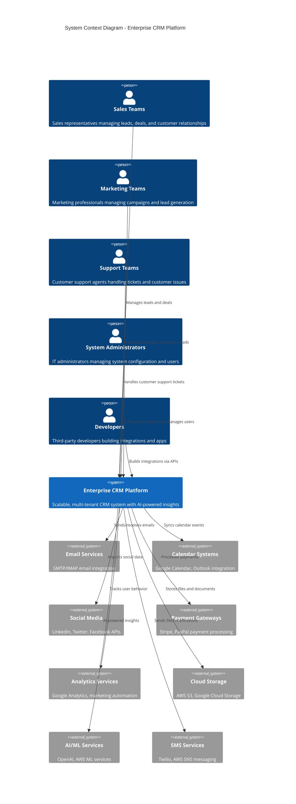
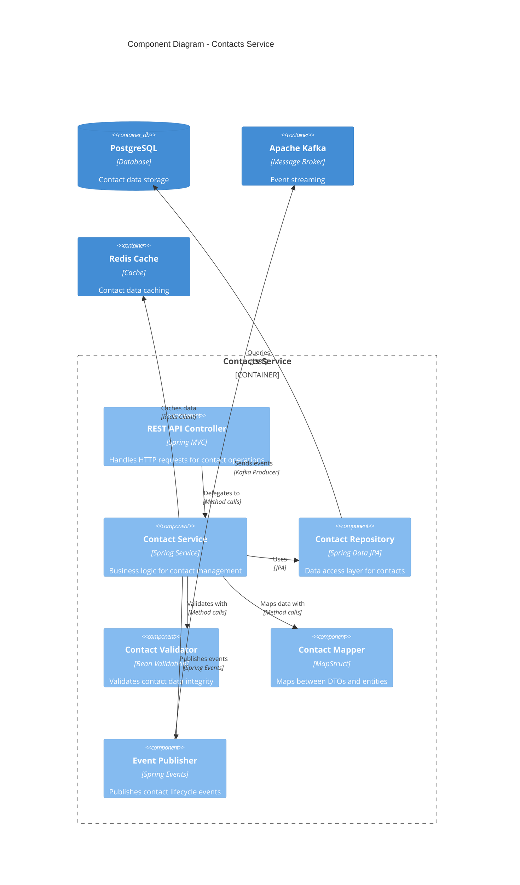
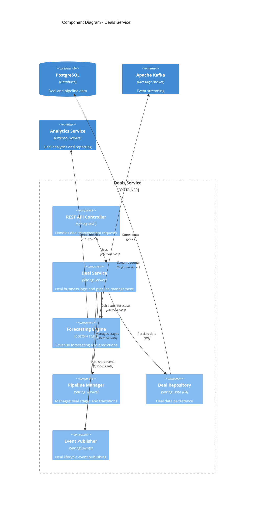

# System Architecture

This document outlines the high-level system architecture for the enterprise CRM platform, including microservices design, technology stack, and infrastructure components.

---

**Status**: In Progress  
**Last Updated**: January 2025  
**Version**: 1.0

## Table of Contents

1. [Architecture Overview](#architecture-overview)
2. [High-Level Architecture Diagrams](#high-level-architecture-diagrams)
3. [Microservices Architecture](#microservices-architecture)
4. [Technology Stack and Infrastructure](#technology-stack-and-infrastructure)
5. [Deployment Architecture](#deployment-architecture)

## Architecture Overview

The CRM platform follows a cloud-native, microservices architecture designed for scalability, resilience, and maintainability. The system is built using Java-based microservices deployed on Kubernetes, with event-driven communication patterns and comprehensive observability.

### Key Architectural Principles

- **Microservices Architecture**: Domain-driven service boundaries
- **Event-Driven Design**: Asynchronous communication via message brokers
- **API-First Approach**: RESTful and GraphQL APIs with OpenAPI specifications
- **Cloud-Native**: Containerized deployment with Kubernetes orchestration
- **Multi-Tenant**: Secure tenant isolation at application and data layers
- **Observability**: Comprehensive monitoring, logging, and tracing

## High-Level Architecture Diagrams

### C4 Context Diagram

The following diagram shows the system boundaries and external integrations:



### Container Diagram

The following diagram shows the major microservices and their interactions:

```mermaid
C4Container
    title Container Diagram - CRM Platform Microservices

    Person(user, "CRM Users", "Sales, Marketing, Support teams")
    Person(developer, "API Consumers", "Third-party developers and integrations")

    Container_Boundary(web, "Web Layer") {
        Container(webapp, "Web Application", "React/Angular SPA", "User interface for CRM functionality")
        Container(mobile, "Mobile App", "React Native/Flutter", "Mobile CRM application")
    }

    Container_Boundary(api, "API Gateway Layer") {
        Container(gateway, "API Gateway", "Kong/Istio Gateway", "API routing, authentication, rate limiting")
        Container(auth, "Authentication Service", "Java/Spring Boot", "OAuth2, JWT token management")
    }

    Container_Boundary(core, "Core Services") {
        Container(contacts, "Contacts Service", "Java/Spring Boot", "Contact management and relationships")
        Container(deals, "Deals Service", "Java/Spring Boot", "Deal pipeline and forecasting")
        Container(leads, "Leads Service", "Java/Spring Boot", "Lead qualification and conversion")
        Container(accounts, "Accounts Service", "Java/Spring Boot", "Account hierarchy and management")
        Container(activities, "Activities Service", "Java/Spring Boot", "Tasks, events, communications")
        Container(pipelines, "Pipelines Service", "Java/Spring Boot", "Pipeline configuration and automation")
    }

    Container_Boundary(advanced, "Advanced Services") {
        Container(analytics, "Analytics Service", "Java/Spring Boot", "Custom dashboards and reporting")
        Container(ai, "AI Insights Service", "Python/FastAPI", "ML models and predictive analytics")
        Container(custom, "Custom Objects Service", "Java/Spring Boot", "User-defined entities and fields")
        Container(workflow, "Workflow Service", "Java/Spring Boot", "Automation and business rules")
        Container(marketplace, "Marketplace Service", "Java/Spring Boot", "App store and extensions")
        Container(integration, "Integration Service", "Java/Spring Boot", "Third-party connectors")
    }

    Container_Boundary(platform, "Platform Services") {
        Container(notification, "Notification Service", "Java/Spring Boot", "Email, SMS, push notifications")
        Container(file, "File Service", "Java/Spring Boot", "Document and media management")
        Container(audit, "Audit Service", "Java/Spring Boot", "Audit trails and compliance")
        Container(tenant, "Tenant Service", "Java/Spring Boot", "Multi-tenant configuration")
    }

    Container_Boundary(data, "Data Layer") {
        ContainerDb(postgres, "PostgreSQL", "Relational Database", "Core CRM data")
        ContainerDb(mongo, "MongoDB", "Document Database", "Custom objects and configurations")
        ContainerDb(redis, "Redis", "Cache/Session Store", "Caching and session management")
        ContainerDb(elastic, "Elasticsearch", "Search Engine", "Full-text search and analytics")
    }

    Container_Boundary(messaging, "Messaging Layer") {
        Container(kafka, "Apache Kafka", "Message Broker", "Event streaming and async communication")
        Container(rabbitmq, "RabbitMQ", "Message Queue", "Task queues and reliable messaging")
    }

    Rel(user, webapp, "Uses", "HTTPS")
    Rel(user, mobile, "Uses", "HTTPS")
    Rel(developer, gateway, "Consumes APIs", "HTTPS/REST")

    Rel(webapp, gateway, "API calls", "HTTPS/REST")
    Rel(mobile, gateway, "API calls", "HTTPS/REST")
    Rel(gateway, auth, "Authentication", "HTTP/gRPC")

    Rel(gateway, contacts, "Routes requests", "HTTP/gRPC")
    Rel(gateway, deals, "Routes requests", "HTTP/gRPC")
    Rel(gateway, leads, "Routes requests", "HTTP/gRPC")
    Rel(gateway, accounts, "Routes requests", "HTTP/gRPC")
    Rel(gateway, activities, "Routes requests", "HTTP/gRPC")
    Rel(gateway, pipelines, "Routes requests", "HTTP/gRPC")

    Rel(contacts, postgres, "Reads/Writes", "JDBC")
    Rel(deals, postgres, "Reads/Writes", "JDBC")
    Rel(leads, postgres, "Reads/Writes", "JDBC")
    Rel(accounts, postgres, "Reads/Writes", "JDBC")
    Rel(activities, postgres, "Reads/Writes", "JDBC")

    Rel(custom, mongo, "Reads/Writes", "MongoDB Driver")
    Rel(analytics, elastic, "Queries", "REST API")
    Rel(ai, redis, "Caches models", "Redis Protocol")

    Rel(contacts, kafka, "Publishes events", "Kafka Protocol")
    Rel(deals, kafka, "Publishes events", "Kafka Protocol")
    Rel(workflow, kafka, "Consumes events", "Kafka Protocol")
    Rel(notification, rabbitmq, "Processes tasks", "AMQP")
```



### Component Diagrams

#### Contacts Service Components



#### Deals Service Components



### Deployment Architecture Diagram

```mermaid
C4Deployment
    title Deployment Diagram - Kubernetes Infrastructure

    Deployment_Node(cloud, "Cloud Provider (AWS/GCP/Azure)", "Managed Kubernetes Service") {
        Deployment_Node(cluster, "Kubernetes Cluster", "Production Environment") {
            
            Deployment_Node(ingress, "Ingress Layer") {
                Container(lb, "Load Balancer", "Cloud LB", "External traffic routing")
                Container(ingress_ctrl, "Ingress Controller", "NGINX/Istio", "HTTP/HTTPS routing")
            }
            
            Deployment_Node(gateway_ns, "Gateway Namespace") {
                Container(api_gw, "API Gateway", "Kong/Istio Gateway", "API management and security")
                Container(auth_svc, "Auth Service", "Java/Spring Boot", "Authentication and authorization")
            }
            
            Deployment_Node(core_ns, "Core Services Namespace") {
                Container(contacts_svc, "Contacts Service", "Java/Spring Boot", "Contact management")
                Container(deals_svc, "Deals Service", "Java/Spring Boot", "Deal pipeline management")
                Container(leads_svc, "Leads Service", "Java/Spring Boot", "Lead qualification")
                Container(accounts_svc, "Accounts Service", "Java/Spring Boot", "Account management")
            }
            
            Deployment_Node(advanced_ns, "Advanced Services Namespace") {
                Container(ai_svc, "AI Service", "Python/FastAPI", "ML and analytics")
                Container(workflow_svc, "Workflow Service", "Java/Spring Boot", "Automation engine")
                Container(analytics_svc, "Analytics Service", "Java/Spring Boot", "Reporting and dashboards")
            }
            
            Deployment_Node(data_ns, "Data Layer Namespace") {
                ContainerDb(postgres_cluster, "PostgreSQL Cluster", "StatefulSet", "Primary database cluster")
                ContainerDb(mongo_cluster, "MongoDB Cluster", "StatefulSet", "Document database cluster")
                ContainerDb(redis_cluster, "Redis Cluster", "StatefulSet", "Cache and session store")
                ContainerDb(elastic_cluster, "Elasticsearch Cluster", "StatefulSet", "Search and analytics")
            }
            
            Deployment_Node(messaging_ns, "Messaging Namespace") {
                Container(kafka_cluster, "Kafka Cluster", "StatefulSet", "Event streaming platform")
                Container(rabbitmq_cluster, "RabbitMQ Cluster", "StatefulSet", "Message queue system")
            }
            
            Deployment_Node(monitoring_ns, "Monitoring Namespace") {
                Container(prometheus, "Prometheus", "Deployment", "Metrics collection")
                Container(grafana, "Grafana", "Deployment", "Metrics visualization")
                Container(jaeger, "Jaeger", "Deployment", "Distributed tracing")
                Container(elk, "ELK Stack", "StatefulSet", "Log aggregation and analysis")
            }
        }
        
        Deployment_Node(storage, "Managed Storage") {
            ContainerDb(s3, "Object Storage", "AWS S3/GCS", "File and document storage")
            ContainerDb(backup, "Backup Storage", "Cloud Backup", "Database backups and disaster recovery")
        }
        
        Deployment_Node(external, "External Services") {
            Container(cdn, "CDN", "CloudFlare/CloudFront", "Static asset delivery")
            Container(dns, "DNS", "Route53/Cloud DNS", "Domain name resolution")
            Container(secrets, "Secrets Manager", "AWS Secrets/GCP Secret Manager", "Credential management")
        }
    }

    Rel(lb, ingress_ctrl, "Routes traffic", "HTTP/HTTPS")
    Rel(ingress_ctrl, api_gw, "Forwards requests", "HTTP")
    Rel(api_gw, contacts_svc, "Routes API calls", "HTTP/gRPC")
    Rel(api_gw, deals_svc, "Routes API calls", "HTTP/gRPC")
    Rel(contacts_svc, postgres_cluster, "Stores data", "TCP/5432")
    Rel(deals_svc, postgres_cluster, "Stores data", "TCP/5432")
    Rel(ai_svc, mongo_cluster, "Stores ML models", "TCP/27017")
    Rel(contacts_svc, kafka_cluster, "Publishes events", "TCP/9092")
    Rel(prometheus, contacts_svc, "Scrapes metrics", "HTTP")
    Rel(grafana, prometheus, "Queries metrics", "HTTP")
```



## Microservices Architecture

### Service Boundaries and Responsibilities

The CRM platform is decomposed into domain-driven microservices, each with clear boundaries and responsibilities:

#### Core Business Services

**Contacts Service**
- **Responsibility**: Manages individual and organizational contact information
- **Domain**: Contact entities, relationships, contact hierarchies
- **Key Operations**: CRUD operations, contact search, relationship management, contact deduplication
- **Data Ownership**: Contact profiles, contact relationships, communication preferences
- **Service Boundaries**: Does not handle deals or activities directly, publishes events for other services

**Deals Service**
- **Responsibility**: Manages sales opportunities and revenue pipeline
- **Domain**: Deal entities, pipeline stages, forecasting, deal progression
- **Key Operations**: Deal lifecycle management, pipeline analytics, revenue forecasting, stage transitions
- **Data Ownership**: Deal records, pipeline configurations, forecasting data
- **Service Boundaries**: References contacts and accounts but doesn't manage them directly

**Leads Service**
- **Responsibility**: Manages potential customers and lead qualification
- **Domain**: Lead entities, lead scoring, qualification workflows, conversion tracking
- **Key Operations**: Lead capture, scoring algorithms, qualification workflows, lead-to-contact conversion
- **Data Ownership**: Lead records, scoring models, qualification criteria
- **Service Boundaries**: Converts leads to contacts via events, doesn't directly manage post-conversion data

**Accounts Service**
- **Responsibility**: Manages organizational accounts and hierarchies
- **Domain**: Account entities, account hierarchies, account relationships
- **Key Operations**: Account management, hierarchy navigation, account merging, territory assignment
- **Data Ownership**: Account profiles, organizational hierarchies, account metadata
- **Service Boundaries**: References contacts but maintains separate account-specific data

**Activities Service**
- **Responsibility**: Manages tasks, events, and communication tracking
- **Domain**: Activity entities, task management, calendar integration, communication logs
- **Key Operations**: Activity CRUD, calendar synchronization, task assignment, communication tracking
- **Data Ownership**: Activity records, task assignments, communication logs
- **Service Boundaries**: References other entities but owns activity-specific data and workflows

**Pipelines Service**
- **Responsibility**: Manages pipeline configurations and automation rules
- **Domain**: Pipeline definitions, stage configurations, automation workflows
- **Key Operations**: Pipeline configuration, stage management, automation rule execution
- **Data Ownership**: Pipeline templates, stage definitions, automation rules
- **Service Boundaries**: Configures pipelines used by Deals Service, doesn't manage individual deals

#### Advanced Feature Services

**Analytics Service**
- **Responsibility**: Provides reporting, dashboards, and business intelligence
- **Domain**: Data aggregation, report generation, dashboard configuration
- **Key Operations**: Report generation, dashboard creation, data visualization, trend analysis
- **Data Ownership**: Aggregated metrics, report definitions, dashboard configurations
- **Service Boundaries**: Reads from other services via events, doesn't modify core business data

**AI Insights Service**
- **Responsibility**: Provides machine learning capabilities and predictive analytics
- **Domain**: ML models, predictive analytics, lead scoring, recommendation engines
- **Key Operations**: Model training, prediction generation, lead scoring, recommendation algorithms
- **Data Ownership**: ML models, training data, prediction results, scoring algorithms
- **Service Boundaries**: Consumes data from other services, provides insights back via APIs

**Custom Objects Service**
- **Responsibility**: Manages user-defined entities and custom field definitions
- **Domain**: Custom object schemas, custom field definitions, dynamic data structures
- **Key Operations**: Schema management, custom field CRUD, dynamic query generation
- **Data Ownership**: Custom object definitions, custom field metadata, dynamic data
- **Service Boundaries**: Provides extensibility framework, integrates with core services for custom data

**Workflow Service**
- **Responsibility**: Manages business process automation and workflow execution
- **Domain**: Workflow definitions, automation rules, process orchestration
- **Key Operations**: Workflow execution, rule evaluation, process automation, trigger management
- **Data Ownership**: Workflow definitions, execution logs, automation rules
- **Service Boundaries**: Orchestrates actions across services, doesn't own core business entities

**Marketplace Service**
- **Responsibility**: Manages third-party applications and extensions
- **Domain**: App catalog, app installations, app configurations, app lifecycle
- **Key Operations**: App discovery, installation management, configuration, lifecycle management
- **Data Ownership**: App metadata, installation records, app configurations
- **Service Boundaries**: Manages app ecosystem, integrates with other services via defined APIs

**Integration Service**
- **Responsibility**: Manages external system integrations and data synchronization
- **Domain**: Integration configurations, data mapping, synchronization workflows
- **Key Operations**: Integration setup, data transformation, sync orchestration, error handling
- **Data Ownership**: Integration configurations, mapping definitions, sync logs
- **Service Boundaries**: Facilitates data flow between CRM and external systems

#### Platform Services

**Authentication Service**
- **Responsibility**: Manages user authentication, authorization, and security
- **Domain**: User credentials, access tokens, permissions, security policies
- **Key Operations**: User authentication, token management, permission validation, security enforcement
- **Data Ownership**: User credentials, access tokens, permission mappings
- **Service Boundaries**: Provides security for all services, doesn't manage business data

**Notification Service**
- **Responsibility**: Manages multi-channel notifications and communications
- **Domain**: Notification templates, delivery channels, notification preferences
- **Key Operations**: Notification delivery, template management, channel routing, preference management
- **Data Ownership**: Notification templates, delivery logs, user preferences
- **Service Boundaries**: Receives notification requests from other services, handles delivery

**File Service**
- **Responsibility**: Manages document storage, file uploads, and media handling
- **Domain**: File metadata, storage management, access control, file processing
- **Key Operations**: File upload/download, metadata management, access control, file processing
- **Data Ownership**: File metadata, storage references, access permissions
- **Service Boundaries**: Provides file services to all other services, doesn't manage business context

**Audit Service**
- **Responsibility**: Manages audit trails, compliance logging, and data governance
- **Domain**: Audit logs, compliance reports, data lineage, change tracking
- **Key Operations**: Audit log collection, compliance reporting, change tracking, data governance
- **Data Ownership**: Audit logs, compliance records, change history
- **Service Boundaries**: Receives audit events from all services, provides compliance reporting

**Tenant Service**
- **Responsibility**: Manages multi-tenant configurations and tenant isolation
- **Domain**: Tenant configurations, isolation policies, tenant-specific settings
- **Key Operations**: Tenant provisioning, configuration management, isolation enforcement
- **Data Ownership**: Tenant metadata, configuration settings, isolation policies
- **Service Boundaries**: Provides tenant context to all services, manages tenant lifecycle

### Inter-Service Communication Patterns

#### Synchronous Communication

**REST APIs**
- **Usage**: Client-facing operations, real-time queries, CRUD operations
- **Protocol**: HTTP/HTTPS with JSON payloads
- **Authentication**: JWT tokens with OAuth2
- **Error Handling**: Standardized HTTP status codes and error responses
- **Versioning**: URL-based versioning (e.g., `/api/v1/contacts`)

```yaml
REST API Standards:
  Base URL: https://api.crm.company.com/v1
  Authentication: Bearer JWT tokens
  Content-Type: application/json
  Error Format:
    error:
      code: string
      message: string
      details: object
  Rate Limiting: 1000 requests/hour per user
```

**gRPC APIs**
- **Usage**: High-performance service-to-service communication
- **Protocol**: HTTP/2 with Protocol Buffers
- **Authentication**: mTLS certificates and JWT tokens
- **Error Handling**: gRPC status codes with detailed error messages
- **Service Discovery**: Kubernetes service discovery with load balancing

```protobuf
// Example gRPC service definition
service ContactService {
  rpc GetContact(GetContactRequest) returns (ContactResponse);
  rpc CreateContact(CreateContactRequest) returns (ContactResponse);
  rpc UpdateContact(UpdateContactRequest) returns (ContactResponse);
  rpc DeleteContact(DeleteContactRequest) returns (Empty);
  rpc SearchContacts(SearchContactsRequest) returns (SearchContactsResponse);
}
```

#### Asynchronous Communication

**Event-Driven Messaging Architecture**

The platform uses Apache Kafka for event streaming and RabbitMQ for task queues:

**Apache Kafka Configuration**
- **Topics**: Domain-specific topics (contacts.events, deals.events, activities.events)
- **Partitioning**: By tenant ID for scalability and isolation
- **Retention**: 7 days for events, 30 days for audit events
- **Replication**: 3 replicas for high availability

```yaml
Kafka Topics:
  contacts.lifecycle:
    partitions: 12
    replication: 3
    retention: 168h
  deals.pipeline:
    partitions: 12
    replication: 3
    retention: 168h
  activities.tracking:
    partitions: 6
    replication: 3
    retention: 72h
  audit.events:
    partitions: 24
    replication: 3
    retention: 720h
```

**Event Schema Standards**

```json
{
  "eventId": "uuid",
  "eventType": "contact.created|contact.updated|contact.deleted",
  "tenantId": "string",
  "timestamp": "ISO8601",
  "source": "service-name",
  "version": "1.0",
  "data": {
    "entityId": "uuid",
    "entityType": "contact",
    "changes": {},
    "metadata": {}
  }
}
```

**RabbitMQ Configuration**
- **Queues**: Task-specific queues with dead letter queues
- **Exchanges**: Topic exchanges for routing flexibility
- **Durability**: Persistent queues and messages
- **Acknowledgments**: Manual acknowledgments for reliability

```yaml
RabbitMQ Queues:
  notification.email:
    durable: true
    auto_delete: false
    dlq: notification.email.dlq
  workflow.execution:
    durable: true
    auto_delete: false
    dlq: workflow.execution.dlq
  integration.sync:
    durable: true
    auto_delete: false
    dlq: integration.sync.dlq
```

### API Gateway Configuration and Routing

#### Kong API Gateway Setup

**Core Configuration**
- **Load Balancing**: Round-robin with health checks
- **Rate Limiting**: Per-user and per-endpoint limits
- **Authentication**: JWT plugin with OAuth2 integration
- **Logging**: Request/response logging with correlation IDs
- **Caching**: Response caching for read-heavy endpoints

```yaml
Kong Configuration:
  services:
    contacts-service:
      url: http://contacts-service:8080
      retries: 3
      connect_timeout: 5000
      read_timeout: 60000
    deals-service:
      url: http://deals-service:8080
      retries: 3
      connect_timeout: 5000
      read_timeout: 60000
  
  routes:
    contacts-api:
      service: contacts-service
      paths: ["/api/v1/contacts"]
      methods: ["GET", "POST", "PUT", "DELETE"]
    deals-api:
      service: deals-service
      paths: ["/api/v1/deals"]
      methods: ["GET", "POST", "PUT", "DELETE"]
  
  plugins:
    - name: jwt
      config:
        secret_is_base64: false
        key_claim_name: iss
    - name: rate-limiting
      config:
        minute: 100
        hour: 1000
    - name: cors
      config:
        origins: ["*"]
        methods: ["GET", "POST", "PUT", "DELETE"]
```

**Routing Strategies**

1. **Path-Based Routing**: Routes based on URL paths
   - `/api/v1/contacts/*` → Contacts Service
   - `/api/v1/deals/*` → Deals Service
   - `/api/v1/analytics/*` → Analytics Service

2. **Header-Based Routing**: Routes based on custom headers
   - `X-Service-Version: v2` → Beta service versions
   - `X-Tenant-Type: enterprise` → Enterprise-specific services

3. **Load Balancing**: Weighted round-robin with health checks
   - Health check endpoint: `/health`
   - Failure threshold: 3 consecutive failures
   - Recovery threshold: 2 consecutive successes

### Service Mesh Implementation

#### Istio Service Mesh Configuration

**Observability Features**
- **Distributed Tracing**: Jaeger integration for request tracing
- **Metrics Collection**: Prometheus metrics for all service interactions
- **Access Logging**: Comprehensive request/response logging
- **Service Graph**: Visual representation of service dependencies

**Security Features**
- **mTLS**: Automatic mutual TLS between services
- **Authorization Policies**: Fine-grained access control
- **Security Policies**: Network policies and traffic encryption
- **Certificate Management**: Automatic certificate rotation

```yaml
Istio Configuration:
  telemetry:
    tracing:
      sampling: 1.0
      jaeger:
        address: jaeger-collector:14268
    metrics:
      prometheus:
        configOverride:
          metric_relabeling_configs:
            - source_labels: [__name__]
              regex: istio_.*
              target_label: __tmp_istio_metric
  
  security:
    peerAuthentication:
      mtls:
        mode: STRICT
    authorizationPolicy:
      rules:
        - from:
          - source:
              principals: ["cluster.local/ns/crm-core/sa/contacts-service"]
          to:
          - operation:
              methods: ["GET", "POST"]
```

**Traffic Management**
- **Circuit Breaking**: Automatic failure detection and recovery
- **Retry Policies**: Configurable retry logic with exponential backoff
- **Timeout Configuration**: Per-service timeout settings
- **Canary Deployments**: Gradual traffic shifting for deployments

```yaml
Traffic Policies:
  circuitBreaker:
    consecutiveErrors: 5
    interval: 30s
    baseEjectionTime: 30s
    maxEjectionPercent: 50
  
  retryPolicy:
    attempts: 3
    perTryTimeout: 2s
    retryOn: 5xx,reset,connect-failure,refused-stream
  
  timeout: 10s
```#
# Technology Stack and Infrastructure

### Java Framework Selection

#### Spring Boot (Primary Choice)

**Rationale**: Spring Boot is selected as the primary framework for most microservices due to its maturity, ecosystem, and enterprise features.

**Key Benefits**:
- Comprehensive ecosystem with Spring Data, Spring Security, Spring Cloud
- Excellent observability support with Micrometer and Actuator
- Strong community support and extensive documentation
- Production-ready features out of the box
- Excellent integration with Kubernetes and cloud platforms

**Configuration**:
```yaml
Spring Boot Services:
  version: 3.2.x
  java_version: 21
  build_tool: Maven
  packaging: jar
  
  dependencies:
    - spring-boot-starter-web
    - spring-boot-starter-data-jpa
    - spring-boot-starter-security
    - spring-boot-starter-actuator
    - spring-cloud-starter-kubernetes
    - micrometer-registry-prometheus
    - spring-kafka
    - spring-boot-starter-validation
```

**Service Implementation Pattern**:
```java
@SpringBootApplication
@EnableJpaRepositories
@EnableKafka
public class ContactsServiceApplication {
    public static void main(String[] args) {
        SpringApplication.run(ContactsServiceApplication.class, args);
    }
}
```

#### Quarkus (Specialized Use Cases)

**Usage**: Selected for specific services requiring ultra-fast startup and low memory footprint.

**Target Services**:
- AI Insights Service (when implemented in Java)
- Integration Service (for lightweight connectors)
- Notification Service (for high-throughput scenarios)

**Key Benefits**:
- Sub-second startup times
- Low memory footprint (ideal for serverless)
- Native compilation with GraalVM
- Kubernetes-native features
- Reactive programming support

**Configuration**:
```yaml
Quarkus Services:
  version: 3.6.x
  java_version: 21
  build_tool: Maven
  packaging: uber-jar
  
  extensions:
    - quarkus-resteasy-reactive-jackson
    - quarkus-hibernate-orm-panache
    - quarkus-security-jwt
    - quarkus-micrometer-registry-prometheus
    - quarkus-kafka-client
    - quarkus-kubernetes
```

### Database Technologies

#### PostgreSQL (Primary Relational Database)

**Usage**: Core CRM entities with strong consistency requirements

**Target Data**:
- Contacts, Accounts, Leads, Deals
- User management and authentication
- Pipeline configurations
- Audit trails and compliance data

**Configuration**:
```yaml
PostgreSQL Cluster:
  version: 15.x
  deployment: StatefulSet with 3 replicas
  storage: SSD with 1TB per instance
  backup: Daily automated backups to cloud storage
  
  performance_tuning:
    shared_buffers: 256MB
    effective_cache_size: 1GB
    work_mem: 4MB
    maintenance_work_mem: 64MB
    max_connections: 200
  
  extensions:
    - uuid-ossp (UUID generation)
    - pg_stat_statements (query performance)
    - pg_trgm (full-text search)
```

**Schema Design Principles**:
- Multi-tenant architecture with tenant_id in all tables
- JSONB columns for flexible metadata storage
- Proper indexing strategy for query performance
- Foreign key constraints for data integrity

#### MongoDB (Document Database)

**Usage**: Flexible schema requirements and custom objects

**Target Data**:
- Custom object definitions and data
- Analytics and reporting data
- Configuration and metadata
- Integration mapping definitions

**Configuration**:
```yaml
MongoDB Cluster:
  version: 7.0.x
  deployment: StatefulSet with replica set (3 members)
  storage: SSD with 500GB per instance
  
  replica_set:
    primary: 1
    secondary: 2
    arbiter: 0
  
  performance_tuning:
    wiredTiger:
      cacheSizeGB: 1
      journalCompressor: snappy
      collectionBlockCompressor: snappy
```

**Data Modeling Strategy**:
- Document-per-tenant for custom objects
- Embedded documents for related data
- Proper indexing on tenant_id and frequently queried fields
- TTL indexes for temporary data

#### Redis (Cache and Session Store)

**Usage**: High-performance caching and session management

**Target Data**:
- User sessions and authentication tokens
- Frequently accessed data caching
- Rate limiting counters
- Real-time analytics data

**Configuration**:
```yaml
Redis Cluster:
  version: 7.2.x
  deployment: StatefulSet with cluster mode
  nodes: 6 (3 masters, 3 replicas)
  memory: 2GB per node
  
  cluster_config:
    cluster-enabled: yes
    cluster-config-file: nodes.conf
    cluster-node-timeout: 5000
    appendonly: yes
    save: "900 1 300 10 60 10000"
```

#### Elasticsearch (Search and Analytics)

**Usage**: Full-text search and analytics capabilities

**Target Data**:
- Contact and account search indexes
- Activity and communication logs
- Analytics and reporting data
- Audit log search

**Configuration**:
```yaml
Elasticsearch Cluster:
  version: 8.11.x
  deployment: StatefulSet with 3 nodes
  roles:
    - master: 3 nodes
    - data: 3 nodes
    - ingest: 3 nodes
  
  performance_tuning:
    heap_size: 2GB
    indices:
      number_of_shards: 3
      number_of_replicas: 1
    refresh_interval: 30s
```

### Containerization and Orchestration

#### Docker Configuration

**Base Images**:
```dockerfile
# Java services base image
FROM eclipse-temurin:21-jre-alpine
RUN addgroup -g 1001 appuser && adduser -u 1001 -G appuser -s /bin/sh -D appuser
USER appuser
WORKDIR /app
COPY --chown=appuser:appuser target/*.jar app.jar
EXPOSE 8080
ENTRYPOINT ["java", "-jar", "app.jar"]
```

**Multi-stage Build**:
```dockerfile
# Build stage
FROM eclipse-temurin:21-jdk-alpine AS builder
WORKDIR /app
COPY pom.xml .
COPY src ./src
RUN ./mvnw clean package -DskipTests

# Runtime stage
FROM eclipse-temurin:21-jre-alpine
RUN addgroup -g 1001 appuser && adduser -u 1001 -G appuser -s /bin/sh -D appuser
USER appuser
WORKDIR /app
COPY --from=builder --chown=appuser:appuser /app/target/*.jar app.jar
EXPOSE 8080
ENTRYPOINT ["java", "-jar", "app.jar"]
```

#### Kubernetes Configuration

**Cluster Specifications**:
```yaml
Kubernetes Cluster:
  version: 1.28.x
  node_pools:
    system:
      machine_type: e2-standard-4
      nodes: 3
      disk_size: 100GB
    application:
      machine_type: e2-standard-8
      nodes: 5-20 (auto-scaling)
      disk_size: 200GB
    data:
      machine_type: e2-highmem-4
      nodes: 3
      disk_size: 500GB
      disk_type: SSD
```

**Namespace Organization**:
```yaml
Namespaces:
  crm-system:     # System components (ingress, monitoring)
  crm-gateway:    # API Gateway and authentication
  crm-core:       # Core business services
  crm-advanced:   # Advanced feature services
  crm-platform:   # Platform services
  crm-data:       # Database and storage services
  crm-messaging:  # Message brokers and queues
  crm-monitoring: # Observability stack
```

**Resource Management**:
```yaml
Resource Quotas:
  crm-core:
    requests.cpu: "4"
    requests.memory: 8Gi
    limits.cpu: "8"
    limits.memory: 16Gi
  crm-data:
    requests.cpu: "6"
    requests.memory: 12Gi
    limits.cpu: "12"
    limits.memory: 24Gi
```

### Cloud Provider Selection

#### Multi-Cloud Strategy

**Primary Provider: AWS**
- **Rationale**: Comprehensive service ecosystem, mature Kubernetes support (EKS), strong security features
- **Key Services**: EKS, RDS, ElastiCache, S3, CloudWatch, IAM, Secrets Manager

**Secondary Provider: Google Cloud Platform**
- **Rationale**: Excellent Kubernetes-native features (GKE), strong AI/ML services, competitive pricing
- **Key Services**: GKE, Cloud SQL, Memorystore, Cloud Storage, Cloud Monitoring

**Hybrid Deployment Strategy**:
```yaml
Environment Distribution:
  production:
    primary: AWS (us-east-1, us-west-2)
    secondary: GCP (us-central1)
    strategy: Active-Active with cross-region replication
  
  staging:
    provider: GCP (us-central1)
    strategy: Cost-optimized single region
  
  development:
    provider: AWS (us-east-1)
    strategy: Shared cluster with namespace isolation
```

#### Cloud-Native Services Integration

**AWS Services**:
```yaml
AWS Integration:
  compute: EKS with managed node groups
  database: RDS PostgreSQL Multi-AZ
  cache: ElastiCache Redis Cluster
  storage: S3 with lifecycle policies
  monitoring: CloudWatch + Prometheus
  secrets: AWS Secrets Manager
  networking: VPC with private subnets
  security: IAM roles with OIDC
```

**GCP Services**:
```yaml
GCP Integration:
  compute: GKE Autopilot
  database: Cloud SQL PostgreSQL HA
  cache: Memorystore Redis
  storage: Cloud Storage with versioning
  monitoring: Cloud Monitoring + Prometheus
  secrets: Secret Manager
  networking: VPC with private clusters
  security: Workload Identity
```

### Monitoring and Observability Stack

#### Prometheus Configuration

**Metrics Collection**:
```yaml
Prometheus Setup:
  version: 2.47.x
  retention: 15d
  storage: 100GB SSD
  
  scrape_configs:
    - job_name: kubernetes-pods
      kubernetes_sd_configs:
        - role: pod
      relabel_configs:
        - source_labels: [__meta_kubernetes_pod_annotation_prometheus_io_scrape]
          action: keep
          regex: true
    
    - job_name: kubernetes-services
      kubernetes_sd_configs:
        - role: endpoints
      relabel_configs:
        - source_labels: [__meta_kubernetes_service_annotation_prometheus_io_scrape]
          action: keep
          regex: true
```

**Custom Metrics**:
```yaml
Application Metrics:
  business_metrics:
    - contacts_created_total
    - deals_closed_total
    - leads_converted_total
    - api_requests_duration_seconds
  
  technical_metrics:
    - jvm_memory_used_bytes
    - database_connections_active
    - kafka_consumer_lag
    - cache_hit_ratio
```

#### Grafana Dashboards

**Dashboard Categories**:
```yaml
Grafana Dashboards:
  infrastructure:
    - Kubernetes Cluster Overview
    - Node Resource Utilization
    - Pod Resource Usage
    - Network Traffic Analysis
  
  application:
    - Service Performance Metrics
    - API Response Times
    - Error Rate Analysis
    - Business KPI Dashboard
  
  data:
    - Database Performance
    - Cache Hit Rates
    - Message Queue Metrics
    - Storage Utilization
```

#### Jaeger Distributed Tracing

**Tracing Configuration**:
```yaml
Jaeger Setup:
  version: 1.50.x
  deployment: Production (Elasticsearch backend)
  sampling_rate: 0.1 (10% of requests)
  retention: 7 days
  
  components:
    jaeger-collector:
      replicas: 3
      resources:
        requests: {cpu: 100m, memory: 128Mi}
        limits: {cpu: 500m, memory: 512Mi}
    
    jaeger-query:
      replicas: 2
      resources:
        requests: {cpu: 100m, memory: 128Mi}
        limits: {cpu: 200m, memory: 256Mi}
```

#### Centralized Logging (ELK Stack)

**Logging Architecture**:
```yaml
ELK Stack:
  elasticsearch:
    version: 8.11.x
    nodes: 3
    storage: 200GB per node
    retention: 30 days
  
  logstash:
    version: 8.11.x
    replicas: 2
    pipelines:
      - application-logs
      - audit-logs
      - access-logs
  
  kibana:
    version: 8.11.x
    replicas: 2
    dashboards:
      - Application Error Analysis
      - Audit Trail Visualization
      - Performance Monitoring
```

**Log Format Standardization**:
```json
{
  "timestamp": "2025-01-24T10:30:00.000Z",
  "level": "INFO|WARN|ERROR",
  "service": "contacts-service",
  "traceId": "abc123def456",
  "spanId": "789ghi012jkl",
  "tenantId": "tenant-123",
  "userId": "user-456",
  "message": "Contact created successfully",
  "metadata": {
    "contactId": "contact-789",
    "operation": "CREATE"
  }
}
```

### Performance and Scalability Considerations

#### Auto-scaling Configuration

**Horizontal Pod Autoscaler (HPA)**:
```yaml
HPA Configuration:
  contacts-service:
    min_replicas: 3
    max_replicas: 20
    target_cpu: 70%
    target_memory: 80%
  
  deals-service:
    min_replicas: 3
    max_replicas: 15
    target_cpu: 70%
    target_memory: 80%
  
  ai-service:
    min_replicas: 2
    max_replicas: 10
    target_cpu: 80%
    target_memory: 85%
```

**Vertical Pod Autoscaler (VPA)**:
```yaml
VPA Configuration:
  update_mode: Auto
  resource_policy:
    container_policies:
      - container_name: app
        max_allowed:
          cpu: 2
          memory: 4Gi
        min_allowed:
          cpu: 100m
          memory: 128Mi
```

#### Database Scaling Strategy

**Read Replicas**:
```yaml
PostgreSQL Scaling:
  primary: 1 instance (write operations)
  read_replicas: 3 instances (read operations)
  connection_pooling: PgBouncer
  max_connections: 200 per instance
  
MongoDB Scaling:
  replica_set: 3 members
  read_preference: secondaryPreferred
  connection_pooling: Built-in driver pooling
  max_connections: 100 per instance
```

**Caching Strategy**:
```yaml
Redis Caching:
  application_cache:
    ttl: 300s (5 minutes)
    max_memory: 2GB
    eviction_policy: allkeys-lru
  
  session_cache:
    ttl: 3600s (1 hour)
    max_memory: 1GB
    eviction_policy: volatile-ttl
```##
 Deployment Architecture

### Environment Strategy

#### Development Environment
```yaml
Development Setup:
  cluster: Shared Kubernetes cluster
  isolation: Namespace-based
  resources: Minimal resource allocation
  data: Synthetic test data
  monitoring: Basic logging and metrics
  
  services:
    replicas: 1 per service
    resources:
      requests: {cpu: 50m, memory: 128Mi}
      limits: {cpu: 200m, memory: 512Mi}
```

#### Staging Environment
```yaml
Staging Setup:
  cluster: Dedicated cluster (smaller)
  isolation: Full environment isolation
  resources: Production-like but scaled down
  data: Anonymized production data subset
  monitoring: Full observability stack
  
  services:
    replicas: 2 per service
    resources:
      requests: {cpu: 100m, memory: 256Mi}
      limits: {cpu: 500m, memory: 1Gi}
```

#### Production Environment
```yaml
Production Setup:
  cluster: Dedicated high-availability cluster
  isolation: Complete environment separation
  resources: Full resource allocation
  data: Live production data
  monitoring: Comprehensive observability
  
  services:
    replicas: 3+ per service (auto-scaling)
    resources:
      requests: {cpu: 200m, memory: 512Mi}
      limits: {cpu: 1, memory: 2Gi}
```

### Security Architecture

#### Network Security
```yaml
Network Policies:
  ingress:
    - Allow traffic from API Gateway to services
    - Allow traffic between related services
    - Deny all other ingress traffic
  
  egress:
    - Allow traffic to databases within namespace
    - Allow traffic to message brokers
    - Allow traffic to external APIs (whitelist)
    - Deny all other egress traffic
```

#### Identity and Access Management
```yaml
RBAC Configuration:
  service_accounts:
    - contacts-service-sa
    - deals-service-sa
    - analytics-service-sa
  
  cluster_roles:
    - crm-service-reader (read ConfigMaps, Secrets)
    - crm-service-writer (write to specific resources)
  
  role_bindings:
    - Bind service accounts to appropriate roles
    - Namespace-scoped permissions
```

### Disaster Recovery and Backup

#### Backup Strategy
```yaml
Backup Configuration:
  databases:
    postgresql:
      frequency: Daily automated backups
      retention: 30 days
      cross_region: Yes
    mongodb:
      frequency: Daily automated backups
      retention: 30 days
      cross_region: Yes
  
  application_data:
    frequency: Continuous (via replication)
    retention: Point-in-time recovery (7 days)
  
  configuration:
    frequency: On every change
    retention: Version controlled (Git)
```

#### Recovery Procedures
```yaml
Recovery Time Objectives:
  database_recovery: 4 hours
  application_recovery: 1 hour
  full_system_recovery: 8 hours

Recovery Point Objectives:
  database_data: 1 hour
  application_state: 15 minutes
  configuration: Real-time
```

---

**Document Status**: Completed  
**Last Updated**: January 2025  
**Next Review**: February 2025

This system architecture provides a comprehensive foundation for building a scalable, resilient, and maintainable enterprise CRM platform. The architecture supports the business requirements while ensuring operational excellence through proper observability, security, and disaster recovery measures.