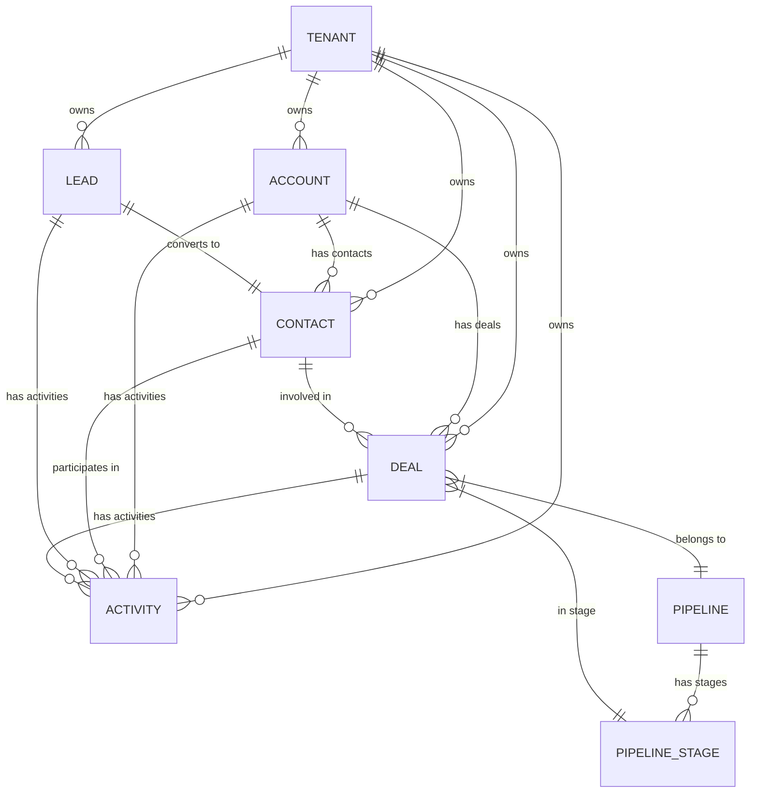

# Data Modeling

## Table of Contents
- [Overview](#overview)
- [Core Entity Data Models](#core-entity-data-models)
- [Custom Objects Framework](#custom-objects-framework)
- [Multi-Tenancy and Data Partitioning](#multi-tenancy-and-data-partitioning)
- [Audit Trails and Metadata Systems](#audit-trails-and-metadata-systems)
- [Conclusion](#conclusion)

## Overview

This document defines the comprehensive data modeling strategy for the CRM platform, covering core entities, custom object frameworks, multi-tenancy architecture, and audit systems. The data model is designed to support scalability, extensibility, and compliance requirements while maintaining performance and data integrity.

## Core Entity Data Models

### Entity Relationship Overview

The CRM platform is built around five core entities that form the foundation of customer relationship management:



### Core Entity Schemas

#### 1. Tenant Entity

```sql
CREATE TABLE tenants (
    id UUID PRIMARY KEY DEFAULT gen_random_uuid(),
    name VARCHAR(255) NOT NULL,
    subdomain VARCHAR(100) UNIQUE NOT NULL,
    plan_type VARCHAR(50) NOT NULL DEFAULT 'basic',
    status VARCHAR(20) NOT NULL DEFAULT 'active',
    settings JSONB DEFAULT '{}',
    created_at TIMESTAMP WITH TIME ZONE DEFAULT NOW(),
    updated_at TIMESTAMP WITH TIME ZONE DEFAULT NOW(),
    
    CONSTRAINT valid_plan_type CHECK (plan_type IN ('basic', 'professional', 'enterprise')),
    CONSTRAINT valid_status CHECK (status IN ('active', 'suspended', 'cancelled')),
    CONSTRAINT valid_subdomain CHECK (subdomain ~ '^[a-z0-9][a-z0-9-]*[a-z0-9]$')
);

CREATE INDEX idx_tenants_subdomain ON tenants(subdomain);
CREATE INDEX idx_tenants_status ON tenants(status);
```

#### 2. Account Entity

```sql
CREATE TABLE accounts (
    id UUID PRIMARY KEY DEFAULT gen_random_uuid(),
    tenant_id UUID NOT NULL REFERENCES tenants(id) ON DELETE CASCADE,
    name VARCHAR(255) NOT NULL,
    account_type VARCHAR(50) DEFAULT 'prospect',
    industry VARCHAR(100),
    website VARCHAR(255),
    phone VARCHAR(50),
    billing_address JSONB,
    shipping_address JSONB,
    parent_account_id UUID REFERENCES accounts(id),
    annual_revenue DECIMAL(15,2),
    employee_count INTEGER,
    description TEXT,
    custom_fields JSONB DEFAULT '{}',
    created_at TIMESTAMP WITH TIME ZONE DEFAULT NOW(),
    updated_at TIMESTAMP WITH TIME ZONE DEFAULT NOW(),
    created_by UUID NOT NULL,
    updated_by UUID NOT NULL,
    
    CONSTRAINT valid_account_type CHECK (account_type IN ('prospect', 'customer', 'partner', 'competitor')),
    CONSTRAINT valid_employee_count CHECK (employee_count >= 0),
    CONSTRAINT valid_annual_revenue CHECK (annual_revenue >= 0)
);

CREATE INDEX idx_accounts_tenant_id ON accounts(tenant_id);
CREATE INDEX idx_accounts_name ON accounts(tenant_id, name);
CREATE INDEX idx_accounts_type ON accounts(tenant_id, account_type);
CREATE INDEX idx_accounts_parent ON accounts(parent_account_id);
CREATE INDEX idx_accounts_created_at ON accounts(tenant_id, created_at);
```

#### 3. Contact Entity

```sql
CREATE TABLE contacts (
    id UUID PRIMARY KEY DEFAULT gen_random_uuid(),
    tenant_id UUID NOT NULL REFERENCES tenants(id) ON DELETE CASCADE,
    account_id UUID REFERENCES accounts(id) ON DELETE SET NULL,
    first_name VARCHAR(100) NOT NULL,
    last_name VARCHAR(100) NOT NULL,
    email VARCHAR(255),
    phone VARCHAR(50),
    mobile VARCHAR(50),
    title VARCHAR(100),
    department VARCHAR(100),
    mailing_address JSONB,
    lead_source VARCHAR(100),
    contact_status VARCHAR(50) DEFAULT 'active',
    do_not_call BOOLEAN DEFAULT FALSE,
    do_not_email BOOLEAN DEFAULT FALSE,
    email_opt_out BOOLEAN DEFAULT FALSE,
    description TEXT,
    custom_fields JSONB DEFAULT '{}',
    created_at TIMESTAMP WITH TIME ZONE DEFAULT NOW(),
    updated_at TIMESTAMP WITH TIME ZONE DEFAULT NOW(),
    created_by UUID NOT NULL,
    updated_by UUID NOT NULL,
    
    CONSTRAINT valid_contact_status CHECK (contact_status IN ('active', 'inactive', 'deceased')),
    CONSTRAINT valid_email CHECK (email IS NULL OR email ~ '^[A-Za-z0-9._%+-]+@[A-Za-z0-9.-]+\.[A-Za-z]{2,}$'),
    CONSTRAINT contact_name_not_empty CHECK (TRIM(first_name) != '' AND TRIM(last_name) != '')
);

CREATE UNIQUE INDEX idx_contacts_email_tenant ON contacts(tenant_id, email) WHERE email IS NOT NULL;
CREATE INDEX idx_contacts_tenant_id ON contacts(tenant_id);
CREATE INDEX idx_contacts_account_id ON contacts(account_id);
CREATE INDEX idx_contacts_name ON contacts(tenant_id, last_name, first_name);
CREATE INDEX idx_contacts_status ON contacts(tenant_id, contact_status);
CREATE INDEX idx_contacts_created_at ON contacts(tenant_id, created_at);
```

#### 4. Lead Entity

```sql
CREATE TABLE leads (
    id UUID PRIMARY KEY DEFAULT gen_random_uuid(),
    tenant_id UUID NOT NULL REFERENCES tenants(id) ON DELETE CASCADE,
    first_name VARCHAR(100) NOT NULL,
    last_name VARCHAR(100) NOT NULL,
    email VARCHAR(255),
    phone VARCHAR(50),
    company VARCHAR(255),
    title VARCHAR(100),
    lead_source VARCHAR(100),
    lead_status VARCHAR(50) DEFAULT 'new',
    lead_score INTEGER DEFAULT 0,
    rating VARCHAR(20),
    industry VARCHAR(100),
    annual_revenue DECIMAL(15,2),
    employee_count INTEGER,
    website VARCHAR(255),
    mailing_address JSONB,
    description TEXT,
    converted BOOLEAN DEFAULT FALSE,
    converted_date TIMESTAMP WITH TIME ZONE,
    converted_contact_id UUID REFERENCES contacts(id),
    converted_account_id UUID REFERENCES accounts(id),
    custom_fields JSONB DEFAULT '{}',
    created_at TIMESTAMP WITH TIME ZONE DEFAULT NOW(),
    updated_at TIMESTAMP WITH TIME ZONE DEFAULT NOW(),
    created_by UUID NOT NULL,
    updated_by UUID NOT NULL,
    
    CONSTRAINT valid_lead_status CHECK (lead_status IN ('new', 'contacted', 'qualified', 'unqualified', 'converted')),
    CONSTRAINT valid_rating CHECK (rating IS NULL OR rating IN ('hot', 'warm', 'cold')),
    CONSTRAINT valid_lead_score CHECK (lead_score >= 0 AND lead_score <= 100),
    CONSTRAINT valid_email CHECK (email IS NULL OR email ~ '^[A-Za-z0-9._%+-]+@[A-Za-z0-9.-]+\.[A-Za-z]{2,}$'),
    CONSTRAINT conversion_consistency CHECK (
        (converted = FALSE AND converted_date IS NULL AND converted_contact_id IS NULL AND converted_account_id IS NULL) OR
        (converted = TRUE AND converted_date IS NOT NULL)
    )
);

CREATE INDEX idx_leads_tenant_id ON leads(tenant_id);
CREATE INDEX idx_leads_email ON leads(tenant_id, email) WHERE email IS NOT NULL;
CREATE INDEX idx_leads_status ON leads(tenant_id, lead_status);
CREATE INDEX idx_leads_score ON leads(tenant_id, lead_score DESC);
CREATE INDEX idx_leads_converted ON leads(tenant_id, converted);
CREATE INDEX idx_leads_created_at ON leads(tenant_id, created_at);
```

#### 5. Deal Entity

```sql
CREATE TABLE pipelines (
    id UUID PRIMARY KEY DEFAULT gen_random_uuid(),
    tenant_id UUID NOT NULL REFERENCES tenants(id) ON DELETE CASCADE,
    name VARCHAR(255) NOT NULL,
    description TEXT,
    is_default BOOLEAN DEFAULT FALSE,
    is_active BOOLEAN DEFAULT TRUE,
    created_at TIMESTAMP WITH TIME ZONE DEFAULT NOW(),
    updated_at TIMESTAMP WITH TIME ZONE DEFAULT NOW(),
    
    CONSTRAINT unique_default_pipeline_per_tenant UNIQUE (tenant_id, is_default) DEFERRABLE INITIALLY DEFERRED
);

CREATE TABLE pipeline_stages (
    id UUID PRIMARY KEY DEFAULT gen_random_uuid(),
    pipeline_id UUID NOT NULL REFERENCES pipelines(id) ON DELETE CASCADE,
    name VARCHAR(255) NOT NULL,
    stage_order INTEGER NOT NULL,
    probability DECIMAL(5,2) DEFAULT 0,
    is_closed BOOLEAN DEFAULT FALSE,
    is_won BOOLEAN DEFAULT FALSE,
    created_at TIMESTAMP WITH TIME ZONE DEFAULT NOW(),
    
    CONSTRAINT valid_probability CHECK (probability >= 0 AND probability <= 100),
    CONSTRAINT valid_closed_won CHECK (NOT is_won OR is_closed),
    CONSTRAINT unique_stage_order_per_pipeline UNIQUE (pipeline_id, stage_order),
    CONSTRAINT unique_stage_name_per_pipeline UNIQUE (pipeline_id, name)
);

CREATE TABLE deals (
    id UUID PRIMARY KEY DEFAULT gen_random_uuid(),
    tenant_id UUID NOT NULL REFERENCES tenants(id) ON DELETE CASCADE,
    account_id UUID REFERENCES accounts(id) ON DELETE SET NULL,
    contact_id UUID REFERENCES contacts(id) ON DELETE SET NULL,
    pipeline_id UUID NOT NULL REFERENCES pipelines(id),
    stage_id UUID NOT NULL REFERENCES pipeline_stages(id),
    name VARCHAR(255) NOT NULL,
    amount DECIMAL(15,2),
    currency VARCHAR(3) DEFAULT 'USD',
    probability DECIMAL(5,2),
    expected_close_date DATE,
    actual_close_date DATE,
    deal_type VARCHAR(50),
    lead_source VARCHAR(100),
    next_step TEXT,
    description TEXT,
    is_closed BOOLEAN DEFAULT FALSE,
    is_won BOOLEAN DEFAULT FALSE,
    custom_fields JSONB DEFAULT '{}',
    created_at TIMESTAMP WITH TIME ZONE DEFAULT NOW(),
    updated_at TIMESTAMP WITH TIME ZONE DEFAULT NOW(),
    created_by UUID NOT NULL,
    updated_by UUID NOT NULL,
    
    CONSTRAINT valid_amount CHECK (amount IS NULL OR amount >= 0),
    CONSTRAINT valid_probability CHECK (probability IS NULL OR (probability >= 0 AND probability <= 100)),
    CONSTRAINT valid_currency CHECK (currency ~ '^[A-Z]{3}$'),
    CONSTRAINT valid_deal_type CHECK (deal_type IS NULL OR deal_type IN ('new_business', 'existing_business', 'renewal')),
    CONSTRAINT valid_closed_won CHECK (NOT is_won OR is_closed),
    CONSTRAINT close_date_consistency CHECK (NOT is_closed OR actual_close_date IS NOT NULL)
);

CREATE INDEX idx_deals_tenant_id ON deals(tenant_id);
CREATE INDEX idx_deals_account_id ON deals(account_id);
CREATE INDEX idx_deals_contact_id ON deals(contact_id);
CREATE INDEX idx_deals_pipeline_stage ON deals(pipeline_id, stage_id);
CREATE INDEX idx_deals_amount ON deals(tenant_id, amount DESC) WHERE amount IS NOT NULL;
CREATE INDEX idx_deals_close_date ON deals(tenant_id, expected_close_date) WHERE expected_close_date IS NOT NULL;
CREATE INDEX idx_deals_status ON deals(tenant_id, is_closed, is_won);
CREATE INDEX idx_deals_created_at ON deals(tenant_id, created_at);
```

#### 6. Activity Entity

```sql
CREATE TABLE activities (
    id UUID PRIMARY KEY DEFAULT gen_random_uuid(),
    tenant_id UUID NOT NULL REFERENCES tenants(id) ON DELETE CASCADE,
    account_id UUID REFERENCES accounts(id) ON DELETE CASCADE,
    contact_id UUID REFERENCES contacts(id) ON DELETE CASCADE,
    lead_id UUID REFERENCES leads(id) ON DELETE CASCADE,
    deal_id UUID REFERENCES deals(id) ON DELETE CASCADE,
    activity_type VARCHAR(50) NOT NULL,
    subject VARCHAR(255) NOT NULL,
    description TEXT,
    status VARCHAR(20) DEFAULT 'planned',
    priority VARCHAR(20) DEFAULT 'medium',
    due_date TIMESTAMP WITH TIME ZONE,
    completed_date TIMESTAMP WITH TIME ZONE,
    duration_minutes INTEGER,
    location VARCHAR(255),
    is_all_day BOOLEAN DEFAULT FALSE,
    reminder_minutes INTEGER,
    custom_fields JSONB DEFAULT '{}',
    created_at TIMESTAMP WITH TIME ZONE DEFAULT NOW(),
    updated_at TIMESTAMP WITH TIME ZONE DEFAULT NOW(),
    created_by UUID NOT NULL,
    updated_by UUID NOT NULL,
    assigned_to UUID NOT NULL,
    
    CONSTRAINT valid_activity_type CHECK (activity_type IN ('call', 'email', 'meeting', 'task', 'note', 'demo')),
    CONSTRAINT valid_status CHECK (status IN ('planned', 'in_progress', 'completed', 'cancelled', 'deferred')),
    CONSTRAINT valid_priority CHECK (priority IN ('low', 'medium', 'high', 'urgent')),
    CONSTRAINT valid_duration CHECK (duration_minutes IS NULL OR duration_minutes > 0),
    CONSTRAINT completion_consistency CHECK (
        (status != 'completed' AND completed_date IS NULL) OR
        (status = 'completed' AND completed_date IS NOT NULL)
    ),
    CONSTRAINT at_least_one_relation CHECK (
        account_id IS NOT NULL OR contact_id IS NOT NULL OR 
        lead_id IS NOT NULL OR deal_id IS NOT NULL
    )
);

CREATE INDEX idx_activities_tenant_id ON activities(tenant_id);
CREATE INDEX idx_activities_account_id ON activities(account_id);
CREATE INDEX idx_activities_contact_id ON activities(contact_id);
CREATE INDEX idx_activities_lead_id ON activities(lead_id);
CREATE INDEX idx_activities_deal_id ON activities(deal_id);
CREATE INDEX idx_activities_assigned_to ON activities(assigned_to);
CREATE INDEX idx_activities_due_date ON activities(tenant_id, due_date) WHERE due_date IS NOT NULL;
CREATE INDEX idx_activities_status ON activities(tenant_id, status);
CREATE INDEX idx_activities_type ON activities(tenant_id, activity_type);
CREATE INDEX idx_activities_created_at ON activities(tenant_id, created_at);
```

### Data Validation Rules and Business Constraints

#### Entity-Level Validation Rules

**Account Validation:**
- Name is required and cannot be empty
- Website must be valid URL format if provided
- Annual revenue must be non-negative
- Employee count must be non-negative
- Parent account cannot create circular references

**Contact Validation:**
- First name and last name are required
- Email must be unique per tenant if provided
- Email format validation using regex
- Phone number format validation
- Cannot have duplicate email addresses within tenant

**Lead Validation:**
- First name and last name are required
- Lead score must be between 0-100
- Email format validation
- Conversion fields must be consistent (all set or all null)
- Cannot convert to non-existent contact/account

**Deal Validation:**
- Name is required
- Amount must be non-negative if provided
- Probability must be between 0-100
- Currency must be valid 3-letter ISO code
- Close date consistency (actual close date required if closed)
- Stage must belong to the selected pipeline

**Activity Validation:**
- Subject is required
- Must be related to at least one entity (account, contact, lead, or deal)
- Due date cannot be in the past for new activities
- Duration must be positive if specified
- Completion date required if status is completed

#### Cross-Entity Business Rules

```sql
-- Ensure pipeline stages belong to correct pipeline
ALTER TABLE deals ADD CONSTRAINT fk_deal_stage_pipeline 
CHECK (
    EXISTS (
        SELECT 1 FROM pipeline_stages ps 
        WHERE ps.id = stage_id AND ps.pipeline_id = deals.pipeline_id
    )
);

-- Ensure contact belongs to same tenant as account
ALTER TABLE contacts ADD CONSTRAINT fk_contact_account_tenant
CHECK (
    account_id IS NULL OR 
    EXISTS (
        SELECT 1 FROM accounts a 
        WHERE a.id = account_id AND a.tenant_id = contacts.tenant_id
    )
);

-- Ensure deal entities belong to same tenant
ALTER TABLE deals ADD CONSTRAINT fk_deal_entities_tenant
CHECK (
    (account_id IS NULL OR EXISTS (SELECT 1 FROM accounts WHERE id = account_id AND tenant_id = deals.tenant_id)) AND
    (contact_id IS NULL OR EXISTS (SELECT 1 FROM contacts WHERE id = contact_id AND tenant_id = deals.tenant_id))
);
```

### Performance Optimization Indexes

```sql
-- Composite indexes for common query patterns
CREATE INDEX idx_contacts_account_status ON contacts(account_id, contact_status) WHERE contact_status = 'active';
CREATE INDEX idx_deals_account_open ON deals(account_id, is_closed) WHERE is_closed = FALSE;
CREATE INDEX idx_activities_assigned_due ON activities(assigned_to, due_date) WHERE status IN ('planned', 'in_progress');
CREATE INDEX idx_leads_score_status ON leads(tenant_id, lead_score DESC, lead_status) WHERE converted = FALSE;

-- Partial indexes for better performance
CREATE INDEX idx_deals_open_amount ON deals(tenant_id, amount DESC) WHERE is_closed = FALSE AND amount IS NOT NULL;
CREATE INDEX idx_activities_overdue ON activities(tenant_id, due_date) WHERE status IN ('planned', 'in_progress') AND due_date < NOW();
```
## 
Custom Objects Framework

### Overview

The custom objects framework enables tenants to create user-defined entities that extend the core CRM functionality. This system provides a flexible metadata-driven approach that allows dynamic field creation, custom relationships, and validation rules while maintaining performance and data integrity.

### Custom Object Metadata Schema

#### Custom Object Definition

```sql
CREATE TABLE custom_objects (
    id UUID PRIMARY KEY DEFAULT gen_random_uuid(),
    tenant_id UUID NOT NULL REFERENCES tenants(id) ON DELETE CASCADE,
    name VARCHAR(100) NOT NULL,
    label VARCHAR(255) NOT NULL,
    plural_label VARCHAR(255) NOT NULL,
    description TEXT,
    api_name VARCHAR(100) NOT NULL,
    is_active BOOLEAN DEFAULT TRUE,
    allow_reports BOOLEAN DEFAULT TRUE,
    allow_activities BOOLEAN DEFAULT TRUE,
    record_name_field VARCHAR(100),
    icon VARCHAR(50),
    color VARCHAR(7),
    created_at TIMESTAMP WITH TIME ZONE DEFAULT NOW(),
    updated_at TIMESTAMP WITH TIME ZONE DEFAULT NOW(),
    created_by UUID NOT NULL,
    updated_by UUID NOT NULL,
    
    CONSTRAINT unique_custom_object_name UNIQUE (tenant_id, name),
    CONSTRAINT unique_custom_object_api_name UNIQUE (tenant_id, api_name),
    CONSTRAINT valid_api_name CHECK (api_name ~ '^[a-z][a-z0-9_]*[a-z0-9]$'),
    CONSTRAINT valid_color CHECK (color IS NULL OR color ~ '^#[0-9A-Fa-f]{6}$')
);

CREATE INDEX idx_custom_objects_tenant ON custom_objects(tenant_id);
CREATE INDEX idx_custom_objects_active ON custom_objects(tenant_id, is_active);
```

#### Custom Field Definition

```sql
CREATE TABLE custom_fields (
    id UUID PRIMARY KEY DEFAULT gen_random_uuid(),
    tenant_id UUID NOT NULL REFERENCES tenants(id) ON DELETE CASCADE,
    object_type VARCHAR(100) NOT NULL, -- 'account', 'contact', 'lead', 'deal', 'activity', or custom object api_name
    custom_object_id UUID REFERENCES custom_objects(id) ON DELETE CASCADE,
    field_name VARCHAR(100) NOT NULL,
    field_label VARCHAR(255) NOT NULL,
    field_type VARCHAR(50) NOT NULL,
    data_type VARCHAR(50) NOT NULL,
    is_required BOOLEAN DEFAULT FALSE,
    is_unique BOOLEAN DEFAULT FALSE,
    is_indexed BOOLEAN DEFAULT FALSE,
    default_value TEXT,
    help_text TEXT,
    field_order INTEGER DEFAULT 0,
    validation_rules JSONB DEFAULT '{}',
    display_options JSONB DEFAULT '{}',
    is_active BOOLEAN DEFAULT TRUE,
    created_at TIMESTAMP WITH TIME ZONE DEFAULT NOW(),
    updated_at TIMESTAMP WITH TIME ZONE DEFAULT NOW(),
    created_by UUID NOT NULL,
    updated_by UUID NOT NULL,
    
    CONSTRAINT unique_field_per_object UNIQUE (tenant_id, object_type, field_name),
    CONSTRAINT valid_field_type CHECK (field_type IN (
        'text', 'textarea', 'number', 'decimal', 'currency', 'percent',
        'date', 'datetime', 'boolean', 'picklist', 'multipicklist',
        'email', 'phone', 'url', 'lookup', 'master_detail'
    )),
    CONSTRAINT valid_data_type CHECK (data_type IN (
        'varchar', 'text', 'integer', 'decimal', 'boolean', 'date', 
        'timestamp', 'jsonb', 'uuid'
    )),
    CONSTRAINT custom_object_consistency CHECK (
        (object_type IN ('account', 'contact', 'lead', 'deal', 'activity') AND custom_object_id IS NULL) OR
        (object_type NOT IN ('account', 'contact', 'lead', 'deal', 'activity') AND custom_object_id IS NOT NULL)
    )
);

CREATE INDEX idx_custom_fields_tenant ON custom_fields(tenant_id);
CREATE INDEX idx_custom_fields_object ON custom_fields(tenant_id, object_type);
CREATE INDEX idx_custom_fields_active ON custom_fields(tenant_id, is_active);
```

#### Custom Field Options (for Picklists)

```sql
CREATE TABLE custom_field_options (
    id UUID PRIMARY KEY DEFAULT gen_random_uuid(),
    custom_field_id UUID NOT NULL REFERENCES custom_fields(id) ON DELETE CASCADE,
    option_value VARCHAR(255) NOT NULL,
    option_label VARCHAR(255) NOT NULL,
    option_order INTEGER DEFAULT 0,
    is_default BOOLEAN DEFAULT FALSE,
    is_active BOOLEAN DEFAULT TRUE,
    created_at TIMESTAMP WITH TIME ZONE DEFAULT NOW(),
    
    CONSTRAINT unique_option_per_field UNIQUE (custom_field_id, option_value),
    CONSTRAINT unique_option_order UNIQUE (custom_field_id, option_order)
);

CREATE INDEX idx_custom_field_options_field ON custom_field_options(custom_field_id);
CREATE INDEX idx_custom_field_options_active ON custom_field_options(custom_field_id, is_active);
```

### Dynamic Field Creation and Validation

#### Field Type Specifications

```json
{
  "field_types": {
    "text": {
      "data_type": "varchar",
      "max_length": 255,
      "validation": {
        "min_length": 0,
        "max_length": 255,
        "pattern": "regex_pattern"
      }
    },
    "textarea": {
      "data_type": "text",
      "validation": {
        "min_length": 0,
        "max_length": 32768
      }
    },
    "number": {
      "data_type": "integer",
      "validation": {
        "min_value": -2147483648,
        "max_value": 2147483647
      }
    },
    "decimal": {
      "data_type": "decimal",
      "precision": 15,
      "scale": 2,
      "validation": {
        "min_value": -999999999999.99,
        "max_value": 999999999999.99
      }
    },
    "currency": {
      "data_type": "decimal",
      "precision": 15,
      "scale": 2,
      "display_options": {
        "currency_code": "USD",
        "symbol": "$"
      }
    },
    "percent": {
      "data_type": "decimal",
      "precision": 5,
      "scale": 2,
      "validation": {
        "min_value": 0,
        "max_value": 100
      }
    },
    "date": {
      "data_type": "date",
      "validation": {
        "min_date": "1900-01-01",
        "max_date": "2100-12-31"
      }
    },
    "datetime": {
      "data_type": "timestamp",
      "display_options": {
        "timezone": "UTC",
        "format": "YYYY-MM-DD HH:mm:ss"
      }
    },
    "boolean": {
      "data_type": "boolean",
      "display_options": {
        "true_label": "Yes",
        "false_label": "No"
      }
    },
    "email": {
      "data_type": "varchar",
      "max_length": 255,
      "validation": {
        "pattern": "^[A-Za-z0-9._%+-]+@[A-Za-z0-9.-]+\\.[A-Za-z]{2,}$"
      }
    },
    "phone": {
      "data_type": "varchar",
      "max_length": 50,
      "validation": {
        "pattern": "^[+]?[0-9\\s\\-\\(\\)]{7,20}$"
      }
    },
    "url": {
      "data_type": "varchar",
      "max_length": 2048,
      "validation": {
        "pattern": "^https?:\\/\\/.+"
      }
    },
    "picklist": {
      "data_type": "varchar",
      "max_length": 255,
      "requires_options": true
    },
    "multipicklist": {
      "data_type": "jsonb",
      "requires_options": true,
      "validation": {
        "max_selections": 10
      }
    }
  }
}
```

#### Dynamic Validation Framework

```sql
-- Function to validate custom field values
CREATE OR REPLACE FUNCTION validate_custom_field_value(
    field_id UUID,
    field_value TEXT
) RETURNS BOOLEAN AS $$
DECLARE
    field_record custom_fields%ROWTYPE;
    validation_rules JSONB;
    field_options TEXT[];
BEGIN
    -- Get field definition
    SELECT * INTO field_record FROM custom_fields WHERE id = field_id;
    
    IF NOT FOUND THEN
        RETURN FALSE;
    END IF;
    
    validation_rules := field_record.validation_rules;
    
    -- Type-specific validation
    CASE field_record.field_type
        WHEN 'text', 'textarea' THEN
            -- Length validation
            IF validation_rules ? 'min_length' AND LENGTH(field_value) < (validation_rules->>'min_length')::INTEGER THEN
                RETURN FALSE;
            END IF;
            IF validation_rules ? 'max_length' AND LENGTH(field_value) > (validation_rules->>'max_length')::INTEGER THEN
                RETURN FALSE;
            END IF;
            -- Pattern validation
            IF validation_rules ? 'pattern' AND field_value !~ (validation_rules->>'pattern') THEN
                RETURN FALSE;
            END IF;
            
        WHEN 'number' THEN
            -- Numeric validation
            IF field_value !~ '^-?[0-9]+$' THEN
                RETURN FALSE;
            END IF;
            IF validation_rules ? 'min_value' AND field_value::INTEGER < (validation_rules->>'min_value')::INTEGER THEN
                RETURN FALSE;
            END IF;
            IF validation_rules ? 'max_value' AND field_value::INTEGER > (validation_rules->>'max_value')::INTEGER THEN
                RETURN FALSE;
            END IF;
            
        WHEN 'decimal', 'currency', 'percent' THEN
            -- Decimal validation
            IF field_value !~ '^-?[0-9]+(\.[0-9]+)?$' THEN
                RETURN FALSE;
            END IF;
            IF validation_rules ? 'min_value' AND field_value::DECIMAL < (validation_rules->>'min_value')::DECIMAL THEN
                RETURN FALSE;
            END IF;
            IF validation_rules ? 'max_value' AND field_value::DECIMAL > (validation_rules->>'max_value')::DECIMAL THEN
                RETURN FALSE;
            END IF;
            
        WHEN 'email' THEN
            IF field_value !~ '^[A-Za-z0-9._%+-]+@[A-Za-z0-9.-]+\.[A-Za-z]{2,}$' THEN
                RETURN FALSE;
            END IF;
            
        WHEN 'picklist' THEN
            -- Check if value exists in options
            SELECT ARRAY_AGG(option_value) INTO field_options 
            FROM custom_field_options 
            WHERE custom_field_id = field_id AND is_active = TRUE;
            
            IF field_value != ANY(field_options) THEN
                RETURN FALSE;
            END IF;
            
        WHEN 'boolean' THEN
            IF field_value NOT IN ('true', 'false', '1', '0') THEN
                RETURN FALSE;
            END IF;
    END CASE;
    
    RETURN TRUE;
END;
$$ LANGUAGE plpgsql;
```

### Custom Relationship Types and Cardinality

#### Custom Relationship Definition

```sql
CREATE TABLE custom_relationships (
    id UUID PRIMARY KEY DEFAULT gen_random_uuid(),
    tenant_id UUID NOT NULL REFERENCES tenants(id) ON DELETE CASCADE,
    relationship_name VARCHAR(100) NOT NULL,
    from_object_type VARCHAR(100) NOT NULL,
    from_custom_object_id UUID REFERENCES custom_objects(id),
    to_object_type VARCHAR(100) NOT NULL,
    to_custom_object_id UUID REFERENCES custom_objects(id),
    relationship_type VARCHAR(50) NOT NULL,
    cardinality VARCHAR(20) NOT NULL,
    cascade_delete BOOLEAN DEFAULT FALSE,
    is_required BOOLEAN DEFAULT FALSE,
    description TEXT,
    created_at TIMESTAMP WITH TIME ZONE DEFAULT NOW(),
    updated_at TIMESTAMP WITH TIME ZONE DEFAULT NOW(),
    created_by UUID NOT NULL,
    updated_by UUID NOT NULL,
    
    CONSTRAINT unique_relationship_name UNIQUE (tenant_id, relationship_name),
    CONSTRAINT valid_relationship_type CHECK (relationship_type IN ('lookup', 'master_detail', 'many_to_many')),
    CONSTRAINT valid_cardinality CHECK (cardinality IN ('one_to_one', 'one_to_many', 'many_to_one', 'many_to_many')),
    CONSTRAINT cardinality_type_consistency CHECK (
        (relationship_type = 'many_to_many' AND cardinality = 'many_to_many') OR
        (relationship_type IN ('lookup', 'master_detail') AND cardinality IN ('one_to_one', 'one_to_many', 'many_to_one'))
    )
);

CREATE INDEX idx_custom_relationships_tenant ON custom_relationships(tenant_id);
CREATE INDEX idx_custom_relationships_from ON custom_relationships(tenant_id, from_object_type);
CREATE INDEX idx_custom_relationships_to ON custom_relationships(tenant_id, to_object_type);
```

#### Relationship Data Storage

```sql
-- For lookup and master-detail relationships (stored as foreign keys)
CREATE TABLE custom_object_records (
    id UUID PRIMARY KEY DEFAULT gen_random_uuid(),
    tenant_id UUID NOT NULL REFERENCES tenants(id) ON DELETE CASCADE,
    custom_object_id UUID NOT NULL REFERENCES custom_objects(id) ON DELETE CASCADE,
    record_data JSONB NOT NULL DEFAULT '{}',
    created_at TIMESTAMP WITH TIME ZONE DEFAULT NOW(),
    updated_at TIMESTAMP WITH TIME ZONE DEFAULT NOW(),
    created_by UUID NOT NULL,
    updated_by UUID NOT NULL
);

-- For many-to-many relationships
CREATE TABLE custom_relationship_data (
    id UUID PRIMARY KEY DEFAULT gen_random_uuid(),
    tenant_id UUID NOT NULL REFERENCES tenants(id) ON DELETE CASCADE,
    relationship_id UUID NOT NULL REFERENCES custom_relationships(id) ON DELETE CASCADE,
    from_record_id UUID NOT NULL,
    to_record_id UUID NOT NULL,
    relationship_data JSONB DEFAULT '{}',
    created_at TIMESTAMP WITH TIME ZONE DEFAULT NOW(),
    created_by UUID NOT NULL,
    
    CONSTRAINT unique_relationship_pair UNIQUE (relationship_id, from_record_id, to_record_id)
);

CREATE INDEX idx_custom_object_records_tenant ON custom_object_records(tenant_id);
CREATE INDEX idx_custom_object_records_object ON custom_object_records(custom_object_id);
CREATE INDEX idx_custom_relationship_data_tenant ON custom_relationship_data(tenant_id);
CREATE INDEX idx_custom_relationship_data_from ON custom_relationship_data(relationship_id, from_record_id);
CREATE INDEX idx_custom_relationship_data_to ON custom_relationship_data(relationship_id, to_record_id);
```

### Custom Object Implementation Examples

#### Example 1: Project Management Custom Object

```sql
-- Create custom object for Projects
INSERT INTO custom_objects (
    tenant_id, name, label, plural_label, description, api_name,
    allow_reports, allow_activities, record_name_field, icon, color,
    created_by, updated_by
) VALUES (
    'tenant-uuid', 'project', 'Project', 'Projects',
    'Custom object to track client projects and deliverables',
    'project__c', TRUE, TRUE, 'project_name', 'project', '#4CAF50',
    'user-uuid', 'user-uuid'
);

-- Add custom fields to Project object
INSERT INTO custom_fields (
    tenant_id, object_type, custom_object_id, field_name, field_label,
    field_type, data_type, is_required, validation_rules, created_by, updated_by
) VALUES 
(
    'tenant-uuid', 'project__c', 'project-object-uuid', 'project_name', 'Project Name',
    'text', 'varchar', TRUE, '{"max_length": 255}', 'user-uuid', 'user-uuid'
),
(
    'tenant-uuid', 'project__c', 'project-object-uuid', 'start_date', 'Start Date',
    'date', 'date', TRUE, '{}', 'user-uuid', 'user-uuid'
),
(
    'tenant-uuid', 'project__c', 'project-object-uuid', 'end_date', 'End Date',
    'date', 'date', FALSE, '{}', 'user-uuid', 'user-uuid'
),
(
    'tenant-uuid', 'project__c', 'project-object-uuid', 'budget', 'Budget',
    'currency', 'decimal', FALSE, '{"min_value": 0}', 'user-uuid', 'user-uuid'
),
(
    'tenant-uuid', 'project__c', 'project-object-uuid', 'status', 'Status',
    'picklist', 'varchar', TRUE, '{}', 'user-uuid', 'user-uuid'
);

-- Add picklist options for status field
INSERT INTO custom_field_options (custom_field_id, option_value, option_label, option_order, is_default)
VALUES 
('status-field-uuid', 'planning', 'Planning', 1, TRUE),
('status-field-uuid', 'in_progress', 'In Progress', 2, FALSE),
('status-field-uuid', 'on_hold', 'On Hold', 3, FALSE),
('status-field-uuid', 'completed', 'Completed', 4, FALSE),
('status-field-uuid', 'cancelled', 'Cancelled', 5, FALSE);

-- Create relationship between Project and Account
INSERT INTO custom_relationships (
    tenant_id, relationship_name, from_object_type, to_object_type,
    relationship_type, cardinality, is_required, description,
    created_by, updated_by
) VALUES (
    'tenant-uuid', 'project_account', 'project__c', 'account',
    'lookup', 'many_to_one', TRUE, 'Each project belongs to an account',
    'user-uuid', 'user-uuid'
);
```

#### Example 2: Product Catalog Custom Object

```sql
-- Create custom object for Products
INSERT INTO custom_objects (
    tenant_id, name, label, plural_label, description, api_name,
    allow_reports, allow_activities, record_name_field, icon, color,
    created_by, updated_by
) VALUES (
    'tenant-uuid', 'product', 'Product', 'Products',
    'Product catalog for sales opportunities',
    'product__c', TRUE, FALSE, 'product_name', 'package', '#FF9800',
    'user-uuid', 'user-uuid'
);

-- Add fields to Product object
INSERT INTO custom_fields (
    tenant_id, object_type, custom_object_id, field_name, field_label,
    field_type, data_type, is_required, is_unique, validation_rules,
    created_by, updated_by
) VALUES 
(
    'tenant-uuid', 'product__c', 'product-object-uuid', 'product_name', 'Product Name',
    'text', 'varchar', TRUE, FALSE, '{"max_length": 255}', 'user-uuid', 'user-uuid'
),
(
    'tenant-uuid', 'product__c', 'product-object-uuid', 'sku', 'SKU',
    'text', 'varchar', TRUE, TRUE, '{"max_length": 50}', 'user-uuid', 'user-uuid'
),
(
    'tenant-uuid', 'product__c', 'product-object-uuid', 'price', 'Unit Price',
    'currency', 'decimal', TRUE, FALSE, '{"min_value": 0}', 'user-uuid', 'user-uuid'
),
(
    'tenant-uuid', 'product__c', 'product-object-uuid', 'category', 'Category',
    'picklist', 'varchar', TRUE, FALSE, '{}', 'user-uuid', 'user-uuid'
),
(
    'tenant-uuid', 'product__c', 'product-object-uuid', 'description', 'Description',
    'textarea', 'text', FALSE, FALSE, '{"max_length": 2000}', 'user-uuid', 'user-uuid'
),
(
    'tenant-uuid', 'product__c', 'product-object-uuid', 'is_active', 'Active',
    'boolean', 'boolean', TRUE, FALSE, '{}', 'user-uuid', 'user-uuid'
);

-- Many-to-many relationship between Deals and Products
INSERT INTO custom_relationships (
    tenant_id, relationship_name, from_object_type, to_object_type,
    relationship_type, cardinality, description,
    created_by, updated_by
) VALUES (
    'tenant-uuid', 'deal_products', 'deal', 'product__c',
    'many_to_many', 'many_to_many', 'Products associated with deals',
    'user-uuid', 'user-uuid'
);
```

### Custom Object Query Patterns

#### Dynamic Query Builder

```sql
-- Function to build dynamic queries for custom objects
CREATE OR REPLACE FUNCTION build_custom_object_query(
    p_tenant_id UUID,
    p_object_type VARCHAR,
    p_filters JSONB DEFAULT '{}',
    p_sort_by VARCHAR DEFAULT 'created_at',
    p_sort_order VARCHAR DEFAULT 'DESC',
    p_limit INTEGER DEFAULT 50,
    p_offset INTEGER DEFAULT 0
) RETURNS TEXT AS $$
DECLARE
    base_query TEXT;
    where_clause TEXT := '';
    filter_key TEXT;
    filter_value TEXT;
BEGIN
    -- Build base query
    IF p_object_type IN ('account', 'contact', 'lead', 'deal', 'activity') THEN
        base_query := format('SELECT * FROM %I WHERE tenant_id = %L', p_object_type || 's', p_tenant_id);
    ELSE
        base_query := format(
            'SELECT cor.*, co.name as object_name FROM custom_object_records cor 
             JOIN custom_objects co ON cor.custom_object_id = co.id 
             WHERE cor.tenant_id = %L AND co.api_name = %L',
            p_tenant_id, p_object_type
        );
    END IF;
    
    -- Add filters
    FOR filter_key IN SELECT jsonb_object_keys(p_filters)
    LOOP
        filter_value := p_filters ->> filter_key;
        
        IF p_object_type NOT IN ('account', 'contact', 'lead', 'deal', 'activity') THEN
            where_clause := where_clause || format(' AND cor.record_data->>%L = %L', filter_key, filter_value);
        ELSE
            where_clause := where_clause || format(' AND %I = %L', filter_key, filter_value);
        END IF;
    END LOOP;
    
    -- Combine query parts
    RETURN format('%s %s ORDER BY %I %s LIMIT %s OFFSET %s',
        base_query, where_clause, p_sort_by, p_sort_order, p_limit, p_offset
    );
END;
$$ LANGUAGE plpgsql;
```

This custom objects framework provides:

1. **Flexible Metadata Schema**: Supports dynamic object and field creation
2. **Type-Safe Validation**: Comprehensive validation rules for different field types
3. **Relationship Management**: Support for lookup, master-detail, and many-to-many relationships
4. **Performance Optimization**: Proper indexing and query patterns
5. **Extensibility**: Easy to add new field types and relationship patterns
6. **Real-world Examples**: Practical implementations for common use cases## Multi-
Tenancy and Data Partitioning

### Overview

The CRM platform implements a comprehensive multi-tenancy strategy that ensures data isolation, scalability, and performance while supporting tenant-specific customizations. The approach combines logical separation with physical partitioning strategies to optimize for different tenant sizes and usage patterns.

### Tenant Isolation Strategies

#### Database Level Isolation

**1. Shared Database, Shared Schema with Tenant ID (Current Implementation)**

```sql
-- All tables include tenant_id for logical separation
CREATE TABLE accounts (
    id UUID PRIMARY KEY DEFAULT gen_random_uuid(),
    tenant_id UUID NOT NULL REFERENCES tenants(id) ON DELETE CASCADE,
    -- ... other fields
);

-- Row Level Security (RLS) for automatic tenant isolation
ALTER TABLE accounts ENABLE ROW LEVEL SECURITY;

CREATE POLICY tenant_isolation_policy ON accounts
    FOR ALL TO application_role
    USING (tenant_id = current_setting('app.current_tenant_id')::UUID);

-- Function to set tenant context
CREATE OR REPLACE FUNCTION set_tenant_context(p_tenant_id UUID)
RETURNS VOID AS $$
BEGIN
    PERFORM set_config('app.current_tenant_id', p_tenant_id::TEXT, TRUE);
END;
$$ LANGUAGE plpgsql;
```

**2. Database Per Tenant (For Enterprise Customers)**

```sql
-- Template database for new tenant creation
CREATE DATABASE tenant_template
    WITH TEMPLATE = template0
    ENCODING = 'UTF8'
    LC_COLLATE = 'en_US.UTF-8'
    LC_CTYPE = 'en_US.UTF-8';

-- Function to create new tenant database
CREATE OR REPLACE FUNCTION create_tenant_database(
    p_tenant_id UUID,
    p_subdomain VARCHAR
) RETURNS BOOLEAN AS $$
DECLARE
    db_name VARCHAR := 'tenant_' || replace(p_tenant_id::TEXT, '-', '_');
    result BOOLEAN := FALSE;
BEGIN
    -- Create database from template
    EXECUTE format('CREATE DATABASE %I WITH TEMPLATE tenant_template', db_name);
    
    -- Update tenant record with database info
    UPDATE tenants 
    SET settings = settings || jsonb_build_object('database_name', db_name)
    WHERE id = p_tenant_id;
    
    result := TRUE;
    RETURN result;
EXCEPTION
    WHEN OTHERS THEN
        RETURN FALSE;
END;
$$ LANGUAGE plpgsql;
```

#### Application Level Isolation

**Tenant Context Management**

```java
// Tenant context holder
@Component
public class TenantContext {
    private static final ThreadLocal<UUID> currentTenant = new ThreadLocal<>();
    
    public static void setTenantId(UUID tenantId) {
        currentTenant.set(tenantId);
    }
    
    public static UUID getTenantId() {
        return currentTenant.get();
    }
    
    public static void clear() {
        currentTenant.remove();
    }
}

// Tenant interceptor
@Component
public class TenantInterceptor implements HandlerInterceptor {
    
    @Override
    public boolean preHandle(HttpServletRequest request, 
                           HttpServletResponse response, 
                           Object handler) throws Exception {
        
        String subdomain = extractSubdomain(request);
        UUID tenantId = tenantService.getTenantIdBySubdomain(subdomain);
        
        if (tenantId == null) {
            response.setStatus(HttpStatus.NOT_FOUND.value());
            return false;
        }
        
        TenantContext.setTenantId(tenantId);
        return true;
    }
    
    @Override
    public void afterCompletion(HttpServletRequest request, 
                              HttpServletResponse response, 
                              Object handler, Exception ex) {
        TenantContext.clear();
    }
}
```

### Data Partitioning Approaches

#### Horizontal Partitioning by Tenant

**1. PostgreSQL Native Partitioning**

```sql
-- Create partitioned table for large entities
CREATE TABLE activities_partitioned (
    id UUID DEFAULT gen_random_uuid(),
    tenant_id UUID NOT NULL,
    -- ... other fields
    created_at TIMESTAMP WITH TIME ZONE DEFAULT NOW()
) PARTITION BY HASH (tenant_id);

-- Create partitions for different tenant groups
CREATE TABLE activities_partition_0 PARTITION OF activities_partitioned
    FOR VALUES WITH (MODULUS 4, REMAINDER 0);

CREATE TABLE activities_partition_1 PARTITION OF activities_partitioned
    FOR VALUES WITH (MODULUS 4, REMAINDER 1);

CREATE TABLE activities_partition_2 PARTITION OF activities_partitioned
    FOR VALUES WITH (MODULUS 4, REMAINDER 2);

CREATE TABLE activities_partition_3 PARTITION OF activities_partitioned
    FOR VALUES WITH (MODULUS 4, REMAINDER 3);

-- Indexes on each partition
CREATE INDEX idx_activities_p0_tenant_created ON activities_partition_0(tenant_id, created_at);
CREATE INDEX idx_activities_p1_tenant_created ON activities_partition_1(tenant_id, created_at);
CREATE INDEX idx_activities_p2_tenant_created ON activities_partition_2(tenant_id, created_at);
CREATE INDEX idx_activities_p3_tenant_created ON activities_partition_3(tenant_id, created_at);
```

**2. Time-based Partitioning for Audit Data**

```sql
-- Partition audit logs by month
CREATE TABLE audit_logs (
    id UUID DEFAULT gen_random_uuid(),
    tenant_id UUID NOT NULL,
    table_name VARCHAR(100) NOT NULL,
    operation VARCHAR(10) NOT NULL,
    old_values JSONB,
    new_values JSONB,
    changed_by UUID NOT NULL,
    changed_at TIMESTAMP WITH TIME ZONE DEFAULT NOW()
) PARTITION BY RANGE (changed_at);

-- Create monthly partitions
CREATE TABLE audit_logs_2024_01 PARTITION OF audit_logs
    FOR VALUES FROM ('2024-01-01') TO ('2024-02-01');

CREATE TABLE audit_logs_2024_02 PARTITION OF audit_logs
    FOR VALUES FROM ('2024-02-01') TO ('2024-03-01');

-- Function to automatically create new partitions
CREATE OR REPLACE FUNCTION create_monthly_partition(
    table_name TEXT,
    start_date DATE
) RETURNS VOID AS $$
DECLARE
    partition_name TEXT;
    end_date DATE;
BEGIN
    partition_name := table_name || '_' || to_char(start_date, 'YYYY_MM');
    end_date := start_date + INTERVAL '1 month';
    
    EXECUTE format('CREATE TABLE %I PARTITION OF %I FOR VALUES FROM (%L) TO (%L)',
                   partition_name, table_name, start_date, end_date);
                   
    EXECUTE format('CREATE INDEX idx_%s_tenant_date ON %I(tenant_id, changed_at)',
                   partition_name, partition_name);
END;
$$ LANGUAGE plpgsql;
```

#### Sharding Strategy for Large Tenants

**Shard Configuration**

```sql
CREATE TABLE shard_config (
    id UUID PRIMARY KEY DEFAULT gen_random_uuid(),
    shard_name VARCHAR(100) NOT NULL UNIQUE,
    database_host VARCHAR(255) NOT NULL,
    database_port INTEGER DEFAULT 5432,
    database_name VARCHAR(100) NOT NULL,
    max_tenants INTEGER DEFAULT 1000,
    current_tenants INTEGER DEFAULT 0,
    is_active BOOLEAN DEFAULT TRUE,
    created_at TIMESTAMP WITH TIME ZONE DEFAULT NOW()
);

CREATE TABLE tenant_shard_mapping (
    tenant_id UUID PRIMARY KEY REFERENCES tenants(id),
    shard_id UUID NOT NULL REFERENCES shard_config(id),
    assigned_at TIMESTAMP WITH TIME ZONE DEFAULT NOW()
);

-- Function to assign tenant to optimal shard
CREATE OR REPLACE FUNCTION assign_tenant_to_shard(p_tenant_id UUID)
RETURNS UUID AS $$
DECLARE
    optimal_shard_id UUID;
BEGIN
    -- Find shard with lowest tenant count
    SELECT id INTO optimal_shard_id
    FROM shard_config
    WHERE is_active = TRUE AND current_tenants < max_tenants
    ORDER BY current_tenants ASC
    LIMIT 1;
    
    IF optimal_shard_id IS NULL THEN
        RAISE EXCEPTION 'No available shard for new tenant';
    END IF;
    
    -- Assign tenant to shard
    INSERT INTO tenant_shard_mapping (tenant_id, shard_id)
    VALUES (p_tenant_id, optimal_shard_id);
    
    -- Update shard tenant count
    UPDATE shard_config
    SET current_tenants = current_tenants + 1
    WHERE id = optimal_shard_id;
    
    RETURN optimal_shard_id;
END;
$$ LANGUAGE plpgsql;
```

### Tenant-Specific Customization Storage

#### Custom Field Storage Strategy

**1. JSONB Column Approach (Current)**

```sql
-- Custom fields stored in JSONB column
ALTER TABLE accounts ADD COLUMN custom_fields JSONB DEFAULT '{}';
ALTER TABLE contacts ADD COLUMN custom_fields JSONB DEFAULT '{}';
ALTER TABLE leads ADD COLUMN custom_fields JSONB DEFAULT '{}';
ALTER TABLE deals ADD COLUMN custom_fields JSONB DEFAULT '{}';
ALTER TABLE activities ADD COLUMN custom_fields JSONB DEFAULT '{}';

-- Indexes for custom field queries
CREATE INDEX idx_accounts_custom_fields ON accounts USING GIN (custom_fields);
CREATE INDEX idx_contacts_custom_fields ON contacts USING GIN (custom_fields);

-- Function to query custom fields efficiently
CREATE OR REPLACE FUNCTION query_custom_field(
    table_name TEXT,
    tenant_id UUID,
    field_name TEXT,
    field_value TEXT
) RETURNS TABLE(id UUID) AS $$
BEGIN
    RETURN QUERY EXECUTE format(
        'SELECT id FROM %I WHERE tenant_id = $1 AND custom_fields->>$2 = $3',
        table_name
    ) USING tenant_id, field_name, field_value;
END;
$$ LANGUAGE plpgsql;
```

**2. Entity-Attribute-Value (EAV) Approach for Complex Customizations**

```sql
CREATE TABLE custom_field_values (
    id UUID PRIMARY KEY DEFAULT gen_random_uuid(),
    tenant_id UUID NOT NULL REFERENCES tenants(id) ON DELETE CASCADE,
    entity_type VARCHAR(50) NOT NULL,
    entity_id UUID NOT NULL,
    custom_field_id UUID NOT NULL REFERENCES custom_fields(id) ON DELETE CASCADE,
    value_text TEXT,
    value_number DECIMAL(15,2),
    value_date DATE,
    value_datetime TIMESTAMP WITH TIME ZONE,
    value_boolean BOOLEAN,
    value_json JSONB,
    created_at TIMESTAMP WITH TIME ZONE DEFAULT NOW(),
    updated_at TIMESTAMP WITH TIME ZONE DEFAULT NOW(),
    
    CONSTRAINT unique_field_per_entity UNIQUE (tenant_id, entity_type, entity_id, custom_field_id)
);

CREATE INDEX idx_custom_field_values_entity ON custom_field_values(tenant_id, entity_type, entity_id);
CREATE INDEX idx_custom_field_values_field ON custom_field_values(custom_field_id);
CREATE INDEX idx_custom_field_values_text ON custom_field_values(tenant_id, custom_field_id, value_text) WHERE value_text IS NOT NULL;
CREATE INDEX idx_custom_field_values_number ON custom_field_values(tenant_id, custom_field_id, value_number) WHERE value_number IS NOT NULL;
```

#### Tenant Configuration Storage

```sql
CREATE TABLE tenant_configurations (
    id UUID PRIMARY KEY DEFAULT gen_random_uuid(),
    tenant_id UUID NOT NULL REFERENCES tenants(id) ON DELETE CASCADE,
    config_category VARCHAR(100) NOT NULL,
    config_key VARCHAR(100) NOT NULL,
    config_value JSONB NOT NULL,
    is_encrypted BOOLEAN DEFAULT FALSE,
    created_at TIMESTAMP WITH TIME ZONE DEFAULT NOW(),
    updated_at TIMESTAMP WITH TIME ZONE DEFAULT NOW(),
    
    CONSTRAINT unique_config_per_tenant UNIQUE (tenant_id, config_category, config_key)
);

-- Examples of tenant configurations
INSERT INTO tenant_configurations (tenant_id, config_category, config_key, config_value) VALUES
('tenant-uuid', 'ui_customization', 'theme', '{"primary_color": "#1976d2", "secondary_color": "#dc004e"}'),
('tenant-uuid', 'business_rules', 'lead_scoring', '{"email_score": 10, "phone_score": 15, "company_score": 20}'),
('tenant-uuid', 'integrations', 'email_provider', '{"provider": "sendgrid", "api_key": "encrypted_key"}'),
('tenant-uuid', 'workflow_automation', 'deal_notifications', '{"notify_on_stage_change": true, "notify_managers": true}');

CREATE INDEX idx_tenant_configurations_tenant ON tenant_configurations(tenant_id);
CREATE INDEX idx_tenant_configurations_category ON tenant_configurations(tenant_id, config_category);
```

### Data Migration Strategies

#### Tenant Onboarding Process

**1. New Tenant Setup**

```sql
-- Comprehensive tenant onboarding function
CREATE OR REPLACE FUNCTION onboard_new_tenant(
    p_tenant_name VARCHAR,
    p_subdomain VARCHAR,
    p_plan_type VARCHAR DEFAULT 'basic',
    p_admin_email VARCHAR,
    p_admin_name VARCHAR
) RETURNS UUID AS $$
DECLARE
    new_tenant_id UUID;
    admin_user_id UUID;
    default_pipeline_id UUID;
BEGIN
    -- Create tenant
    INSERT INTO tenants (name, subdomain, plan_type, status)
    VALUES (p_tenant_name, p_subdomain, p_plan_type, 'active')
    RETURNING id INTO new_tenant_id;
    
    -- Create admin user (simplified - would integrate with auth system)
    INSERT INTO users (tenant_id, email, first_name, last_name, role, is_active)
    VALUES (new_tenant_id, p_admin_email, split_part(p_admin_name, ' ', 1), 
            split_part(p_admin_name, ' ', 2), 'admin', TRUE)
    RETURNING id INTO admin_user_id;
    
    -- Create default pipeline
    INSERT INTO pipelines (tenant_id, name, description, is_default, is_active)
    VALUES (new_tenant_id, 'Sales Pipeline', 'Default sales pipeline', TRUE, TRUE)
    RETURNING id INTO default_pipeline_id;
    
    -- Create default pipeline stages
    INSERT INTO pipeline_stages (pipeline_id, name, stage_order, probability, is_closed, is_won) VALUES
    (default_pipeline_id, 'Prospecting', 1, 10, FALSE, FALSE),
    (default_pipeline_id, 'Qualification', 2, 25, FALSE, FALSE),
    (default_pipeline_id, 'Proposal', 3, 50, FALSE, FALSE),
    (default_pipeline_id, 'Negotiation', 4, 75, FALSE, FALSE),
    (default_pipeline_id, 'Closed Won', 5, 100, TRUE, TRUE),
    (default_pipeline_id, 'Closed Lost', 6, 0, TRUE, FALSE);
    
    -- Set default configurations
    INSERT INTO tenant_configurations (tenant_id, config_category, config_key, config_value) VALUES
    (new_tenant_id, 'ui_customization', 'theme', '{"primary_color": "#1976d2", "logo_url": null}'),
    (new_tenant_id, 'business_rules', 'currency', '{"default": "USD", "symbol": "$"}'),
    (new_tenant_id, 'notifications', 'email_settings', '{"enabled": true, "daily_digest": true}');
    
    -- Assign to shard if using sharding
    PERFORM assign_tenant_to_shard(new_tenant_id);
    
    RETURN new_tenant_id;
END;
$$ LANGUAGE plpgsql;
```

**2. Data Import and Migration**

```sql
-- Bulk data import function with validation
CREATE OR REPLACE FUNCTION import_tenant_data(
    p_tenant_id UUID,
    p_data_type VARCHAR,
    p_data JSONB
) RETURNS TABLE(success_count INTEGER, error_count INTEGER, errors JSONB) AS $$
DECLARE
    record JSONB;
    success_cnt INTEGER := 0;
    error_cnt INTEGER := 0;
    error_list JSONB := '[]'::JSONB;
    error_msg TEXT;
BEGIN
    FOR record IN SELECT jsonb_array_elements(p_data)
    LOOP
        BEGIN
            CASE p_data_type
                WHEN 'accounts' THEN
                    INSERT INTO accounts (tenant_id, name, account_type, industry, website, phone, created_by, updated_by)
                    VALUES (
                        p_tenant_id,
                        record->>'name',
                        COALESCE(record->>'account_type', 'prospect'),
                        record->>'industry',
                        record->>'website',
                        record->>'phone',
                        (record->>'created_by')::UUID,
                        (record->>'updated_by')::UUID
                    );
                    
                WHEN 'contacts' THEN
                    INSERT INTO contacts (tenant_id, first_name, last_name, email, phone, title, created_by, updated_by)
                    VALUES (
                        p_tenant_id,
                        record->>'first_name',
                        record->>'last_name',
                        record->>'email',
                        record->>'phone',
                        record->>'title',
                        (record->>'created_by')::UUID,
                        (record->>'updated_by')::UUID
                    );
                    
                ELSE
                    RAISE EXCEPTION 'Unsupported data type: %', p_data_type;
            END CASE;
            
            success_cnt := success_cnt + 1;
            
        EXCEPTION
            WHEN OTHERS THEN
                error_cnt := error_cnt + 1;
                error_msg := SQLERRM;
                error_list := error_list || jsonb_build_object(
                    'record', record,
                    'error', error_msg
                );
        END;
    END LOOP;
    
    RETURN QUERY SELECT success_cnt, error_cnt, error_list;
END;
$$ LANGUAGE plpgsql;
```

#### Tenant Migration Between Shards

```sql
-- Function to migrate tenant to different shard
CREATE OR REPLACE FUNCTION migrate_tenant_to_shard(
    p_tenant_id UUID,
    p_target_shard_id UUID
) RETURNS BOOLEAN AS $$
DECLARE
    current_shard_id UUID;
    migration_successful BOOLEAN := FALSE;
BEGIN
    -- Get current shard
    SELECT shard_id INTO current_shard_id
    FROM tenant_shard_mapping
    WHERE tenant_id = p_tenant_id;
    
    IF current_shard_id = p_target_shard_id THEN
        RETURN TRUE; -- Already on target shard
    END IF;
    
    -- Start transaction for migration
    BEGIN
        -- Export tenant data
        CREATE TEMP TABLE tenant_export AS
        SELECT 'accounts' as table_name, row_to_json(a.*) as data FROM accounts a WHERE tenant_id = p_tenant_id
        UNION ALL
        SELECT 'contacts', row_to_json(c.*) FROM contacts c WHERE tenant_id = p_tenant_id
        UNION ALL
        SELECT 'leads', row_to_json(l.*) FROM leads l WHERE tenant_id = p_tenant_id
        UNION ALL
        SELECT 'deals', row_to_json(d.*) FROM deals d WHERE tenant_id = p_tenant_id
        UNION ALL
        SELECT 'activities', row_to_json(act.*) FROM activities act WHERE tenant_id = p_tenant_id;
        
        -- Update shard mapping
        UPDATE tenant_shard_mapping
        SET shard_id = p_target_shard_id
        WHERE tenant_id = p_tenant_id;
        
        -- Update shard counts
        UPDATE shard_config SET current_tenants = current_tenants - 1 WHERE id = current_shard_id;
        UPDATE shard_config SET current_tenants = current_tenants + 1 WHERE id = p_target_shard_id;
        
        migration_successful := TRUE;
        
    EXCEPTION
        WHEN OTHERS THEN
            migration_successful := FALSE;
            RAISE;
    END;
    
    RETURN migration_successful;
END;
$$ LANGUAGE plpgsql;
```

### Performance Optimization for Multi-Tenancy

#### Connection Pooling Strategy

```java
// Tenant-aware connection pool configuration
@Configuration
public class TenantDataSourceConfig {
    
    @Bean
    public DataSource dataSource() {
        return new TenantRoutingDataSource();
    }
    
    public class TenantRoutingDataSource extends AbstractRoutingDataSource {
        
        @Override
        protected Object determineCurrentLookupKey() {
            UUID tenantId = TenantContext.getTenantId();
            return getShardForTenant(tenantId);
        }
        
        private String getShardForTenant(UUID tenantId) {
            // Logic to determine shard based on tenant
            return tenantShardService.getShardForTenant(tenantId);
        }
    }
}
```

#### Caching Strategy

```java
// Tenant-aware caching
@Service
public class TenantCacheService {
    
    private final RedisTemplate<String, Object> redisTemplate;
    
    public void put(String key, Object value) {
        String tenantKey = getTenantKey(key);
        redisTemplate.opsForValue().set(tenantKey, value, Duration.ofMinutes(30));
    }
    
    public <T> T get(String key, Class<T> type) {
        String tenantKey = getTenantKey(key);
        return (T) redisTemplate.opsForValue().get(tenantKey);
    }
    
    private String getTenantKey(String key) {
        UUID tenantId = TenantContext.getTenantId();
        return String.format("tenant:%s:%s", tenantId, key);
    }
    
    public void evictTenantCache(UUID tenantId) {
        String pattern = String.format("tenant:%s:*", tenantId);
        Set<String> keys = redisTemplate.keys(pattern);
        if (!keys.isEmpty()) {
            redisTemplate.delete(keys);
        }
    }
}
```

This multi-tenancy and data partitioning strategy provides:

1. **Flexible Isolation**: Multiple isolation strategies for different tenant sizes
2. **Scalable Partitioning**: Horizontal and time-based partitioning approaches
3. **Efficient Customization Storage**: JSONB and EAV approaches for custom fields
4. **Automated Migration**: Comprehensive tenant onboarding and migration processes
5. **Performance Optimization**: Connection pooling and caching strategies
6. **Data Integrity**: Proper constraints and validation across tenant boundaries#
# Audit Trails and Metadata Systems

### Overview

The audit trails and metadata systems provide comprehensive tracking of all data modifications, configuration changes, and user activities within the CRM platform. This system ensures compliance with regulatory requirements, supports data governance, and enables detailed reporting and analytics.

### Audit Log Schema

#### Core Audit Log Structure

```sql
CREATE TABLE audit_logs (
    id UUID PRIMARY KEY DEFAULT gen_random_uuid(),
    tenant_id UUID NOT NULL REFERENCES tenants(id) ON DELETE CASCADE,
    table_name VARCHAR(100) NOT NULL,
    record_id UUID NOT NULL,
    operation VARCHAR(10) NOT NULL,
    old_values JSONB,
    new_values JSONB,
    changed_fields TEXT[],
    user_id UUID NOT NULL,
    user_email VARCHAR(255),
    session_id VARCHAR(255),
    ip_address INET,
    user_agent TEXT,
    api_endpoint VARCHAR(500),
    request_id UUID,
    changed_at TIMESTAMP WITH TIME ZONE DEFAULT NOW(),
    
    CONSTRAINT valid_operation CHECK (operation IN ('INSERT', 'UPDATE', 'DELETE', 'RESTORE')),
    CONSTRAINT values_consistency CHECK (
        (operation = 'INSERT' AND old_values IS NULL AND new_values IS NOT NULL) OR
        (operation = 'UPDATE' AND old_values IS NOT NULL AND new_values IS NOT NULL) OR
        (operation = 'DELETE' AND old_values IS NOT NULL AND new_values IS NULL) OR
        (operation = 'RESTORE' AND old_values IS NOT NULL AND new_values IS NOT NULL)
    )
) PARTITION BY RANGE (changed_at);

-- Create monthly partitions for audit logs
CREATE TABLE audit_logs_2024_01 PARTITION OF audit_logs
    FOR VALUES FROM ('2024-01-01') TO ('2024-02-01');

CREATE TABLE audit_logs_2024_02 PARTITION OF audit_logs
    FOR VALUES FROM ('2024-02-01') TO ('2024-03-01');

-- Indexes for efficient querying
CREATE INDEX idx_audit_logs_tenant_time ON audit_logs(tenant_id, changed_at DESC);
CREATE INDEX idx_audit_logs_table_record ON audit_logs(tenant_id, table_name, record_id);
CREATE INDEX idx_audit_logs_user ON audit_logs(tenant_id, user_id, changed_at DESC);
CREATE INDEX idx_audit_logs_operation ON audit_logs(tenant_id, operation, changed_at DESC);
CREATE INDEX idx_audit_logs_session ON audit_logs(session_id) WHERE session_id IS NOT NULL;
```

#### Specialized Audit Tables

**1. Field-Level Change Tracking**

```sql
CREATE TABLE field_audit_logs (
    id UUID PRIMARY KEY DEFAULT gen_random_uuid(),
    audit_log_id UUID NOT NULL REFERENCES audit_logs(id) ON DELETE CASCADE,
    field_name VARCHAR(100) NOT NULL,
    old_value TEXT,
    new_value TEXT,
    field_type VARCHAR(50),
    is_sensitive BOOLEAN DEFAULT FALSE,
    changed_at TIMESTAMP WITH TIME ZONE DEFAULT NOW()
);

CREATE INDEX idx_field_audit_logs_audit ON field_audit_logs(audit_log_id);
CREATE INDEX idx_field_audit_logs_field ON field_audit_logs(field_name, changed_at DESC);
```

**2. Login and Authentication Audit**

```sql
CREATE TABLE auth_audit_logs (
    id UUID PRIMARY KEY DEFAULT gen_random_uuid(),
    tenant_id UUID REFERENCES tenants(id) ON DELETE CASCADE,
    user_id UUID,
    email VARCHAR(255),
    event_type VARCHAR(50) NOT NULL,
    success BOOLEAN NOT NULL,
    failure_reason VARCHAR(255),
    ip_address INET,
    user_agent TEXT,
    session_id VARCHAR(255),
    mfa_used BOOLEAN DEFAULT FALSE,
    location_country VARCHAR(2),
    location_city VARCHAR(100),
    created_at TIMESTAMP WITH TIME ZONE DEFAULT NOW(),
    
    CONSTRAINT valid_auth_event CHECK (event_type IN (
        'login_attempt', 'login_success', 'login_failure', 'logout',
        'password_change', 'password_reset', 'mfa_setup', 'mfa_verification',
        'account_locked', 'account_unlocked', 'session_expired'
    ))
);

CREATE INDEX idx_auth_audit_tenant_time ON auth_audit_logs(tenant_id, created_at DESC);
CREATE INDEX idx_auth_audit_user ON auth_audit_logs(user_id, created_at DESC) WHERE user_id IS NOT NULL;
CREATE INDEX idx_auth_audit_events ON auth_audit_logs(tenant_id, event_type, created_at DESC);
CREATE INDEX idx_auth_audit_failures ON auth_audit_logs(tenant_id, success, created_at DESC) WHERE success = FALSE;
```

**3. API Access Audit**

```sql
CREATE TABLE api_audit_logs (
    id UUID PRIMARY KEY DEFAULT gen_random_uuid(),
    tenant_id UUID REFERENCES tenants(id) ON DELETE CASCADE,
    user_id UUID,
    api_key_id UUID,
    endpoint VARCHAR(500) NOT NULL,
    http_method VARCHAR(10) NOT NULL,
    request_size INTEGER,
    response_status INTEGER,
    response_size INTEGER,
    response_time_ms INTEGER,
    ip_address INET,
    user_agent TEXT,
    request_id UUID,
    error_message TEXT,
    created_at TIMESTAMP WITH TIME ZONE DEFAULT NOW()
) PARTITION BY RANGE (created_at);

-- Create daily partitions for API logs (high volume)
CREATE TABLE api_audit_logs_2024_01_01 PARTITION OF api_audit_logs
    FOR VALUES FROM ('2024-01-01') TO ('2024-01-02');

CREATE INDEX idx_api_audit_tenant_time ON api_audit_logs(tenant_id, created_at DESC);
CREATE INDEX idx_api_audit_user ON api_audit_logs(user_id, created_at DESC) WHERE user_id IS NOT NULL;
CREATE INDEX idx_api_audit_endpoint ON api_audit_logs(tenant_id, endpoint, created_at DESC);
CREATE INDEX idx_api_audit_errors ON api_audit_logs(tenant_id, response_status, created_at DESC) WHERE response_status >= 400;
```

### Data Versioning and Change Tracking

#### Version Control System

```sql
CREATE TABLE record_versions (
    id UUID PRIMARY KEY DEFAULT gen_random_uuid(),
    tenant_id UUID NOT NULL REFERENCES tenants(id) ON DELETE CASCADE,
    table_name VARCHAR(100) NOT NULL,
    record_id UUID NOT NULL,
    version_number INTEGER NOT NULL,
    record_data JSONB NOT NULL,
    created_by UUID NOT NULL,
    created_at TIMESTAMP WITH TIME ZONE DEFAULT NOW(),
    is_current BOOLEAN DEFAULT FALSE,
    
    CONSTRAINT unique_version_per_record UNIQUE (tenant_id, table_name, record_id, version_number),
    CONSTRAINT unique_current_version UNIQUE (tenant_id, table_name, record_id, is_current) DEFERRABLE INITIALLY DEFERRED
);

CREATE INDEX idx_record_versions_record ON record_versions(tenant_id, table_name, record_id, version_number DESC);
CREATE INDEX idx_record_versions_current ON record_versions(tenant_id, table_name, record_id) WHERE is_current = TRUE;
CREATE INDEX idx_record_versions_created ON record_versions(tenant_id, created_at DESC);
```

#### Change Tracking Functions

```sql
-- Function to create audit log entry
CREATE OR REPLACE FUNCTION create_audit_log(
    p_tenant_id UUID,
    p_table_name VARCHAR,
    p_record_id UUID,
    p_operation VARCHAR,
    p_old_values JSONB,
    p_new_values JSONB,
    p_user_id UUID,
    p_session_id VARCHAR DEFAULT NULL,
    p_ip_address INET DEFAULT NULL,
    p_user_agent TEXT DEFAULT NULL,
    p_api_endpoint VARCHAR DEFAULT NULL,
    p_request_id UUID DEFAULT NULL
) RETURNS UUID AS $$
DECLARE
    audit_id UUID;
    changed_fields TEXT[];
    field_name TEXT;
    old_val TEXT;
    new_val TEXT;
BEGIN
    -- Determine changed fields
    IF p_operation = 'UPDATE' THEN
        SELECT ARRAY_AGG(key) INTO changed_fields
        FROM (
            SELECT key FROM jsonb_each_text(p_old_values)
            EXCEPT
            SELECT key FROM jsonb_each_text(p_new_values)
            UNION
            SELECT key FROM jsonb_each_text(p_new_values)
            EXCEPT
            SELECT key FROM jsonb_each_text(p_old_values)
        ) AS changed;
    END IF;
    
    -- Insert main audit log
    INSERT INTO audit_logs (
        tenant_id, table_name, record_id, operation,
        old_values, new_values, changed_fields,
        user_id, session_id, ip_address, user_agent,
        api_endpoint, request_id
    ) VALUES (
        p_tenant_id, p_table_name, p_record_id, p_operation,
        p_old_values, p_new_values, changed_fields,
        p_user_id, p_session_id, p_ip_address, p_user_agent,
        p_api_endpoint, p_request_id
    ) RETURNING id INTO audit_id;
    
    -- Insert field-level changes
    IF p_operation = 'UPDATE' AND changed_fields IS NOT NULL THEN
        FOR field_name IN SELECT unnest(changed_fields)
        LOOP
            old_val := p_old_values ->> field_name;
            new_val := p_new_values ->> field_name;
            
            INSERT INTO field_audit_logs (
                audit_log_id, field_name, old_value, new_value,
                is_sensitive
            ) VALUES (
                audit_id, field_name, old_val, new_val,
                is_sensitive_field(p_table_name, field_name)
            );
        END LOOP;
    END IF;
    
    RETURN audit_id;
END;
$$ LANGUAGE plpgsql;

-- Function to check if field is sensitive
CREATE OR REPLACE FUNCTION is_sensitive_field(
    table_name VARCHAR,
    field_name VARCHAR
) RETURNS BOOLEAN AS $$
BEGIN
    RETURN field_name IN (
        'password', 'ssn', 'tax_id', 'credit_card',
        'bank_account', 'api_key', 'secret'
    ) OR field_name LIKE '%password%' OR field_name LIKE '%secret%';
END;
$$ LANGUAGE plpgsql;
```

#### Trigger-Based Audit System

```sql
-- Generic audit trigger function
CREATE OR REPLACE FUNCTION audit_trigger_function()
RETURNS TRIGGER AS $$
DECLARE
    audit_user_id UUID;
    audit_session_id VARCHAR;
    audit_ip_address INET;
BEGIN
    -- Get audit context from session variables
    audit_user_id := COALESCE(
        current_setting('audit.user_id', TRUE)::UUID,
        '00000000-0000-0000-0000-000000000000'::UUID
    );
    audit_session_id := current_setting('audit.session_id', TRUE);
    audit_ip_address := current_setting('audit.ip_address', TRUE)::INET;
    
    IF TG_OP = 'INSERT' THEN
        PERFORM create_audit_log(
            NEW.tenant_id,
            TG_TABLE_NAME,
            NEW.id,
            'INSERT',
            NULL,
            row_to_json(NEW)::JSONB,
            audit_user_id,
            audit_session_id,
            audit_ip_address
        );
        RETURN NEW;
        
    ELSIF TG_OP = 'UPDATE' THEN
        PERFORM create_audit_log(
            NEW.tenant_id,
            TG_TABLE_NAME,
            NEW.id,
            'UPDATE',
            row_to_json(OLD)::JSONB,
            row_to_json(NEW)::JSONB,
            audit_user_id,
            audit_session_id,
            audit_ip_address
        );
        RETURN NEW;
        
    ELSIF TG_OP = 'DELETE' THEN
        PERFORM create_audit_log(
            OLD.tenant_id,
            TG_TABLE_NAME,
            OLD.id,
            'DELETE',
            row_to_json(OLD)::JSONB,
            NULL,
            audit_user_id,
            audit_session_id,
            audit_ip_address
        );
        RETURN OLD;
    END IF;
    
    RETURN NULL;
END;
$$ LANGUAGE plpgsql;

-- Create audit triggers for all main tables
CREATE TRIGGER accounts_audit_trigger
    AFTER INSERT OR UPDATE OR DELETE ON accounts
    FOR EACH ROW EXECUTE FUNCTION audit_trigger_function();

CREATE TRIGGER contacts_audit_trigger
    AFTER INSERT OR UPDATE OR DELETE ON contacts
    FOR EACH ROW EXECUTE FUNCTION audit_trigger_function();

CREATE TRIGGER leads_audit_trigger
    AFTER INSERT OR UPDATE OR DELETE ON leads
    FOR EACH ROW EXECUTE FUNCTION audit_trigger_function();

CREATE TRIGGER deals_audit_trigger
    AFTER INSERT OR UPDATE OR DELETE ON deals
    FOR EACH ROW EXECUTE FUNCTION audit_trigger_function();

CREATE TRIGGER activities_audit_trigger
    AFTER INSERT OR UPDATE OR DELETE ON activities
    FOR EACH ROW EXECUTE FUNCTION audit_trigger_function();
```

### Metadata Storage Systems

#### System Metadata

```sql
CREATE TABLE system_metadata (
    id UUID PRIMARY KEY DEFAULT gen_random_uuid(),
    tenant_id UUID REFERENCES tenants(id) ON DELETE CASCADE,
    metadata_type VARCHAR(100) NOT NULL,
    metadata_key VARCHAR(200) NOT NULL,
    metadata_value JSONB NOT NULL,
    description TEXT,
    is_system BOOLEAN DEFAULT FALSE,
    is_encrypted BOOLEAN DEFAULT FALSE,
    created_at TIMESTAMP WITH TIME ZONE DEFAULT NOW(),
    updated_at TIMESTAMP WITH TIME ZONE DEFAULT NOW(),
    created_by UUID,
    updated_by UUID,
    
    CONSTRAINT unique_metadata_key UNIQUE (tenant_id, metadata_type, metadata_key)
);

-- Examples of system metadata
INSERT INTO system_metadata (tenant_id, metadata_type, metadata_key, metadata_value, is_system) VALUES
(NULL, 'system_config', 'max_file_upload_size', '{"value": 10485760, "unit": "bytes"}', TRUE),
(NULL, 'system_config', 'supported_currencies', '["USD", "EUR", "GBP", "CAD", "AUD"]', TRUE),
(NULL, 'system_config', 'password_policy', '{"min_length": 8, "require_uppercase": true, "require_numbers": true}', TRUE);

CREATE INDEX idx_system_metadata_tenant ON system_metadata(tenant_id);
CREATE INDEX idx_system_metadata_type ON system_metadata(tenant_id, metadata_type);
CREATE INDEX idx_system_metadata_system ON system_metadata(is_system);
```

#### Custom Field Metadata Enhancement

```sql
-- Enhanced custom field metadata
ALTER TABLE custom_fields ADD COLUMN metadata JSONB DEFAULT '{}';

-- Update existing custom fields with metadata
UPDATE custom_fields SET metadata = jsonb_build_object(
    'created_version', '1.0.0',
    'last_modified_version', '1.0.0',
    'usage_count', 0,
    'performance_impact', 'low',
    'compliance_tags', ARRAY[]::TEXT[]
);

-- Function to update field usage statistics
CREATE OR REPLACE FUNCTION update_field_usage_stats(
    p_tenant_id UUID,
    p_object_type VARCHAR,
    p_field_name VARCHAR
) RETURNS VOID AS $$
BEGIN
    UPDATE custom_fields 
    SET metadata = metadata || jsonb_build_object(
        'usage_count', COALESCE((metadata->>'usage_count')::INTEGER, 0) + 1,
        'last_used', NOW()
    )
    WHERE tenant_id = p_tenant_id 
    AND object_type = p_object_type 
    AND field_name = p_field_name;
END;
$$ LANGUAGE plpgsql;
```

### Compliance Reporting Data Structures

#### GDPR Compliance Tracking

```sql
CREATE TABLE data_processing_activities (
    id UUID PRIMARY KEY DEFAULT gen_random_uuid(),
    tenant_id UUID NOT NULL REFERENCES tenants(id) ON DELETE CASCADE,
    activity_name VARCHAR(255) NOT NULL,
    purpose VARCHAR(500) NOT NULL,
    legal_basis VARCHAR(100) NOT NULL,
    data_categories TEXT[],
    data_subjects TEXT[],
    recipients TEXT[],
    retention_period INTERVAL,
    cross_border_transfers BOOLEAN DEFAULT FALSE,
    security_measures TEXT[],
    created_at TIMESTAMP WITH TIME ZONE DEFAULT NOW(),
    updated_at TIMESTAMP WITH TIME ZONE DEFAULT NOW(),
    
    CONSTRAINT valid_legal_basis CHECK (legal_basis IN (
        'consent', 'contract', 'legal_obligation', 'vital_interests',
        'public_task', 'legitimate_interests'
    ))
);

CREATE TABLE consent_records (
    id UUID PRIMARY KEY DEFAULT gen_random_uuid(),
    tenant_id UUID NOT NULL REFERENCES tenants(id) ON DELETE CASCADE,
    contact_id UUID REFERENCES contacts(id) ON DELETE CASCADE,
    lead_id UUID REFERENCES leads(id) ON DELETE CASCADE,
    consent_type VARCHAR(100) NOT NULL,
    consent_given BOOLEAN NOT NULL,
    consent_date TIMESTAMP WITH TIME ZONE NOT NULL,
    consent_method VARCHAR(100),
    consent_evidence JSONB,
    withdrawn_date TIMESTAMP WITH TIME ZONE,
    withdrawal_method VARCHAR(100),
    ip_address INET,
    user_agent TEXT,
    
    CONSTRAINT contact_or_lead_required CHECK (
        (contact_id IS NOT NULL AND lead_id IS NULL) OR
        (contact_id IS NULL AND lead_id IS NOT NULL)
    )
);

CREATE INDEX idx_consent_records_contact ON consent_records(contact_id);
CREATE INDEX idx_consent_records_lead ON consent_records(lead_id);
CREATE INDEX idx_consent_records_type ON consent_records(tenant_id, consent_type);
```

#### Data Retention and Deletion Tracking

```sql
CREATE TABLE data_retention_policies (
    id UUID PRIMARY KEY DEFAULT gen_random_uuid(),
    tenant_id UUID NOT NULL REFERENCES tenants(id) ON DELETE CASCADE,
    policy_name VARCHAR(255) NOT NULL,
    table_name VARCHAR(100) NOT NULL,
    retention_period INTERVAL NOT NULL,
    deletion_method VARCHAR(50) DEFAULT 'soft_delete',
    conditions JSONB DEFAULT '{}',
    is_active BOOLEAN DEFAULT TRUE,
    created_at TIMESTAMP WITH TIME ZONE DEFAULT NOW(),
    updated_at TIMESTAMP WITH TIME ZONE DEFAULT NOW(),
    
    CONSTRAINT valid_deletion_method CHECK (deletion_method IN ('soft_delete', 'hard_delete', 'anonymize')),
    CONSTRAINT unique_policy_per_table UNIQUE (tenant_id, table_name, policy_name)
);

CREATE TABLE data_deletion_logs (
    id UUID PRIMARY KEY DEFAULT gen_random_uuid(),
    tenant_id UUID NOT NULL REFERENCES tenants(id) ON DELETE CASCADE,
    table_name VARCHAR(100) NOT NULL,
    record_id UUID NOT NULL,
    deletion_reason VARCHAR(255),
    deletion_method VARCHAR(50) NOT NULL,
    deleted_by UUID,
    deleted_at TIMESTAMP WITH TIME ZONE DEFAULT NOW(),
    original_data JSONB,
    
    CONSTRAINT valid_deletion_method CHECK (deletion_method IN ('retention_policy', 'user_request', 'gdpr_erasure', 'manual'))
);

CREATE INDEX idx_data_deletion_logs_tenant ON data_deletion_logs(tenant_id, deleted_at DESC);
CREATE INDEX idx_data_deletion_logs_table ON data_deletion_logs(tenant_id, table_name);
```

### Audit Query and Reporting Functions

#### Audit Trail Queries

```sql
-- Function to get complete audit trail for a record
CREATE OR REPLACE FUNCTION get_record_audit_trail(
    p_tenant_id UUID,
    p_table_name VARCHAR,
    p_record_id UUID,
    p_limit INTEGER DEFAULT 100
) RETURNS TABLE(
    audit_id UUID,
    operation VARCHAR,
    changed_at TIMESTAMP WITH TIME ZONE,
    user_email VARCHAR,
    changed_fields TEXT[],
    old_values JSONB,
    new_values JSONB
) AS $$
BEGIN
    RETURN QUERY
    SELECT 
        al.id,
        al.operation,
        al.changed_at,
        al.user_email,
        al.changed_fields,
        al.old_values,
        al.new_values
    FROM audit_logs al
    WHERE al.tenant_id = p_tenant_id
    AND al.table_name = p_table_name
    AND al.record_id = p_record_id
    ORDER BY al.changed_at DESC
    LIMIT p_limit;
END;
$$ LANGUAGE plpgsql;

-- Function to get user activity summary
CREATE OR REPLACE FUNCTION get_user_activity_summary(
    p_tenant_id UUID,
    p_user_id UUID,
    p_start_date TIMESTAMP WITH TIME ZONE,
    p_end_date TIMESTAMP WITH TIME ZONE
) RETURNS TABLE(
    table_name VARCHAR,
    operation VARCHAR,
    count BIGINT,
    last_activity TIMESTAMP WITH TIME ZONE
) AS $$
BEGIN
    RETURN QUERY
    SELECT 
        al.table_name,
        al.operation,
        COUNT(*) as count,
        MAX(al.changed_at) as last_activity
    FROM audit_logs al
    WHERE al.tenant_id = p_tenant_id
    AND al.user_id = p_user_id
    AND al.changed_at BETWEEN p_start_date AND p_end_date
    GROUP BY al.table_name, al.operation
    ORDER BY last_activity DESC;
END;
$$ LANGUAGE plpgsql;
```

#### Compliance Reporting

```sql
-- Function to generate GDPR data processing report
CREATE OR REPLACE FUNCTION generate_gdpr_report(
    p_tenant_id UUID
) RETURNS TABLE(
    activity_name VARCHAR,
    purpose VARCHAR,
    legal_basis VARCHAR,
    data_categories TEXT[],
    retention_period INTERVAL,
    records_count BIGINT,
    last_updated TIMESTAMP WITH TIME ZONE
) AS $$
BEGIN
    RETURN QUERY
    SELECT 
        dpa.activity_name,
        dpa.purpose,
        dpa.legal_basis,
        dpa.data_categories,
        dpa.retention_period,
        CASE 
            WHEN 'contacts' = ANY(dpa.data_categories) THEN (SELECT COUNT(*) FROM contacts WHERE tenant_id = p_tenant_id)
            WHEN 'leads' = ANY(dpa.data_categories) THEN (SELECT COUNT(*) FROM leads WHERE tenant_id = p_tenant_id)
            ELSE 0
        END as records_count,
        dpa.updated_at
    FROM data_processing_activities dpa
    WHERE dpa.tenant_id = p_tenant_id
    ORDER BY dpa.activity_name;
END;
$$ LANGUAGE plpgsql;
```

### Performance Optimization

#### Audit Log Archiving

```sql
-- Function to archive old audit logs
CREATE OR REPLACE FUNCTION archive_old_audit_logs(
    p_archive_before_date TIMESTAMP WITH TIME ZONE
) RETURNS INTEGER AS $$
DECLARE
    archived_count INTEGER := 0;
BEGIN
    -- Create archive table if not exists
    CREATE TABLE IF NOT EXISTS audit_logs_archive (
        LIKE audit_logs INCLUDING ALL
    );
    
    -- Move old records to archive
    WITH moved_records AS (
        DELETE FROM audit_logs 
        WHERE changed_at < p_archive_before_date
        RETURNING *
    )
    INSERT INTO audit_logs_archive 
    SELECT * FROM moved_records;
    
    GET DIAGNOSTICS archived_count = ROW_COUNT;
    
    RETURN archived_count;
END;
$$ LANGUAGE plpgsql;

-- Scheduled job to run archiving (example for pg_cron)
SELECT cron.schedule('archive-audit-logs', '0 2 * * 0', 
    'SELECT archive_old_audit_logs(NOW() - INTERVAL ''1 year'');');
```

This comprehensive audit trails and metadata system provides:

1. **Complete Audit Coverage**: Tracks all data modifications with detailed context
2. **Compliance Support**: GDPR and regulatory compliance features
3. **Performance Optimization**: Partitioned tables and efficient indexing
4. **Flexible Metadata**: Extensible metadata storage for system and custom configurations
5. **Automated Tracking**: Trigger-based audit system with minimal performance impact
6. **Rich Reporting**: Comprehensive query functions for audit analysis and compliance reporting## C
onclusion

The data modeling strategy for the CRM platform provides a comprehensive foundation that balances flexibility, performance, and compliance requirements. The design encompasses:

### Key Achievements

**Scalable Core Architecture**: The entity relationship model supports complex CRM workflows while maintaining data integrity through proper constraints and relationships.

**Extensible Custom Objects**: The metadata-driven custom objects framework enables tenants to extend the platform without code changes, supporting diverse business requirements.

**Robust Multi-Tenancy**: The multi-tenant architecture ensures data isolation and supports various deployment patterns from shared infrastructure to dedicated databases.

**Comprehensive Audit System**: Complete audit trails and metadata systems provide transparency, compliance support, and detailed change tracking.

### Implementation Priorities

1. **Phase 1**: Implement core entity schemas with basic audit triggers
2. **Phase 2**: Deploy custom objects framework with validation systems
3. **Phase 3**: Implement advanced multi-tenancy features and partitioning
4. **Phase 4**: Complete audit system with compliance reporting

### Performance Considerations

- Proper indexing strategies for tenant-aware queries
- Partitioning for high-volume audit data
- Efficient custom field storage using JSONB
- Connection pooling and caching for multi-tenant access

### Compliance and Security

- GDPR-compliant data processing and consent management
- Comprehensive audit trails for regulatory requirements
- Data retention and deletion policies
- Sensitive data handling and encryption support

This data model serves as the foundation for building a scalable, compliant, and feature-rich CRM platform that can compete with industry leaders while providing unique customization capabilities.

---

**Last Updated**: January 2024  
**Version**: 1.0  
**Maintained By**: CRM Platform Development Team