# Documentation and Handover

This document provides comprehensive guidelines for automated documentation generation, developer onboarding, partner integration, and knowledge transfer procedures for the CRM platform.

---

**Status**: In Progress  
**Last Updated**: January 2025  
**Version**: 1.0

## Table of Contents

1. [Automated API Documentation Generation](#automated-api-documentation-generation)
2. [Developer Onboarding Guides](#developer-onboarding-guides)
3. [Partner Integration Guides](#partner-integration-guides)
4. [Architecture Diagrams and Visual Documentation](#architecture-diagrams-and-visual-documentation)

---

## Automated API Documentation Generation

### Overview

The CRM platform implements automated API documentation generation using OpenAPI/Swagger specifications with continuous integration to ensure documentation stays synchronized with code changes.

### OpenAPI/Swagger Configuration

#### Spring Boot Integration

```java
// SwaggerConfig.java
@Configuration
@EnableOpenApi
public class SwaggerConfig {
    
    @Bean
    public OpenAPI customOpenAPI() {
        return new OpenAPI()
            .info(new Info()
                .title("CRM Platform API")
                .version("v1.0")
                .description("Enterprise CRM Platform REST API Documentation")
                .contact(new Contact()
                    .name("CRM Platform Team")
                    .email("api-support@crmplatform.com")
                    .url("https://docs.crmplatform.com"))
                .license(new License()
                    .name("MIT License")
                    .url("https://opensource.org/licenses/MIT")))
            .servers(List.of(
                new Server().url("https://api.crmplatform.com").description("Production"),
                new Server().url("https://staging-api.crmplatform.com").description("Staging"),
                new Server().url("http://localhost:8080").description("Development")
            ))
            .components(new Components()
                .addSecuritySchemes("bearerAuth", 
                    new SecurityScheme()
                        .type(SecurityScheme.Type.HTTP)
                        .scheme("bearer")
                        .bearerFormat("JWT")));
    }
    
    @Bean
    public GroupedOpenApi contactsApi() {
        return GroupedOpenApi.builder()
            .group("contacts")
            .pathsToMatch("/api/v1/contacts/**")
            .build();
    }
    
    @Bean
    public GroupedOpenApi dealsApi() {
        return GroupedOpenApi.builder()
            .group("deals")
            .pathsToMatch("/api/v1/deals/**")
            .build();
    }
}
```

#### Controller Annotations

```java
// ContactController.java
@RestController
@RequestMapping("/api/v1/contacts")
@Tag(name = "Contacts", description = "Contact management operations")
@SecurityRequirement(name = "bearerAuth")
public class ContactController {
    
    @Operation(
        summary = "Create a new contact",
        description = "Creates a new contact in the CRM system with validation and audit logging"
    )
    @ApiResponses(value = {
        @ApiResponse(responseCode = "201", 
            description = "Contact created successfully",
            content = @Content(schema = @Schema(implementation = ContactResponse.class))),
        @ApiResponse(responseCode = "400", 
            description = "Invalid input data",
            content = @Content(schema = @Schema(implementation = ErrorResponse.class))),
        @ApiResponse(responseCode = "401", 
            description = "Unauthorized access",
            content = @Content(schema = @Schema(implementation = ErrorResponse.class)))
    })
    @PostMapping
    public ResponseEntity<ContactResponse> createContact(
        @Parameter(description = "Contact data to create", required = true)
        @Valid @RequestBody CreateContactRequest request) {
        // Implementation
    }
    
    @Operation(
        summary = "Get contact by ID",
        description = "Retrieves a specific contact by its unique identifier"
    )
    @GetMapping("/{id}")
    public ResponseEntity<ContactResponse> getContact(
        @Parameter(description = "Contact ID", required = true, example = "123e4567-e89b-12d3-a456-426614174000")
        @PathVariable UUID id) {
        // Implementation
    }
}
```

#### Data Model Documentation

```java
// ContactResponse.java
@Schema(description = "Contact information response")
public class ContactResponse {
    
    @Schema(description = "Unique contact identifier", 
            example = "123e4567-e89b-12d3-a456-426614174000")
    private UUID id;
    
    @Schema(description = "Contact first name", 
            example = "John", 
            maxLength = 50)
    private String firstName;
    
    @Schema(description = "Contact last name", 
            example = "Doe", 
            maxLength = 50)
    private String lastName;
    
    @Schema(description = "Primary email address", 
            example = "john.doe@example.com",
            format = "email")
    private String email;
    
    @Schema(description = "Contact creation timestamp", 
            example = "2025-01-24T10:30:00Z")
    private Instant createdAt;
    
    @Schema(description = "Last modification timestamp", 
            example = "2025-01-24T15:45:00Z")
    private Instant updatedAt;
}
```

### Automated Documentation Deployment Pipeline

#### GitHub Actions Workflow

```yaml
# .github/workflows/api-docs.yml
name: API Documentation Generation and Deployment

on:
  push:
    branches: [main, develop]
  pull_request:
    branches: [main]

jobs:
  generate-docs:
    runs-on: ubuntu-latest
    
    steps:
    - name: Checkout code
      uses: actions/checkout@v4
      
    - name: Set up JDK 17
      uses: actions/setup-java@v4
      with:
        java-version: '17'
        distribution: 'temurin'
        
    - name: Cache Maven dependencies
      uses: actions/cache@v3
      with:
        path: ~/.m2
        key: ${{ runner.os }}-m2-${{ hashFiles('**/pom.xml') }}
        
    - name: Build application
      run: mvn clean compile
      
    - name: Generate OpenAPI specification
      run: |
        mvn spring-boot:run -Dspring-boot.run.arguments="--spring.profiles.active=docs" &
        sleep 30
        curl -o openapi.json http://localhost:8080/v3/api-docs
        curl -o openapi.yaml http://localhost:8080/v3/api-docs.yaml
        pkill -f spring-boot:run
        
    - name: Generate Swagger UI
      uses: Legion2/swagger-ui-action@v1
      with:
        output: swagger-ui
        spec-file: openapi.yaml
        
    - name: Generate ReDoc documentation
      run: |
        npm install -g redoc-cli
        redoc-cli build openapi.yaml --output redoc.html
        
    - name: Deploy to GitHub Pages
      if: github.ref == 'refs/heads/main'
      uses: peaceiris/actions-gh-pages@v3
      with:
        github_token: ${{ secrets.GITHUB_TOKEN }}
        publish_dir: ./swagger-ui
        destination_dir: api-docs
```

#### Maven Plugin Configuration

```xml
<!-- pom.xml -->
<plugin>
    <groupId>org.springdoc</groupId>
    <artifactId>springdoc-openapi-maven-plugin</artifactId>
    <version>1.4</version>
    <executions>
        <execution>
            <id>integration-test</id>
            <goals>
                <goal>generate</goal>
            </goals>
        </execution>
    </executions>
    <configuration>
        <apiDocsUrl>http://localhost:8080/v3/api-docs</apiDocsUrl>
        <outputFileName>openapi.json</outputFileName>
        <outputDir>${project.build.directory}</outputDir>
    </configuration>
</plugin>
```

### API Documentation Standards

#### Documentation Guidelines

1. **Endpoint Documentation Requirements:**
   - Clear, concise operation summaries
   - Detailed descriptions for complex operations
   - Complete parameter documentation with examples
   - Comprehensive response documentation
   - Error response specifications
   - Security requirements specification

2. **Schema Documentation Standards:**
   - Descriptive field names and descriptions
   - Realistic example values
   - Validation constraints documentation
   - Format specifications for special fields
   - Deprecation notices where applicable

3. **Code Example Standards:**
   ```java
   // Good: Comprehensive documentation
   @Operation(
       summary = "Search contacts with filters",
       description = "Performs advanced search across contacts with support for filtering, sorting, and pagination. Supports full-text search across name and email fields."
   )
   @Parameter(name = "query", description = "Search query string for full-text search", example = "john@example.com")
   @Parameter(name = "page", description = "Page number (0-based)", example = "0")
   @Parameter(name = "size", description = "Page size (max 100)", example = "20")
   ```

#### Quality Assurance Checklist

- [ ] All endpoints have operation summaries
- [ ] Complex operations include detailed descriptions
- [ ] All parameters are documented with examples
- [ ] Response schemas are complete
- [ ] Error responses are documented
- [ ] Security requirements are specified
- [ ] Examples are realistic and helpful
- [ ] Deprecated endpoints are marked
- [ ] API versioning is clearly indicated

### Interactive API Testing Interfaces

#### Swagger UI Configuration

```java
// SwaggerUIConfig.java
@Configuration
public class SwaggerUIConfig {
    
    @Bean
    public SwaggerUiConfigParameters swaggerUiConfig() {
        return SwaggerUiConfigParametersBuilder.newInstance()
            .displayRequestDuration(true)
            .tryItOutEnabled(true)
            .filter(true)
            .showExtensions(true)
            .showCommonExtensions(true)
            .defaultModelsExpandDepth(2)
            .defaultModelExpandDepth(2)
            .docExpansion(DocExpansion.LIST)
            .operationsSorter(OperationsSorter.METHOD)
            .tagsSorter(TagsSorter.ALPHA)
            .build();
    }
}
```

#### Custom API Testing Environment

```html
<!-- api-testing.html -->
<!DOCTYPE html>
<html>
<head>
    <title>CRM Platform API Testing</title>
    <link rel="stylesheet" type="text/css" href="swagger-ui-bundle.css" />
    <style>
        .swagger-ui .topbar { display: none; }
        .custom-header {
            background: #1f2937;
            color: white;
            padding: 1rem;
            text-align: center;
        }
    </style>
</head>
<body>
    <div class="custom-header">
        <h1>CRM Platform API Testing Interface</h1>
        <p>Interactive API documentation and testing environment</p>
    </div>
    <div id="swagger-ui"></div>
    
    <script src="swagger-ui-bundle.js"></script>
    <script>
        SwaggerUIBundle({
            url: '/v3/api-docs',
            dom_id: '#swagger-ui',
            presets: [
                SwaggerUIBundle.presets.apis,
                SwaggerUIBundle.presets.standalone
            ],
            plugins: [
                SwaggerUIBundle.plugins.DownloadUrl
            ],
            requestInterceptor: (request) => {
                // Add authentication token if available
                const token = localStorage.getItem('api_token');
                if (token) {
                    request.headers['Authorization'] = `Bearer ${token}`;
                }
                return request;
            },
            onComplete: () => {
                // Custom initialization
                console.log('API documentation loaded');
            }
        });
    </script>
</body>
</html>
```

#### Postman Collection Generation

```java
// PostmanCollectionGenerator.java
@Component
public class PostmanCollectionGenerator {
    
    public void generatePostmanCollection(OpenAPI openAPI) {
        PostmanCollection collection = new PostmanCollection();
        collection.setInfo(new CollectionInfo()
            .name("CRM Platform API")
            .description("Generated Postman collection for CRM Platform API")
            .version("1.0.0"));
            
        // Generate collection items from OpenAPI spec
        openAPI.getPaths().forEach((path, pathItem) -> {
            pathItem.readOperations().forEach(operation -> {
                PostmanItem item = createPostmanItem(path, operation);
                collection.addItem(item);
            });
        });
        
        // Export collection
        ObjectMapper mapper = new ObjectMapper();
        mapper.writeValue(new File("postman-collection.json"), collection);
    }
}
```

### Documentation Maintenance Automation

#### Automated Quality Checks

```yaml
# .github/workflows/docs-quality.yml
name: Documentation Quality Check

on:
  pull_request:
    paths:
      - 'src/**/*.java'
      - 'docs/**/*.md'

jobs:
  check-docs:
    runs-on: ubuntu-latest
    
    steps:
    - name: Check API documentation coverage
      run: |
        # Check that all endpoints have documentation
        ./scripts/check-api-docs-coverage.sh
        
    - name: Validate OpenAPI specification
      run: |
        swagger-codegen validate -i openapi.yaml
        
    - name: Check for broken links
      uses: gaurav-nelson/github-action-markdown-link-check@v1
      with:
        use-quiet-mode: 'yes'
        use-verbose-mode: 'yes'
```

#### Documentation Metrics Dashboard

```java
// DocumentationMetrics.java
@Component
public class DocumentationMetrics {
    
    @EventListener
    public void onApplicationReady(ApplicationReadyEvent event) {
        generateDocumentationMetrics();
    }
    
    private void generateDocumentationMetrics() {
        OpenAPI openAPI = getOpenAPISpecification();
        
        DocumentationReport report = DocumentationReport.builder()
            .totalEndpoints(countEndpoints(openAPI))
            .documentedEndpoints(countDocumentedEndpoints(openAPI))
            .coveragePercentage(calculateCoverage(openAPI))
            .lastUpdated(Instant.now())
            .build();
            
        // Export metrics for monitoring
        exportMetrics(report);
    }
}
```

---

## Developer Onboarding Guides

### Overview

Comprehensive onboarding guides to help new developers quickly set up their development environment and become productive contributors to the CRM platform.

### Local Development Environment Setup

#### Prerequisites Checklist

Before starting development, ensure you have the following installed:

- [ ] **Java Development Kit (JDK) 17 or later**
  ```bash
  # Verify installation
  java -version
  javac -version
  ```

- [ ] **Apache Maven 3.8+**
  ```bash
  # Verify installation
  mvn -version
  ```

- [ ] **Docker Desktop**
  ```bash
  # Verify installation
  docker --version
  docker-compose --version
  ```

- [ ] **Git**
  ```bash
  # Verify installation
  git --version
  ```

- [ ] **Node.js 18+ and npm** (for frontend tooling)
  ```bash
  # Verify installation
  node --version
  npm --version
  ```

#### Environment Setup Script

```bash
#!/bin/bash
# setup-dev-environment.sh

echo "Setting up CRM Platform development environment..."

# Clone the repository
git clone https://github.com/company/crm-platform.git
cd crm-platform

# Set up environment variables
cp .env.example .env.local
echo "Please edit .env.local with your local configuration"

# Start infrastructure services
docker-compose -f docker-compose.dev.yml up -d

# Wait for services to be ready
echo "Waiting for services to start..."
sleep 30

# Run database migrations
mvn flyway:migrate -Pflyway-dev

# Install dependencies and build
mvn clean install -DskipTests

# Generate initial test data
mvn exec:java -Dexec.mainClass="com.crmplatform.tools.DataSeeder" -Dexec.args="--profile=dev"

echo "Development environment setup complete!"
echo "Access the application at: http://localhost:8080"
echo "Access Swagger UI at: http://localhost:8080/swagger-ui.html"
```

#### Docker Development Environment

```yaml
# docker-compose.dev.yml
version: '3.8'

services:
  postgres:
    image: postgres:15
    environment:
      POSTGRES_DB: crm_platform_dev
      POSTGRES_USER: dev_user
      POSTGRES_PASSWORD: dev_password
    ports:
      - "5432:5432"
    volumes:
      - postgres_dev_data:/var/lib/postgresql/data
      - ./scripts/init-db.sql:/docker-entrypoint-initdb.d/init-db.sql

  redis:
    image: redis:7-alpine
    ports:
      - "6379:6379"
    command: redis-server --appendonly yes
    volumes:
      - redis_dev_data:/data

  elasticsearch:
    image: elasticsearch:8.11.0
    environment:
      - discovery.type=single-node
      - xpack.security.enabled=false
      - "ES_JAVA_OPTS=-Xms512m -Xmx512m"
    ports:
      - "9200:9200"
    volumes:
      - elasticsearch_dev_data:/usr/share/elasticsearch/data

  rabbitmq:
    image: rabbitmq:3-management
    environment:
      RABBITMQ_DEFAULT_USER: dev_user
      RABBITMQ_DEFAULT_PASS: dev_password
    ports:
      - "5672:5672"
      - "15672:15672"
    volumes:
      - rabbitmq_dev_data:/var/lib/rabbitmq

  mailhog:
    image: mailhog/mailhog
    ports:
      - "1025:1025"
      - "8025:8025"

volumes:
  postgres_dev_data:
  redis_dev_data:
  elasticsearch_dev_data:
  rabbitmq_dev_data:
```

### IDE Configuration and Recommended Plugins

#### IntelliJ IDEA Setup

**Required Plugins:**
- Spring Boot
- Lombok
- MapStruct Support
- SonarLint
- CheckStyle-IDEA
- SpotBugs
- Docker
- Database Navigator

**Configuration Steps:**

1. **Import Project:**
   ```
   File → Open → Select crm-platform directory → Import as Maven project
   ```

2. **Configure Code Style:**
   ```
   File → Settings → Editor → Code Style → Import Scheme → 
   Select: config/intellij-code-style.xml
   ```

3. **Set up Live Templates:**
   ```
   File → Settings → Editor → Live Templates → Import → 
   Select: config/intellij-live-templates.xml
   ```

4. **Configure Annotation Processing:**
   ```
   File → Settings → Build → Compiler → Annotation Processors
   ✓ Enable annotation processing
   ✓ Obtain processors from project classpath
   ```

**Custom Live Templates:**

```xml
<!-- intellij-live-templates.xml -->
<templateSet group="CRM Platform">
  <template name="svc" value="@Service&#10;@RequiredArgsConstructor&#10;@Slf4j&#10;public class $CLASS_NAME$Service {&#10;    &#10;    $END$&#10;}" 
           description="Create Spring Service class" toReformat="true" toShortenFQNames="true">
    <variable name="CLASS_NAME" expression="capitalize(fileNameWithoutExtension())" defaultValue="" alwaysStopAt="false" />
    <context>
      <option name="JAVA_DECLARATION" value="true" />
    </context>
  </template>
  
  <template name="ctrl" value="@RestController&#10;@RequestMapping(&quot;/api/v1/$PATH$&quot;)&#10;@RequiredArgsConstructor&#10;@Slf4j&#10;@Tag(name = &quot;$TAG_NAME$&quot;)&#10;public class $CLASS_NAME$Controller {&#10;    &#10;    $END$&#10;}" 
           description="Create REST Controller" toReformat="true" toShortenFQNames="true">
    <variable name="PATH" expression="lowercaseAndDash(regularExpression(fileNameWithoutExtension(), &quot;Controller&quot;, &quot;&quot;))" defaultValue="" alwaysStopAt="true" />
    <variable name="TAG_NAME" expression="capitalize(regularExpression(fileNameWithoutExtension(), &quot;Controller&quot;, &quot;&quot;))" defaultValue="" alwaysStopAt="true" />
    <variable name="CLASS_NAME" expression="capitalize(fileNameWithoutExtension())" defaultValue="" alwaysStopAt="false" />
    <context>
      <option name="JAVA_DECLARATION" value="true" />
    </context>
  </template>
</templateSet>
```

#### VS Code Setup

**Required Extensions:**
- Extension Pack for Java
- Spring Boot Extension Pack
- Lombok Annotations Support
- SonarLint
- Docker
- REST Client
- GitLens

**Configuration (settings.json):**

```json
{
  "java.configuration.updateBuildConfiguration": "automatic",
  "java.compile.nullAnalysis.mode": "automatic",
  "java.format.settings.url": "config/eclipse-formatter.xml",
  "java.checkstyle.configuration": "config/checkstyle.xml",
  "spring-boot.ls.problem.application-properties.unknown-property": "warning",
  "files.exclude": {
    "**/target": true,
    "**/.mvn": true
  },
  "java.test.config": {
    "vmArgs": ["-Dspring.profiles.active=test"]
  }
}
```

### Step-by-Step Microservice Development Guide

#### Creating a New Microservice

1. **Generate Service Structure:**
   ```bash
   # Use Maven archetype
   mvn archetype:generate \
     -DgroupId=com.crmplatform \
     -DartifactId=notification-service \
     -DarchetypeArtifactId=crm-platform-service-archetype \
     -DinteractiveMode=false
   ```

2. **Configure Service Properties:**
   ```yaml
   # application.yml
   server:
     port: 8083
   
   spring:
     application:
       name: notification-service
     datasource:
       url: jdbc:postgresql://localhost:5432/crm_platform_dev
       username: ${DB_USERNAME:dev_user}
       password: ${DB_PASSWORD:dev_password}
     jpa:
       hibernate:
         ddl-auto: validate
       show-sql: false
     rabbitmq:
       host: localhost
       port: 5672
       username: ${RABBITMQ_USERNAME:dev_user}
       password: ${RABBITMQ_PASSWORD:dev_password}
   
   management:
     endpoints:
       web:
         exposure:
           include: health,info,metrics,prometheus
     endpoint:
       health:
         show-details: always
   ```

3. **Implement Core Components:**

   **Entity Example:**
   ```java
   @Entity
   @Table(name = "notifications")
   @Data
   @NoArgsConstructor
   @AllArgsConstructor
   @Builder
   public class Notification {
       
       @Id
       @GeneratedValue(strategy = GenerationType.UUID)
       private UUID id;
       
       @Column(nullable = false)
       private UUID recipientId;
       
       @Column(nullable = false)
       private String title;
       
       @Column(columnDefinition = "TEXT")
       private String content;
       
       @Enumerated(EnumType.STRING)
       private NotificationType type;
       
       @Enumerated(EnumType.STRING)
       private NotificationStatus status;
       
       @CreationTimestamp
       private Instant createdAt;
       
       @UpdateTimestamp
       private Instant updatedAt;
   }
   ```

   **Repository Example:**
   ```java
   @Repository
   public interface NotificationRepository extends JpaRepository<Notification, UUID> {
       
       @Query("SELECT n FROM Notification n WHERE n.recipientId = :recipientId AND n.status = :status")
       Page<Notification> findByRecipientIdAndStatus(
           @Param("recipientId") UUID recipientId,
           @Param("status") NotificationStatus status,
           Pageable pageable);
       
       @Modifying
       @Query("UPDATE Notification n SET n.status = :status WHERE n.id IN :ids")
       int updateStatusByIds(@Param("ids") List<UUID> ids, @Param("status") NotificationStatus status);
   }
   ```

   **Service Example:**
   ```java
   @Service
   @RequiredArgsConstructor
   @Slf4j
   public class NotificationService {
       
       private final NotificationRepository notificationRepository;
       private final NotificationMapper notificationMapper;
       private final RabbitTemplate rabbitTemplate;
       
       @Transactional
       public NotificationResponse createNotification(CreateNotificationRequest request) {
           log.info("Creating notification for recipient: {}", request.getRecipientId());
           
           Notification notification = Notification.builder()
               .recipientId(request.getRecipientId())
               .title(request.getTitle())
               .content(request.getContent())
               .type(request.getType())
               .status(NotificationStatus.PENDING)
               .build();
               
           Notification saved = notificationRepository.save(notification);
           
           // Publish event for async processing
           NotificationCreatedEvent event = NotificationCreatedEvent.builder()
               .notificationId(saved.getId())
               .recipientId(saved.getRecipientId())
               .type(saved.getType())
               .build();
               
           rabbitTemplate.convertAndSend("notification.created", event);
           
           return notificationMapper.toResponse(saved);
       }
   }
   ```

#### Running and Testing Microservices Locally

**Start Individual Service:**
```bash
# Navigate to service directory
cd notification-service

# Run with development profile
mvn spring-boot:run -Dspring-boot.run.profiles=dev

# Or run with specific port
mvn spring-boot:run -Dspring-boot.run.arguments="--server.port=8083"
```

**Run All Services:**
```bash
# Use the provided script
./scripts/start-all-services.sh

# Or use Docker Compose
docker-compose -f docker-compose.services.yml up
```

**Testing Endpoints:**
```bash
# Health check
curl http://localhost:8083/actuator/health

# Create notification
curl -X POST http://localhost:8083/api/v1/notifications \
  -H "Content-Type: application/json" \
  -H "Authorization: Bearer YOUR_JWT_TOKEN" \
  -d '{
    "recipientId": "123e4567-e89b-12d3-a456-426614174000",
    "title": "Welcome to CRM Platform",
    "content": "Thank you for joining our platform!",
    "type": "WELCOME"
  }'
```

### Troubleshooting Guide for Common Development Issues

#### Database Connection Issues

**Problem:** `Connection refused` or `Connection timeout`

**Solutions:**
1. **Check Docker services:**
   ```bash
   docker-compose -f docker-compose.dev.yml ps
   docker-compose -f docker-compose.dev.yml logs postgres
   ```

2. **Verify database credentials:**
   ```bash
   # Test connection manually
   psql -h localhost -p 5432 -U dev_user -d crm_platform_dev
   ```

3. **Reset database:**
   ```bash
   docker-compose -f docker-compose.dev.yml down -v
   docker-compose -f docker-compose.dev.yml up -d
   ```

#### Port Conflicts

**Problem:** `Port already in use` errors

**Solutions:**
1. **Find process using port:**
   ```bash
   lsof -i :8080
   kill -9 <PID>
   ```

2. **Use different ports:**
   ```bash
   mvn spring-boot:run -Dspring-boot.run.arguments="--server.port=8081"
   ```

#### Maven Build Issues

**Problem:** Dependency resolution failures

**Solutions:**
1. **Clear Maven cache:**
   ```bash
   mvn dependency:purge-local-repository
   mvn clean install
   ```

2. **Update dependencies:**
   ```bash
   mvn versions:display-dependency-updates
   mvn versions:use-latest-versions
   ```

#### Memory Issues

**Problem:** `OutOfMemoryError` during development

**Solutions:**
1. **Increase JVM memory:**
   ```bash
   export MAVEN_OPTS="-Xmx2g -XX:MaxPermSize=512m"
   mvn spring-boot:run
   ```

2. **Configure IDE memory:**
   ```
   IntelliJ: Help → Edit Custom VM Options
   Add: -Xmx4g -XX:MaxMetaspaceSize=512m
   ```

#### Service Discovery Issues

**Problem:** Services cannot find each other

**Solutions:**
1. **Check service registration:**
   ```bash
   curl http://localhost:8761/eureka/apps
   ```

2. **Verify network connectivity:**
   ```bash
   docker network ls
   docker network inspect crm-platform_default
   ```

#### Common Error Messages and Solutions

| Error | Cause | Solution |
|-------|-------|----------|
| `BeanCreationException` | Missing dependency or configuration | Check `@ComponentScan` and `@EnableAutoConfiguration` |
| `DataIntegrityViolationException` | Database constraint violation | Check entity relationships and validation |
| `ConversionFailedException` | Type conversion error | Verify request/response DTOs and mappers |
| `ResourceAccessException` | External service unavailable | Check service health and network connectivity |
| `JpaSystemException` | Database query error | Review JPA queries and entity mappings |

#### Development Workflow Checklist

**Before Starting Development:**
- [ ] Pull latest changes from main branch
- [ ] Start required infrastructure services
- [ ] Run database migrations
- [ ] Verify all services are healthy

**During Development:**
- [ ] Write tests before implementation (TDD)
- [ ] Run tests frequently (`mvn test`)
- [ ] Check code quality (`mvn sonar:sonar`)
- [ ] Verify API documentation is updated

**Before Committing:**
- [ ] Run full test suite (`mvn verify`)
- [ ] Check code formatting (`mvn spotless:check`)
- [ ] Update documentation if needed
- [ ] Create meaningful commit messages

**Development Tools and Scripts:**

```bash
# Quick development commands
alias crm-start="docker-compose -f docker-compose.dev.yml up -d"
alias crm-stop="docker-compose -f docker-compose.dev.yml down"
alias crm-logs="docker-compose -f docker-compose.dev.yml logs -f"
alias crm-test="mvn clean test -Dspring.profiles.active=test"
alias crm-build="mvn clean install -DskipTests"
```
-
--

## Partner Integration Guides

### Overview

The CRM platform provides comprehensive integration capabilities for third-party partners, including REST APIs, GraphQL endpoints, webhooks, and a marketplace for custom applications. This section provides detailed guides for partners to integrate with the platform effectively.

### API Integration Tutorials

#### Getting Started with CRM Platform APIs

**Prerequisites:**
- Valid partner account with API access
- API credentials (Client ID and Client Secret)
- Basic understanding of REST APIs and HTTP protocols
- Development environment with HTTP client capabilities

#### Authentication Setup

**OAuth 2.0 Flow for Partners:**

1. **Register Your Application:**
   ```bash
   # Register via Partner Portal or API
   curl -X POST https://api.crmplatform.com/v1/partner/applications \
     -H "Content-Type: application/json" \
     -d '{
       "name": "My CRM Integration",
       "description": "Integration for syncing customer data",
       "redirectUris": ["https://myapp.com/oauth/callback"],
       "scopes": ["contacts:read", "contacts:write", "deals:read"]
     }'
   ```

2. **Obtain Access Token:**
   ```javascript
   // Client Credentials Flow (Server-to-Server)
   const getAccessToken = async () => {
     const response = await fetch('https://api.crmplatform.com/oauth/token', {
       method: 'POST',
       headers: {
         'Content-Type': 'application/x-www-form-urlencoded',
         'Authorization': `Basic ${btoa(`${CLIENT_ID}:${CLIENT_SECRET}`)}`
       },
       body: new URLSearchParams({
         'grant_type': 'client_credentials',
         'scope': 'contacts:read contacts:write deals:read'
       })
     });
     
     const data = await response.json();
     return data.access_token;
   };
   ```

3. **Authorization Code Flow (User Authorization):**
   ```javascript
   // Step 1: Redirect user to authorization endpoint
   const authUrl = `https://api.crmplatform.com/oauth/authorize?` +
     `response_type=code&` +
     `client_id=${CLIENT_ID}&` +
     `redirect_uri=${encodeURIComponent(REDIRECT_URI)}&` +
     `scope=contacts:read contacts:write deals:read&` +
     `state=${generateRandomState()}`;
   
   window.location.href = authUrl;
   
   // Step 2: Handle callback and exchange code for token
   const exchangeCodeForToken = async (code) => {
     const response = await fetch('https://api.crmplatform.com/oauth/token', {
       method: 'POST',
       headers: {
         'Content-Type': 'application/x-www-form-urlencoded'
       },
       body: new URLSearchParams({
         'grant_type': 'authorization_code',
         'code': code,
         'redirect_uri': REDIRECT_URI,
         'client_id': CLIENT_ID,
         'client_secret': CLIENT_SECRET
       })
     });
     
     return await response.json();
   };
   ```

#### Core API Integration Examples

**1. Contact Management Integration:**

```python
# Python SDK Example
import requests
from datetime import datetime

class CRMPlatformClient:
    def __init__(self, access_token):
        self.base_url = "https://api.crmplatform.com/v1"
        self.headers = {
            "Authorization": f"Bearer {access_token}",
            "Content-Type": "application/json"
        }
    
    def create_contact(self, contact_data):
        """Create a new contact in the CRM"""
        response = requests.post(
            f"{self.base_url}/contacts",
            headers=self.headers,
            json=contact_data
        )
        response.raise_for_status()
        return response.json()
    
    def get_contact(self, contact_id):
        """Retrieve a contact by ID"""
        response = requests.get(
            f"{self.base_url}/contacts/{contact_id}",
            headers=self.headers
        )
        response.raise_for_status()
        return response.json()
    
    def update_contact(self, contact_id, updates):
        """Update an existing contact"""
        response = requests.patch(
            f"{self.base_url}/contacts/{contact_id}",
            headers=self.headers,
            json=updates
        )
        response.raise_for_status()
        return response.json()
    
    def search_contacts(self, query, filters=None):
        """Search contacts with filters"""
        params = {"q": query}
        if filters:
            params.update(filters)
        
        response = requests.get(
            f"{self.base_url}/contacts/search",
            headers=self.headers,
            params=params
        )
        response.raise_for_status()
        return response.json()

# Usage Example
client = CRMPlatformClient("your_access_token_here")

# Create a new contact
new_contact = client.create_contact({
    "firstName": "John",
    "lastName": "Doe",
    "email": "john.doe@example.com",
    "phone": "+1-555-0123",
    "company": "Acme Corp",
    "customFields": {
        "lead_source": "website",
        "industry": "technology"
    }
})

print(f"Created contact with ID: {new_contact['id']}")
```

**2. Deal Pipeline Integration:**

```java
// Java SDK Example
public class CRMDealService {
    private final RestTemplate restTemplate;
    private final String baseUrl = "https://api.crmplatform.com/v1";
    private final HttpHeaders headers;
    
    public CRMDealService(String accessToken) {
        this.restTemplate = new RestTemplate();
        this.headers = new HttpHeaders();
        this.headers.setBearerAuth(accessToken);
        this.headers.setContentType(MediaType.APPLICATION_JSON);
    }
    
    public DealResponse createDeal(CreateDealRequest request) {
        HttpEntity<CreateDealRequest> entity = new HttpEntity<>(request, headers);
        
        return restTemplate.postForObject(
            baseUrl + "/deals",
            entity,
            DealResponse.class
        );
    }
    
    public List<DealResponse> getDealsInPipeline(String pipelineId, String stage) {
        UriComponentsBuilder builder = UriComponentsBuilder
            .fromHttpUrl(baseUrl + "/deals")
            .queryParam("pipelineId", pipelineId)
            .queryParam("stage", stage);
        
        HttpEntity<?> entity = new HttpEntity<>(headers);
        
        ResponseEntity<DealListResponse> response = restTemplate.exchange(
            builder.toUriString(),
            HttpMethod.GET,
            entity,
            DealListResponse.class
        );
        
        return response.getBody().getDeals();
    }
    
    public DealResponse moveDealToStage(String dealId, String newStage) {
        Map<String, Object> update = Map.of(
            "stage", newStage,
            "stageChangedAt", Instant.now().toString()
        );
        
        HttpEntity<Map<String, Object>> entity = new HttpEntity<>(update, headers);
        
        return restTemplate.patchForObject(
            baseUrl + "/deals/" + dealId,
            entity,
            DealResponse.class
        );
    }
}

// Usage Example
CRMDealService dealService = new CRMDealService("your_access_token");

// Create a new deal
CreateDealRequest newDeal = CreateDealRequest.builder()
    .title("Enterprise Software License")
    .value(new BigDecimal("50000.00"))
    .currency("USD")
    .contactId(UUID.fromString("contact-uuid"))
    .accountId(UUID.fromString("account-uuid"))
    .pipelineId(UUID.fromString("pipeline-uuid"))
    .stage("qualification")
    .expectedCloseDate(LocalDate.now().plusDays(30))
    .build();

DealResponse createdDeal = dealService.createDeal(newDeal);
System.out.println("Created deal: " + createdDeal.getId());
```

**3. Webhook Integration:**

```javascript
// Node.js Webhook Handler Example
const express = require('express');
const crypto = require('crypto');
const app = express();

// Middleware to verify webhook signature
const verifyWebhookSignature = (req, res, next) => {
  const signature = req.headers['x-crm-signature'];
  const payload = JSON.stringify(req.body);
  const secret = process.env.WEBHOOK_SECRET;
  
  const expectedSignature = crypto
    .createHmac('sha256', secret)
    .update(payload)
    .digest('hex');
  
  if (signature !== `sha256=${expectedSignature}`) {
    return res.status(401).json({ error: 'Invalid signature' });
  }
  
  next();
};

app.use(express.json());

// Handle contact events
app.post('/webhooks/contacts', verifyWebhookSignature, (req, res) => {
  const { event, data } = req.body;
  
  switch (event) {
    case 'contact.created':
      handleContactCreated(data.contact);
      break;
    case 'contact.updated':
      handleContactUpdated(data.contact, data.changes);
      break;
    case 'contact.deleted':
      handleContactDeleted(data.contactId);
      break;
    default:
      console.log(`Unknown event: ${event}`);
  }
  
  res.status(200).json({ received: true });
});

// Handle deal events
app.post('/webhooks/deals', verifyWebhookSignature, (req, res) => {
  const { event, data } = req.body;
  
  switch (event) {
    case 'deal.stage_changed':
      handleDealStageChanged(data.deal, data.previousStage, data.newStage);
      break;
    case 'deal.won':
      handleDealWon(data.deal);
      break;
    case 'deal.lost':
      handleDealLost(data.deal, data.reason);
      break;
    default:
      console.log(`Unknown event: ${event}`);
  }
  
  res.status(200).json({ received: true });
});

const handleContactCreated = (contact) => {
  console.log(`New contact created: ${contact.firstName} ${contact.lastName}`);
  // Sync to your system
  syncContactToExternalSystem(contact);
};

const handleDealStageChanged = (deal, previousStage, newStage) => {
  console.log(`Deal ${deal.title} moved from ${previousStage} to ${newStage}`);
  // Update your sales dashboard
  updateSalesDashboard(deal, newStage);
};

app.listen(3000, () => {
  console.log('Webhook server listening on port 3000');
});
```

#### GraphQL Integration

**GraphQL Query Examples:**

```graphql
# Fetch contacts with related deals and activities
query GetContactsWithRelations($limit: Int!, $offset: Int!) {
  contacts(limit: $limit, offset: $offset) {
    edges {
      node {
        id
        firstName
        lastName
        email
        phone
        company
        createdAt
        updatedAt
        deals {
          id
          title
          value
          currency
          stage
          expectedCloseDate
        }
        activities(last: 5) {
          id
          type
          subject
          description
          dueDate
          completedAt
        }
        customFields {
          key
          value
          type
        }
      }
    }
    pageInfo {
      hasNextPage
      hasPreviousPage
      startCursor
      endCursor
    }
    totalCount
  }
}
```

```javascript
// GraphQL Client Implementation
class CRMGraphQLClient {
  constructor(accessToken) {
    this.endpoint = 'https://api.crmplatform.com/graphql';
    this.headers = {
      'Authorization': `Bearer ${accessToken}`,
      'Content-Type': 'application/json'
    };
  }
  
  async query(query, variables = {}) {
    const response = await fetch(this.endpoint, {
      method: 'POST',
      headers: this.headers,
      body: JSON.stringify({
        query,
        variables
      })
    });
    
    const result = await response.json();
    
    if (result.errors) {
      throw new Error(`GraphQL Error: ${result.errors.map(e => e.message).join(', ')}`);
    }
    
    return result.data;
  }
  
  async getContactsWithDeals(limit = 20, offset = 0) {
    const query = `
      query GetContactsWithDeals($limit: Int!, $offset: Int!) {
        contacts(limit: $limit, offset: $offset) {
          edges {
            node {
              id
              firstName
              lastName
              email
              deals {
                id
                title
                value
                stage
              }
            }
          }
          totalCount
        }
      }
    `;
    
    return this.query(query, { limit, offset });
  }
  
  async createContactWithDeal(contactData, dealData) {
    const mutation = `
      mutation CreateContactWithDeal($contactInput: CreateContactInput!, $dealInput: CreateDealInput!) {
        createContact(input: $contactInput) {
          id
          firstName
          lastName
          email
        }
        createDeal(input: $dealInput) {
          id
          title
          value
          stage
        }
      }
    `;
    
    return this.query(mutation, {
      contactInput: contactData,
      dealInput: dealData
    });
  }
}

// Usage
const client = new CRMGraphQLClient('your_access_token');

// Fetch contacts with their deals
const contactsData = await client.getContactsWithDeals(10, 0);
console.log(`Found ${contactsData.contacts.totalCount} contacts`);
```

### Authentication and Authorization Setup for Partners

#### Partner Account Setup

**1. Partner Registration Process:**

```bash
# Step 1: Register as a partner
curl -X POST https://partner.crmplatform.com/api/v1/register \
  -H "Content-Type: application/json" \
  -d '{
    "companyName": "Integration Solutions Inc",
    "contactEmail": "dev@integrationsolutions.com",
    "contactName": "John Developer",
    "integrationType": "data_sync",
    "description": "Customer data synchronization service"
  }'
```

**2. Application Registration:**

```json
{
  "name": "Customer Sync Service",
  "description": "Bidirectional customer data synchronization",
  "applicationType": "server_to_server",
  "redirectUris": [
    "https://myapp.com/oauth/callback"
  ],
  "scopes": [
    "contacts:read",
    "contacts:write",
    "deals:read",
    "deals:write",
    "webhooks:manage"
  ],
  "webhookEndpoints": [
    {
      "url": "https://myapp.com/webhooks/contacts",
      "events": ["contact.created", "contact.updated", "contact.deleted"]
    },
    {
      "url": "https://myapp.com/webhooks/deals",
      "events": ["deal.created", "deal.updated", "deal.stage_changed"]
    }
  ]
}
```

#### Security Best Practices

**1. Token Management:**

```python
# Token refresh implementation
class TokenManager:
    def __init__(self, client_id, client_secret, refresh_token):
        self.client_id = client_id
        self.client_secret = client_secret
        self.refresh_token = refresh_token
        self.access_token = None
        self.token_expires_at = None
    
    def get_valid_token(self):
        if self.access_token and self.token_expires_at > datetime.now():
            return self.access_token
        
        return self.refresh_access_token()
    
    def refresh_access_token(self):
        response = requests.post(
            'https://api.crmplatform.com/oauth/token',
            data={
                'grant_type': 'refresh_token',
                'refresh_token': self.refresh_token,
                'client_id': self.client_id,
                'client_secret': self.client_secret
            }
        )
        
        token_data = response.json()
        self.access_token = token_data['access_token']
        self.token_expires_at = datetime.now() + timedelta(seconds=token_data['expires_in'])
        
        # Update refresh token if provided
        if 'refresh_token' in token_data:
            self.refresh_token = token_data['refresh_token']
        
        return self.access_token
```

**2. Rate Limiting Handling:**

```javascript
class RateLimitedClient {
  constructor(accessToken) {
    this.accessToken = accessToken;
    this.baseUrl = 'https://api.crmplatform.com/v1';
    this.requestQueue = [];
    this.isProcessing = false;
  }
  
  async makeRequest(method, endpoint, data = null) {
    return new Promise((resolve, reject) => {
      this.requestQueue.push({ method, endpoint, data, resolve, reject });
      this.processQueue();
    });
  }
  
  async processQueue() {
    if (this.isProcessing || this.requestQueue.length === 0) {
      return;
    }
    
    this.isProcessing = true;
    
    while (this.requestQueue.length > 0) {
      const request = this.requestQueue.shift();
      
      try {
        const response = await this.executeRequest(request);
        request.resolve(response);
      } catch (error) {
        if (error.status === 429) {
          // Rate limited - wait and retry
          const retryAfter = parseInt(error.headers['retry-after']) || 60;
          await this.sleep(retryAfter * 1000);
          this.requestQueue.unshift(request); // Put back at front
          continue;
        }
        request.reject(error);
      }
      
      // Small delay between requests
      await this.sleep(100);
    }
    
    this.isProcessing = false;
  }
  
  async executeRequest({ method, endpoint, data }) {
    const options = {
      method,
      headers: {
        'Authorization': `Bearer ${this.accessToken}`,
        'Content-Type': 'application/json'
      }
    };
    
    if (data) {
      options.body = JSON.stringify(data);
    }
    
    const response = await fetch(`${this.baseUrl}${endpoint}`, options);
    
    if (!response.ok) {
      const error = new Error(`HTTP ${response.status}`);
      error.status = response.status;
      error.headers = response.headers;
      throw error;
    }
    
    return response.json();
  }
  
  sleep(ms) {
    return new Promise(resolve => setTimeout(resolve, ms));
  }
}
```

#### Scope-Based Access Control

**Available Scopes:**

| Scope | Description | Access Level |
|-------|-------------|--------------|
| `contacts:read` | Read contact information | GET endpoints for contacts |
| `contacts:write` | Create and update contacts | POST, PUT, PATCH for contacts |
| `deals:read` | Read deal information | GET endpoints for deals |
| `deals:write` | Create and update deals | POST, PUT, PATCH for deals |
| `accounts:read` | Read account information | GET endpoints for accounts |
| `accounts:write` | Create and update accounts | POST, PUT, PATCH for accounts |
| `activities:read` | Read activities and tasks | GET endpoints for activities |
| `activities:write` | Create and update activities | POST, PUT, PATCH for activities |
| `pipelines:read` | Read pipeline configurations | GET endpoints for pipelines |
| `pipelines:write` | Modify pipeline configurations | POST, PUT, PATCH for pipelines |
| `webhooks:manage` | Manage webhook subscriptions | Full webhook management |
| `analytics:read` | Access analytics and reports | GET endpoints for analytics |
| `custom_objects:read` | Read custom object data | GET endpoints for custom objects |
| `custom_objects:write` | Modify custom object data | POST, PUT, PATCH for custom objects |

**Scope Request Example:**

```javascript
// Request specific scopes during authorization
const requestScopes = [
  'contacts:read',
  'contacts:write',
  'deals:read',
  'deals:write',
  'webhooks:manage'
].join(' ');

const authUrl = `https://api.crmplatform.com/oauth/authorize?` +
  `response_type=code&` +
  `client_id=${CLIENT_ID}&` +
  `redirect_uri=${encodeURIComponent(REDIRECT_URI)}&` +
  `scope=${encodeURIComponent(requestScopes)}&` +
  `state=${generateRandomState()}`;
```

### SDK and Client Library Usage Guides

#### Official SDKs

**1. JavaScript/Node.js SDK:**

```bash
# Installation
npm install @crmplatform/sdk

# Or with yarn
yarn add @crmplatform/sdk
```

```javascript
// Basic usage
const { CRMPlatformClient } = require('@crmplatform/sdk');

const client = new CRMPlatformClient({
  accessToken: 'your_access_token',
  environment: 'production' // or 'sandbox'
});

// Contacts API
const contacts = client.contacts;

// Create contact
const newContact = await contacts.create({
  firstName: 'Jane',
  lastName: 'Smith',
  email: 'jane.smith@example.com',
  customFields: {
    lead_source: 'referral'
  }
});

// Search contacts
const searchResults = await contacts.search('jane@example.com', {
  fields: ['firstName', 'lastName', 'email', 'phone'],
  limit: 10
});

// Update contact
const updatedContact = await contacts.update(newContact.id, {
  phone: '+1-555-0199'
});

// Deals API
const deals = client.deals;

// Create deal
const newDeal = await deals.create({
  title: 'Software License Deal',
  contactId: newContact.id,
  value: 25000,
  currency: 'USD',
  stage: 'qualification'
});

// Move deal through pipeline
await deals.updateStage(newDeal.id, 'proposal');
```

**2. Python SDK:**

```bash
# Installation
pip install crm-platform-sdk
```

```python
# Basic usage
from crm_platform_sdk import CRMPlatformClient

client = CRMPlatformClient(
    access_token='your_access_token',
    environment='production'  # or 'sandbox'
)

# Contacts operations
contact = client.contacts.create({
    'firstName': 'Bob',
    'lastName': 'Johnson',
    'email': 'bob.johnson@example.com',
    'company': 'Tech Solutions Inc'
})

# Bulk operations
contacts_data = [
    {'firstName': 'Alice', 'lastName': 'Brown', 'email': 'alice@example.com'},
    {'firstName': 'Charlie', 'lastName': 'Davis', 'email': 'charlie@example.com'}
]

bulk_result = client.contacts.bulk_create(contacts_data)
print(f"Created {bulk_result.success_count} contacts")

# Advanced querying
from crm_platform_sdk.filters import ContactFilter

filter_criteria = ContactFilter() \
    .where('company', 'contains', 'Tech') \
    .where('createdAt', 'gte', '2025-01-01') \
    .order_by('lastName', 'asc')

filtered_contacts = client.contacts.list(filter=filter_criteria, limit=50)

# Pagination
for contact_page in client.contacts.paginate(limit=20):
    for contact in contact_page:
        print(f"{contact.firstName} {contact.lastName}")
```

**3. Java SDK:**

```xml
<!-- Maven dependency -->
<dependency>
    <groupId>com.crmplatform</groupId>
    <artifactId>crm-platform-sdk</artifactId>
    <version>1.0.0</version>
</dependency>
```

```java
// Basic usage
import com.crmplatform.sdk.CRMPlatformClient;
import com.crmplatform.sdk.models.*;

public class CRMIntegrationExample {
    public static void main(String[] args) {
        CRMPlatformClient client = CRMPlatformClient.builder()
            .accessToken("your_access_token")
            .environment(Environment.PRODUCTION)
            .build();
        
        // Create contact
        CreateContactRequest contactRequest = CreateContactRequest.builder()
            .firstName("Sarah")
            .lastName("Wilson")
            .email("sarah.wilson@example.com")
            .phone("+1-555-0177")
            .build();
        
        ContactResponse contact = client.contacts().create(contactRequest);
        System.out.println("Created contact: " + contact.getId());
        
        // Create deal
        CreateDealRequest dealRequest = CreateDealRequest.builder()
            .title("Enterprise Contract")
            .contactId(contact.getId())
            .value(new BigDecimal("75000.00"))
            .currency("USD")
            .stage("negotiation")
            .expectedCloseDate(LocalDate.now().plusDays(45))
            .build();
        
        DealResponse deal = client.deals().create(dealRequest);
        
        // Set up webhook
        WebhookSubscription webhook = client.webhooks().subscribe(
            WebhookSubscriptionRequest.builder()
                .url("https://myapp.com/webhooks/deals")
                .events(List.of("deal.stage_changed", "deal.won", "deal.lost"))
                .build()
        );
    }
}
```

#### Custom SDK Development

**SDK Architecture Guidelines:**

```typescript
// TypeScript SDK structure example
export interface CRMPlatformSDKConfig {
  accessToken: string;
  environment: 'production' | 'sandbox';
  timeout?: number;
  retryAttempts?: number;
}

export class CRMPlatformSDK {
  private httpClient: HttpClient;
  
  public readonly contacts: ContactsAPI;
  public readonly deals: DealsAPI;
  public readonly accounts: AccountsAPI;
  public readonly activities: ActivitiesAPI;
  public readonly webhooks: WebhooksAPI;
  
  constructor(config: CRMPlatformSDKConfig) {
    this.httpClient = new HttpClient(config);
    
    this.contacts = new ContactsAPI(this.httpClient);
    this.deals = new DealsAPI(this.httpClient);
    this.accounts = new AccountsAPI(this.httpClient);
    this.activities = new ActivitiesAPI(this.httpClient);
    this.webhooks = new WebhooksAPI(this.httpClient);
  }
}

// Resource-specific API classes
export class ContactsAPI extends BaseAPI {
  async create(data: CreateContactRequest): Promise<ContactResponse> {
    return this.httpClient.post('/contacts', data);
  }
  
  async get(id: string): Promise<ContactResponse> {
    return this.httpClient.get(`/contacts/${id}`);
  }
  
  async update(id: string, data: UpdateContactRequest): Promise<ContactResponse> {
    return this.httpClient.patch(`/contacts/${id}`, data);
  }
  
  async delete(id: string): Promise<void> {
    return this.httpClient.delete(`/contacts/${id}`);
  }
  
  async search(query: string, options?: SearchOptions): Promise<ContactSearchResponse> {
    const params = { q: query, ...options };
    return this.httpClient.get('/contacts/search', { params });
  }
}
```

### Marketplace App Development Guidelines

#### Marketplace Overview

The CRM Platform Marketplace allows partners to develop and distribute applications that extend the platform's functionality. Apps can be private (for specific customers) or public (available to all users).

#### App Development Framework

**1. App Manifest Structure:**

```json
{
  "manifest_version": "1.0",
  "name": "Advanced Analytics Dashboard",
  "version": "2.1.0",
  "description": "Enhanced analytics and reporting capabilities for CRM data",
  "author": {
    "name": "Analytics Solutions Inc",
    "email": "support@analyticssolutions.com",
    "website": "https://analyticssolutions.com"
  },
  "permissions": [
    "contacts:read",
    "deals:read",
    "activities:read",
    "analytics:read",
    "custom_objects:read"
  ],
  "app_type": "iframe",
  "entry_points": {
    "main": "/dashboard",
    "settings": "/settings",
    "contact_detail": "/contact-insights"
  },
  "webhooks": [
    {
      "event": "deal.stage_changed",
      "endpoint": "/webhooks/deal-stage-changed"
    }
  ],
  "custom_fields": [
    {
      "entity": "contact",
      "field": "analytics_score",
      "type": "number",
      "label": "Analytics Score"
    }
  ],
  "ui_extensions": [
    {
      "location": "contact_detail_sidebar",
      "component": "ContactInsights",
      "title": "AI Insights"
    },
    {
      "location": "deals_list_actions",
      "component": "BulkAnalytics",
      "title": "Analyze Selected"
    }
  ]
}
```

**2. App Development Template:**

```javascript
// app.js - Main application entry point
class CRMMarketplaceApp {
  constructor() {
    this.crmSDK = new CRMPlatformSDK({
      accessToken: this.getAccessToken(),
      environment: this.getEnvironment()
    });
    
    this.initializeApp();
  }
  
  async initializeApp() {
    // Initialize app when loaded in CRM platform
    await this.loadUserSettings();
    await this.setupEventListeners();
    this.renderMainInterface();
  }
  
  getAccessToken() {
    // Token is provided by the CRM platform
    return window.CRM_PLATFORM_TOKEN;
  }
  
  getEnvironment() {
    return window.CRM_PLATFORM_ENV || 'production';
  }
  
  async loadUserSettings() {
    // Load app-specific user settings
    this.settings = await this.crmSDK.apps.getSettings();
  }
  
  setupEventListeners() {
    // Listen for CRM platform events
    window.addEventListener('crm:contact:selected', this.handleContactSelected.bind(this));
    window.addEventListener('crm:deal:updated', this.handleDealUpdated.bind(this));
  }
  
  handleContactSelected(event) {
    const contact = event.detail.contact;
    this.displayContactInsights(contact);
  }
  
  async displayContactInsights(contact) {
    // Fetch analytics data for the contact
    const insights = await this.generateContactInsights(contact.id);
    
    // Update UI
    document.getElementById('contact-insights').innerHTML = `
      <div class="insights-panel">
        <h3>AI Insights for ${contact.firstName} ${contact.lastName}</h3>
        <div class="insight-score">
          <label>Engagement Score:</label>
          <span class="score">${insights.engagementScore}/100</span>
        </div>
        <div class="recommendations">
          <h4>Recommendations:</h4>
          <ul>
            ${insights.recommendations.map(rec => `<li>${rec}</li>`).join('')}
          </ul>
        </div>
      </div>
    `;
  }
  
  async generateContactInsights(contactId) {
    // Call your analytics service
    const response = await fetch(`/api/insights/contact/${contactId}`, {
      headers: {
        'Authorization': `Bearer ${this.getAccessToken()}`
      }
    });
    
    return response.json();
  }
}

// Initialize app when DOM is ready
document.addEventListener('DOMContentLoaded', () => {
  new CRMMarketplaceApp();
});
```

**3. UI Extension Components:**

```react
// ContactInsights.jsx - React component for contact sidebar
import React, { useState, useEffect } from 'react';
import { useCRMContext } from '@crmplatform/react-sdk';

export const ContactInsights = ({ contactId }) => {
  const [insights, setInsights] = useState(null);
  const [loading, setLoading] = useState(true);
  const { crmSDK } = useCRMContext();
  
  useEffect(() => {
    loadInsights();
  }, [contactId]);
  
  const loadInsights = async () => {
    try {
      setLoading(true);
      const data = await crmSDK.customAPI.get(`/insights/contact/${contactId}`);
      setInsights(data);
    } catch (error) {
      console.error('Failed to load insights:', error);
    } finally {
      setLoading(false);
    }
  };
  
  if (loading) {
    return <div className="loading-spinner">Loading insights...</div>;
  }
  
  return (
    <div className="contact-insights">
      <div className="insight-header">
        <h4>AI-Powered Insights</h4>
        <button onClick={loadInsights} className="refresh-btn">
          Refresh
        </button>
      </div>
      
      <div className="metrics-grid">
        <div className="metric">
          <label>Engagement Score</label>
          <div className="score-bar">
            <div 
              className="score-fill" 
              style={{ width: `${insights.engagementScore}%` }}
            />
            <span>{insights.engagementScore}/100</span>
          </div>
        </div>
        
        <div className="metric">
          <label>Lead Quality</label>
          <span className={`quality-badge ${insights.leadQuality.toLowerCase()}`}>
            {insights.leadQuality}
          </span>
        </div>
      </div>
      
      <div className="recommendations">
        <h5>Next Best Actions</h5>
        <ul>
          {insights.recommendations.map((rec, index) => (
            <li key={index} className="recommendation-item">
              <span className="priority">{rec.priority}</span>
              <span className="action">{rec.action}</span>
            </li>
          ))}
        </ul>
      </div>
    </div>
  );
};
```

#### App Deployment and Distribution

**1. App Packaging:**

```bash
# Build script for marketplace app
#!/bin/bash

# Build the application
npm run build

# Create app package
mkdir -p dist/marketplace-app
cp -r build/* dist/marketplace-app/
cp manifest.json dist/marketplace-app/
cp README.md dist/marketplace-app/

# Create deployment package
cd dist
zip -r analytics-dashboard-v2.1.0.zip marketplace-app/

echo "App package created: analytics-dashboard-v2.1.0.zip"
```

**2. Submission Process:**

```bash
# Submit app to marketplace
curl -X POST https://marketplace.crmplatform.com/api/v1/apps \
  -H "Authorization: Bearer $PARTNER_TOKEN" \
  -F "package=@analytics-dashboard-v2.1.0.zip" \
  -F "metadata={
    \"category\": \"analytics\",
    \"pricing_model\": \"subscription\",
    \"price\": 29.99,
    \"trial_period_days\": 14,
    \"support_email\": \"support@analyticssolutions.com\"
  }"
```

**3. App Store Listing:**

```json
{
  "listing": {
    "title": "Advanced Analytics Dashboard",
    "short_description": "AI-powered analytics and insights for your CRM data",
    "long_description": "Transform your CRM data into actionable insights with our advanced analytics dashboard. Features include predictive lead scoring, engagement analytics, and automated recommendations.",
    "screenshots": [
      "https://cdn.analyticssolutions.com/screenshots/dashboard.png",
      "https://cdn.analyticssolutions.com/screenshots/insights.png"
    ],
    "demo_video": "https://cdn.analyticssolutions.com/demo.mp4",
    "categories": ["analytics", "reporting", "ai"],
    "tags": ["dashboard", "insights", "predictions", "automation"],
    "pricing": {
      "model": "subscription",
      "price": 29.99,
      "currency": "USD",
      "billing_cycle": "monthly",
      "trial_period_days": 14
    },
    "support": {
      "email": "support@analyticssolutions.com",
      "documentation": "https://docs.analyticssolutions.com",
      "website": "https://analyticssolutions.com"
    }
  }
}
```

#### Testing and Quality Assurance

**App Testing Checklist:**

- [ ] **Functionality Testing**
  - All features work as described
  - Error handling is implemented
  - Performance is acceptable
  
- [ ] **Integration Testing**
  - API calls work correctly
  - Webhooks are processed properly
  - UI extensions render correctly
  
- [ ] **Security Testing**
  - Proper token handling
  - No sensitive data exposure
  - Input validation implemented
  
- [ ] **User Experience Testing**
  - Intuitive interface design
  - Responsive design for different screen sizes
  - Accessibility compliance

**Automated Testing Example:**

```javascript
// tests/integration.test.js
const { CRMPlatformTestClient } = require('@crmplatform/test-utils');

describe('Analytics Dashboard Integration', () => {
  let testClient;
  
  beforeAll(async () => {
    testClient = new CRMPlatformTestClient({
      environment: 'sandbox',
      appId: 'analytics-dashboard'
    });
  });
  
  test('should load contact insights', async () => {
    const contact = await testClient.contacts.create({
      firstName: 'Test',
      lastName: 'User',
      email: 'test@example.com'
    });
    
    const insights = await testClient.customAPI.get(`/insights/contact/${contact.id}`);
    
    expect(insights).toHaveProperty('engagementScore');
    expect(insights.engagementScore).toBeGreaterThanOrEqual(0);
    expect(insights.engagementScore).toBeLessThanOrEqual(100);
  });
  
  test('should handle webhook events', async () => {
    const webhookPayload = {
      event: 'deal.stage_changed',
      data: {
        deal: { id: 'test-deal-id', stage: 'won' },
        previousStage: 'negotiation'
      }
    };
    
    const response = await testClient.webhooks.trigger('/webhooks/deal-stage-changed', webhookPayload);
    expect(response.status).toBe(200);
  });
});
```

This comprehensive partner integration guide provides everything partners need to successfully integrate with the CRM platform, from basic API usage to advanced marketplace app development.

---#
# Architecture Diagrams and Visual Documentation

### Overview

Visual documentation is crucial for understanding complex system architectures and facilitating effective communication among stakeholders. This section outlines the creation and maintenance of comprehensive architecture diagrams and visual documentation for the CRM platform.

### System Architecture Diagrams Using C4 Model

#### C4 Model Implementation

The CRM platform documentation follows the C4 model (Context, Containers, Components, Code) for creating hierarchical architecture diagrams that provide different levels of detail for different audiences.

**1. Context Diagram (Level 1):**

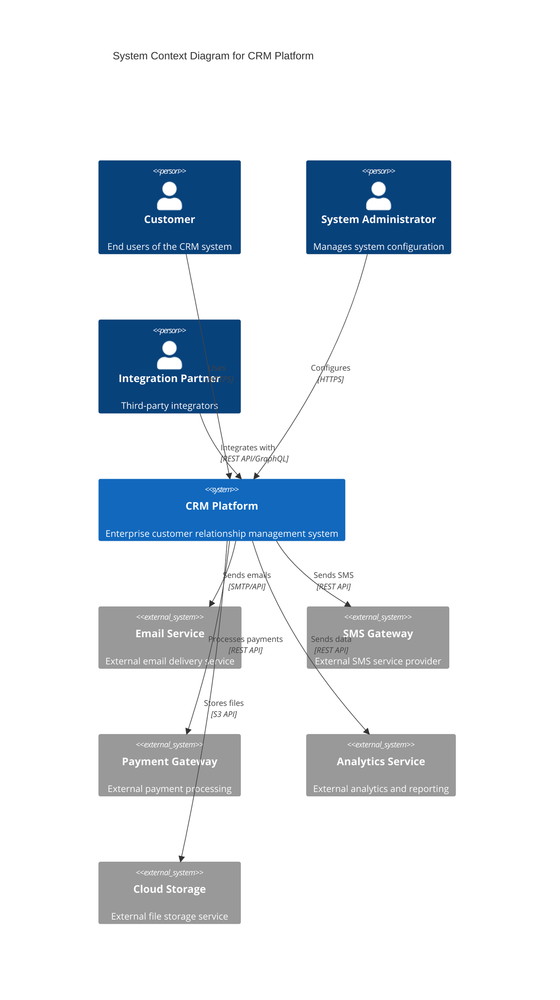

**2. Container Diagram (Level 2):**

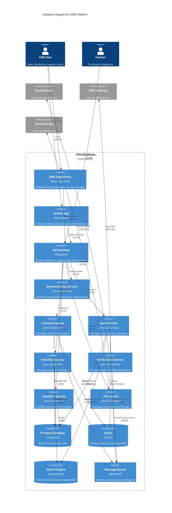

**3. Component Diagram (Level 3) - Contacts Service:**

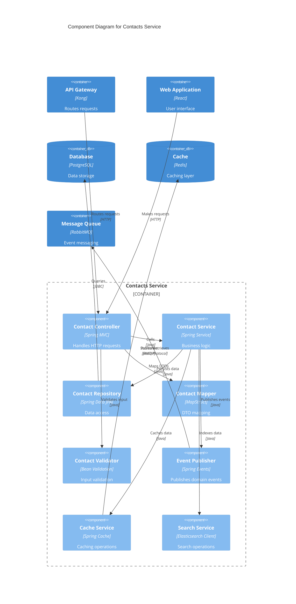

### Data Flow Diagrams for Major Business Processes

#### Lead to Customer Conversion Process

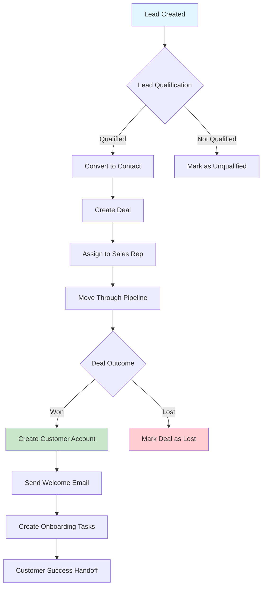

#### Deal Pipeline Management Flow

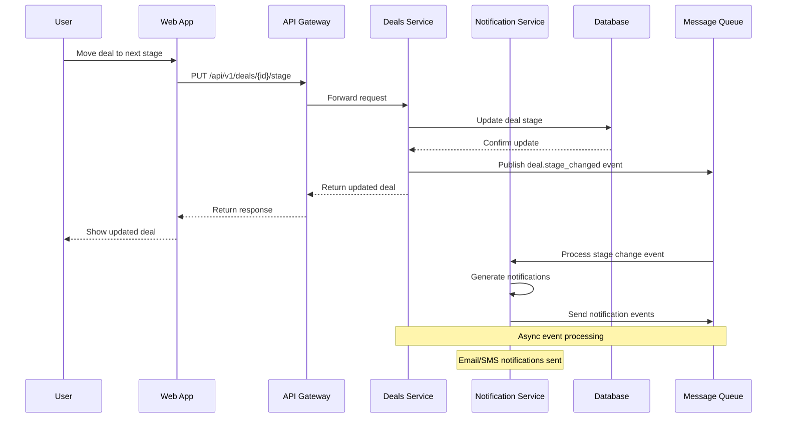

#### Custom Object Creation and Management

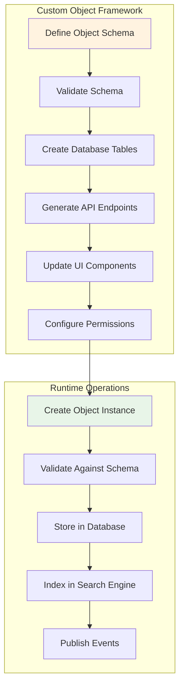

### Sequence Diagrams for Complex Inter-Service Interactions

#### Authentication and Authorization Flow

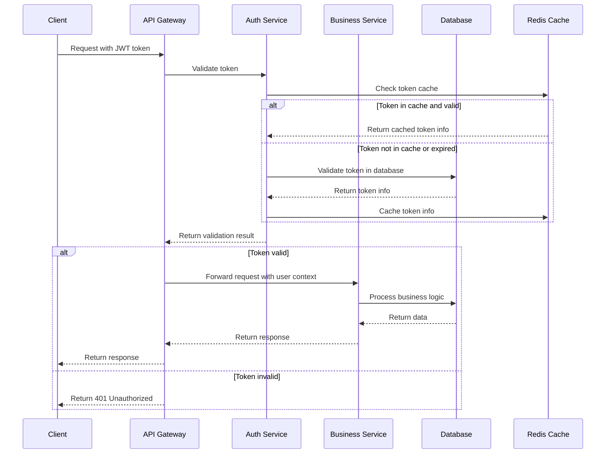

#### Webhook Event Processing

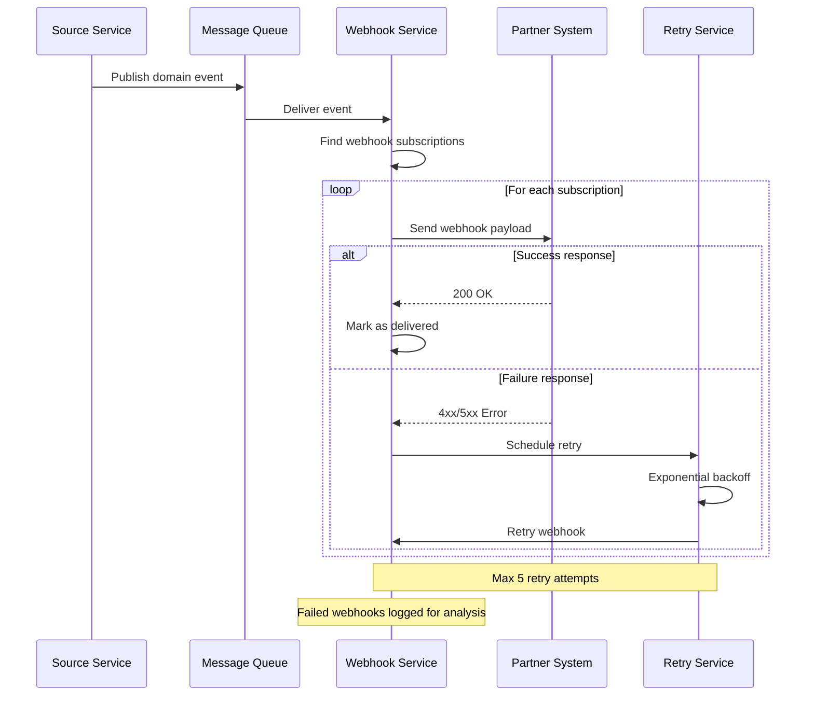

### Deployment and Infrastructure Diagrams

#### Kubernetes Deployment Architecture

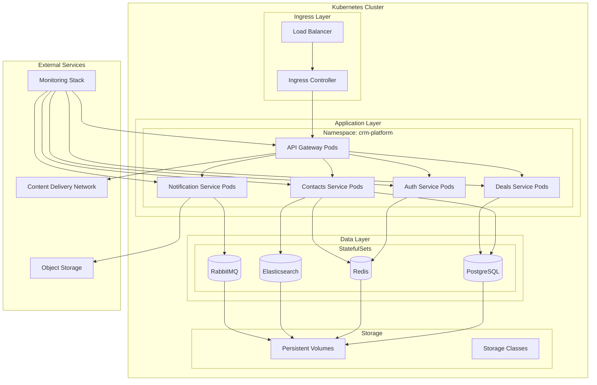

#### CI/CD Pipeline Architecture

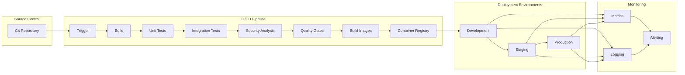

### Visual Documentation Maintenance

#### Automated Diagram Generation

**PlantUML Integration:**

```java
// DiagramGenerator.java
@Component
public class DiagramGenerator {
    
    public void generateArchitectureDiagrams() {
        // Generate C4 diagrams from code annotations
        generateC4Diagrams();
        
        // Generate sequence diagrams from API documentation
        generateSequenceDiagrams();
        
        // Generate deployment diagrams from Kubernetes manifests
        generateDeploymentDiagrams();
    }
    
    private void generateC4Diagrams() {
        String plantUML = """
            @startuml
            !include https://raw.githubusercontent.com/plantuml-stdlib/C4-PlantUML/master/C4_Container.puml
            
            LAYOUT_WITH_LEGEND()
            
            Person(user, "CRM User", "Sales and marketing teams")
            
            System_Boundary(c1, "CRM Platform") {
                Container(web, "Web Application", "React", "User interface")
                Container(api, "API Gateway", "Spring Cloud Gateway", "API routing")
                Container(contacts, "Contacts Service", "Spring Boot", "Contact management")
                Container(deals, "Deals Service", "Spring Boot", "Deal management")
                ContainerDb(db, "Database", "PostgreSQL", "Data storage")
            }
            
            Rel(user, web, "Uses")
            Rel(web, api, "Makes API calls")
            Rel(api, contacts, "Routes to")
            Rel(api, deals, "Routes to")
            Rel(contacts, db, "Reads from and writes to")
            Rel(deals, db, "Reads from and writes to")
            
            @enduml
            """;
        
        generateDiagram(plantUML, "architecture-overview.svg");
    }
}
```

**Mermaid Integration in Documentation:**

```markdown
<!-- Auto-generated from service annotations -->
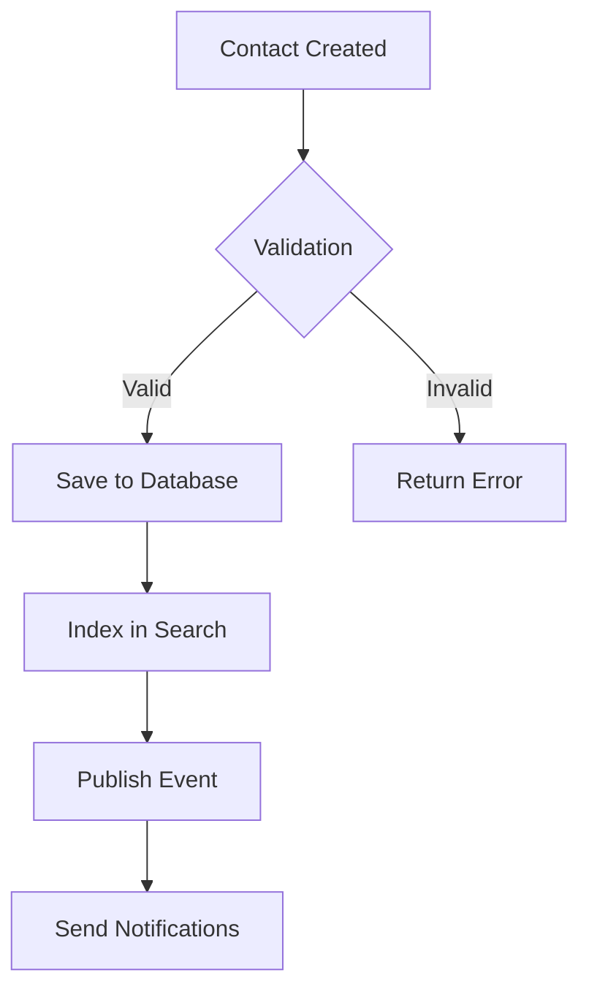

#### Documentation Update Automation

**GitHub Actions Workflow:**

```yaml
# .github/workflows/update-diagrams.yml
name: Update Architecture Diagrams

on:
  push:
    branches: [main]
    paths:
      - 'src/**/*.java'
      - 'k8s/**/*.yaml'
      - 'docs/**/*.md'

jobs:
  update-diagrams:
    runs-on: ubuntu-latest
    
    steps:
    - name: Checkout code
      uses: actions/checkout@v4
      
    - name: Set up Java
      uses: actions/setup-java@v4
      with:
        java-version: '17'
        distribution: 'temurin'
        
    - name: Generate PlantUML diagrams
      run: |
        java -jar plantuml.jar -tsvg docs/diagrams/*.puml
        
    - name: Update Mermaid diagrams
      uses: mermaid-js/mermaid-cli-action@v1
      with:
        files: 'docs/**/*.md'
        
    - name: Commit updated diagrams
      run: |
        git config --local user.email "action@github.com"
        git config --local user.name "GitHub Action"
        git add docs/diagrams/
        git diff --staged --quiet || git commit -m "Auto-update architecture diagrams"
        git push
```

#### Diagram Quality Standards

**Quality Checklist:**

- [ ] **Clarity and Readability**
  - Clear labels and descriptions
  - Appropriate level of detail for audience
  - Consistent styling and formatting
  - Readable font sizes and colors

- [ ] **Accuracy and Currency**
  - Reflects current system architecture
  - Updated with code changes
  - Validated by technical reviewers
  - Version controlled with code

- [ ] **Completeness**
  - All major components included
  - Key relationships shown
  - External dependencies identified
  - Data flows clearly indicated

- [ ] **Consistency**
  - Consistent notation across diagrams
  - Standardized symbols and colors
  - Uniform naming conventions
  - Aligned with documentation standards

This comprehensive visual documentation framework ensures that the CRM platform's architecture is clearly communicated and maintained alongside the codebase.