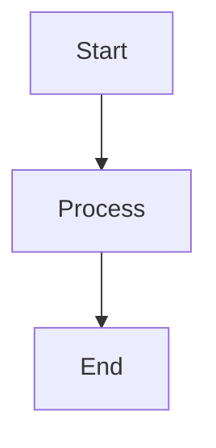

# Document Title

## Table of Contents
- [Overview](#overview)
- [Section 1](#section-1)
- [Section 2](#section-2)
- [Conclusion](#conclusion)

## Overview

Brief introduction to the document's purpose and scope.

## Section 1

### Subsection 1.1

Content with proper formatting:

**Bold text** for emphasis
*Italic text* for definitions
`Code snippets` for technical terms

#### Code Examples

```java
// Java code example with comments
public class Example {
    private String property;
    
    public Example(String property) {
        this.property = property;
    }
}
```

#### Diagrams



#### Tables

| Column 1 | Column 2 | Column 3 |
|----------|----------|----------|
| Value 1  | Value 2  | Value 3  |
| Value 4  | Value 5  | Value 6  |

## Section 2

### Lists

**Ordered List:**
1. First item
2. Second item
3. Third item

**Unordered List:**
- Bullet point 1
- Bullet point 2
- Bullet point 3

### References

- [Internal Link](01_Requirements_and_Planning.md)
- [External Link](https://example.com)

## Conclusion

Summary and next steps.

---

**Last Updated**: [Date]  
**Version**: [Version Number]  
**Maintained By**: [Team/Author]