# Comprehensive CRM Platform Architecture Documentation

## Table of Contents

1. [Overview](#overview)
2. [System Architecture](#system-architecture)
3. [Microservices Architecture](#microservices-architecture)
4. [Infrastructure Architecture](#infrastructure-architecture)
5. [Security Architecture](#security-architecture)
6. [Data Architecture](#data-architecture)
7. [Integration Architecture](#integration-architecture)
8. [Deployment Architecture](#deployment-architecture)
9. [Scalability and Performance](#scalability-and-performance)
10. [Monitoring and Observability](#monitoring-and-observability)
11. [Disaster Recovery](#disaster-recovery)
12. [Technology Stack](#technology-stack)
13. [Architecture Decisions](#architecture-decisions)
14. [Future Roadmap](#future-roadmap)

---

## Overview

### System Overview
The Comprehensive CRM Platform is built using a modern, cloud-native microservices architecture designed for scalability, reliability, and maintainability. The system supports multi-tenant SaaS deployment with enterprise-grade security, performance, and compliance features.

### Key Architectural Principles
- **Microservices Architecture**: Loosely coupled, independently deployable services
- **Domain-Driven Design**: Services organized around business domains
- **API-First Design**: All functionality exposed through well-defined APIs
- **Event-Driven Architecture**: Asynchronous communication between services
- **Multi-Tenant SaaS**: Secure tenant isolation with shared infrastructure
- **Cloud-Native**: Designed for containerized deployment on Kubernetes
- **DevOps Integration**: CI/CD pipelines with automated testing and deployment

### Business Capabilities
- **Customer Relationship Management**: Complete contact and account management
- **Sales Pipeline Management**: Deal tracking and forecasting
- **Lead Management**: Lead capture, scoring, and nurturing
- **Activity Management**: Task, meeting, and communication tracking
- **Analytics and Reporting**: Real-time insights and custom dashboards
- **AI-Powered Insights**: Predictive analytics and recommendations
- **Workflow Automation**: Business process automation and triggers
- **Third-Party Integrations**: Extensive integration ecosystem
- **Mobile and Web Access**: Cross-platform accessibility

---

## System Architecture

### High-Level Architecture Diagram

```mermaid
graph TB
    subgraph "Client Layer"
        WEB[Web Application]
        MOBILE[Mobile Apps]
        API_CLIENT[API Clients]
    end
    
    subgraph "API Gateway Layer"
        GATEWAY[API Gateway]
        LB[Load Balancer]
        AUTH[Authentication Service]
    end
    
    subgraph "Core Services Layer"
        CONTACTS[Contacts Service]
        DEALS[Deals Service]
        LEADS[Leads Service]
        ACCOUNTS[Accounts Service]
        ACTIVITIES[Activities Service]
        PIPELINES[Pipelines Service]
    end
    
    subgraph "Advanced Services Layer"
        ANALYTICS[Analytics Service]
        AI[AI Insights Service]
        CUSTOM[Custom Objects Service]
        WORKFLOWS[Workflow Service]
        MARKETPLACE[Marketplace Service]
        INTEGRATIONS[Integration Service]
    end
    
    subgraph "Platform Services Layer"
        USERS[User Management]
        TENANTS[Tenant Management]
        NOTIFICATIONS[Notification Service]
        FILES[File Management]
        AUDIT[Audit Service]
        SEARCH[Search Service]
    end
    
    subgraph "Data Layer"
        POSTGRES[(PostgreSQL)]
        REDIS[(Redis Cache)]
        ELASTICSEARCH[(Elasticsearch)]
        S3[(Object Storage)]
    end
    
    subgraph "Infrastructure Layer"
        KUBERNETES[Kubernetes Cluster]
        MONITORING[Monitoring Stack]
        LOGGING[Logging Stack]
        BACKUP[Backup Systems]
    end
    
    WEB --> GATEWAY
    MOBILE --> GATEWAY
    API_CLIENT --> GATEWAY
    
    GATEWAY --> AUTH
    GATEWAY --> LB
    
    LB --> CONTACTS
    LB --> DEALS
    LB --> LEADS
    LB --> ACCOUNTS
    LB --> ACTIVITIES
    LB --> PIPELINES
    LB --> ANALYTICS
    LB --> AI
    LB --> CUSTOM
    LB --> WORKFLOWS
    LB --> MARKETPLACE
    LB --> INTEGRATIONS
    LB --> USERS
    LB --> TENANTS
    LB --> NOTIFICATIONS
    LB --> FILES
    LB --> AUDIT
    LB --> SEARCH
    
    CONTACTS --> POSTGRES
    DEALS --> POSTGRES
    LEADS --> POSTGRES
    ACCOUNTS --> POSTGRES
    ACTIVITIES --> POSTGRES
    PIPELINES --> POSTGRES
    ANALYTICS --> POSTGRES
    AI --> POSTGRES
    CUSTOM --> POSTGRES
    WORKFLOWS --> POSTGRES
    MARKETPLACE --> POSTGRES
    INTEGRATIONS --> POSTGRES
    USERS --> POSTGRES
    TENANTS --> POSTGRES
    NOTIFICATIONS --> POSTGRES
    FILES --> POSTGRES
    AUDIT --> POSTGRES
    SEARCH --> ELASTICSEARCH
    
    CONTACTS --> REDIS
    DEALS --> REDIS
    LEADS --> REDIS
    ACCOUNTS --> REDIS
    
    FILES --> S3
    
    KUBERNETES --> MONITORING
    KUBERNETES --> LOGGING
    KUBERNETES --> BACKUP
```

### Architecture Layers

#### 1. Client Layer
- **Web Application**: React-based SPA with TypeScript
- **Mobile Applications**: Native iOS and Android apps
- **API Clients**: Third-party integrations and custom applications

#### 2. API Gateway Layer
- **API Gateway**: Kong/AWS API Gateway for request routing and management
- **Load Balancer**: NGINX/AWS ALB for traffic distribution
- **Authentication Service**: OAuth2/JWT-based authentication

#### 3. Service Layers
- **Core Services**: Essential CRM functionality
- **Advanced Services**: Enhanced features and AI capabilities
- **Platform Services**: Infrastructure and support services

#### 4. Data Layer
- **PostgreSQL**: Primary relational database
- **Redis**: Caching and session management
- **Elasticsearch**: Search and analytics
- **Object Storage**: File and document storage

#### 5. Infrastructure Layer
- **Kubernetes**: Container orchestration
- **Monitoring**: Prometheus, Grafana, Jaeger
- **Logging**: ELK Stack (Elasticsearch, Logstash, Kibana)
- **Backup**: Automated backup and recovery systems

---

## Microservices Architecture

### Service Decomposition Strategy

#### Domain-Driven Design Approach
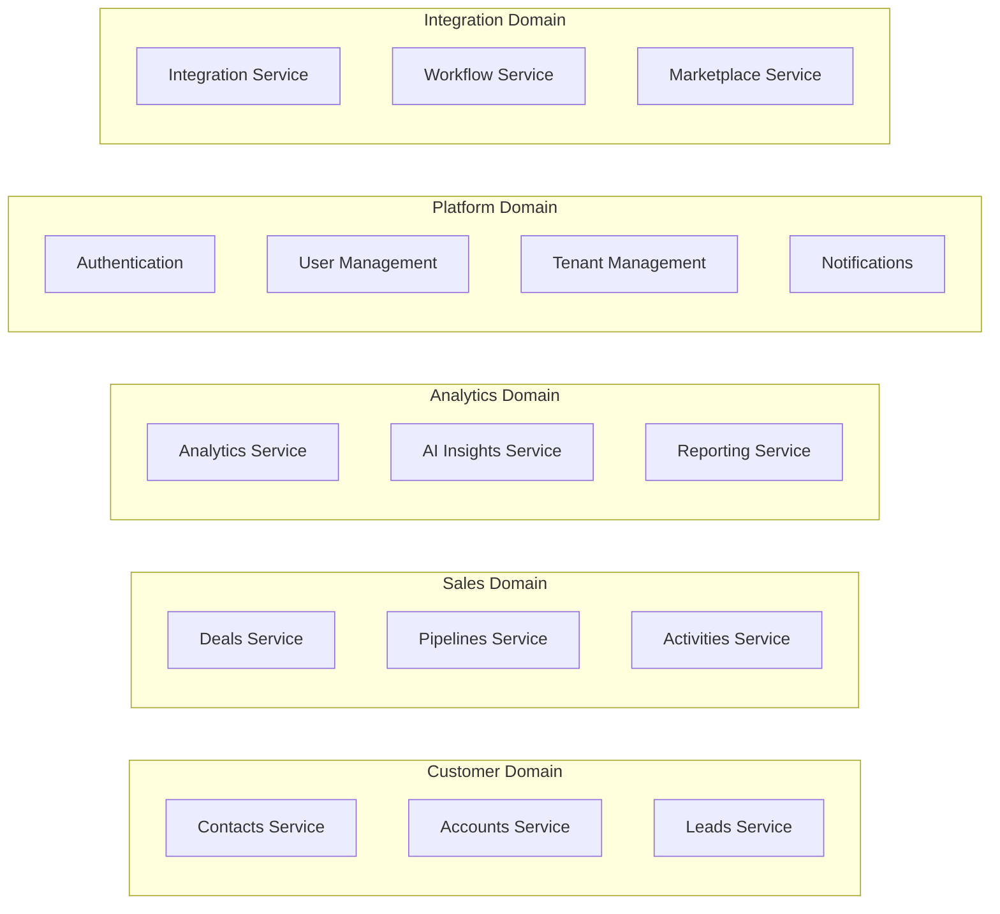

### Service Communication Patterns

#### Synchronous Communication
- **REST APIs**: HTTP/HTTPS for request-response patterns
- **GraphQL**: Flexible data querying for complex client needs
- **gRPC**: High-performance inter-service communication

#### Asynchronous Communication
- **Event Streaming**: Apache Kafka for real-time event processing
- **Message Queues**: RabbitMQ for reliable message delivery
- **Pub/Sub**: Redis Pub/Sub for lightweight messaging

#### Communication Matrix
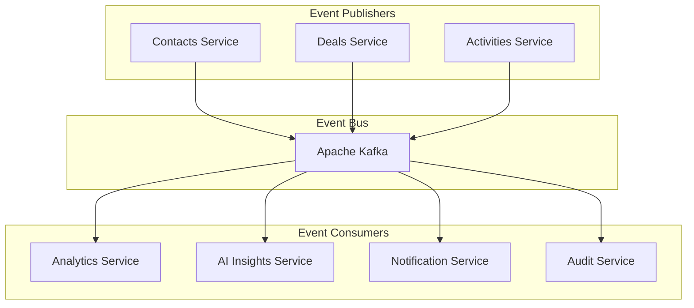

### Service Boundaries and Responsibilities

#### Core Services
```yaml
Contacts Service:
  Responsibilities:
    - Contact CRUD operations
    - Contact relationships
    - Contact deduplication
    - Contact import/export
  Data Ownership:
    - Contact profiles
    - Contact relationships
    - Contact custom fields
  APIs:
    - REST API for CRUD operations
    - GraphQL for complex queries
    - Bulk operations API

Deals Service:
  Responsibilities:
    - Deal lifecycle management
    - Pipeline management
    - Deal forecasting
    - Deal analytics
  Data Ownership:
    - Deal records
    - Deal products
    - Deal history
    - Pipeline configurations
  APIs:
    - REST API for deal operations
    - Pipeline management API
    - Forecasting API

Leads Service:
  Responsibilities:
    - Lead capture and management
    - Lead scoring and qualification
    - Lead conversion
    - Lead nurturing campaigns
  Data Ownership:
    - Lead profiles
    - Lead scoring rules
    - Lead conversion history
    - Campaign associations
  APIs:
    - REST API for lead operations
    - Lead scoring API
    - Conversion tracking API
```

---

## Infrastructure Architecture

### Cloud Infrastructure

#### AWS Architecture
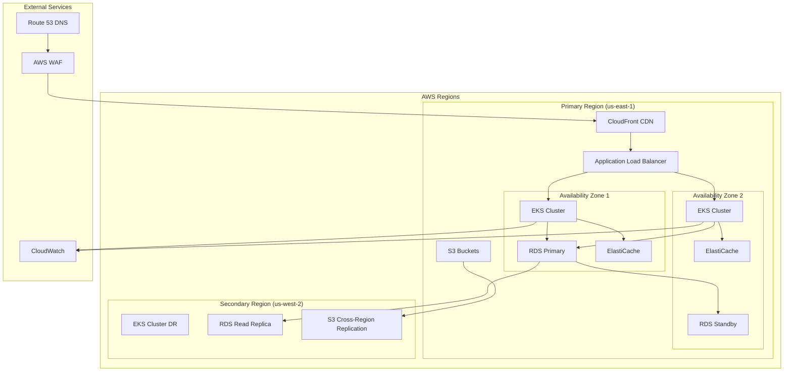

#### Kubernetes Architecture
```yaml
Kubernetes Cluster Configuration:
  Node Groups:
    - System Node Group:
        Instance Type: t3.medium
        Min Size: 2
        Max Size: 5
        Purpose: System pods (kube-system, monitoring)
    
    - Application Node Group:
        Instance Type: c5.xlarge
        Min Size: 3
        Max Size: 20
        Purpose: Application workloads
    
    - Database Node Group:
        Instance Type: r5.large
        Min Size: 2
        Max Size: 6
        Purpose: Database and cache workloads

  Namespaces:
    - crm-core: Core CRM services
    - crm-advanced: Advanced services
    - crm-platform: Platform services
    - crm-system: System services
    - monitoring: Monitoring stack
    - ingress: Ingress controllers

  Storage Classes:
    - gp3-ssd: General purpose SSD storage
    - io2-high-iops: High IOPS storage for databases
    - efs-shared: Shared file storage
```

### Container Architecture

#### Docker Strategy
```dockerfile
# Multi-stage build example for Node.js service
FROM node:18-alpine AS builder
WORKDIR /app
COPY package*.json ./
RUN npm ci --only=production

FROM node:18-alpine AS runtime
RUN addgroup -g 1001 -S nodejs
RUN adduser -S nodejs -u 1001
WORKDIR /app
COPY --from=builder /app/node_modules ./node_modules
COPY --chown=nodejs:nodejs . .
USER nodejs
EXPOSE 3000
CMD ["node", "server.js"]
```

#### Service Mesh Architecture
```yaml
Istio Service Mesh:
  Components:
    - Istio Pilot: Service discovery and configuration
    - Istio Citadel: Certificate management
    - Istio Galley: Configuration validation
    - Istio Proxy (Envoy): Sidecar proxy
  
  Features:
    - Traffic Management: Load balancing, routing, failover
    - Security: mTLS, RBAC, security policies
    - Observability: Metrics, logs, traces
    - Policy Enforcement: Rate limiting, access control

  Configuration:
    Virtual Services: Traffic routing rules
    Destination Rules: Load balancing and circuit breaker policies
    Service Entries: External service registration
    Gateways: Ingress and egress traffic management
```

---

## Security Architecture

### Security Layers

#### Defense in Depth Strategy
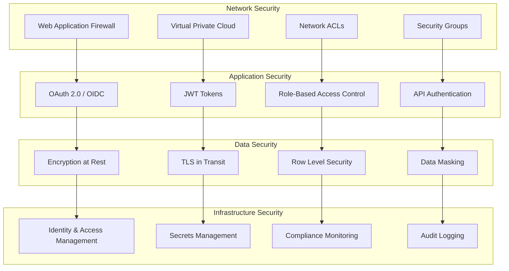

### Authentication and Authorization

#### OAuth 2.0 / OpenID Connect Flow
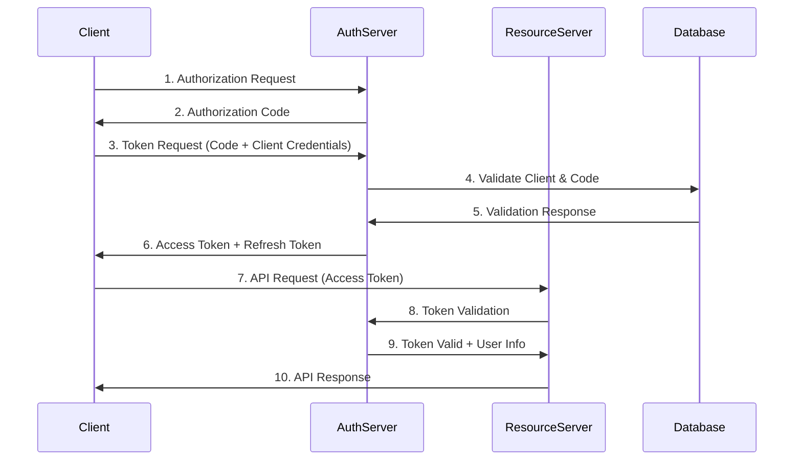

#### Role-Based Access Control (RBAC)
```yaml
RBAC Model:
  Roles:
    - System Admin:
        Permissions:
          - tenant:*
          - user:*
          - system:*
        Scope: Global
    
    - Tenant Admin:
        Permissions:
          - tenant:read,update
          - user:create,read,update,delete
          - data:*
        Scope: Tenant-specific
    
    - Sales Manager:
        Permissions:
          - contact:*
          - deal:*
          - lead:*
          - activity:*
          - report:read
        Scope: Team-specific
    
    - Sales Rep:
        Permissions:
          - contact:read,update
          - deal:read,update
          - lead:read,update
          - activity:*
        Scope: Owned records only

  Permission Format: "resource:action"
  Actions: create, read, update, delete, execute
  Resources: tenant, user, contact, deal, lead, account, activity, report
```

### Data Protection

#### Encryption Strategy
```yaml
Encryption at Rest:
  Database:
    - PostgreSQL: Transparent Data Encryption (TDE)
    - Algorithm: AES-256
    - Key Management: AWS KMS / HashiCorp Vault
  
  File Storage:
    - S3: Server-Side Encryption (SSE-S3)
    - Algorithm: AES-256
    - Key Rotation: Automatic annual rotation
  
  Application Secrets:
    - Kubernetes Secrets: Encrypted etcd storage
    - External Secrets: HashiCorp Vault integration

Encryption in Transit:
  - TLS 1.3 for all HTTP communications
  - mTLS for service-to-service communication
  - Database connections: SSL/TLS encrypted
  - Message queues: TLS encrypted channels
```

#### Data Privacy and Compliance
```yaml
GDPR Compliance:
  Data Subject Rights:
    - Right to Access: API endpoints for data export
    - Right to Rectification: Update mechanisms
    - Right to Erasure: Data deletion workflows
    - Right to Portability: Data export formats
  
  Data Processing:
    - Lawful Basis: Documented for each data type
    - Purpose Limitation: Data used only for stated purposes
    - Data Minimization: Collect only necessary data
    - Retention Policies: Automated data lifecycle management
  
  Technical Measures:
    - Pseudonymization: PII tokenization
    - Data Masking: Non-production environments
    - Access Logging: Complete audit trails
    - Breach Detection: Automated monitoring

SOC 2 Type II Compliance:
  Security Controls:
    - Access Controls: Multi-factor authentication
    - Logical Access: Role-based permissions
    - System Operations: Change management
    - Risk Management: Regular assessments
  
  Availability Controls:
    - System Monitoring: 24/7 monitoring
    - Incident Response: Documented procedures
    - Backup and Recovery: Tested procedures
    - Capacity Management: Scalability planning
```

---

## Data Architecture

### Data Flow Architecture

#### Event-Driven Data Flow
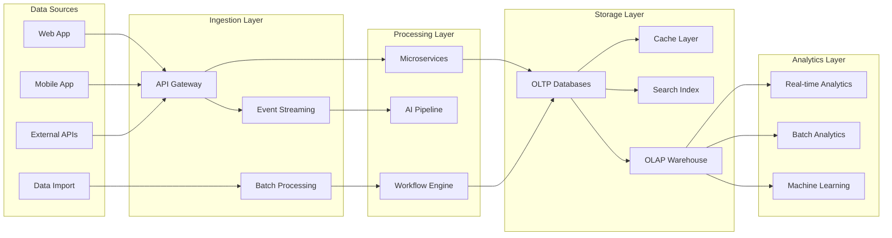

### Data Storage Strategy

#### Database Per Service Pattern
```yaml
Service Database Mapping:
  Core Services:
    - contacts-service: crm_contacts_db (PostgreSQL)
    - deals-service: crm_deals_db (PostgreSQL)
    - leads-service: crm_leads_db (PostgreSQL)
    - accounts-service: crm_accounts_db (PostgreSQL)
    - activities-service: crm_activities_db (PostgreSQL)
    - pipelines-service: crm_pipelines_db (PostgreSQL)
  
  Advanced Services:
    - analytics-service: crm_analytics_db (PostgreSQL + ClickHouse)
    - ai-insights-service: crm_ai_db (PostgreSQL + Vector DB)
    - custom-objects-service: crm_custom_db (PostgreSQL)
    - workflow-service: crm_workflows_db (PostgreSQL)
  
  Platform Services:
    - auth-service: crm_auth_db (PostgreSQL)
    - user-service: crm_users_db (PostgreSQL)
    - tenant-service: crm_tenants_db (PostgreSQL)
    - notification-service: crm_notifications_db (PostgreSQL)
  
  Shared Services:
    - search-service: Elasticsearch cluster
    - cache-service: Redis cluster
    - file-service: S3 + metadata in PostgreSQL
```

#### Data Consistency Patterns
```yaml
Consistency Patterns:
  Strong Consistency:
    - Financial data (deal values, billing)
    - User authentication data
    - Tenant configuration data
    - Audit logs
  
  Eventual Consistency:
    - Analytics and reporting data
    - Search indexes
    - Cached data
    - Cross-service data synchronization
  
  Saga Pattern Implementation:
    - Lead conversion process
    - Deal closure workflow
    - Account merging operations
    - Data import/export processes

Transaction Management:
  Local Transactions:
    - Within single service boundaries
    - ACID properties maintained
    - Database-level transaction support
  
  Distributed Transactions:
    - Saga orchestration pattern
    - Compensating actions for rollback
    - Event sourcing for audit trail
    - Idempotent operations
```

---

## Integration Architecture

### Integration Patterns

#### API Integration Patterns
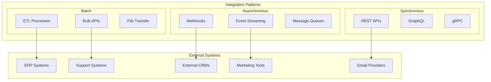

#### Integration Hub Architecture
```yaml
Integration Hub Components:
  API Gateway:
    - Request routing and transformation
    - Rate limiting and throttling
    - Authentication and authorization
    - Request/response logging
  
  Message Broker:
    - Apache Kafka for event streaming
    - RabbitMQ for reliable messaging
    - Redis Pub/Sub for real-time updates
    - Dead letter queues for error handling
  
  Transformation Engine:
    - Data mapping and transformation
    - Protocol translation
    - Format conversion (JSON, XML, CSV)
    - Schema validation
  
  Connector Framework:
    - Pre-built connectors for popular systems
    - Custom connector development SDK
    - Connector lifecycle management
    - Configuration and monitoring
```

### Third-Party Integrations

#### Popular Integration Categories
```yaml
Email and Communication:
  - Gmail/Google Workspace
  - Microsoft Outlook/Office 365
  - SendGrid/Mailgun
  - Twilio (SMS/Voice)
  - Slack/Microsoft Teams

Marketing Automation:
  - HubSpot
  - Marketo
  - Pardot
  - Mailchimp
  - Constant Contact

Sales Tools:
  - Salesforce
  - Pipedrive
  - Zoho CRM
  - Microsoft Dynamics
  - SugarCRM

Business Intelligence:
  - Tableau
  - Power BI
  - Looker
  - Qlik Sense
  - Google Analytics

ERP and Finance:
  - SAP
  - Oracle NetSuite
  - QuickBooks
  - Xero
  - Sage

Support and Helpdesk:
  - Zendesk
  - Freshdesk
  - ServiceNow
  - Jira Service Management
  - Intercom
```

---

## Deployment Architecture

### Deployment Strategies

#### Blue-Green Deployment
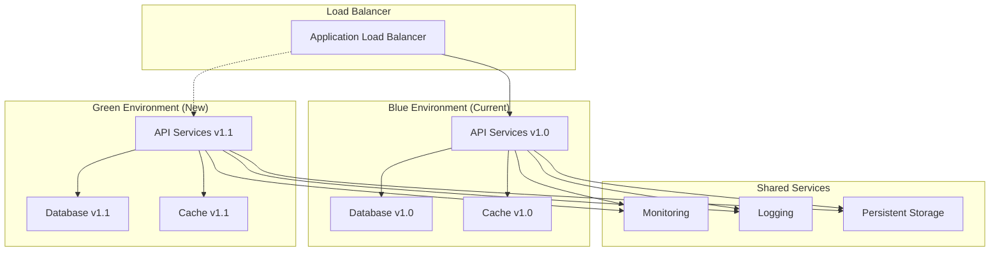

#### Canary Deployment Strategy
```yaml
Canary Deployment Process:
  Phase 1 - Initial Canary (5%):
    - Deploy new version to 5% of traffic
    - Monitor key metrics for 30 minutes
    - Automated rollback if error rate > 0.1%
  
  Phase 2 - Expanded Canary (25%):
    - Increase traffic to 25% if Phase 1 successful
    - Monitor for 1 hour
    - Manual approval required for next phase
  
  Phase 3 - Majority Canary (75%):
    - Increase traffic to 75%
    - Monitor for 2 hours
    - Automated performance comparison
  
  Phase 4 - Full Deployment (100%):
    - Complete rollout to all traffic
    - Remove old version after 24 hours
    - Update deployment documentation

Rollback Triggers:
  - Error rate > 0.5%
  - Response time > 2x baseline
  - Memory usage > 90%
  - CPU usage > 85%
  - Custom business metrics degradation
```

### CI/CD Pipeline

#### Pipeline Architecture
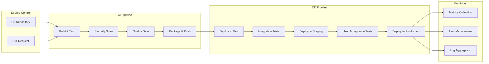

#### Pipeline Configuration
```yaml
CI/CD Pipeline Stages:
  Source Stage:
    - Git webhook triggers
    - Branch protection rules
    - Code review requirements
    - Automated dependency updates
  
  Build Stage:
    - Multi-stage Docker builds
    - Dependency vulnerability scanning
    - Unit test execution
    - Code coverage analysis
    - Static code analysis (SonarQube)
  
  Security Stage:
    - Container image scanning
    - Infrastructure as Code scanning
    - Secrets detection
    - License compliance checking
  
  Test Stage:
    - Integration tests
    - API contract tests
    - Performance tests
    - Security tests (OWASP ZAP)
  
  Deploy Stage:
    - Infrastructure provisioning (Terraform)
    - Application deployment (Helm)
    - Database migrations
    - Configuration updates
    - Health checks and validation
  
  Monitor Stage:
    - Deployment verification
    - Performance monitoring
    - Error tracking
    - Business metrics validation
```

---

## Scalability and Performance

### Horizontal Scaling Strategy

#### Auto-Scaling Configuration
```yaml
Kubernetes HPA Configuration:
  API Services:
    Min Replicas: 3
    Max Replicas: 50
    Target CPU: 70%
    Target Memory: 80%
    Scale Up: 2 pods per 30 seconds
    Scale Down: 1 pod per 60 seconds
  
  Background Workers:
    Min Replicas: 2
    Max Replicas: 20
    Target CPU: 60%
    Custom Metrics: Queue depth
    Scale Up: 1 pod per 60 seconds
    Scale Down: 1 pod per 300 seconds
  
  Database Connections:
    Connection Pool Size: 20-100 per pod
    Max Connections: 1000 per database
    Connection Timeout: 30 seconds
    Idle Timeout: 300 seconds

Cluster Auto-Scaling:
  Node Groups:
    - On-Demand: 3-10 nodes (baseline capacity)
    - Spot Instances: 0-20 nodes (burst capacity)
  
  Scaling Triggers:
    - CPU utilization > 75%
    - Memory utilization > 80%
    - Pending pods > 5 minutes
    - Custom application metrics
```

### Performance Optimization

#### Caching Strategy
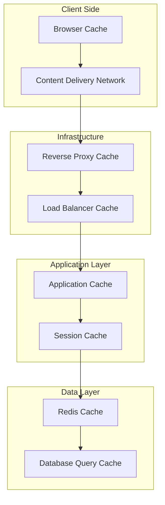

#### Performance Metrics and SLAs
```yaml
Service Level Objectives (SLOs):
  API Response Time:
    - P50: < 200ms
    - P95: < 500ms
    - P99: < 1000ms
  
  System Availability:
    - Uptime: 99.9% (8.76 hours downtime/year)
    - Error Rate: < 0.1%
    - Recovery Time: < 15 minutes
  
  Database Performance:
    - Query Response Time: < 100ms (P95)
    - Connection Pool Utilization: < 80%
    - Replication Lag: < 1 second
  
  Cache Performance:
    - Hit Ratio: > 95%
    - Eviction Rate: < 5%
    - Memory Utilization: < 85%

Performance Monitoring:
  Application Metrics:
    - Request rate and latency
    - Error rates by service
    - Business transaction performance
    - User experience metrics
  
  Infrastructure Metrics:
    - CPU, memory, disk, network utilization
    - Container and pod metrics
    - Database performance metrics
    - Cache performance metrics
  
  Custom Metrics:
    - Active user sessions
    - API usage by tenant
    - Feature adoption rates
    - Data processing throughput
```

---

*This comprehensive architecture documentation provides a complete view of the CRM platform's technical architecture, from high-level system design to detailed implementation strategies. It serves as the definitive guide for architects, developers, and operations teams working with the platform.*