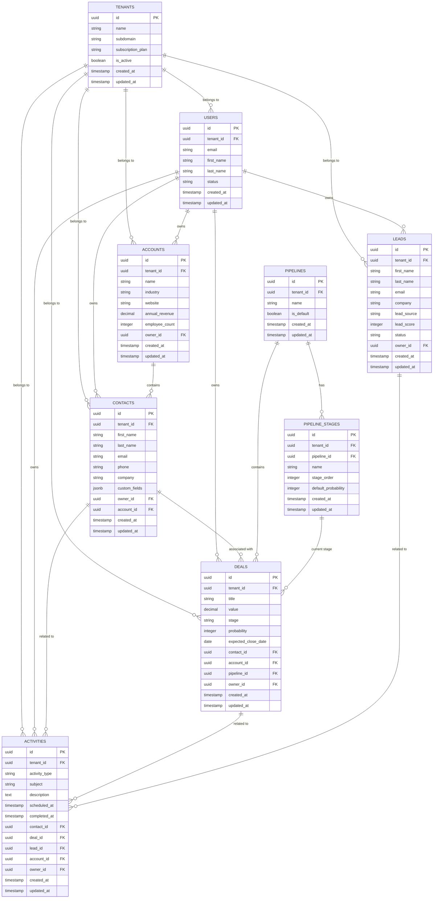

# Comprehensive CRM Platform Database Documentation

## Table of Contents

1. [Overview](#overview)
2. [Database Architecture](#database-architecture)
3. [Core CRM Database Schema](#core-crm-database-schema)
4. [Advanced Services Database Schema](#advanced-services-database-schema)
5. [Platform Services Database Schema](#platform-services-database-schema)
6. [System Services Database Schema](#system-services-database-schema)
7. [Data Relationships and Constraints](#data-relationships-and-constraints)
8. [Indexing Strategy](#indexing-strategy)
9. [Performance Optimization](#performance-optimization)
10. [Data Security and Compliance](#data-security-and-compliance)
11. [Backup and Recovery](#backup-and-recovery)
12. [Migration and Versioning](#migration-and-versioning)
13. [Monitoring and Analytics](#monitoring-and-analytics)
14. [Appendices](#appendices)

---

## Overview

### Database Architecture Overview
The CRM platform uses a microservices-based database architecture with:
- **Primary Database**: PostgreSQL 15+ for ACID compliance and complex queries
- **Cache Layer**: Redis 7+ for session management and high-frequency data
- **Search Engine**: Elasticsearch 8+ for full-text search and analytics
- **Time-Series Database**: InfluxDB 2+ for metrics and activity tracking
- **File Storage**: AWS S3/MinIO for document and media storage

### Multi-Tenant Data Isolation
- **Schema-per-tenant**: Each tenant has isolated database schemas
- **Row-level security**: Additional security layer for shared tables
- **Data encryption**: AES-256 encryption for sensitive data at rest
- **Audit trails**: Complete data lineage and change tracking

### Database Distribution Strategy
- **Core Services**: Dedicated PostgreSQL clusters per service
- **Shared Services**: Centralized databases for authentication and tenant management
- **Read Replicas**: Geographic distribution for performance optimization
- **Sharding**: Horizontal partitioning for high-volume data

---

## Database Architecture

### Service Database Mapping

#### Core CRM Services Databases
```
crm_contacts_db     - Contacts Service
crm_deals_db        - Deals Service  
crm_leads_db        - Leads Service
crm_accounts_db     - Accounts Service
crm_activities_db   - Activities Service
crm_pipelines_db    - Pipelines Service
```

#### Advanced Services Databases
```
crm_analytics_db    - Analytics Service
crm_ai_insights_db  - AI Insights Service
crm_custom_objects_db - Custom Objects Service
crm_workflows_db    - Workflow Service
crm_marketplace_db  - Marketplace Service
crm_integrations_db - Integration Service
```

#### Platform Services Databases
```
crm_auth_db         - Authentication Service
crm_users_db        - User Management Service
crm_tenants_db      - Tenant Management Service
crm_notifications_db - Notification Service
crm_files_db        - File Management Service
crm_audit_db        - Audit Service
```

#### System Services Databases
```
crm_search_db       - Search Service (Elasticsearch)
crm_reports_db      - Reporting Service
crm_dashboards_db   - Dashboard Service
crm_communication_db - Communication Service
crm_social_db       - Social CRM Service
crm_collaboration_db - Collaboration Service
```

### Database Technology Stack

#### Primary Databases
- **PostgreSQL 15.4+**: ACID compliance, JSON support, advanced indexing
- **Connection Pooling**: PgBouncer for connection management
- **High Availability**: Streaming replication with automatic failover
- **Backup Strategy**: Continuous WAL archiving with point-in-time recovery

#### Caching Layer
- **Redis 7.2+**: Session storage, rate limiting, real-time data
- **Redis Cluster**: Horizontal scaling and high availability
- **Cache Strategies**: Write-through, write-behind, and cache-aside patterns
- **TTL Management**: Automatic expiration for temporary data

#### Search and Analytics
- **Elasticsearch 8.10+**: Full-text search, aggregations, analytics
- **Kibana**: Data visualization and monitoring dashboards
- **Logstash**: Data ingestion and transformation pipeline
- **Index Management**: Automated lifecycle policies and optimization

---

## Core CRM Database Schema

### 1. Contacts Service Database (crm_contacts_db)

#### Core Tables```sql

-- Contacts table
CREATE TABLE contacts (
    id UUID PRIMARY KEY DEFAULT gen_random_uuid(),
    tenant_id UUID NOT NULL,
    first_name VARCHAR(100),
    last_name VARCHAR(100),
    full_name VARCHAR(200) GENERATED ALWAYS AS (
        CASE 
            WHEN first_name IS NOT NULL AND last_name IS NOT NULL 
            THEN first_name || ' ' || last_name
            WHEN first_name IS NOT NULL THEN first_name
            WHEN last_name IS NOT NULL THEN last_name
            ELSE NULL
        END
    ) STORED,
    email VARCHAR(255),
    phone VARCHAR(50),
    company VARCHAR(200),
    job_title VARCHAR(150),
    department VARCHAR(100),
    address JSONB,
    social_profiles JSONB,
    custom_fields JSONB,
    tags TEXT[],
    notes TEXT,
    preferred_contact_method VARCHAR(20) DEFAULT 'email',
    timezone VARCHAR(50) DEFAULT 'UTC',
    language VARCHAR(10) DEFAULT 'en-US',
    status VARCHAR(20) DEFAULT 'active',
    lead_score INTEGER DEFAULT 0,
    deal_count INTEGER DEFAULT 0,
    total_deal_value DECIMAL(15,2) DEFAULT 0,
    won_deal_count INTEGER DEFAULT 0,
    won_deal_value DECIMAL(15,2) DEFAULT 0,
    last_contacted_at TIMESTAMP WITH TIME ZONE,
    last_activity_at TIMESTAMP WITH TIME ZONE,
    next_activity_at TIMESTAMP WITH TIME ZONE,
    owner_id UUID,
    account_id UUID,
    created_at TIMESTAMP WITH TIME ZONE DEFAULT NOW(),
    updated_at TIMESTAMP WITH TIME ZONE DEFAULT NOW(),
    created_by UUID NOT NULL,
    updated_by UUID,
    version INTEGER DEFAULT 1,
    
    -- Constraints
    CONSTRAINT contacts_tenant_id_fk FOREIGN KEY (tenant_id) REFERENCES tenants(id),
    CONSTRAINT contacts_owner_id_fk FOREIGN KEY (owner_id) REFERENCES users(id),
    CONSTRAINT contacts_account_id_fk FOREIGN KEY (account_id) REFERENCES accounts(id),
    CONSTRAINT contacts_email_format CHECK (email ~* '^[A-Za-z0-9._%+-]+@[A-Za-z0-9.-]+\.[A-Za-z]{2,}$'),
    CONSTRAINT contacts_status_check CHECK (status IN ('active', 'inactive', 'archived')),
    CONSTRAINT contacts_lead_score_range CHECK (lead_score >= 0 AND lead_score <= 100),
    CONSTRAINT contacts_name_required CHECK (first_name IS NOT NULL OR last_name IS NOT NULL)
);

-- Contact relationships table
CREATE TABLE contact_relationships (
    id UUID PRIMARY KEY DEFAULT gen_random_uuid(),
    tenant_id UUID NOT NULL,
    contact_id UUID NOT NULL,
    related_contact_id UUID NOT NULL,
    relationship_type VARCHAR(50) NOT NULL,
    description TEXT,
    is_mutual BOOLEAN DEFAULT false,
    created_at TIMESTAMP WITH TIME ZONE DEFAULT NOW(),
    created_by UUID NOT NULL,
    
    -- Constraints
    CONSTRAINT contact_relationships_tenant_id_fk FOREIGN KEY (tenant_id) REFERENCES tenants(id),
    CONSTRAINT contact_relationships_contact_id_fk FOREIGN KEY (contact_id) REFERENCES contacts(id) ON DELETE CASCADE,
    CONSTRAINT contact_relationships_related_contact_id_fk FOREIGN KEY (related_contact_id) REFERENCES contacts(id) ON DELETE CASCADE,
    CONSTRAINT contact_relationships_type_check CHECK (relationship_type IN ('reports_to', 'manages', 'colleague', 'partner', 'vendor', 'customer')),
    CONSTRAINT contact_relationships_no_self_reference CHECK (contact_id != related_contact_id),
    UNIQUE(tenant_id, contact_id, related_contact_id, relationship_type)
);

-- Contact import/export jobs table
CREATE TABLE contact_import_jobs (
    id UUID PRIMARY KEY DEFAULT gen_random_uuid(),
    tenant_id UUID NOT NULL,
    job_type VARCHAR(20) NOT NULL,
    status VARCHAR(20) DEFAULT 'pending',
    file_name VARCHAR(255),
    file_size BIGINT,
    total_records INTEGER DEFAULT 0,
    processed_records INTEGER DEFAULT 0,
    successful_records INTEGER DEFAULT 0,
    failed_records INTEGER DEFAULT 0,
    skipped_records INTEGER DEFAULT 0,
    options JSONB,
    results JSONB,
    error_details JSONB,
    started_at TIMESTAMP WITH TIME ZONE,
    completed_at TIMESTAMP WITH TIME ZONE,
    created_at TIMESTAMP WITH TIME ZONE DEFAULT NOW(),
    created_by UUID NOT NULL,
    
    -- Constraints
    CONSTRAINT contact_import_jobs_tenant_id_fk FOREIGN KEY (tenant_id) REFERENCES tenants(id),
    CONSTRAINT contact_import_jobs_type_check CHECK (job_type IN ('import', 'export')),
    CONSTRAINT contact_import_jobs_status_check CHECK (status IN ('pending', 'processing', 'completed', 'failed', 'cancelled'))
);
```

#### Indexes for Contacts Service
```sql
-- Primary indexes
CREATE INDEX idx_contacts_tenant_id ON contacts(tenant_id);
CREATE INDEX idx_contacts_email ON contacts(tenant_id, email) WHERE email IS NOT NULL;
CREATE INDEX idx_contacts_phone ON contacts(tenant_id, phone) WHERE phone IS NOT NULL;
CREATE INDEX idx_contacts_company ON contacts(tenant_id, company) WHERE company IS NOT NULL;
CREATE INDEX idx_contacts_owner_id ON contacts(tenant_id, owner_id) WHERE owner_id IS NOT NULL;
CREATE INDEX idx_contacts_account_id ON contacts(tenant_id, account_id) WHERE account_id IS NOT NULL;

-- Search indexes
CREATE INDEX idx_contacts_full_name_gin ON contacts USING gin(to_tsvector('english', full_name)) WHERE full_name IS NOT NULL;
CREATE INDEX idx_contacts_email_gin ON contacts USING gin(to_tsvector('english', email)) WHERE email IS NOT NULL;
CREATE INDEX idx_contacts_company_gin ON contacts USING gin(to_tsvector('english', company)) WHERE company IS NOT NULL;

-- Performance indexes
CREATE INDEX idx_contacts_created_at ON contacts(tenant_id, created_at DESC);
CREATE INDEX idx_contacts_updated_at ON contacts(tenant_id, updated_at DESC);
CREATE INDEX idx_contacts_last_activity_at ON contacts(tenant_id, last_activity_at DESC) WHERE last_activity_at IS NOT NULL;
CREATE INDEX idx_contacts_lead_score ON contacts(tenant_id, lead_score DESC) WHERE lead_score > 0;

-- Custom field indexes
CREATE INDEX idx_contacts_custom_fields_gin ON contacts USING gin(custom_fields) WHERE custom_fields IS NOT NULL;
CREATE INDEX idx_contacts_tags_gin ON contacts USING gin(tags) WHERE tags IS NOT NULL;

-- Relationship indexes
CREATE INDEX idx_contact_relationships_contact_id ON contact_relationships(tenant_id, contact_id);
CREATE INDEX idx_contact_relationships_related_contact_id ON contact_relationships(tenant_id, related_contact_id);
CREATE INDEX idx_contact_relationships_type ON contact_relationships(tenant_id, relationship_type);
```

### 2. Deals Service Database (crm_deals_db)

#### Core Tables
```sql
-- Deals table
CREATE TABLE deals (
    id UUID PRIMARY KEY DEFAULT gen_random_uuid(),
    tenant_id UUID NOT NULL,
    title VARCHAR(255) NOT NULL,
    description TEXT,
    value DECIMAL(15,2),
    currency VARCHAR(3) DEFAULT 'USD',
    stage VARCHAR(100) NOT NULL,
    probability INTEGER DEFAULT 0,
    expected_close_date DATE,
    actual_close_date DATE,
    close_reason VARCHAR(100),
    deal_type VARCHAR(50) DEFAULT 'new_business',
    lead_source VARCHAR(100),
    competitor VARCHAR(200),
    next_step TEXT,
    custom_fields JSONB,
    tags TEXT[],
    contact_id UUID,
    account_id UUID,
    pipeline_id UUID NOT NULL,
    owner_id UUID,
    team_id UUID,
    status VARCHAR(20) DEFAULT 'open',
    priority VARCHAR(20) DEFAULT 'medium',
    created_at TIMESTAMP WITH TIME ZONE DEFAULT NOW(),
    updated_at TIMESTAMP WITH TIME ZONE DEFAULT NOW(),
    created_by UUID NOT NULL,
    updated_by UUID,
    version INTEGER DEFAULT 1,
    
    -- Constraints
    CONSTRAINT deals_tenant_id_fk FOREIGN KEY (tenant_id) REFERENCES tenants(id),
    CONSTRAINT deals_contact_id_fk FOREIGN KEY (contact_id) REFERENCES contacts(id),
    CONSTRAINT deals_account_id_fk FOREIGN KEY (account_id) REFERENCES accounts(id),
    CONSTRAINT deals_pipeline_id_fk FOREIGN KEY (pipeline_id) REFERENCES pipelines(id),
    CONSTRAINT deals_owner_id_fk FOREIGN KEY (owner_id) REFERENCES users(id),
    CONSTRAINT deals_team_id_fk FOREIGN KEY (team_id) REFERENCES teams(id),
    CONSTRAINT deals_currency_check CHECK (currency ~ '^[A-Z]{3}$'),
    CONSTRAINT deals_probability_range CHECK (probability >= 0 AND probability <= 100),
    CONSTRAINT deals_value_positive CHECK (value IS NULL OR value >= 0),
    CONSTRAINT deals_status_check CHECK (status IN ('open', 'won', 'lost', 'archived')),
    CONSTRAINT deals_priority_check CHECK (priority IN ('low', 'medium', 'high', 'urgent')),
    CONSTRAINT deals_type_check CHECK (deal_type IN ('new_business', 'existing_business', 'renewal', 'upsell', 'cross_sell'))
);

-- Deal stage history table
CREATE TABLE deal_stage_history (
    id UUID PRIMARY KEY DEFAULT gen_random_uuid(),
    tenant_id UUID NOT NULL,
    deal_id UUID NOT NULL,
    from_stage VARCHAR(100),
    to_stage VARCHAR(100) NOT NULL,
    from_probability INTEGER,
    to_probability INTEGER,
    duration_in_stage INTERVAL,
    notes TEXT,
    changed_at TIMESTAMP WITH TIME ZONE DEFAULT NOW(),
    changed_by UUID NOT NULL,
    
    -- Constraints
    CONSTRAINT deal_stage_history_tenant_id_fk FOREIGN KEY (tenant_id) REFERENCES tenants(id),
    CONSTRAINT deal_stage_history_deal_id_fk FOREIGN KEY (deal_id) REFERENCES deals(id) ON DELETE CASCADE,
    CONSTRAINT deal_stage_history_changed_by_fk FOREIGN KEY (changed_by) REFERENCES users(id)
);

-- Deal products table
CREATE TABLE deal_products (
    id UUID PRIMARY KEY DEFAULT gen_random_uuid(),
    tenant_id UUID NOT NULL,
    deal_id UUID NOT NULL,
    product_id UUID,
    product_name VARCHAR(255) NOT NULL,
    product_code VARCHAR(100),
    quantity DECIMAL(10,2) DEFAULT 1,
    unit_price DECIMAL(15,2) NOT NULL,
    discount_percent DECIMAL(5,2) DEFAULT 0,
    discount_amount DECIMAL(15,2) DEFAULT 0,
    total_price DECIMAL(15,2) GENERATED ALWAYS AS (
        (quantity * unit_price) - discount_amount - ((quantity * unit_price) * discount_percent / 100)
    ) STORED,
    description TEXT,
    custom_fields JSONB,
    created_at TIMESTAMP WITH TIME ZONE DEFAULT NOW(),
    created_by UUID NOT NULL,
    
    -- Constraints
    CONSTRAINT deal_products_tenant_id_fk FOREIGN KEY (tenant_id) REFERENCES tenants(id),
    CONSTRAINT deal_products_deal_id_fk FOREIGN KEY (deal_id) REFERENCES deals(id) ON DELETE CASCADE,
    CONSTRAINT deal_products_quantity_positive CHECK (quantity > 0),
    CONSTRAINT deal_products_unit_price_positive CHECK (unit_price >= 0),
    CONSTRAINT deal_products_discount_percent_range CHECK (discount_percent >= 0 AND discount_percent <= 100),
    CONSTRAINT deal_products_discount_amount_positive CHECK (discount_amount >= 0)
);

-- Deal forecasting table
CREATE TABLE deal_forecasts (
    id UUID PRIMARY KEY DEFAULT gen_random_uuid(),
    tenant_id UUID NOT NULL,
    deal_id UUID NOT NULL,
    forecast_period VARCHAR(20) NOT NULL,
    forecast_date DATE NOT NULL,
    forecasted_value DECIMAL(15,2) NOT NULL,
    forecasted_close_date DATE,
    confidence_level INTEGER DEFAULT 50,
    forecast_category VARCHAR(50) DEFAULT 'pipeline',
    notes TEXT,
    created_at TIMESTAMP WITH TIME ZONE DEFAULT NOW(),
    created_by UUID NOT NULL,
    
    -- Constraints
    CONSTRAINT deal_forecasts_tenant_id_fk FOREIGN KEY (tenant_id) REFERENCES tenants(id),
    CONSTRAINT deal_forecasts_deal_id_fk FOREIGN KEY (deal_id) REFERENCES deals(id) ON DELETE CASCADE,
    CONSTRAINT deal_forecasts_period_check CHECK (forecast_period IN ('monthly', 'quarterly', 'yearly')),
    CONSTRAINT deal_forecasts_confidence_range CHECK (confidence_level >= 0 AND confidence_level <= 100),
    CONSTRAINT deal_forecasts_category_check CHECK (forecast_category IN ('pipeline', 'best_case', 'worst_case', 'commit')),
    UNIQUE(tenant_id, deal_id, forecast_period, forecast_date)
);
```

### 3. Leads Service Database (crm_leads_db)

#### Core Tables
```sql
-- Leads table
CREATE TABLE leads (
    id UUID PRIMARY KEY DEFAULT gen_random_uuid(),
    tenant_id UUID NOT NULL,
    first_name VARCHAR(100),
    last_name VARCHAR(100),
    full_name VARCHAR(200) GENERATED ALWAYS AS (
        CASE 
            WHEN first_name IS NOT NULL AND last_name IS NOT NULL 
            THEN first_name || ' ' || last_name
            WHEN first_name IS NOT NULL THEN first_name
            WHEN last_name IS NOT NULL THEN last_name
            ELSE NULL
        END
    ) STORED,
    email VARCHAR(255),
    phone VARCHAR(50),
    company VARCHAR(200),
    job_title VARCHAR(150),
    website VARCHAR(255),
    industry VARCHAR(100),
    annual_revenue DECIMAL(15,2),
    employee_count INTEGER,
    address JSONB,
    lead_source VARCHAR(100),
    lead_source_detail VARCHAR(255),
    campaign_id UUID,
    utm_source VARCHAR(100),
    utm_medium VARCHAR(100),
    utm_campaign VARCHAR(100),
    utm_term VARCHAR(100),
    utm_content VARCHAR(100),
    referrer_url TEXT,
    landing_page_url TEXT,
    lead_score INTEGER DEFAULT 0,
    grade VARCHAR(10),
    status VARCHAR(50) DEFAULT 'new',
    qualification_status VARCHAR(50) DEFAULT 'unqualified',
    interest_level VARCHAR(20) DEFAULT 'unknown',
    budget_range VARCHAR(50),
    timeline VARCHAR(50),
    decision_maker BOOLEAN DEFAULT false,
    pain_points TEXT[],
    interests TEXT[],
    custom_fields JSONB,
    tags TEXT[],
    notes TEXT,
    owner_id UUID,
    assigned_at TIMESTAMP WITH TIME ZONE,
    qualified_at TIMESTAMP WITH TIME ZONE,
    converted_at TIMESTAMP WITH TIME ZONE,
    converted_contact_id UUID,
    converted_deal_id UUID,
    converted_account_id UUID,
    last_activity_at TIMESTAMP WITH TIME ZONE,
    next_activity_at TIMESTAMP WITH TIME ZONE,
    created_at TIMESTAMP WITH TIME ZONE DEFAULT NOW(),
    updated_at TIMESTAMP WITH TIME ZONE DEFAULT NOW(),
    created_by UUID,
    updated_by UUID,
    version INTEGER DEFAULT 1,
    
    -- Constraints
    CONSTRAINT leads_tenant_id_fk FOREIGN KEY (tenant_id) REFERENCES tenants(id),
    CONSTRAINT leads_campaign_id_fk FOREIGN KEY (campaign_id) REFERENCES campaigns(id),
    CONSTRAINT leads_owner_id_fk FOREIGN KEY (owner_id) REFERENCES users(id),
    CONSTRAINT leads_converted_contact_id_fk FOREIGN KEY (converted_contact_id) REFERENCES contacts(id),
    CONSTRAINT leads_converted_deal_id_fk FOREIGN KEY (converted_deal_id) REFERENCES deals(id),
    CONSTRAINT leads_converted_account_id_fk FOREIGN KEY (converted_account_id) REFERENCES accounts(id),
    CONSTRAINT leads_email_format CHECK (email ~* '^[A-Za-z0-9._%+-]+@[A-Za-z0-9.-]+\.[A-Za-z]{2,}$'),
    CONSTRAINT leads_website_format CHECK (website ~* '^https?://'),
    CONSTRAINT leads_lead_score_range CHECK (lead_score >= 0 AND lead_score <= 100),
    CONSTRAINT leads_status_check CHECK (status IN ('new', 'contacted', 'qualified', 'unqualified', 'converted', 'lost', 'archived')),
    CONSTRAINT leads_qualification_check CHECK (qualification_status IN ('unqualified', 'marketing_qualified', 'sales_qualified', 'sales_accepted')),
    CONSTRAINT leads_interest_check CHECK (interest_level IN ('unknown', 'low', 'medium', 'high', 'very_high')),
    CONSTRAINT leads_name_or_company_required CHECK (first_name IS NOT NULL OR last_name IS NOT NULL OR company IS NOT NULL)
);

-- Lead scoring rules table
CREATE TABLE lead_scoring_rules (
    id UUID PRIMARY KEY DEFAULT gen_random_uuid(),
    tenant_id UUID NOT NULL,
    rule_name VARCHAR(100) NOT NULL,
    rule_type VARCHAR(50) NOT NULL,
    condition_field VARCHAR(100) NOT NULL,
    condition_operator VARCHAR(20) NOT NULL,
    condition_value TEXT,
    score_change INTEGER NOT NULL,
    is_active BOOLEAN DEFAULT true,
    priority INTEGER DEFAULT 0,
    description TEXT,
    created_at TIMESTAMP WITH TIME ZONE DEFAULT NOW(),
    updated_at TIMESTAMP WITH TIME ZONE DEFAULT NOW(),
    created_by UUID NOT NULL,
    updated_by UUID,
    
    -- Constraints
    CONSTRAINT lead_scoring_rules_tenant_id_fk FOREIGN KEY (tenant_id) REFERENCES tenants(id),
    CONSTRAINT lead_scoring_rules_type_check CHECK (rule_type IN ('demographic', 'behavioral', 'engagement', 'firmographic')),
    CONSTRAINT lead_scoring_rules_operator_check CHECK (condition_operator IN ('equals', 'not_equals', 'contains', 'not_contains', 'greater_than', 'less_than', 'in', 'not_in')),
    CONSTRAINT lead_scoring_rules_score_range CHECK (score_change >= -100 AND score_change <= 100),
    UNIQUE(tenant_id, rule_name)
);

-- Lead scoring history table
CREATE TABLE lead_scoring_history (
    id UUID PRIMARY KEY DEFAULT gen_random_uuid(),
    tenant_id UUID NOT NULL,
    lead_id UUID NOT NULL,
    rule_id UUID,
    rule_name VARCHAR(100),
    score_change INTEGER NOT NULL,
    previous_score INTEGER NOT NULL,
    new_score INTEGER NOT NULL,
    reason TEXT,
    applied_at TIMESTAMP WITH TIME ZONE DEFAULT NOW(),
    
    -- Constraints
    CONSTRAINT lead_scoring_history_tenant_id_fk FOREIGN KEY (tenant_id) REFERENCES tenants(id),
    CONSTRAINT lead_scoring_history_lead_id_fk FOREIGN KEY (lead_id) REFERENCES leads(id) ON DELETE CASCADE,
    CONSTRAINT lead_scoring_history_rule_id_fk FOREIGN KEY (rule_id) REFERENCES lead_scoring_rules(id)
);
```

### 4. Accounts Service Database (crm_accounts_db)

#### Core Tables
```sql
-- Accounts table
CREATE TABLE accounts (
    id UUID PRIMARY KEY DEFAULT gen_random_uuid(),
    tenant_id UUID NOT NULL,
    name VARCHAR(255) NOT NULL,
    account_number VARCHAR(100),
    account_type VARCHAR(50) DEFAULT 'prospect',
    industry VARCHAR(100),
    sub_industry VARCHAR(100),
    website VARCHAR(255),
    description TEXT,
    annual_revenue DECIMAL(15,2),
    employee_count INTEGER,
    founded_year INTEGER,
    stock_symbol VARCHAR(10),
    parent_account_id UUID,
    billing_address JSONB,
    shipping_address JSONB,
    phone VARCHAR(50),
    fax VARCHAR(50),
    email VARCHAR(255),
    social_profiles JSONB,
    custom_fields JSONB,
    tags TEXT[],
    territory_id UUID,
    owner_id UUID,
    account_manager_id UUID,
    status VARCHAR(20) DEFAULT 'active',
    priority VARCHAR(20) DEFAULT 'medium',
    health_score INTEGER DEFAULT 0,
    last_activity_at TIMESTAMP WITH TIME ZONE,
    next_activity_at TIMESTAMP WITH TIME ZONE,
    created_at TIMESTAMP WITH TIME ZONE DEFAULT NOW(),
    updated_at TIMESTAMP WITH TIME ZONE DEFAULT NOW(),
    created_by UUID NOT NULL,
    updated_by UUID,
    version INTEGER DEFAULT 1,
    
    -- Constraints
    CONSTRAINT accounts_tenant_id_fk FOREIGN KEY (tenant_id) REFERENCES tenants(id),
    CONSTRAINT accounts_parent_account_id_fk FOREIGN KEY (parent_account_id) REFERENCES accounts(id),
    CONSTRAINT accounts_territory_id_fk FOREIGN KEY (territory_id) REFERENCES territories(id),
    CONSTRAINT accounts_owner_id_fk FOREIGN KEY (owner_id) REFERENCES users(id),
    CONSTRAINT accounts_account_manager_id_fk FOREIGN KEY (account_manager_id) REFERENCES users(id),
    CONSTRAINT accounts_email_format CHECK (email ~* '^[A-Za-z0-9._%+-]+@[A-Za-z0-9.-]+\.[A-Za-z]{2,}$'),
    CONSTRAINT accounts_website_format CHECK (website ~* '^https?://'),
    CONSTRAINT accounts_type_check CHECK (account_type IN ('prospect', 'customer', 'partner', 'vendor', 'competitor', 'former_customer')),
    CONSTRAINT accounts_status_check CHECK (status IN ('active', 'inactive', 'archived')),
    CONSTRAINT accounts_priority_check CHECK (priority IN ('low', 'medium', 'high', 'critical')),
    CONSTRAINT accounts_health_score_range CHECK (health_score >= 0 AND health_score <= 100),
    CONSTRAINT accounts_no_self_parent CHECK (id != parent_account_id),
    UNIQUE(tenant_id, account_number) WHERE account_number IS NOT NULL
);

-- Account hierarchy table (for complex hierarchies)
CREATE TABLE account_hierarchy (
    id UUID PRIMARY KEY DEFAULT gen_random_uuid(),
    tenant_id UUID NOT NULL,
    ancestor_id UUID NOT NULL,
    descendant_id UUID NOT NULL,
    depth INTEGER NOT NULL,
    path TEXT NOT NULL,
    created_at TIMESTAMP WITH TIME ZONE DEFAULT NOW(),
    
    -- Constraints
    CONSTRAINT account_hierarchy_tenant_id_fk FOREIGN KEY (tenant_id) REFERENCES tenants(id),
    CONSTRAINT account_hierarchy_ancestor_id_fk FOREIGN KEY (ancestor_id) REFERENCES accounts(id) ON DELETE CASCADE,
    CONSTRAINT account_hierarchy_descendant_id_fk FOREIGN KEY (descendant_id) REFERENCES accounts(id) ON DELETE CASCADE,
    CONSTRAINT account_hierarchy_depth_positive CHECK (depth >= 0),
    UNIQUE(tenant_id, ancestor_id, descendant_id)
);

-- Territories table
CREATE TABLE territories (
    id UUID PRIMARY KEY DEFAULT gen_random_uuid(),
    tenant_id UUID NOT NULL,
    name VARCHAR(100) NOT NULL,
    description TEXT,
    territory_type VARCHAR(50) DEFAULT 'geographic',
    parent_territory_id UUID,
    manager_id UUID,
    geographic_boundaries JSONB,
    account_criteria JSONB,
    is_active BOOLEAN DEFAULT true,
    created_at TIMESTAMP WITH TIME ZONE DEFAULT NOW(),
    updated_at TIMESTAMP WITH TIME ZONE DEFAULT NOW(),
    created_by UUID NOT NULL,
    updated_by UUID,
    
    -- Constraints
    CONSTRAINT territories_tenant_id_fk FOREIGN KEY (tenant_id) REFERENCES tenants(id),
    CONSTRAINT territories_parent_territory_id_fk FOREIGN KEY (parent_territory_id) REFERENCES territories(id),
    CONSTRAINT territories_manager_id_fk FOREIGN KEY (manager_id) REFERENCES users(id),
    CONSTRAINT territories_type_check CHECK (territory_type IN ('geographic', 'industry', 'account_size', 'product', 'custom')),
    CONSTRAINT territories_no_self_parent CHECK (id != parent_territory_id),
    UNIQUE(tenant_id, name)
);

-- Account merging history table
CREATE TABLE account_merge_history (
    id UUID PRIMARY KEY DEFAULT gen_random_uuid(),
    tenant_id UUID NOT NULL,
    master_account_id UUID NOT NULL,
    merged_account_id UUID NOT NULL,
    merged_account_data JSONB NOT NULL,
    merge_reason TEXT,
    merged_at TIMESTAMP WITH TIME ZONE DEFAULT NOW(),
    merged_by UUID NOT NULL,
    
    -- Constraints
    CONSTRAINT account_merge_history_tenant_id_fk FOREIGN KEY (tenant_id) REFERENCES tenants(id),
    CONSTRAINT account_merge_history_master_account_id_fk FOREIGN KEY (master_account_id) REFERENCES accounts(id),
    CONSTRAINT account_merge_history_merged_by_fk FOREIGN KEY (merged_by) REFERENCES users(id)
);
```### 5. A
ctivities Service Database (crm_activities_db)

#### Core Tables
```sql
-- Activities table
CREATE TABLE activities (
    id UUID PRIMARY KEY DEFAULT gen_random_uuid(),
    tenant_id UUID NOT NULL,
    activity_type VARCHAR(50) NOT NULL,
    subject VARCHAR(255) NOT NULL,
    description TEXT,
    status VARCHAR(20) DEFAULT 'scheduled',
    priority VARCHAR(20) DEFAULT 'medium',
    scheduled_at TIMESTAMP WITH TIME ZONE,
    started_at TIMESTAMP WITH TIME ZONE,
    completed_at TIMESTAMP WITH TIME ZONE,
    due_date TIMESTAMP WITH TIME ZONE,
    duration_minutes INTEGER,
    location VARCHAR(255),
    meeting_url VARCHAR(500),
    outcome VARCHAR(100),
    outcome_notes TEXT,
    follow_up_required BOOLEAN DEFAULT false,
    follow_up_date TIMESTAMP WITH TIME ZONE,
    custom_fields JSONB,
    tags TEXT[],
    contact_id UUID,
    account_id UUID,
    deal_id UUID,
    lead_id UUID,
    owner_id UUID NOT NULL,
    assigned_to UUID,
    created_at TIMESTAMP WITH TIME ZONE DEFAULT NOW(),
    updated_at TIMESTAMP WITH TIME ZONE DEFAULT NOW(),
    created_by UUID NOT NULL,
    updated_by UUID,
    version INTEGER DEFAULT 1,
    
    -- Constraints
    CONSTRAINT activities_tenant_id_fk FOREIGN KEY (tenant_id) REFERENCES tenants(id),
    CONSTRAINT activities_contact_id_fk FOREIGN KEY (contact_id) REFERENCES contacts(id),
    CONSTRAINT activities_account_id_fk FOREIGN KEY (account_id) REFERENCES accounts(id),
    CONSTRAINT activities_deal_id_fk FOREIGN KEY (deal_id) REFERENCES deals(id),
    CONSTRAINT activities_lead_id_fk FOREIGN KEY (lead_id) REFERENCES leads(id),
    CONSTRAINT activities_owner_id_fk FOREIGN KEY (owner_id) REFERENCES users(id),
    CONSTRAINT activities_assigned_to_fk FOREIGN KEY (assigned_to) REFERENCES users(id),
    CONSTRAINT activities_type_check CHECK (activity_type IN ('call', 'email', 'meeting', 'task', 'note', 'demo', 'proposal', 'follow_up', 'other')),
    CONSTRAINT activities_status_check CHECK (status IN ('scheduled', 'in_progress', 'completed', 'cancelled', 'no_show')),
    CONSTRAINT activities_priority_check CHECK (priority IN ('low', 'medium', 'high', 'urgent')),
    CONSTRAINT activities_duration_positive CHECK (duration_minutes IS NULL OR duration_minutes > 0),
    CONSTRAINT activities_meeting_url_format CHECK (meeting_url ~* '^https?://'),
    CONSTRAINT activities_entity_reference_check CHECK (
        contact_id IS NOT NULL OR account_id IS NOT NULL OR deal_id IS NOT NULL OR lead_id IS NOT NULL
    )
);

-- Activity participants table
CREATE TABLE activity_participants (
    id UUID PRIMARY KEY DEFAULT gen_random_uuid(),
    tenant_id UUID NOT NULL,
    activity_id UUID NOT NULL,
    participant_type VARCHAR(20) NOT NULL,
    participant_id UUID,
    email VARCHAR(255),
    name VARCHAR(200),
    role VARCHAR(50),
    attendance_status VARCHAR(20) DEFAULT 'invited',
    response_status VARCHAR(20) DEFAULT 'pending',
    notes TEXT,
    added_at TIMESTAMP WITH TIME ZONE DEFAULT NOW(),
    added_by UUID NOT NULL,
    
    -- Constraints
    CONSTRAINT activity_participants_tenant_id_fk FOREIGN KEY (tenant_id) REFERENCES tenants(id),
    CONSTRAINT activity_participants_activity_id_fk FOREIGN KEY (activity_id) REFERENCES activities(id) ON DELETE CASCADE,
    CONSTRAINT activity_participants_added_by_fk FOREIGN KEY (added_by) REFERENCES users(id),
    CONSTRAINT activity_participants_type_check CHECK (participant_type IN ('user', 'contact', 'external')),
    CONSTRAINT activity_participants_attendance_check CHECK (attendance_status IN ('invited', 'attending', 'not_attending', 'tentative')),
    CONSTRAINT activity_participants_response_check CHECK (response_status IN ('pending', 'accepted', 'declined', 'tentative')),
    CONSTRAINT activity_participants_email_format CHECK (email ~* '^[A-Za-z0-9._%+-]+@[A-Za-z0-9.-]+\.[A-Za-z]{2,}$'),
    CONSTRAINT activity_participants_identification_check CHECK (
        (participant_type = 'external' AND email IS NOT NULL AND name IS NOT NULL) OR
        (participant_type IN ('user', 'contact') AND participant_id IS NOT NULL)
    )
);

-- Activity templates table
CREATE TABLE activity_templates (
    id UUID PRIMARY KEY DEFAULT gen_random_uuid(),
    tenant_id UUID NOT NULL,
    name VARCHAR(100) NOT NULL,
    activity_type VARCHAR(50) NOT NULL,
    subject_template VARCHAR(255),
    description_template TEXT,
    duration_minutes INTEGER,
    default_priority VARCHAR(20) DEFAULT 'medium',
    custom_fields_template JSONB,
    tags TEXT[],
    is_active BOOLEAN DEFAULT true,
    is_global BOOLEAN DEFAULT false,
    created_at TIMESTAMP WITH TIME ZONE DEFAULT NOW(),
    updated_at TIMESTAMP WITH TIME ZONE DEFAULT NOW(),
    created_by UUID NOT NULL,
    updated_by UUID,
    
    -- Constraints
    CONSTRAINT activity_templates_tenant_id_fk FOREIGN KEY (tenant_id) REFERENCES tenants(id),
    CONSTRAINT activity_templates_type_check CHECK (activity_type IN ('call', 'email', 'meeting', 'task', 'note', 'demo', 'proposal', 'follow_up', 'other')),
    CONSTRAINT activity_templates_priority_check CHECK (default_priority IN ('low', 'medium', 'high', 'urgent')),
    CONSTRAINT activity_templates_duration_positive CHECK (duration_minutes IS NULL OR duration_minutes > 0),
    UNIQUE(tenant_id, name)
);

-- Activity reminders table
CREATE TABLE activity_reminders (
    id UUID PRIMARY KEY DEFAULT gen_random_uuid(),
    tenant_id UUID NOT NULL,
    activity_id UUID NOT NULL,
    reminder_type VARCHAR(20) NOT NULL,
    reminder_time TIMESTAMP WITH TIME ZONE NOT NULL,
    offset_minutes INTEGER NOT NULL,
    status VARCHAR(20) DEFAULT 'pending',
    sent_at TIMESTAMP WITH TIME ZONE,
    recipient_id UUID,
    recipient_email VARCHAR(255),
    message TEXT,
    created_at TIMESTAMP WITH TIME ZONE DEFAULT NOW(),
    
    -- Constraints
    CONSTRAINT activity_reminders_tenant_id_fk FOREIGN KEY (tenant_id) REFERENCES tenants(id),
    CONSTRAINT activity_reminders_activity_id_fk FOREIGN KEY (activity_id) REFERENCES activities(id) ON DELETE CASCADE,
    CONSTRAINT activity_reminders_recipient_id_fk FOREIGN KEY (recipient_id) REFERENCES users(id),
    CONSTRAINT activity_reminders_type_check CHECK (reminder_type IN ('email', 'sms', 'push', 'desktop')),
    CONSTRAINT activity_reminders_status_check CHECK (status IN ('pending', 'sent', 'failed', 'cancelled')),
    CONSTRAINT activity_reminders_offset_positive CHECK (offset_minutes > 0),
    CONSTRAINT activity_reminders_recipient_check CHECK (recipient_id IS NOT NULL OR recipient_email IS NOT NULL)
);
```

### 6. Pipelines Service Database (crm_pipelines_db)

#### Core Tables
```sql
-- Pipelines table
CREATE TABLE pipelines (
    id UUID PRIMARY KEY DEFAULT gen_random_uuid(),
    tenant_id UUID NOT NULL,
    name VARCHAR(100) NOT NULL,
    description TEXT,
    pipeline_type VARCHAR(50) DEFAULT 'sales',
    is_default BOOLEAN DEFAULT false,
    is_active BOOLEAN DEFAULT true,
    currency VARCHAR(3) DEFAULT 'USD',
    probability_calculation VARCHAR(20) DEFAULT 'manual',
    stage_order_enforced BOOLEAN DEFAULT false,
    automation_rules JSONB,
    custom_fields JSONB,
    created_at TIMESTAMP WITH TIME ZONE DEFAULT NOW(),
    updated_at TIMESTAMP WITH TIME ZONE DEFAULT NOW(),
    created_by UUID NOT NULL,
    updated_by UUID,
    version INTEGER DEFAULT 1,
    
    -- Constraints
    CONSTRAINT pipelines_tenant_id_fk FOREIGN KEY (tenant_id) REFERENCES tenants(id),
    CONSTRAINT pipelines_type_check CHECK (pipeline_type IN ('sales', 'marketing', 'support', 'custom')),
    CONSTRAINT pipelines_currency_check CHECK (currency ~ '^[A-Z]{3}$'),
    CONSTRAINT pipelines_probability_calc_check CHECK (probability_calculation IN ('manual', 'automatic', 'stage_based')),
    UNIQUE(tenant_id, name)
);

-- Pipeline stages table
CREATE TABLE pipeline_stages (
    id UUID PRIMARY KEY DEFAULT gen_random_uuid(),
    tenant_id UUID NOT NULL,
    pipeline_id UUID NOT NULL,
    name VARCHAR(100) NOT NULL,
    description TEXT,
    stage_order INTEGER NOT NULL,
    default_probability INTEGER DEFAULT 0,
    is_closed_won BOOLEAN DEFAULT false,
    is_closed_lost BOOLEAN DEFAULT false,
    stage_type VARCHAR(20) DEFAULT 'open',
    required_fields TEXT[],
    automation_triggers JSONB,
    color VARCHAR(7) DEFAULT '#007bff',
    icon VARCHAR(50),
    is_active BOOLEAN DEFAULT true,
    created_at TIMESTAMP WITH TIME ZONE DEFAULT NOW(),
    updated_at TIMESTAMP WITH TIME ZONE DEFAULT NOW(),
    created_by UUID NOT NULL,
    updated_by UUID,
    
    -- Constraints
    CONSTRAINT pipeline_stages_tenant_id_fk FOREIGN KEY (tenant_id) REFERENCES tenants(id),
    CONSTRAINT pipeline_stages_pipeline_id_fk FOREIGN KEY (pipeline_id) REFERENCES pipelines(id) ON DELETE CASCADE,
    CONSTRAINT pipeline_stages_probability_range CHECK (default_probability >= 0 AND default_probability <= 100),
    CONSTRAINT pipeline_stages_type_check CHECK (stage_type IN ('open', 'closed_won', 'closed_lost')),
    CONSTRAINT pipeline_stages_color_format CHECK (color ~ '^#[0-9A-Fa-f]{6}$'),
    CONSTRAINT pipeline_stages_order_positive CHECK (stage_order > 0),
    UNIQUE(tenant_id, pipeline_id, name),
    UNIQUE(tenant_id, pipeline_id, stage_order)
);

-- Pipeline automation rules table
CREATE TABLE pipeline_automation_rules (
    id UUID PRIMARY KEY DEFAULT gen_random_uuid(),
    tenant_id UUID NOT NULL,
    pipeline_id UUID,
    stage_id UUID,
    rule_name VARCHAR(100) NOT NULL,
    rule_type VARCHAR(50) NOT NULL,
    trigger_event VARCHAR(50) NOT NULL,
    conditions JSONB NOT NULL,
    actions JSONB NOT NULL,
    is_active BOOLEAN DEFAULT true,
    execution_order INTEGER DEFAULT 0,
    last_executed_at TIMESTAMP WITH TIME ZONE,
    execution_count INTEGER DEFAULT 0,
    created_at TIMESTAMP WITH TIME ZONE DEFAULT NOW(),
    updated_at TIMESTAMP WITH TIME ZONE DEFAULT NOW(),
    created_by UUID NOT NULL,
    updated_by UUID,
    
    -- Constraints
    CONSTRAINT pipeline_automation_rules_tenant_id_fk FOREIGN KEY (tenant_id) REFERENCES tenants(id),
    CONSTRAINT pipeline_automation_rules_pipeline_id_fk FOREIGN KEY (pipeline_id) REFERENCES pipelines(id) ON DELETE CASCADE,
    CONSTRAINT pipeline_automation_rules_stage_id_fk FOREIGN KEY (stage_id) REFERENCES pipeline_stages(id) ON DELETE CASCADE,
    CONSTRAINT pipeline_automation_rules_type_check CHECK (rule_type IN ('stage_entry', 'stage_exit', 'field_change', 'time_based', 'probability_change')),
    CONSTRAINT pipeline_automation_rules_trigger_check CHECK (trigger_event IN ('deal_created', 'stage_changed', 'field_updated', 'time_elapsed', 'probability_changed')),
    CONSTRAINT pipeline_automation_rules_order_positive CHECK (execution_order >= 0),
    UNIQUE(tenant_id, rule_name)
);

-- Pipeline analytics table
CREATE TABLE pipeline_analytics (
    id UUID PRIMARY KEY DEFAULT gen_random_uuid(),
    tenant_id UUID NOT NULL,
    pipeline_id UUID NOT NULL,
    stage_id UUID,
    metric_date DATE NOT NULL,
    metric_type VARCHAR(50) NOT NULL,
    metric_value DECIMAL(15,2) NOT NULL,
    deal_count INTEGER DEFAULT 0,
    total_value DECIMAL(15,2) DEFAULT 0,
    average_value DECIMAL(15,2) DEFAULT 0,
    conversion_rate DECIMAL(5,2) DEFAULT 0,
    average_time_in_stage INTERVAL,
    created_at TIMESTAMP WITH TIME ZONE DEFAULT NOW(),
    
    -- Constraints
    CONSTRAINT pipeline_analytics_tenant_id_fk FOREIGN KEY (tenant_id) REFERENCES tenants(id),
    CONSTRAINT pipeline_analytics_pipeline_id_fk FOREIGN KEY (pipeline_id) REFERENCES pipelines(id) ON DELETE CASCADE,
    CONSTRAINT pipeline_analytics_stage_id_fk FOREIGN KEY (stage_id) REFERENCES pipeline_stages(id) ON DELETE CASCADE,
    CONSTRAINT pipeline_analytics_type_check CHECK (metric_type IN ('deals_entered', 'deals_exited', 'deals_won', 'deals_lost', 'velocity', 'conversion')),
    CONSTRAINT pipeline_analytics_conversion_range CHECK (conversion_rate >= 0 AND conversion_rate <= 100),
    UNIQUE(tenant_id, pipeline_id, stage_id, metric_date, metric_type)
);
```

---

## Advanced Services Database Schema

### 1. Analytics Service Database (crm_analytics_db)

#### Core Tables
```sql
-- Analytics dashboards table
CREATE TABLE analytics_dashboards (
    id UUID PRIMARY KEY DEFAULT gen_random_uuid(),
    tenant_id UUID NOT NULL,
    name VARCHAR(100) NOT NULL,
    description TEXT,
    dashboard_type VARCHAR(50) DEFAULT 'custom',
    layout JSONB NOT NULL,
    filters JSONB,
    refresh_interval INTEGER DEFAULT 300,
    is_public BOOLEAN DEFAULT false,
    is_default BOOLEAN DEFAULT false,
    owner_id UUID NOT NULL,
    shared_with JSONB,
    tags TEXT[],
    created_at TIMESTAMP WITH TIME ZONE DEFAULT NOW(),
    updated_at TIMESTAMP WITH TIME ZONE DEFAULT NOW(),
    created_by UUID NOT NULL,
    updated_by UUID,
    version INTEGER DEFAULT 1,
    
    -- Constraints
    CONSTRAINT analytics_dashboards_tenant_id_fk FOREIGN KEY (tenant_id) REFERENCES tenants(id),
    CONSTRAINT analytics_dashboards_owner_id_fk FOREIGN KEY (owner_id) REFERENCES users(id),
    CONSTRAINT analytics_dashboards_type_check CHECK (dashboard_type IN ('sales', 'marketing', 'support', 'executive', 'custom')),
    CONSTRAINT analytics_dashboards_refresh_positive CHECK (refresh_interval > 0),
    UNIQUE(tenant_id, name)
);

-- Analytics widgets table
CREATE TABLE analytics_widgets (
    id UUID PRIMARY KEY DEFAULT gen_random_uuid(),
    tenant_id UUID NOT NULL,
    dashboard_id UUID NOT NULL,
    widget_type VARCHAR(50) NOT NULL,
    title VARCHAR(100) NOT NULL,
    description TEXT,
    data_source VARCHAR(100) NOT NULL,
    query_config JSONB NOT NULL,
    visualization_config JSONB NOT NULL,
    position_x INTEGER NOT NULL DEFAULT 0,
    position_y INTEGER NOT NULL DEFAULT 0,
    width INTEGER NOT NULL DEFAULT 4,
    height INTEGER NOT NULL DEFAULT 3,
    refresh_interval INTEGER DEFAULT 300,
    is_visible BOOLEAN DEFAULT true,
    created_at TIMESTAMP WITH TIME ZONE DEFAULT NOW(),
    updated_at TIMESTAMP WITH TIME ZONE DEFAULT NOW(),
    created_by UUID NOT NULL,
    updated_by UUID,
    
    -- Constraints
    CONSTRAINT analytics_widgets_tenant_id_fk FOREIGN KEY (tenant_id) REFERENCES tenants(id),
    CONSTRAINT analytics_widgets_dashboard_id_fk FOREIGN KEY (dashboard_id) REFERENCES analytics_dashboards(id) ON DELETE CASCADE,
    CONSTRAINT analytics_widgets_type_check CHECK (widget_type IN ('chart', 'table', 'metric', 'gauge', 'map', 'funnel', 'timeline')),
    CONSTRAINT analytics_widgets_position_positive CHECK (position_x >= 0 AND position_y >= 0),
    CONSTRAINT analytics_widgets_size_positive CHECK (width > 0 AND height > 0),
    CONSTRAINT analytics_widgets_refresh_positive CHECK (refresh_interval > 0)
);

-- Analytics reports table
CREATE TABLE analytics_reports (
    id UUID PRIMARY KEY DEFAULT gen_random_uuid(),
    tenant_id UUID NOT NULL,
    name VARCHAR(100) NOT NULL,
    description TEXT,
    report_type VARCHAR(50) NOT NULL,
    data_sources TEXT[] NOT NULL,
    query_definition JSONB NOT NULL,
    parameters JSONB,
    schedule JSONB,
    output_format VARCHAR(20) DEFAULT 'pdf',
    recipients JSONB,
    is_active BOOLEAN DEFAULT true,
    last_run_at TIMESTAMP WITH TIME ZONE,
    next_run_at TIMESTAMP WITH TIME ZONE,
    run_count INTEGER DEFAULT 0,
    owner_id UUID NOT NULL,
    created_at TIMESTAMP WITH TIME ZONE DEFAULT NOW(),
    updated_at TIMESTAMP WITH TIME ZONE DEFAULT NOW(),
    created_by UUID NOT NULL,
    updated_by UUID,
    
    -- Constraints
    CONSTRAINT analytics_reports_tenant_id_fk FOREIGN KEY (tenant_id) REFERENCES tenants(id),
    CONSTRAINT analytics_reports_owner_id_fk FOREIGN KEY (owner_id) REFERENCES users(id),
    CONSTRAINT analytics_reports_type_check CHECK (report_type IN ('sales', 'marketing', 'activity', 'pipeline', 'forecast', 'custom')),
    CONSTRAINT analytics_reports_format_check CHECK (output_format IN ('pdf', 'excel', 'csv', 'json')),
    UNIQUE(tenant_id, name)
);

-- Analytics metrics table
CREATE TABLE analytics_metrics (
    id UUID PRIMARY KEY DEFAULT gen_random_uuid(),
    tenant_id UUID NOT NULL,
    metric_name VARCHAR(100) NOT NULL,
    metric_type VARCHAR(50) NOT NULL,
    entity_type VARCHAR(50) NOT NULL,
    entity_id UUID,
    metric_value DECIMAL(15,4) NOT NULL,
    metric_date DATE NOT NULL,
    metric_timestamp TIMESTAMP WITH TIME ZONE DEFAULT NOW(),
    dimensions JSONB,
    metadata JSONB,
    created_at TIMESTAMP WITH TIME ZONE DEFAULT NOW(),
    
    -- Constraints
    CONSTRAINT analytics_metrics_tenant_id_fk FOREIGN KEY (tenant_id) REFERENCES tenants(id),
    CONSTRAINT analytics_metrics_type_check CHECK (metric_type IN ('count', 'sum', 'average', 'percentage', 'ratio', 'rate')),
    CONSTRAINT analytics_metrics_entity_check CHECK (entity_type IN ('contact', 'deal', 'lead', 'account', 'activity', 'user', 'pipeline', 'global')),
    UNIQUE(tenant_id, metric_name, entity_type, entity_id, metric_date)
);
```

### 2. AI Insights Service Database (crm_ai_insights_db)

#### Core Tables
```sql
-- AI models table
CREATE TABLE ai_models (
    id UUID PRIMARY KEY DEFAULT gen_random_uuid(),
    tenant_id UUID NOT NULL,
    model_name VARCHAR(100) NOT NULL,
    model_type VARCHAR(50) NOT NULL,
    model_version VARCHAR(20) NOT NULL,
    description TEXT,
    algorithm VARCHAR(50) NOT NULL,
    features JSONB NOT NULL,
    hyperparameters JSONB,
    training_data_config JSONB NOT NULL,
    performance_metrics JSONB,
    status VARCHAR(20) DEFAULT 'training',
    is_active BOOLEAN DEFAULT false,
    is_default BOOLEAN DEFAULT false,
    trained_at TIMESTAMP WITH TIME ZONE,
    last_prediction_at TIMESTAMP WITH TIME ZONE,
    prediction_count INTEGER DEFAULT 0,
    accuracy_score DECIMAL(5,4),
    created_at TIMESTAMP WITH TIME ZONE DEFAULT NOW(),
    updated_at TIMESTAMP WITH TIME ZONE DEFAULT NOW(),
    created_by UUID NOT NULL,
    updated_by UUID,
    
    -- Constraints
    CONSTRAINT ai_models_tenant_id_fk FOREIGN KEY (tenant_id) REFERENCES tenants(id),
    CONSTRAINT ai_models_type_check CHECK (model_type IN ('lead_scoring', 'deal_prediction', 'churn_prediction', 'recommendation', 'sentiment_analysis', 'classification')),
    CONSTRAINT ai_models_algorithm_check CHECK (algorithm IN ('linear_regression', 'logistic_regression', 'random_forest', 'gradient_boosting', 'neural_network', 'svm')),
    CONSTRAINT ai_models_status_check CHECK (status IN ('training', 'trained', 'deployed', 'failed', 'deprecated')),
    CONSTRAINT ai_models_accuracy_range CHECK (accuracy_score IS NULL OR (accuracy_score >= 0 AND accuracy_score <= 1)),
    UNIQUE(tenant_id, model_name, model_version)
);

-- AI predictions table
CREATE TABLE ai_predictions (
    id UUID PRIMARY KEY DEFAULT gen_random_uuid(),
    tenant_id UUID NOT NULL,
    model_id UUID NOT NULL,
    entity_type VARCHAR(50) NOT NULL,
    entity_id UUID NOT NULL,
    prediction_type VARCHAR(50) NOT NULL,
    prediction_value JSONB NOT NULL,
    confidence_score DECIMAL(5,4),
    features_used JSONB,
    explanation JSONB,
    is_active BOOLEAN DEFAULT true,
    feedback_score INTEGER,
    feedback_notes TEXT,
    predicted_at TIMESTAMP WITH TIME ZONE DEFAULT NOW(),
    expires_at TIMESTAMP WITH TIME ZONE,
    
    -- Constraints
    CONSTRAINT ai_predictions_tenant_id_fk FOREIGN KEY (tenant_id) REFERENCES tenants(id),
    CONSTRAINT ai_predictions_model_id_fk FOREIGN KEY (model_id) REFERENCES ai_models(id),
    CONSTRAINT ai_predictions_entity_check CHECK (entity_type IN ('contact', 'deal', 'lead', 'account')),
    CONSTRAINT ai_predictions_type_check CHECK (prediction_type IN ('lead_score', 'deal_probability', 'churn_risk', 'next_best_action', 'sentiment', 'category')),
    CONSTRAINT ai_predictions_confidence_range CHECK (confidence_score IS NULL OR (confidence_score >= 0 AND confidence_score <= 1)),
    CONSTRAINT ai_predictions_feedback_range CHECK (feedback_score IS NULL OR (feedback_score >= 1 AND feedback_score <= 5)),
    UNIQUE(tenant_id, model_id, entity_type, entity_id, prediction_type)
);

-- AI recommendations table
CREATE TABLE ai_recommendations (
    id UUID PRIMARY KEY DEFAULT gen_random_uuid(),
    tenant_id UUID NOT NULL,
    user_id UUID NOT NULL,
    recommendation_type VARCHAR(50) NOT NULL,
    entity_type VARCHAR(50) NOT NULL,
    entity_id UUID NOT NULL,
    title VARCHAR(255) NOT NULL,
    description TEXT,
    action_type VARCHAR(50) NOT NULL,
    action_data JSONB,
    priority VARCHAR(20) DEFAULT 'medium',
    confidence_score DECIMAL(5,4),
    reasoning JSONB,
    status VARCHAR(20) DEFAULT 'pending',
    viewed_at TIMESTAMP WITH TIME ZONE,
    acted_on_at TIMESTAMP WITH TIME ZONE,
    dismissed_at TIMESTAMP WITH TIME ZONE,
    feedback_rating INTEGER,
    feedback_notes TEXT,
    expires_at TIMESTAMP WITH TIME ZONE,
    created_at TIMESTAMP WITH TIME ZONE DEFAULT NOW(),
    
    -- Constraints
    CONSTRAINT ai_recommendations_tenant_id_fk FOREIGN KEY (tenant_id) REFERENCES tenants(id),
    CONSTRAINT ai_recommendations_user_id_fk FOREIGN KEY (user_id) REFERENCES users(id),
    CONSTRAINT ai_recommendations_type_check CHECK (recommendation_type IN ('next_best_action', 'contact_timing', 'deal_strategy', 'lead_prioritization', 'content_suggestion')),
    CONSTRAINT ai_recommendations_entity_check CHECK (entity_type IN ('contact', 'deal', 'lead', 'account', 'activity')),
    CONSTRAINT ai_recommendations_action_check CHECK (action_type IN ('call', 'email', 'meeting', 'follow_up', 'proposal', 'discount', 'escalate')),
    CONSTRAINT ai_recommendations_priority_check CHECK (priority IN ('low', 'medium', 'high', 'urgent')),
    CONSTRAINT ai_recommendations_status_check CHECK (status IN ('pending', 'viewed', 'acted_on', 'dismissed', 'expired')),
    CONSTRAINT ai_recommendations_confidence_range CHECK (confidence_score IS NULL OR (confidence_score >= 0 AND confidence_score <= 1)),
    CONSTRAINT ai_recommendations_feedback_range CHECK (feedback_rating IS NULL OR (feedback_rating >= 1 AND feedback_rating <= 5))
);

-- AI training data table
CREATE TABLE ai_training_data (
    id UUID PRIMARY KEY DEFAULT gen_random_uuid(),
    tenant_id UUID NOT NULL,
    model_id UUID NOT NULL,
    entity_type VARCHAR(50) NOT NULL,
    entity_id UUID NOT NULL,
    features JSONB NOT NULL,
    target_value JSONB NOT NULL,
    data_quality_score DECIMAL(5,4),
    is_training_set BOOLEAN DEFAULT true,
    is_validation_set BOOLEAN DEFAULT false,
    is_test_set BOOLEAN DEFAULT false,
    created_at TIMESTAMP WITH TIME ZONE DEFAULT NOW(),
    
    -- Constraints
    CONSTRAINT ai_training_data_tenant_id_fk FOREIGN KEY (tenant_id) REFERENCES tenants(id),
    CONSTRAINT ai_training_data_model_id_fk FOREIGN KEY (model_id) REFERENCES ai_models(id) ON DELETE CASCADE,
    CONSTRAINT ai_training_data_entity_check CHECK (entity_type IN ('contact', 'deal', 'lead', 'account', 'activity')),
    CONSTRAINT ai_training_data_quality_range CHECK (data_quality_score IS NULL OR (data_quality_score >= 0 AND data_quality_score <= 1))
);
```#
## 3. Custom Objects Service Database (crm_custom_objects_db)

#### Core Tables
```sql
-- Custom object definitions table
CREATE TABLE custom_object_definitions (
    id UUID PRIMARY KEY DEFAULT gen_random_uuid(),
    tenant_id UUID NOT NULL,
    object_name VARCHAR(100) NOT NULL,
    display_name VARCHAR(100) NOT NULL,
    description TEXT,
    api_name VARCHAR(100) NOT NULL,
    plural_name VARCHAR(100) NOT NULL,
    icon VARCHAR(50),
    color VARCHAR(7) DEFAULT '#007bff',
    is_active BOOLEAN DEFAULT true,
    is_system BOOLEAN DEFAULT false,
    permissions JSONB,
    validation_rules JSONB,
    triggers JSONB,
    created_at TIMESTAMP WITH TIME ZONE DEFAULT NOW(),
    updated_at TIMESTAMP WITH TIME ZONE DEFAULT NOW(),
    created_by UUID NOT NULL,
    updated_by UUID,
    version INTEGER DEFAULT 1,
    
    -- Constraints
    CONSTRAINT custom_object_definitions_tenant_id_fk FOREIGN KEY (tenant_id) REFERENCES tenants(id),
    CONSTRAINT custom_object_definitions_object_name_format CHECK (object_name ~ '^[a-z][a-z0-9_]*$'),
    CONSTRAINT custom_object_definitions_api_name_format CHECK (api_name ~ '^[a-z][a-z0-9_]*$'),
    CONSTRAINT custom_object_definitions_color_format CHECK (color ~ '^#[0-9A-Fa-f]{6}$'),
    UNIQUE(tenant_id, object_name),
    UNIQUE(tenant_id, api_name)
);

-- Custom field definitions table
CREATE TABLE custom_field_definitions (
    id UUID PRIMARY KEY DEFAULT gen_random_uuid(),
    tenant_id UUID NOT NULL,
    object_id UUID NOT NULL,
    field_name VARCHAR(100) NOT NULL,
    display_name VARCHAR(100) NOT NULL,
    description TEXT,
    api_name VARCHAR(100) NOT NULL,
    field_type VARCHAR(50) NOT NULL,
    data_type VARCHAR(50) NOT NULL,
    is_required BOOLEAN DEFAULT false,
    is_unique BOOLEAN DEFAULT false,
    is_indexed BOOLEAN DEFAULT false,
    is_searchable BOOLEAN DEFAULT true,
    is_system BOOLEAN DEFAULT false,
    default_value JSONB,
    validation_rules JSONB,
    field_options JSONB,
    display_order INTEGER DEFAULT 0,
    help_text TEXT,
    created_at TIMESTAMP WITH TIME ZONE DEFAULT NOW(),
    updated_at TIMESTAMP WITH TIME ZONE DEFAULT NOW(),
    created_by UUID NOT NULL,
    updated_by UUID,
    
    -- Constraints
    CONSTRAINT custom_field_definitions_tenant_id_fk FOREIGN KEY (tenant_id) REFERENCES tenants(id),
    CONSTRAINT custom_field_definitions_object_id_fk FOREIGN KEY (object_id) REFERENCES custom_object_definitions(id) ON DELETE CASCADE,
    CONSTRAINT custom_field_definitions_field_name_format CHECK (field_name ~ '^[a-z][a-z0-9_]*$'),
    CONSTRAINT custom_field_definitions_api_name_format CHECK (api_name ~ '^[a-z][a-z0-9_]*$'),
    CONSTRAINT custom_field_definitions_field_type_check CHECK (field_type IN ('text', 'textarea', 'number', 'decimal', 'boolean', 'date', 'datetime', 'email', 'url', 'phone', 'picklist', 'multipicklist', 'lookup', 'formula', 'file')),
    CONSTRAINT custom_field_definitions_data_type_check CHECK (data_type IN ('string', 'integer', 'decimal', 'boolean', 'date', 'timestamp', 'json', 'uuid')),
    CONSTRAINT custom_field_definitions_display_order_positive CHECK (display_order >= 0),
    UNIQUE(tenant_id, object_id, field_name),
    UNIQUE(tenant_id, object_id, api_name)
);

-- Custom object relationships table
CREATE TABLE custom_object_relationships (
    id UUID PRIMARY KEY DEFAULT gen_random_uuid(),
    tenant_id UUID NOT NULL,
    parent_object_id UUID NOT NULL,
    child_object_id UUID NOT NULL,
    relationship_name VARCHAR(100) NOT NULL,
    relationship_type VARCHAR(50) NOT NULL,
    parent_field_name VARCHAR(100),
    child_field_name VARCHAR(100),
    cascade_delete BOOLEAN DEFAULT false,
    is_required BOOLEAN DEFAULT false,
    description TEXT,
    created_at TIMESTAMP WITH TIME ZONE DEFAULT NOW(),
    created_by UUID NOT NULL,
    
    -- Constraints
    CONSTRAINT custom_object_relationships_tenant_id_fk FOREIGN KEY (tenant_id) REFERENCES tenants(id),
    CONSTRAINT custom_object_relationships_parent_object_id_fk FOREIGN KEY (parent_object_id) REFERENCES custom_object_definitions(id) ON DELETE CASCADE,
    CONSTRAINT custom_object_relationships_child_object_id_fk FOREIGN KEY (child_object_id) REFERENCES custom_object_definitions(id) ON DELETE CASCADE,
    CONSTRAINT custom_object_relationships_type_check CHECK (relationship_type IN ('one_to_one', 'one_to_many', 'many_to_many', 'lookup', 'master_detail')),
    CONSTRAINT custom_object_relationships_no_self_reference CHECK (parent_object_id != child_object_id),
    UNIQUE(tenant_id, parent_object_id, child_object_id, relationship_name)
);

-- Custom object records table (generic storage)
CREATE TABLE custom_object_records (
    id UUID PRIMARY KEY DEFAULT gen_random_uuid(),
    tenant_id UUID NOT NULL,
    object_id UUID NOT NULL,
    record_data JSONB NOT NULL,
    search_vector tsvector,
    owner_id UUID,
    created_at TIMESTAMP WITH TIME ZONE DEFAULT NOW(),
    updated_at TIMESTAMP WITH TIME ZONE DEFAULT NOW(),
    created_by UUID NOT NULL,
    updated_by UUID,
    version INTEGER DEFAULT 1,
    
    -- Constraints
    CONSTRAINT custom_object_records_tenant_id_fk FOREIGN KEY (tenant_id) REFERENCES tenants(id),
    CONSTRAINT custom_object_records_object_id_fk FOREIGN KEY (object_id) REFERENCES custom_object_definitions(id) ON DELETE CASCADE,
    CONSTRAINT custom_object_records_owner_id_fk FOREIGN KEY (owner_id) REFERENCES users(id)
);

-- Custom object record relationships table
CREATE TABLE custom_object_record_relationships (
    id UUID PRIMARY KEY DEFAULT gen_random_uuid(),
    tenant_id UUID NOT NULL,
    relationship_id UUID NOT NULL,
    parent_record_id UUID NOT NULL,
    child_record_id UUID NOT NULL,
    relationship_data JSONB,
    created_at TIMESTAMP WITH TIME ZONE DEFAULT NOW(),
    created_by UUID NOT NULL,
    
    -- Constraints
    CONSTRAINT custom_object_record_relationships_tenant_id_fk FOREIGN KEY (tenant_id) REFERENCES tenants(id),
    CONSTRAINT custom_object_record_relationships_relationship_id_fk FOREIGN KEY (relationship_id) REFERENCES custom_object_relationships(id) ON DELETE CASCADE,
    CONSTRAINT custom_object_record_relationships_parent_record_id_fk FOREIGN KEY (parent_record_id) REFERENCES custom_object_records(id) ON DELETE CASCADE,
    CONSTRAINT custom_object_record_relationships_child_record_id_fk FOREIGN KEY (child_record_id) REFERENCES custom_object_records(id) ON DELETE CASCADE,
    UNIQUE(tenant_id, relationship_id, parent_record_id, child_record_id)
);
```

### 4. Workflow Service Database (crm_workflows_db)

#### Core Tables
```sql
-- Workflows table
CREATE TABLE workflows (
    id UUID PRIMARY KEY DEFAULT gen_random_uuid(),
    tenant_id UUID NOT NULL,
    name VARCHAR(100) NOT NULL,
    description TEXT,
    workflow_type VARCHAR(50) NOT NULL,
    trigger_type VARCHAR(50) NOT NULL,
    trigger_config JSONB NOT NULL,
    conditions JSONB,
    actions JSONB NOT NULL,
    is_active BOOLEAN DEFAULT true,
    is_template BOOLEAN DEFAULT false,
    execution_order INTEGER DEFAULT 0,
    max_executions INTEGER,
    execution_count INTEGER DEFAULT 0,
    last_executed_at TIMESTAMP WITH TIME ZONE,
    success_count INTEGER DEFAULT 0,
    failure_count INTEGER DEFAULT 0,
    average_execution_time INTERVAL,
    created_at TIMESTAMP WITH TIME ZONE DEFAULT NOW(),
    updated_at TIMESTAMP WITH TIME ZONE DEFAULT NOW(),
    created_by UUID NOT NULL,
    updated_by UUID,
    version INTEGER DEFAULT 1,
    
    -- Constraints
    CONSTRAINT workflows_tenant_id_fk FOREIGN KEY (tenant_id) REFERENCES tenants(id),
    CONSTRAINT workflows_type_check CHECK (workflow_type IN ('automation', 'approval', 'notification', 'data_sync', 'custom')),
    CONSTRAINT workflows_trigger_check CHECK (trigger_type IN ('record_created', 'record_updated', 'record_deleted', 'field_changed', 'time_based', 'manual', 'api_call')),
    CONSTRAINT workflows_execution_order_positive CHECK (execution_order >= 0),
    CONSTRAINT workflows_max_executions_positive CHECK (max_executions IS NULL OR max_executions > 0),
    UNIQUE(tenant_id, name)
);

-- Workflow executions table
CREATE TABLE workflow_executions (
    id UUID PRIMARY KEY DEFAULT gen_random_uuid(),
    tenant_id UUID NOT NULL,
    workflow_id UUID NOT NULL,
    trigger_data JSONB NOT NULL,
    execution_context JSONB,
    status VARCHAR(20) DEFAULT 'pending',
    started_at TIMESTAMP WITH TIME ZONE DEFAULT NOW(),
    completed_at TIMESTAMP WITH TIME ZONE,
    execution_time INTERVAL,
    error_message TEXT,
    error_details JSONB,
    retry_count INTEGER DEFAULT 0,
    max_retries INTEGER DEFAULT 3,
    next_retry_at TIMESTAMP WITH TIME ZONE,
    executed_by UUID,
    
    -- Constraints
    CONSTRAINT workflow_executions_tenant_id_fk FOREIGN KEY (tenant_id) REFERENCES tenants(id),
    CONSTRAINT workflow_executions_workflow_id_fk FOREIGN KEY (workflow_id) REFERENCES workflows(id) ON DELETE CASCADE,
    CONSTRAINT workflow_executions_executed_by_fk FOREIGN KEY (executed_by) REFERENCES users(id),
    CONSTRAINT workflow_executions_status_check CHECK (status IN ('pending', 'running', 'completed', 'failed', 'cancelled', 'retrying')),
    CONSTRAINT workflow_executions_retry_count_positive CHECK (retry_count >= 0),
    CONSTRAINT workflow_executions_max_retries_positive CHECK (max_retries >= 0)
);

-- Workflow action executions table
CREATE TABLE workflow_action_executions (
    id UUID PRIMARY KEY DEFAULT gen_random_uuid(),
    tenant_id UUID NOT NULL,
    execution_id UUID NOT NULL,
    action_name VARCHAR(100) NOT NULL,
    action_type VARCHAR(50) NOT NULL,
    action_config JSONB NOT NULL,
    input_data JSONB,
    output_data JSONB,
    status VARCHAR(20) DEFAULT 'pending',
    started_at TIMESTAMP WITH TIME ZONE DEFAULT NOW(),
    completed_at TIMESTAMP WITH TIME ZONE,
    execution_time INTERVAL,
    error_message TEXT,
    retry_count INTEGER DEFAULT 0,
    
    -- Constraints
    CONSTRAINT workflow_action_executions_tenant_id_fk FOREIGN KEY (tenant_id) REFERENCES tenants(id),
    CONSTRAINT workflow_action_executions_execution_id_fk FOREIGN KEY (execution_id) REFERENCES workflow_executions(id) ON DELETE CASCADE,
    CONSTRAINT workflow_action_executions_type_check CHECK (action_type IN ('create_record', 'update_record', 'delete_record', 'send_email', 'send_notification', 'call_api', 'wait', 'condition', 'loop')),
    CONSTRAINT workflow_action_executions_status_check CHECK (status IN ('pending', 'running', 'completed', 'failed', 'skipped')),
    CONSTRAINT workflow_action_executions_retry_count_positive CHECK (retry_count >= 0)
);

-- Workflow templates table
CREATE TABLE workflow_templates (
    id UUID PRIMARY KEY DEFAULT gen_random_uuid(),
    tenant_id UUID,
    name VARCHAR(100) NOT NULL,
    description TEXT,
    category VARCHAR(50) NOT NULL,
    template_data JSONB NOT NULL,
    is_global BOOLEAN DEFAULT false,
    is_active BOOLEAN DEFAULT true,
    usage_count INTEGER DEFAULT 0,
    rating DECIMAL(3,2) DEFAULT 0,
    created_at TIMESTAMP WITH TIME ZONE DEFAULT NOW(),
    updated_at TIMESTAMP WITH TIME ZONE DEFAULT NOW(),
    created_by UUID NOT NULL,
    updated_by UUID,
    
    -- Constraints
    CONSTRAINT workflow_templates_tenant_id_fk FOREIGN KEY (tenant_id) REFERENCES tenants(id),
    CONSTRAINT workflow_templates_category_check CHECK (category IN ('sales', 'marketing', 'support', 'hr', 'finance', 'operations', 'custom')),
    CONSTRAINT workflow_templates_rating_range CHECK (rating >= 0 AND rating <= 5),
    CONSTRAINT workflow_templates_usage_count_positive CHECK (usage_count >= 0),
    UNIQUE(tenant_id, name) WHERE tenant_id IS NOT NULL,
    UNIQUE(name) WHERE tenant_id IS NULL AND is_global = true
);
```

---

## Platform Services Database Schema

### 1. Authentication Service Database (crm_auth_db)

#### Core Tables
```sql
-- OAuth applications table
CREATE TABLE oauth_applications (
    id UUID PRIMARY KEY DEFAULT gen_random_uuid(),
    tenant_id UUID,
    client_id VARCHAR(255) NOT NULL,
    client_secret_hash VARCHAR(255) NOT NULL,
    name VARCHAR(100) NOT NULL,
    description TEXT,
    application_type VARCHAR(50) NOT NULL,
    redirect_uris TEXT[] NOT NULL,
    scopes TEXT[] NOT NULL,
    is_trusted BOOLEAN DEFAULT false,
    is_active BOOLEAN DEFAULT true,
    logo_url VARCHAR(500),
    website_url VARCHAR(500),
    privacy_policy_url VARCHAR(500),
    terms_of_service_url VARCHAR(500),
    created_at TIMESTAMP WITH TIME ZONE DEFAULT NOW(),
    updated_at TIMESTAMP WITH TIME ZONE DEFAULT NOW(),
    created_by UUID NOT NULL,
    
    -- Constraints
    CONSTRAINT oauth_applications_tenant_id_fk FOREIGN KEY (tenant_id) REFERENCES tenants(id),
    CONSTRAINT oauth_applications_type_check CHECK (application_type IN ('web', 'native', 'service', 'spa')),
    CONSTRAINT oauth_applications_logo_url_format CHECK (logo_url ~* '^https?://'),
    CONSTRAINT oauth_applications_website_url_format CHECK (website_url ~* '^https?://'),
    CONSTRAINT oauth_applications_privacy_policy_url_format CHECK (privacy_policy_url ~* '^https?://'),
    CONSTRAINT oauth_applications_terms_url_format CHECK (terms_of_service_url ~* '^https?://'),
    UNIQUE(client_id)
);

-- OAuth authorization codes table
CREATE TABLE oauth_authorization_codes (
    id UUID PRIMARY KEY DEFAULT gen_random_uuid(),
    code VARCHAR(255) NOT NULL,
    client_id VARCHAR(255) NOT NULL,
    user_id UUID NOT NULL,
    tenant_id UUID NOT NULL,
    redirect_uri VARCHAR(500) NOT NULL,
    scopes TEXT[] NOT NULL,
    code_challenge VARCHAR(255),
    code_challenge_method VARCHAR(10),
    expires_at TIMESTAMP WITH TIME ZONE NOT NULL,
    used_at TIMESTAMP WITH TIME ZONE,
    created_at TIMESTAMP WITH TIME ZONE DEFAULT NOW(),
    
    -- Constraints
    CONSTRAINT oauth_authorization_codes_client_id_fk FOREIGN KEY (client_id) REFERENCES oauth_applications(client_id),
    CONSTRAINT oauth_authorization_codes_user_id_fk FOREIGN KEY (user_id) REFERENCES users(id),
    CONSTRAINT oauth_authorization_codes_tenant_id_fk FOREIGN KEY (tenant_id) REFERENCES tenants(id),
    CONSTRAINT oauth_authorization_codes_challenge_method_check CHECK (code_challenge_method IN ('plain', 'S256')),
    UNIQUE(code)
);

-- OAuth access tokens table
CREATE TABLE oauth_access_tokens (
    id UUID PRIMARY KEY DEFAULT gen_random_uuid(),
    token_hash VARCHAR(255) NOT NULL,
    client_id VARCHAR(255) NOT NULL,
    user_id UUID NOT NULL,
    tenant_id UUID NOT NULL,
    scopes TEXT[] NOT NULL,
    token_type VARCHAR(20) DEFAULT 'Bearer',
    expires_at TIMESTAMP WITH TIME ZONE NOT NULL,
    revoked_at TIMESTAMP WITH TIME ZONE,
    last_used_at TIMESTAMP WITH TIME ZONE,
    usage_count INTEGER DEFAULT 0,
    ip_address INET,
    user_agent TEXT,
    created_at TIMESTAMP WITH TIME ZONE DEFAULT NOW(),
    
    -- Constraints
    CONSTRAINT oauth_access_tokens_client_id_fk FOREIGN KEY (client_id) REFERENCES oauth_applications(client_id),
    CONSTRAINT oauth_access_tokens_user_id_fk FOREIGN KEY (user_id) REFERENCES users(id),
    CONSTRAINT oauth_access_tokens_tenant_id_fk FOREIGN KEY (tenant_id) REFERENCES tenants(id),
    CONSTRAINT oauth_access_tokens_type_check CHECK (token_type IN ('Bearer', 'MAC')),
    CONSTRAINT oauth_access_tokens_usage_count_positive CHECK (usage_count >= 0),
    UNIQUE(token_hash)
);

-- OAuth refresh tokens table
CREATE TABLE oauth_refresh_tokens (
    id UUID PRIMARY KEY DEFAULT gen_random_uuid(),
    token_hash VARCHAR(255) NOT NULL,
    access_token_id UUID NOT NULL,
    client_id VARCHAR(255) NOT NULL,
    user_id UUID NOT NULL,
    tenant_id UUID NOT NULL,
    scopes TEXT[] NOT NULL,
    expires_at TIMESTAMP WITH TIME ZONE NOT NULL,
    revoked_at TIMESTAMP WITH TIME ZONE,
    used_at TIMESTAMP WITH TIME ZONE,
    created_at TIMESTAMP WITH TIME ZONE DEFAULT NOW(),
    
    -- Constraints
    CONSTRAINT oauth_refresh_tokens_access_token_id_fk FOREIGN KEY (access_token_id) REFERENCES oauth_access_tokens(id) ON DELETE CASCADE,
    CONSTRAINT oauth_refresh_tokens_client_id_fk FOREIGN KEY (client_id) REFERENCES oauth_applications(client_id),
    CONSTRAINT oauth_refresh_tokens_user_id_fk FOREIGN KEY (user_id) REFERENCES users(id),
    CONSTRAINT oauth_refresh_tokens_tenant_id_fk FOREIGN KEY (tenant_id) REFERENCES tenants(id),
    UNIQUE(token_hash)
);

-- User sessions table
CREATE TABLE user_sessions (
    id UUID PRIMARY KEY DEFAULT gen_random_uuid(),
    session_id VARCHAR(255) NOT NULL,
    user_id UUID NOT NULL,
    tenant_id UUID NOT NULL,
    ip_address INET NOT NULL,
    user_agent TEXT,
    device_info JSONB,
    location_info JSONB,
    is_active BOOLEAN DEFAULT true,
    last_activity_at TIMESTAMP WITH TIME ZONE DEFAULT NOW(),
    expires_at TIMESTAMP WITH TIME ZONE NOT NULL,
    created_at TIMESTAMP WITH TIME ZONE DEFAULT NOW(),
    
    -- Constraints
    CONSTRAINT user_sessions_user_id_fk FOREIGN KEY (user_id) REFERENCES users(id) ON DELETE CASCADE,
    CONSTRAINT user_sessions_tenant_id_fk FOREIGN KEY (tenant_id) REFERENCES tenants(id),
    UNIQUE(session_id)
);

-- Multi-factor authentication table
CREATE TABLE user_mfa (
    id UUID PRIMARY KEY DEFAULT gen_random_uuid(),
    user_id UUID NOT NULL,
    mfa_type VARCHAR(20) NOT NULL,
    secret_key VARCHAR(255),
    backup_codes TEXT[],
    phone_number VARCHAR(50),
    email VARCHAR(255),
    is_enabled BOOLEAN DEFAULT false,
    is_verified BOOLEAN DEFAULT false,
    last_used_at TIMESTAMP WITH TIME ZONE,
    created_at TIMESTAMP WITH TIME ZONE DEFAULT NOW(),
    updated_at TIMESTAMP WITH TIME ZONE DEFAULT NOW(),
    
    -- Constraints
    CONSTRAINT user_mfa_user_id_fk FOREIGN KEY (user_id) REFERENCES users(id) ON DELETE CASCADE,
    CONSTRAINT user_mfa_type_check CHECK (mfa_type IN ('totp', 'sms', 'email', 'backup_codes')),
    CONSTRAINT user_mfa_phone_format CHECK (phone_number ~* '^\+[1-9]\d{1,14}$'),
    CONSTRAINT user_mfa_email_format CHECK (email ~* '^[A-Za-z0-9._%+-]+@[A-Za-z0-9.-]+\.[A-Za-z]{2,}$'),
    UNIQUE(user_id, mfa_type)
);
```

### 2. User Management Service Database (crm_users_db)

#### Core Tables
```sql
-- Users table
CREATE TABLE users (
    id UUID PRIMARY KEY DEFAULT gen_random_uuid(),
    tenant_id UUID NOT NULL,
    username VARCHAR(100),
    email VARCHAR(255) NOT NULL,
    email_verified BOOLEAN DEFAULT false,
    email_verified_at TIMESTAMP WITH TIME ZONE,
    password_hash VARCHAR(255),
    first_name VARCHAR(100),
    last_name VARCHAR(100),
    full_name VARCHAR(200) GENERATED ALWAYS AS (
        CASE 
            WHEN first_name IS NOT NULL AND last_name IS NOT NULL 
            THEN first_name || ' ' || last_name
            WHEN first_name IS NOT NULL THEN first_name
            WHEN last_name IS NOT NULL THEN last_name
            ELSE NULL
        END
    ) STORED,
    display_name VARCHAR(200),
    avatar_url VARCHAR(500),
    phone VARCHAR(50),
    mobile VARCHAR(50),
    job_title VARCHAR(150),
    department VARCHAR(100),
    manager_id UUID,
    employee_id VARCHAR(50),
    hire_date DATE,
    birth_date DATE,
    address JSONB,
    timezone VARCHAR(50) DEFAULT 'UTC',
    language VARCHAR(10) DEFAULT 'en-US',
    locale VARCHAR(10) DEFAULT 'en-US',
    date_format VARCHAR(20) DEFAULT 'MM/DD/YYYY',
    time_format VARCHAR(10) DEFAULT '12h',
    currency VARCHAR(3) DEFAULT 'USD',
    preferences JSONB,
    custom_fields JSONB,
    status VARCHAR(20) DEFAULT 'active',
    last_login_at TIMESTAMP WITH TIME ZONE,
    last_activity_at TIMESTAMP WITH TIME ZONE,
    password_changed_at TIMESTAMP WITH TIME ZONE,
    must_change_password BOOLEAN DEFAULT false,
    failed_login_attempts INTEGER DEFAULT 0,
    locked_until TIMESTAMP WITH TIME ZONE,
    created_at TIMESTAMP WITH TIME ZONE DEFAULT NOW(),
    updated_at TIMESTAMP WITH TIME ZONE DEFAULT NOW(),
    created_by UUID,
    updated_by UUID,
    version INTEGER DEFAULT 1,
    
    -- Constraints
    CONSTRAINT users_tenant_id_fk FOREIGN KEY (tenant_id) REFERENCES tenants(id),
    CONSTRAINT users_manager_id_fk FOREIGN KEY (manager_id) REFERENCES users(id),
    CONSTRAINT users_email_format CHECK (email ~* '^[A-Za-z0-9._%+-]+@[A-Za-z0-9.-]+\.[A-Za-z]{2,}$'),
    CONSTRAINT users_phone_format CHECK (phone ~* '^\+?[1-9]\d{1,14}$'),
    CONSTRAINT users_mobile_format CHECK (mobile ~* '^\+?[1-9]\d{1,14}$'),
    CONSTRAINT users_avatar_url_format CHECK (avatar_url ~* '^https?://'),
    CONSTRAINT users_status_check CHECK (status IN ('active', 'inactive', 'suspended', 'archived')),
    CONSTRAINT users_currency_check CHECK (currency ~ '^[A-Z]{3}$'),
    CONSTRAINT users_time_format_check CHECK (time_format IN ('12h', '24h')),
    CONSTRAINT users_failed_attempts_positive CHECK (failed_login_attempts >= 0),
    CONSTRAINT users_no_self_manager CHECK (id != manager_id),
    UNIQUE(tenant_id, email),
    UNIQUE(tenant_id, username) WHERE username IS NOT NULL,
    UNIQUE(tenant_id, employee_id) WHERE employee_id IS NOT NULL
);

-- Roles table
CREATE TABLE roles (
    id UUID PRIMARY KEY DEFAULT gen_random_uuid(),
    tenant_id UUID NOT NULL,
    name VARCHAR(100) NOT NULL,
    display_name VARCHAR(100) NOT NULL,
    description TEXT,
    role_type VARCHAR(50) DEFAULT 'custom',
    is_system BOOLEAN DEFAULT false,
    is_active BOOLEAN DEFAULT true,
    permissions JSONB NOT NULL,
    created_at TIMESTAMP WITH TIME ZONE DEFAULT NOW(),
    updated_at TIMESTAMP WITH TIME ZONE DEFAULT NOW(),
    created_by UUID NOT NULL,
    updated_by UUID,
    
    -- Constraints
    CONSTRAINT roles_tenant_id_fk FOREIGN KEY (tenant_id) REFERENCES tenants(id),
    CONSTRAINT roles_type_check CHECK (role_type IN ('system', 'standard', 'custom')),
    UNIQUE(tenant_id, name)
);

-- User roles table
CREATE TABLE user_roles (
    id UUID PRIMARY KEY DEFAULT gen_random_uuid(),
    tenant_id UUID NOT NULL,
    user_id UUID NOT NULL,
    role_id UUID NOT NULL,
    assigned_at TIMESTAMP WITH TIME ZONE DEFAULT NOW(),
    assigned_by UUID NOT NULL,
    expires_at TIMESTAMP WITH TIME ZONE,
    is_active BOOLEAN DEFAULT true,
    
    -- Constraints
    CONSTRAINT user_roles_tenant_id_fk FOREIGN KEY (tenant_id) REFERENCES tenants(id),
    CONSTRAINT user_roles_user_id_fk FOREIGN KEY (user_id) REFERENCES users(id) ON DELETE CASCADE,
    CONSTRAINT user_roles_role_id_fk FOREIGN KEY (role_id) REFERENCES roles(id) ON DELETE CASCADE,
    CONSTRAINT user_roles_assigned_by_fk FOREIGN KEY (assigned_by) REFERENCES users(id),
    UNIQUE(tenant_id, user_id, role_id)
);

-- Teams table
CREATE TABLE teams (
    id UUID PRIMARY KEY DEFAULT gen_random_uuid(),
    tenant_id UUID NOT NULL,
    name VARCHAR(100) NOT NULL,
    description TEXT,
    team_type VARCHAR(50) DEFAULT 'functional',
    parent_team_id UUID,
    manager_id UUID,
    is_active BOOLEAN DEFAULT true,
    created_at TIMESTAMP WITH TIME ZONE DEFAULT NOW(),
    updated_at TIMESTAMP WITH TIME ZONE DEFAULT NOW(),
    created_by UUID NOT NULL,
    updated_by UUID,
    
    -- Constraints
    CONSTRAINT teams_tenant_id_fk FOREIGN KEY (tenant_id) REFERENCES tenants(id),
    CONSTRAINT teams_parent_team_id_fk FOREIGN KEY (parent_team_id) REFERENCES teams(id),
    CONSTRAINT teams_manager_id_fk FOREIGN KEY (manager_id) REFERENCES users(id),
    CONSTRAINT teams_type_check CHECK (team_type IN ('functional', 'project', 'cross_functional', 'temporary')),
    CONSTRAINT teams_no_self_parent CHECK (id != parent_team_id),
    UNIQUE(tenant_id, name)
);

-- Team members table
CREATE TABLE team_members (
    id UUID PRIMARY KEY DEFAULT gen_random_uuid(),
    tenant_id UUID NOT NULL,
    team_id UUID NOT NULL,
    user_id UUID NOT NULL,
    role VARCHAR(50) DEFAULT 'member',
    joined_at TIMESTAMP WITH TIME ZONE DEFAULT NOW(),
    left_at TIMESTAMP WITH TIME ZONE,
    is_active BOOLEAN DEFAULT true,
    added_by UUID NOT NULL,
    
    -- Constraints
    CONSTRAINT team_members_tenant_id_fk FOREIGN KEY (tenant_id) REFERENCES tenants(id),
    CONSTRAINT team_members_team_id_fk FOREIGN KEY (team_id) REFERENCES teams(id) ON DELETE CASCADE,
    CONSTRAINT team_members_user_id_fk FOREIGN KEY (user_id) REFERENCES users(id) ON DELETE CASCADE,
    CONSTRAINT team_members_added_by_fk FOREIGN KEY (added_by) REFERENCES users(id),
    CONSTRAINT team_members_role_check CHECK (role IN ('member', 'lead', 'admin')),
    UNIQUE(tenant_id, team_id, user_id)
);
```##
# 3. Tenant Management Service Database (crm_tenants_db)

#### Core Tables
```sql
-- Tenants table
CREATE TABLE tenants (
    id UUID PRIMARY KEY DEFAULT gen_random_uuid(),
    name VARCHAR(100) NOT NULL,
    display_name VARCHAR(100) NOT NULL,
    subdomain VARCHAR(50) NOT NULL,
    custom_domain VARCHAR(255),
    description TEXT,
    industry VARCHAR(100),
    company_size VARCHAR(50),
    country VARCHAR(2),
    timezone VARCHAR(50) DEFAULT 'UTC',
    currency VARCHAR(3) DEFAULT 'USD',
    language VARCHAR(10) DEFAULT 'en-US',
    logo_url VARCHAR(500),
    favicon_url VARCHAR(500),
    brand_colors JSONB,
    settings JSONB,
    features JSONB,
    limits JSONB,
    billing_info JSONB,
    subscription_plan VARCHAR(50) DEFAULT 'trial',
    subscription_status VARCHAR(20) DEFAULT 'active',
    trial_ends_at TIMESTAMP WITH TIME ZONE,
    subscription_ends_at TIMESTAMP WITH TIME ZONE,
    is_active BOOLEAN DEFAULT true,
    is_suspended BOOLEAN DEFAULT false,
    suspension_reason TEXT,
    suspended_at TIMESTAMP WITH TIME ZONE,
    created_at TIMESTAMP WITH TIME ZONE DEFAULT NOW(),
    updated_at TIMESTAMP WITH TIME ZONE DEFAULT NOW(),
    created_by UUID,
    updated_by UUID,
    version INTEGER DEFAULT 1,
    
    -- Constraints
    CONSTRAINT tenants_subdomain_format CHECK (subdomain ~ '^[a-z0-9][a-z0-9-]*[a-z0-9]$'),
    CONSTRAINT tenants_custom_domain_format CHECK (custom_domain ~* '^[a-z0-9][a-z0-9.-]*[a-z0-9]$'),
    CONSTRAINT tenants_country_format CHECK (country ~ '^[A-Z]{2}$'),
    CONSTRAINT tenants_currency_format CHECK (currency ~ '^[A-Z]{3}$'),
    CONSTRAINT tenants_logo_url_format CHECK (logo_url ~* '^https?://'),
    CONSTRAINT tenants_favicon_url_format CHECK (favicon_url ~* '^https?://'),
    CONSTRAINT tenants_company_size_check CHECK (company_size IN ('startup', 'small', 'medium', 'large', 'enterprise')),
    CONSTRAINT tenants_subscription_plan_check CHECK (subscription_plan IN ('trial', 'basic', 'professional', 'enterprise', 'custom')),
    CONSTRAINT tenants_subscription_status_check CHECK (subscription_status IN ('active', 'past_due', 'cancelled', 'suspended', 'expired')),
    UNIQUE(subdomain),
    UNIQUE(custom_domain) WHERE custom_domain IS NOT NULL
);

-- Tenant usage tracking table
CREATE TABLE tenant_usage (
    id UUID PRIMARY KEY DEFAULT gen_random_uuid(),
    tenant_id UUID NOT NULL,
    usage_date DATE NOT NULL,
    metric_name VARCHAR(100) NOT NULL,
    metric_value BIGINT NOT NULL DEFAULT 0,
    metric_limit BIGINT,
    usage_details JSONB,
    created_at TIMESTAMP WITH TIME ZONE DEFAULT NOW(),
    updated_at TIMESTAMP WITH TIME ZONE DEFAULT NOW(),
    
    -- Constraints
    CONSTRAINT tenant_usage_tenant_id_fk FOREIGN KEY (tenant_id) REFERENCES tenants(id) ON DELETE CASCADE,
    CONSTRAINT tenant_usage_metric_value_positive CHECK (metric_value >= 0),
    CONSTRAINT tenant_usage_metric_limit_positive CHECK (metric_limit IS NULL OR metric_limit > 0),
    UNIQUE(tenant_id, usage_date, metric_name)
);

-- Tenant billing history table
CREATE TABLE tenant_billing_history (
    id UUID PRIMARY KEY DEFAULT gen_random_uuid(),
    tenant_id UUID NOT NULL,
    billing_period_start DATE NOT NULL,
    billing_period_end DATE NOT NULL,
    subscription_plan VARCHAR(50) NOT NULL,
    base_amount DECIMAL(10,2) NOT NULL,
    usage_charges DECIMAL(10,2) DEFAULT 0,
    discounts DECIMAL(10,2) DEFAULT 0,
    taxes DECIMAL(10,2) DEFAULT 0,
    total_amount DECIMAL(10,2) NOT NULL,
    currency VARCHAR(3) NOT NULL,
    invoice_number VARCHAR(100),
    invoice_url VARCHAR(500),
    payment_status VARCHAR(20) DEFAULT 'pending',
    payment_method VARCHAR(50),
    paid_at TIMESTAMP WITH TIME ZONE,
    due_date DATE,
    created_at TIMESTAMP WITH TIME ZONE DEFAULT NOW(),
    
    -- Constraints
    CONSTRAINT tenant_billing_history_tenant_id_fk FOREIGN KEY (tenant_id) REFERENCES tenants(id) ON DELETE CASCADE,
    CONSTRAINT tenant_billing_history_plan_check CHECK (subscription_plan IN ('trial', 'basic', 'professional', 'enterprise', 'custom')),
    CONSTRAINT tenant_billing_history_currency_check CHECK (currency ~ '^[A-Z]{3}$'),
    CONSTRAINT tenant_billing_history_payment_status_check CHECK (payment_status IN ('pending', 'paid', 'failed', 'refunded', 'cancelled')),
    CONSTRAINT tenant_billing_history_amounts_positive CHECK (
        base_amount >= 0 AND usage_charges >= 0 AND discounts >= 0 AND taxes >= 0 AND total_amount >= 0
    ),
    CONSTRAINT tenant_billing_history_invoice_url_format CHECK (invoice_url ~* '^https?://'),
    UNIQUE(tenant_id, billing_period_start, billing_period_end)
);

-- Tenant configurations table
CREATE TABLE tenant_configurations (
    id UUID PRIMARY KEY DEFAULT gen_random_uuid(),
    tenant_id UUID NOT NULL,
    config_category VARCHAR(50) NOT NULL,
    config_key VARCHAR(100) NOT NULL,
    config_value JSONB NOT NULL,
    is_encrypted BOOLEAN DEFAULT false,
    is_system BOOLEAN DEFAULT false,
    description TEXT,
    created_at TIMESTAMP WITH TIME ZONE DEFAULT NOW(),
    updated_at TIMESTAMP WITH TIME ZONE DEFAULT NOW(),
    created_by UUID,
    updated_by UUID,
    
    -- Constraints
    CONSTRAINT tenant_configurations_tenant_id_fk FOREIGN KEY (tenant_id) REFERENCES tenants(id) ON DELETE CASCADE,
    CONSTRAINT tenant_configurations_category_check CHECK (config_category IN ('general', 'security', 'integrations', 'notifications', 'branding', 'features', 'limits')),
    UNIQUE(tenant_id, config_category, config_key)
);

-- Tenant audit logs table
CREATE TABLE tenant_audit_logs (
    id UUID PRIMARY KEY DEFAULT gen_random_uuid(),
    tenant_id UUID NOT NULL,
    event_type VARCHAR(50) NOT NULL,
    event_category VARCHAR(50) NOT NULL,
    entity_type VARCHAR(50),
    entity_id UUID,
    user_id UUID,
    ip_address INET,
    user_agent TEXT,
    event_data JSONB,
    old_values JSONB,
    new_values JSONB,
    event_timestamp TIMESTAMP WITH TIME ZONE DEFAULT NOW(),
    
    -- Constraints
    CONSTRAINT tenant_audit_logs_tenant_id_fk FOREIGN KEY (tenant_id) REFERENCES tenants(id) ON DELETE CASCADE,
    CONSTRAINT tenant_audit_logs_user_id_fk FOREIGN KEY (user_id) REFERENCES users(id),
    CONSTRAINT tenant_audit_logs_event_type_check CHECK (event_type IN ('create', 'update', 'delete', 'login', 'logout', 'access', 'export', 'import')),
    CONSTRAINT tenant_audit_logs_category_check CHECK (event_category IN ('authentication', 'authorization', 'data_access', 'configuration', 'billing', 'security'))
);
```

---

## Data Relationships and Constraints

### Primary Relationships

#### Core Entity Relationships
```sql
-- Contact to Account relationship
ALTER TABLE contacts 
ADD CONSTRAINT contacts_account_relationship 
FOREIGN KEY (account_id) REFERENCES accounts(id) ON DELETE SET NULL;

-- Deal to Contact relationship
ALTER TABLE deals 
ADD CONSTRAINT deals_contact_relationship 
FOREIGN KEY (contact_id) REFERENCES contacts(id) ON DELETE SET NULL;

-- Deal to Account relationship
ALTER TABLE deals 
ADD CONSTRAINT deals_account_relationship 
FOREIGN KEY (account_id) REFERENCES accounts(id) ON DELETE SET NULL;

-- Lead to converted entities relationships
ALTER TABLE leads 
ADD CONSTRAINT leads_converted_contact_relationship 
FOREIGN KEY (converted_contact_id) REFERENCES contacts(id) ON DELETE SET NULL;

ALTER TABLE leads 
ADD CONSTRAINT leads_converted_deal_relationship 
FOREIGN KEY (converted_deal_id) REFERENCES deals(id) ON DELETE SET NULL;

ALTER TABLE leads 
ADD CONSTRAINT leads_converted_account_relationship 
FOREIGN KEY (converted_account_id) REFERENCES accounts(id) ON DELETE SET NULL;

-- Activity relationships
ALTER TABLE activities 
ADD CONSTRAINT activities_contact_relationship 
FOREIGN KEY (contact_id) REFERENCES contacts(id) ON DELETE CASCADE;

ALTER TABLE activities 
ADD CONSTRAINT activities_deal_relationship 
FOREIGN KEY (deal_id) REFERENCES deals(id) ON DELETE CASCADE;

ALTER TABLE activities 
ADD CONSTRAINT activities_lead_relationship 
FOREIGN KEY (lead_id) REFERENCES leads(id) ON DELETE CASCADE;

ALTER TABLE activities 
ADD CONSTRAINT activities_account_relationship 
FOREIGN KEY (account_id) REFERENCES accounts(id) ON DELETE CASCADE;
```

#### Cross-Service Relationships
```sql
-- User ownership relationships
ALTER TABLE contacts 
ADD CONSTRAINT contacts_owner_relationship 
FOREIGN KEY (owner_id) REFERENCES users(id) ON DELETE SET NULL;

ALTER TABLE deals 
ADD CONSTRAINT deals_owner_relationship 
FOREIGN KEY (owner_id) REFERENCES users(id) ON DELETE SET NULL;

ALTER TABLE leads 
ADD CONSTRAINT leads_owner_relationship 
FOREIGN KEY (owner_id) REFERENCES users(id) ON DELETE SET NULL;

ALTER TABLE accounts 
ADD CONSTRAINT accounts_owner_relationship 
FOREIGN KEY (owner_id) REFERENCES users(id) ON DELETE SET NULL;

-- Tenant isolation constraints
ALTER TABLE contacts 
ADD CONSTRAINT contacts_tenant_isolation 
CHECK (tenant_id IS NOT NULL);

ALTER TABLE deals 
ADD CONSTRAINT deals_tenant_isolation 
CHECK (tenant_id IS NOT NULL);

ALTER TABLE leads 
ADD CONSTRAINT leads_tenant_isolation 
CHECK (tenant_id IS NOT NULL);

ALTER TABLE accounts 
ADD CONSTRAINT accounts_tenant_isolation 
CHECK (tenant_id IS NOT NULL);
```

### Data Integrity Constraints

#### Business Logic Constraints
```sql
-- Deal value consistency
CREATE OR REPLACE FUNCTION check_deal_value_consistency()
RETURNS TRIGGER AS $$
BEGIN
    -- Ensure deal value matches sum of deal products
    IF NEW.value IS NOT NULL THEN
        DECLARE
            products_total DECIMAL(15,2);
        BEGIN
            SELECT COALESCE(SUM(total_price), 0) INTO products_total
            FROM deal_products 
            WHERE deal_id = NEW.id AND tenant_id = NEW.tenant_id;
            
            IF products_total > 0 AND ABS(NEW.value - products_total) > 0.01 THEN
                RAISE EXCEPTION 'Deal value (%) does not match sum of products (%)', NEW.value, products_total;
            END IF;
        END;
    END IF;
    
    RETURN NEW;
END;
$$ LANGUAGE plpgsql;

CREATE TRIGGER deal_value_consistency_trigger
    BEFORE UPDATE ON deals
    FOR EACH ROW
    EXECUTE FUNCTION check_deal_value_consistency();

-- Lead scoring consistency
CREATE OR REPLACE FUNCTION update_lead_score()
RETURNS TRIGGER AS $$
BEGIN
    -- Recalculate lead score based on scoring rules
    UPDATE leads 
    SET lead_score = (
        SELECT COALESCE(SUM(score_change), 0)
        FROM lead_scoring_history 
        WHERE lead_id = NEW.lead_id AND tenant_id = NEW.tenant_id
    )
    WHERE id = NEW.lead_id AND tenant_id = NEW.tenant_id;
    
    RETURN NEW;
END;
$$ LANGUAGE plpgsql;

CREATE TRIGGER lead_score_update_trigger
    AFTER INSERT ON lead_scoring_history
    FOR EACH ROW
    EXECUTE FUNCTION update_lead_score();

-- Contact deal statistics update
CREATE OR REPLACE FUNCTION update_contact_deal_stats()
RETURNS TRIGGER AS $$
BEGIN
    -- Update contact deal statistics
    UPDATE contacts 
    SET 
        deal_count = (
            SELECT COUNT(*) 
            FROM deals 
            WHERE contact_id = COALESCE(NEW.contact_id, OLD.contact_id) 
            AND tenant_id = COALESCE(NEW.tenant_id, OLD.tenant_id)
        ),
        total_deal_value = (
            SELECT COALESCE(SUM(value), 0) 
            FROM deals 
            WHERE contact_id = COALESCE(NEW.contact_id, OLD.contact_id) 
            AND tenant_id = COALESCE(NEW.tenant_id, OLD.tenant_id)
        ),
        won_deal_count = (
            SELECT COUNT(*) 
            FROM deals 
            WHERE contact_id = COALESCE(NEW.contact_id, OLD.contact_id) 
            AND tenant_id = COALESCE(NEW.tenant_id, OLD.tenant_id)
            AND status = 'won'
        ),
        won_deal_value = (
            SELECT COALESCE(SUM(value), 0) 
            FROM deals 
            WHERE contact_id = COALESCE(NEW.contact_id, OLD.contact_id) 
            AND tenant_id = COALESCE(NEW.tenant_id, OLD.tenant_id)
            AND status = 'won'
        )
    WHERE id = COALESCE(NEW.contact_id, OLD.contact_id) 
    AND tenant_id = COALESCE(NEW.tenant_id, OLD.tenant_id);
    
    RETURN COALESCE(NEW, OLD);
END;
$$ LANGUAGE plpgsql;

CREATE TRIGGER contact_deal_stats_trigger
    AFTER INSERT OR UPDATE OR DELETE ON deals
    FOR EACH ROW
    EXECUTE FUNCTION update_contact_deal_stats();
```

---

## Indexing Strategy

### Primary Indexes

#### Core Entity Indexes
```sql
-- Contacts indexes
CREATE INDEX CONCURRENTLY idx_contacts_tenant_email ON contacts(tenant_id, email) WHERE email IS NOT NULL;
CREATE INDEX CONCURRENTLY idx_contacts_tenant_phone ON contacts(tenant_id, phone) WHERE phone IS NOT NULL;
CREATE INDEX CONCURRENTLY idx_contacts_tenant_company ON contacts(tenant_id, company) WHERE company IS NOT NULL;
CREATE INDEX CONCURRENTLY idx_contacts_tenant_owner ON contacts(tenant_id, owner_id) WHERE owner_id IS NOT NULL;
CREATE INDEX CONCURRENTLY idx_contacts_tenant_account ON contacts(tenant_id, account_id) WHERE account_id IS NOT NULL;
CREATE INDEX CONCURRENTLY idx_contacts_tenant_created ON contacts(tenant_id, created_at DESC);
CREATE INDEX CONCURRENTLY idx_contacts_tenant_updated ON contacts(tenant_id, updated_at DESC);
CREATE INDEX CONCURRENTLY idx_contacts_tenant_last_activity ON contacts(tenant_id, last_activity_at DESC) WHERE last_activity_at IS NOT NULL;

-- Deals indexes
CREATE INDEX CONCURRENTLY idx_deals_tenant_contact ON deals(tenant_id, contact_id) WHERE contact_id IS NOT NULL;
CREATE INDEX CONCURRENTLY idx_deals_tenant_account ON deals(tenant_id, account_id) WHERE account_id IS NOT NULL;
CREATE INDEX CONCURRENTLY idx_deals_tenant_pipeline ON deals(tenant_id, pipeline_id);
CREATE INDEX CONCURRENTLY idx_deals_tenant_stage ON deals(tenant_id, stage);
CREATE INDEX CONCURRENTLY idx_deals_tenant_owner ON deals(tenant_id, owner_id) WHERE owner_id IS NOT NULL;
CREATE INDEX CONCURRENTLY idx_deals_tenant_status ON deals(tenant_id, status);
CREATE INDEX CONCURRENTLY idx_deals_tenant_value ON deals(tenant_id, value DESC) WHERE value IS NOT NULL;
CREATE INDEX CONCURRENTLY idx_deals_tenant_close_date ON deals(tenant_id, expected_close_date) WHERE expected_close_date IS NOT NULL;

-- Leads indexes
CREATE INDEX CONCURRENTLY idx_leads_tenant_email ON leads(tenant_id, email) WHERE email IS NOT NULL;
CREATE INDEX CONCURRENTLY idx_leads_tenant_phone ON leads(tenant_id, phone) WHERE phone IS NOT NULL;
CREATE INDEX CONCURRENTLY idx_leads_tenant_company ON leads(tenant_id, company) WHERE company IS NOT NULL;
CREATE INDEX CONCURRENTLY idx_leads_tenant_owner ON leads(tenant_id, owner_id) WHERE owner_id IS NOT NULL;
CREATE INDEX CONCURRENTLY idx_leads_tenant_status ON leads(tenant_id, status);
CREATE INDEX CONCURRENTLY idx_leads_tenant_qualification ON leads(tenant_id, qualification_status);
CREATE INDEX CONCURRENTLY idx_leads_tenant_score ON leads(tenant_id, lead_score DESC);
CREATE INDEX CONCURRENTLY idx_leads_tenant_source ON leads(tenant_id, lead_source) WHERE lead_source IS NOT NULL;

-- Accounts indexes
CREATE INDEX CONCURRENTLY idx_accounts_tenant_name ON accounts(tenant_id, name);
CREATE INDEX CONCURRENTLY idx_accounts_tenant_owner ON accounts(tenant_id, owner_id) WHERE owner_id IS NOT NULL;
CREATE INDEX CONCURRENTLY idx_accounts_tenant_territory ON accounts(tenant_id, territory_id) WHERE territory_id IS NOT NULL;
CREATE INDEX CONCURRENTLY idx_accounts_tenant_type ON accounts(tenant_id, account_type);
CREATE INDEX CONCURRENTLY idx_accounts_tenant_industry ON accounts(tenant_id, industry) WHERE industry IS NOT NULL;
CREATE INDEX CONCURRENTLY idx_accounts_tenant_parent ON accounts(tenant_id, parent_account_id) WHERE parent_account_id IS NOT NULL;

-- Activities indexes
CREATE INDEX CONCURRENTLY idx_activities_tenant_contact ON activities(tenant_id, contact_id) WHERE contact_id IS NOT NULL;
CREATE INDEX CONCURRENTLY idx_activities_tenant_deal ON activities(tenant_id, deal_id) WHERE deal_id IS NOT NULL;
CREATE INDEX CONCURRENTLY idx_activities_tenant_lead ON activities(tenant_id, lead_id) WHERE lead_id IS NOT NULL;
CREATE INDEX CONCURRENTLY idx_activities_tenant_account ON activities(tenant_id, account_id) WHERE account_id IS NOT NULL;
CREATE INDEX CONCURRENTLY idx_activities_tenant_owner ON activities(tenant_id, owner_id);
CREATE INDEX CONCURRENTLY idx_activities_tenant_type ON activities(tenant_id, activity_type);
CREATE INDEX CONCURRENTLY idx_activities_tenant_status ON activities(tenant_id, status);
CREATE INDEX CONCURRENTLY idx_activities_tenant_scheduled ON activities(tenant_id, scheduled_at) WHERE scheduled_at IS NOT NULL;
CREATE INDEX CONCURRENTLY idx_activities_tenant_due ON activities(tenant_id, due_date) WHERE due_date IS NOT NULL;
```

### Full-Text Search Indexes

#### Search Optimization
```sql
-- Full-text search indexes for contacts
CREATE INDEX CONCURRENTLY idx_contacts_search_name 
ON contacts USING gin(to_tsvector('english', COALESCE(full_name, ''))) 
WHERE full_name IS NOT NULL;

CREATE INDEX CONCURRENTLY idx_contacts_search_email 
ON contacts USING gin(to_tsvector('english', COALESCE(email, ''))) 
WHERE email IS NOT NULL;

CREATE INDEX CONCURRENTLY idx_contacts_search_company 
ON contacts USING gin(to_tsvector('english', COALESCE(company, ''))) 
WHERE company IS NOT NULL;

-- Combined search index for contacts
CREATE INDEX CONCURRENTLY idx_contacts_search_combined 
ON contacts USING gin(to_tsvector('english', 
    COALESCE(full_name, '') || ' ' || 
    COALESCE(email, '') || ' ' || 
    COALESCE(company, '') || ' ' || 
    COALESCE(job_title, '')
));

-- Full-text search indexes for deals
CREATE INDEX CONCURRENTLY idx_deals_search_title 
ON deals USING gin(to_tsvector('english', COALESCE(title, ''))) 
WHERE title IS NOT NULL;

CREATE INDEX CONCURRENTLY idx_deals_search_description 
ON deals USING gin(to_tsvector('english', COALESCE(description, ''))) 
WHERE description IS NOT NULL;

-- Full-text search indexes for leads
CREATE INDEX CONCURRENTLY idx_leads_search_name 
ON leads USING gin(to_tsvector('english', COALESCE(full_name, ''))) 
WHERE full_name IS NOT NULL;

CREATE INDEX CONCURRENTLY idx_leads_search_company 
ON leads USING gin(to_tsvector('english', COALESCE(company, ''))) 
WHERE company IS NOT NULL;

-- Full-text search indexes for accounts
CREATE INDEX CONCURRENTLY idx_accounts_search_name 
ON accounts USING gin(to_tsvector('english', COALESCE(name, ''))) 
WHERE name IS NOT NULL;

CREATE INDEX CONCURRENTLY idx_accounts_search_description 
ON accounts USING gin(to_tsvector('english', COALESCE(description, ''))) 
WHERE description IS NOT NULL;
```

### JSON/JSONB Indexes

#### Custom Fields and Metadata
```sql
-- Custom fields indexes
CREATE INDEX CONCURRENTLY idx_contacts_custom_fields_gin 
ON contacts USING gin(custom_fields) 
WHERE custom_fields IS NOT NULL;

CREATE INDEX CONCURRENTLY idx_deals_custom_fields_gin 
ON deals USING gin(custom_fields) 
WHERE custom_fields IS NOT NULL;

CREATE INDEX CONCURRENTLY idx_leads_custom_fields_gin 
ON leads USING gin(custom_fields) 
WHERE custom_fields IS NOT NULL;

CREATE INDEX CONCURRENTLY idx_accounts_custom_fields_gin 
ON accounts USING gin(custom_fields) 
WHERE custom_fields IS NOT NULL;

-- Specific custom field indexes (examples)
CREATE INDEX CONCURRENTLY idx_contacts_industry 
ON contacts USING btree(tenant_id, (custom_fields->>'industry')) 
WHERE custom_fields->>'industry' IS NOT NULL;

CREATE INDEX CONCURRENTLY idx_contacts_lead_source 
ON contacts USING btree(tenant_id, (custom_fields->>'leadSource')) 
WHERE custom_fields->>'leadSource' IS NOT NULL;

CREATE INDEX CONCURRENTLY idx_deals_deal_type 
ON deals USING btree(tenant_id, deal_type);

-- Tags indexes
CREATE INDEX CONCURRENTLY idx_contacts_tags_gin 
ON contacts USING gin(tags) 
WHERE tags IS NOT NULL AND array_length(tags, 1) > 0;

CREATE INDEX CONCURRENTLY idx_deals_tags_gin 
ON deals USING gin(tags) 
WHERE tags IS NOT NULL AND array_length(tags, 1) > 0;

CREATE INDEX CONCURRENTLY idx_leads_tags_gin 
ON leads USING gin(tags) 
WHERE tags IS NOT NULL AND array_length(tags, 1) > 0;

CREATE INDEX CONCURRENTLY idx_accounts_tags_gin 
ON accounts USING gin(tags) 
WHERE tags IS NOT NULL AND array_length(tags, 1) > 0;
```

### Composite Indexes

#### Multi-Column Performance Indexes
```sql
-- Contact composite indexes
CREATE INDEX CONCURRENTLY idx_contacts_tenant_owner_status 
ON contacts(tenant_id, owner_id, status) 
WHERE owner_id IS NOT NULL;

CREATE INDEX CONCURRENTLY idx_contacts_tenant_company_status 
ON contacts(tenant_id, company, status) 
WHERE company IS NOT NULL;

CREATE INDEX CONCURRENTLY idx_contacts_tenant_created_owner 
ON contacts(tenant_id, created_at DESC, owner_id) 
WHERE owner_id IS NOT NULL;

-- Deal composite indexes
CREATE INDEX CONCURRENTLY idx_deals_tenant_pipeline_stage 
ON deals(tenant_id, pipeline_id, stage);

CREATE INDEX CONCURRENTLY idx_deals_tenant_owner_status 
ON deals(tenant_id, owner_id, status) 
WHERE owner_id IS NOT NULL;

CREATE INDEX CONCURRENTLY idx_deals_tenant_close_date_status 
ON deals(tenant_id, expected_close_date, status) 
WHERE expected_close_date IS NOT NULL;

CREATE INDEX CONCURRENTLY idx_deals_tenant_value_status 
ON deals(tenant_id, value DESC, status) 
WHERE value IS NOT NULL;

-- Lead composite indexes
CREATE INDEX CONCURRENTLY idx_leads_tenant_owner_status 
ON leads(tenant_id, owner_id, status) 
WHERE owner_id IS NOT NULL;

CREATE INDEX CONCURRENTLY idx_leads_tenant_score_status 
ON leads(tenant_id, lead_score DESC, status);

CREATE INDEX CONCURRENTLY idx_leads_tenant_source_status 
ON leads(tenant_id, lead_source, status) 
WHERE lead_source IS NOT NULL;

-- Activity composite indexes
CREATE INDEX CONCURRENTLY idx_activities_tenant_owner_status 
ON activities(tenant_id, owner_id, status);

CREATE INDEX CONCURRENTLY idx_activities_tenant_type_status 
ON activities(tenant_id, activity_type, status);

CREATE INDEX CONCURRENTLY idx_activities_tenant_scheduled_status 
ON activities(tenant_id, scheduled_at, status) 
WHERE scheduled_at IS NOT NULL;
```

---

## Performance Optimization

### Query Optimization Strategies

#### Partitioning Strategy
```sql
-- Partition large tables by tenant_id and date
-- Activities partitioning (by month)
CREATE TABLE activities_partitioned (
    LIKE activities INCLUDING ALL
) PARTITION BY RANGE (created_at);

-- Create monthly partitions
CREATE TABLE activities_2024_01 PARTITION OF activities_partitioned
    FOR VALUES FROM ('2024-01-01') TO ('2024-02-01');

CREATE TABLE activities_2024_02 PARTITION OF activities_partitioned
    FOR VALUES FROM ('2024-02-01') TO ('2024-03-01');

-- Audit logs partitioning (by month)
CREATE TABLE tenant_audit_logs_partitioned (
    LIKE tenant_audit_logs INCLUDING ALL
) PARTITION BY RANGE (event_timestamp);

-- Analytics metrics partitioning (by quarter)
CREATE TABLE analytics_metrics_partitioned (
    LIKE analytics_metrics INCLUDING ALL
) PARTITION BY RANGE (metric_date);

CREATE TABLE analytics_metrics_2024_q1 PARTITION OF analytics_metrics_partitioned
    FOR VALUES FROM ('2024-01-01') TO ('2024-04-01');
```

#### Materialized Views for Analytics
```sql
-- Contact summary materialized view
CREATE MATERIALIZED VIEW mv_contact_summary AS
SELECT 
    c.tenant_id,
    c.owner_id,
    c.company,
    COUNT(*) as contact_count,
    COUNT(*) FILTER (WHERE c.status = 'active') as active_contacts,
    AVG(c.lead_score) as avg_lead_score,
    SUM(c.total_deal_value) as total_deal_value,
    MAX(c.last_activity_at) as last_activity_date
FROM contacts c
WHERE c.status != 'archived'
GROUP BY c.tenant_id, c.owner_id, c.company;

CREATE UNIQUE INDEX idx_mv_contact_summary_unique 
ON mv_contact_summary(tenant_id, COALESCE(owner_id, '00000000-0000-0000-0000-000000000000'::uuid), COALESCE(company, ''));

-- Deal pipeline summary materialized view
CREATE MATERIALIZED VIEW mv_deal_pipeline_summary AS
SELECT 
    d.tenant_id,
    d.pipeline_id,
    d.stage,
    d.owner_id,
    COUNT(*) as deal_count,
    SUM(d.value) as total_value,
    AVG(d.value) as avg_value,
    AVG(d.probability) as avg_probability,
    COUNT(*) FILTER (WHERE d.status = 'won') as won_count,
    COUNT(*) FILTER (WHERE d.status = 'lost') as lost_count,
    DATE_TRUNC('month', d.created_at) as month_created
FROM deals d
GROUP BY d.tenant_id, d.pipeline_id, d.stage, d.owner_id, DATE_TRUNC('month', d.created_at);

CREATE UNIQUE INDEX idx_mv_deal_pipeline_summary_unique 
ON mv_deal_pipeline_summary(tenant_id, pipeline_id, stage, COALESCE(owner_id, '00000000-0000-0000-0000-000000000000'::uuid), month_created);

-- Refresh materialized views function
CREATE OR REPLACE FUNCTION refresh_analytics_views()
RETURNS void AS $$
BEGIN
    REFRESH MATERIALIZED VIEW CONCURRENTLY mv_contact_summary;
    REFRESH MATERIALIZED VIEW CONCURRENTLY mv_deal_pipeline_summary;
END;
$$ LANGUAGE plpgsql;

-- Schedule materialized view refresh (example cron job)
-- 0 */6 * * * psql -d crm_db -c "SELECT refresh_analytics_views();"
```

### Connection Pooling Configuration

#### PgBouncer Configuration
```ini
[databases]
crm_contacts_db = host=localhost port=5432 dbname=crm_contacts_db
crm_deals_db = host=localhost port=5432 dbname=crm_deals_db
crm_leads_db = host=localhost port=5432 dbname=crm_leads_db
crm_accounts_db = host=localhost port=5432 dbname=crm_accounts_db
crm_activities_db = host=localhost port=5432 dbname=crm_activities_db
crm_analytics_db = host=localhost port=5432 dbname=crm_analytics_db

[pgbouncer]
pool_mode = transaction
max_client_conn = 1000
default_pool_size = 25
max_db_connections = 100
reserve_pool_size = 5
reserve_pool_timeout = 3
server_reset_query = DISCARD ALL
server_check_delay = 10
server_check_query = SELECT 1
application_name_add_host = 1
```

### Caching Strategy

#### Redis Caching Patterns
```sql
-- Cache frequently accessed data
-- User sessions: 24 hours TTL
SET user:session:{session_id} "{session_data}" EX 86400

-- Contact details: 5 minutes TTL
SET contact:{tenant_id}:{contact_id} "{contact_json}" EX 300

-- Deal pipeline data: 15 minutes TTL
SET pipeline:{tenant_id}:{pipeline_id} "{pipeline_json}" EX 900

-- Search results: 2 minutes TTL
SET search:{tenant_id}:{query_hash} "{results_json}" EX 120

-- Rate limiting: 1 hour sliding window
INCR rate_limit:{tenant_id}:{user_id}:{endpoint} EX 3600

-- Analytics cache: 1 hour TTL
SET analytics:{tenant_id}:{metric_key}:{date} "{metric_value}" EX 3600
```

---

## Data Security and Compliance

### Encryption at Rest

#### Column-Level Encryption
```sql
-- Install pgcrypto extension
CREATE EXTENSION IF NOT EXISTS pgcrypto;

-- Encrypted sensitive fields
ALTER TABLE contacts 
ADD COLUMN email_encrypted BYTEA,
ADD COLUMN phone_encrypted BYTEA;

-- Encryption functions
CREATE OR REPLACE FUNCTION encrypt_pii(data TEXT, key TEXT)
RETURNS BYTEA AS $$
BEGIN
    RETURN pgp_sym_encrypt(data, key);
END;
$$ LANGUAGE plpgsql SECURITY DEFINER;

CREATE OR REPLACE FUNCTION decrypt_pii(encrypted_data BYTEA, key TEXT)
RETURNS TEXT AS $$
BEGIN
    RETURN pgp_sym_decrypt(encrypted_data, key);
END;
$$ LANGUAGE plpgsql SECURITY DEFINER;

-- Trigger to encrypt data on insert/update
CREATE OR REPLACE FUNCTION encrypt_contact_pii()
RETURNS TRIGGER AS $$
BEGIN
    IF NEW.email IS NOT NULL THEN
        NEW.email_encrypted = encrypt_pii(NEW.email, current_setting('app.encryption_key'));
    END IF;
    
    IF NEW.phone IS NOT NULL THEN
        NEW.phone_encrypted = encrypt_pii(NEW.phone, current_setting('app.encryption_key'));
    END IF;
    
    RETURN NEW;
END;
$$ LANGUAGE plpgsql;

CREATE TRIGGER contact_pii_encryption_trigger
    BEFORE INSERT OR UPDATE ON contacts
    FOR EACH ROW
    EXECUTE FUNCTION encrypt_contact_pii();
```

### Row-Level Security (RLS)

#### Tenant Isolation
```sql
-- Enable RLS on all tenant-specific tables
ALTER TABLE contacts ENABLE ROW LEVEL SECURITY;
ALTER TABLE deals ENABLE ROW LEVEL SECURITY;
ALTER TABLE leads ENABLE ROW LEVEL SECURITY;
ALTER TABLE accounts ENABLE ROW LEVEL SECURITY;
ALTER TABLE activities ENABLE ROW LEVEL SECURITY;

-- Create RLS policies for tenant isolation
CREATE POLICY tenant_isolation_contacts ON contacts
    FOR ALL TO application_role
    USING (tenant_id = current_setting('app.current_tenant_id')::uuid);

CREATE POLICY tenant_isolation_deals ON deals
    FOR ALL TO application_role
    USING (tenant_id = current_setting('app.current_tenant_id')::uuid);

CREATE POLICY tenant_isolation_leads ON leads
    FOR ALL TO application_role
    USING (tenant_id = current_setting('app.current_tenant_id')::uuid);

CREATE POLICY tenant_isolation_accounts ON accounts
    FOR ALL TO application_role
    USING (tenant_id = current_setting('app.current_tenant_id')::uuid);

CREATE POLICY tenant_isolation_activities ON activities
    FOR ALL TO application_role
    USING (tenant_id = current_setting('app.current_tenant_id')::uuid);

-- User-based access control
CREATE POLICY user_access_contacts ON contacts
    FOR ALL TO application_role
    USING (
        tenant_id = current_setting('app.current_tenant_id')::uuid AND
        (
            owner_id = current_setting('app.current_user_id')::uuid OR
            current_setting('app.user_role') = 'admin' OR
            current_setting('app.user_permissions')::jsonb ? 'view_all_contacts'
        )
    );
```

### Data Anonymization

#### GDPR Compliance Functions
```sql
-- Anonymize personal data
CREATE OR REPLACE FUNCTION anonymize_contact(contact_uuid UUID)
RETURNS void AS $$
BEGIN
    UPDATE contacts 
    SET 
        first_name = 'Anonymized',
        last_name = 'User',
        email = 'anonymized_' || extract(epoch from now()) || '@example.com',
        phone = NULL,
        address = NULL,
        social_profiles = NULL,
        notes = 'Data anonymized per GDPR request',
        custom_fields = jsonb_build_object('anonymized', true, 'anonymized_at', now())
    WHERE id = contact_uuid;
    
    -- Log anonymization
    INSERT INTO tenant_audit_logs (
        tenant_id, event_type, event_category, entity_type, entity_id, 
        event_data, event_timestamp
    ) VALUES (
        (SELECT tenant_id FROM contacts WHERE id = contact_uuid),
        'anonymize', 'data_privacy', 'contact', contact_uuid,
        jsonb_build_object('reason', 'GDPR_request', 'anonymized_at', now()),
        now()
    );
END;
$$ LANGUAGE plpgsql SECURITY DEFINER;

-- Data retention policy
CREATE OR REPLACE FUNCTION apply_data_retention_policy()
RETURNS void AS $$
BEGIN
    -- Archive old activities (older than 7 years)
    UPDATE activities 
    SET status = 'archived'
    WHERE created_at < now() - interval '7 years'
    AND status != 'archived';
    
    -- Delete old audit logs (older than 10 years)
    DELETE FROM tenant_audit_logs 
    WHERE event_timestamp < now() - interval '10 years';
    
    -- Archive inactive leads (older than 2 years with no activity)
    UPDATE leads 
    SET status = 'archived'
    WHERE last_activity_at < now() - interval '2 years'
    AND status NOT IN ('converted', 'archived');
END;
$$ LANGUAGE plpgsql;
```

---

## Backup and Recovery

### Backup Strategy

#### Continuous WAL Archiving
```bash
#!/bin/bash
# PostgreSQL backup configuration

# postgresql.conf settings
wal_level = replica
archive_mode = on
archive_command = 'cp %p /backup/wal_archive/%f'
max_wal_senders = 3
wal_keep_segments = 32

# Base backup script
pg_basebackup -h localhost -D /backup/base_backup_$(date +%Y%m%d_%H%M%S) -U backup_user -v -P -W

# Point-in-time recovery script
pg_ctl stop -D /var/lib/postgresql/data
rm -rf /var/lib/postgresql/data/*
cp -R /backup/base_backup_20240115_120000/* /var/lib/postgresql/data/
echo "restore_command = 'cp /backup/wal_archive/%f %p'" >> /var/lib/postgresql/data/recovery.conf
echo "recovery_target_time = '2024-01-15 12:30:00'" >> /var/lib/postgresql/data/recovery.conf
pg_ctl start -D /var/lib/postgresql/data
```

#### Logical Backup Strategy
```sql
-- Database-specific backups
pg_dump -h localhost -U backup_user -d crm_contacts_db -f /backup/crm_contacts_db_$(date +%Y%m%d).sql
pg_dump -h localhost -U backup_user -d crm_deals_db -f /backup/crm_deals_db_$(date +%Y%m%d).sql
pg_dump -h localhost -U backup_user -d crm_leads_db -f /backup/crm_leads_db_$(date +%Y%m%d).sql

-- Tenant-specific backups
pg_dump -h localhost -U backup_user -d crm_contacts_db \
    --where="tenant_id='tenant_uuid'" \
    -f /backup/tenant_backup_$(date +%Y%m%d).sql

-- Schema-only backup
pg_dump -h localhost -U backup_user -d crm_contacts_db --schema-only \
    -f /backup/schema_backup_$(date +%Y%m%d).sql
```

### Disaster Recovery

#### Multi-Region Replication
```sql
-- Primary database configuration
-- postgresql.conf
wal_level = replica
max_wal_senders = 10
wal_keep_segments = 64
synchronous_standby_names = 'standby1,standby2'

-- pg_hba.conf
host replication replicator 10.0.0.0/8 md5

-- Standby server setup
pg_basebackup -h primary_server -D /var/lib/postgresql/data -U replicator -v -P -W
echo "standby_mode = 'on'" >> /var/lib/postgresql/data/recovery.conf
echo "primary_conninfo = 'host=primary_server port=5432 user=replicator'" >> /var/lib/postgresql/data/recovery.conf
echo "trigger_file = '/tmp/postgresql.trigger'" >> /var/lib/postgresql/data/recovery.conf

-- Failover script
#!/bin/bash
# Promote standby to primary
touch /tmp/postgresql.trigger
# Update application configuration to point to new primary
# Update DNS records
# Notify monitoring systems
```

---

## Migration and Versioning

### Schema Migration Framework

#### Migration Scripts Structure
```sql
-- Migration: 001_initial_schema.sql
-- Description: Create initial database schema
-- Author: CRM Team
-- Date: 2024-01-15

BEGIN;

-- Create schema version table
CREATE TABLE IF NOT EXISTS schema_migrations (
    version VARCHAR(20) PRIMARY KEY,
    description TEXT NOT NULL,
    applied_at TIMESTAMP WITH TIME ZONE DEFAULT NOW(),
    applied_by VARCHAR(100) NOT NULL
);

-- Create initial tables
-- (Include all CREATE TABLE statements here)

-- Insert migration record
INSERT INTO schema_migrations (version, description, applied_by) 
VALUES ('001', 'Initial schema creation', 'system');

COMMIT;

-- Migration: 002_add_custom_fields.sql
-- Description: Add custom fields support to core entities
-- Author: CRM Team
-- Date: 2024-01-20

BEGIN;

-- Add custom_fields columns
ALTER TABLE contacts ADD COLUMN IF NOT EXISTS custom_fields JSONB;
ALTER TABLE deals ADD COLUMN IF NOT EXISTS custom_fields JSONB;
ALTER TABLE leads ADD COLUMN IF NOT EXISTS custom_fields JSONB;
ALTER TABLE accounts ADD COLUMN IF NOT EXISTS custom_fields JSONB;

-- Create indexes for custom fields
CREATE INDEX CONCURRENTLY IF NOT EXISTS idx_contacts_custom_fields_gin 
ON contacts USING gin(custom_fields) WHERE custom_fields IS NOT NULL;

CREATE INDEX CONCURRENTLY IF NOT EXISTS idx_deals_custom_fields_gin 
ON deals USING gin(custom_fields) WHERE custom_fields IS NOT NULL;

-- Insert migration record
INSERT INTO schema_migrations (version, description, applied_by) 
VALUES ('002', 'Add custom fields support', 'system');

COMMIT;
```

#### Migration Management Functions
```sql
-- Check current schema version
CREATE OR REPLACE FUNCTION get_current_schema_version()
RETURNS VARCHAR(20) AS $$
BEGIN
    RETURN (
        SELECT version 
        FROM schema_migrations 
        ORDER BY applied_at DESC 
        LIMIT 1
    );
END;
$$ LANGUAGE plpgsql;

-- Apply migration
CREATE OR REPLACE FUNCTION apply_migration(
    migration_version VARCHAR(20),
    migration_description TEXT,
    migration_sql TEXT
)
RETURNS BOOLEAN AS $$
DECLARE
    current_version VARCHAR(20);
BEGIN
    -- Check if migration already applied
    SELECT version INTO current_version 
    FROM schema_migrations 
    WHERE version = migration_version;
    
    IF current_version IS NOT NULL THEN
        RAISE NOTICE 'Migration % already applied', migration_version;
        RETURN FALSE;
    END IF;
    
    -- Execute migration
    EXECUTE migration_sql;
    
    -- Record migration
    INSERT INTO schema_migrations (version, description, applied_by) 
    VALUES (migration_version, migration_description, current_user);
    
    RETURN TRUE;
END;
$$ LANGUAGE plpgsql;

-- Rollback migration (if supported)
CREATE OR REPLACE FUNCTION rollback_migration(migration_version VARCHAR(20))
RETURNS BOOLEAN AS $$
BEGIN
    -- This would require rollback scripts to be defined
    -- Implementation depends on specific migration requirements
    RAISE NOTICE 'Rollback functionality not implemented for version %', migration_version;
    RETURN FALSE;
END;
$$ LANGUAGE plpgsql;
```

### Data Migration Utilities

#### Tenant Data Migration
```sql
-- Migrate tenant data between environments
CREATE OR REPLACE FUNCTION export_tenant_data(tenant_uuid UUID)
RETURNS TABLE(
    table_name TEXT,
    record_count BIGINT,
    export_data JSONB
) AS $$
DECLARE
    table_record RECORD;
    export_record RECORD;
BEGIN
    -- Export data from all tenant-specific tables
    FOR table_record IN 
        SELECT t.table_name 
        FROM information_schema.tables t
        JOIN information_schema.columns c ON t.table_name = c.table_name
        WHERE t.table_schema = 'public' 
        AND c.column_name = 'tenant_id'
        AND t.table_type = 'BASE TABLE'
    LOOP
        EXECUTE format('
            SELECT %L as table_name, 
                   COUNT(*) as record_count,
                   jsonb_agg(to_jsonb(t.*)) as export_data
            FROM %I t 
            WHERE tenant_id = %L',
            table_record.table_name,
            table_record.table_name,
            tenant_uuid
        ) INTO export_record;
        
        RETURN NEXT export_record;
    END LOOP;
END;
$$ LANGUAGE plpgsql;

-- Import tenant data
CREATE OR REPLACE FUNCTION import_tenant_data(
    target_tenant_uuid UUID,
    import_data JSONB
)
RETURNS BOOLEAN AS $$
DECLARE
    table_data JSONB;
    record_data JSONB;
BEGIN
    -- Iterate through tables and import data
    FOR table_data IN SELECT jsonb_array_elements(import_data)
    LOOP
        -- Process each record in the table
        FOR record_data IN 
            SELECT jsonb_array_elements(table_data->'export_data')
        LOOP
            -- Update tenant_id and insert record
            -- Implementation would depend on specific table structures
            NULL; -- Placeholder
        END LOOP;
    END LOOP;
    
    RETURN TRUE;
END;
$$ LANGUAGE plpgsql;
```

---

## Monitoring and Analytics

### Database Performance Monitoring

#### Performance Metrics Collection
```sql
-- Database performance monitoring views
CREATE OR REPLACE VIEW v_database_performance AS
SELECT 
    datname as database_name,
    numbackends as active_connections,
    xact_commit as transactions_committed,
    xact_rollback as transactions_rolled_back,
    blks_read as blocks_read,
    blks_hit as blocks_hit,
    ROUND(
        (blks_hit::float / NULLIF(blks_hit + blks_read, 0)) * 100, 2
    ) as cache_hit_ratio,
    tup_returned as tuples_returned,
    tup_fetched as tuples_fetched,
    tup_inserted as tuples_inserted,
    tup_updated as tuples_updated,
    tup_deleted as tuples_deleted,
    conflicts as conflicts,
    temp_files as temp_files,
    temp_bytes as temp_bytes,
    deadlocks as deadlocks,
    stats_reset
FROM pg_stat_database
WHERE datname NOT IN ('template0', 'template1', 'postgres');

-- Table performance monitoring
CREATE OR REPLACE VIEW v_table_performance AS
SELECT 
    schemaname,
    tablename,
    seq_scan as sequential_scans,
    seq_tup_read as sequential_tuples_read,
    idx_scan as index_scans,
    idx_tup_fetch as index_tuples_fetched,
    n_tup_ins as tuples_inserted,
    n_tup_upd as tuples_updated,
    n_tup_del as tuples_deleted,
    n_tup_hot_upd as hot_updates,
    n_live_tup as live_tuples,
    n_dead_tup as dead_tuples,
    ROUND(
        (n_dead_tup::float / NULLIF(n_live_tup + n_dead_tup, 0)) * 100, 2
    ) as dead_tuple_ratio,
    last_vacuum,
    last_autovacuum,
    last_analyze,
    last_autoanalyze,
    vacuum_count,
    autovacuum_count,
    analyze_count,
    autoanalyze_count
FROM pg_stat_user_tables
ORDER BY seq_scan + idx_scan DESC;

-- Index usage monitoring
CREATE OR REPLACE VIEW v_index_usage AS
SELECT 
    schemaname,
    tablename,
    indexname,
    idx_scan as index_scans,
    idx_tup_read as tuples_read,
    idx_tup_fetch as tuples_fetched,
    CASE 
        WHEN idx_scan = 0 THEN 'Unused'
        WHEN idx_scan < 100 THEN 'Low Usage'
        WHEN idx_scan < 1000 THEN 'Medium Usage'
        ELSE 'High Usage'
    END as usage_category
FROM pg_stat_user_indexes
ORDER BY idx_scan DESC;

-- Slow query monitoring
CREATE OR REPLACE VIEW v_slow_queries AS
SELECT 
    query,
    calls,
    total_time,
    mean_time,
    min_time,
    max_time,
    stddev_time,
    rows,
    ROUND((100.0 * total_time / sum(total_time) OVER()), 2) AS percentage_cpu
FROM pg_stat_statements
WHERE mean_time > 100  -- Queries taking more than 100ms on average
ORDER BY total_time DESC;
```

#### Automated Monitoring Alerts
```sql
-- Create monitoring functions
CREATE OR REPLACE FUNCTION check_database_health()
RETURNS TABLE(
    check_name TEXT,
    status TEXT,
    message TEXT,
    metric_value NUMERIC
) AS $$
BEGIN
    -- Check cache hit ratio
    RETURN QUERY
    SELECT 
        'Cache Hit Ratio'::TEXT,
        CASE WHEN cache_hit_ratio < 95 THEN 'WARNING' ELSE 'OK' END::TEXT,
        'Cache hit ratio: ' || cache_hit_ratio || '%'::TEXT,
        cache_hit_ratio
    FROM v_database_performance
    WHERE database_name = current_database();
    
    -- Check for unused indexes
    RETURN QUERY
    SELECT 
        'Unused Indexes'::TEXT,
        CASE WHEN COUNT(*) > 0 THEN 'WARNING' ELSE 'OK' END::TEXT,
        'Found ' || COUNT(*) || ' unused indexes'::TEXT,
        COUNT(*)::NUMERIC
    FROM v_index_usage
    WHERE usage_category = 'Unused';
    
    -- Check for high dead tuple ratio
    RETURN QUERY
    SELECT 
        'Dead Tuple Ratio'::TEXT,
        CASE WHEN MAX(dead_tuple_ratio) > 20 THEN 'WARNING' ELSE 'OK' END::TEXT,
        'Highest dead tuple ratio: ' || MAX(dead_tuple_ratio) || '%'::TEXT,
        MAX(dead_tuple_ratio)
    FROM v_table_performance
    WHERE dead_tuple_ratio IS NOT NULL;
    
    -- Check for long-running queries
    RETURN QUERY
    SELECT 
        'Long Running Queries'::TEXT,
        CASE WHEN COUNT(*) > 0 THEN 'WARNING' ELSE 'OK' END::TEXT,
        'Found ' || COUNT(*) || ' queries running longer than 5 minutes'::TEXT,
        COUNT(*)::NUMERIC
    FROM pg_stat_activity
    WHERE state = 'active' 
    AND now() - query_start > interval '5 minutes'
    AND query NOT LIKE '%pg_stat_activity%';
END;
$$ LANGUAGE plpgsql;

-- Schedule health checks (example cron job)
-- */5 * * * * psql -d crm_db -c "SELECT * FROM check_database_health();" | mail -s "DB Health Check" admin@company.com
```

---

## Appendices

### A. Database Schema ERD



### B. Database Configuration Templates

#### PostgreSQL Configuration (postgresql.conf)
```ini
# Connection Settings
max_connections = 200
shared_buffers = 256MB
effective_cache_size = 1GB
work_mem = 4MB
maintenance_work_mem = 64MB

# WAL Settings
wal_level = replica
max_wal_size = 1GB
min_wal_size = 80MB
checkpoint_completion_target = 0.9
wal_buffers = 16MB

# Query Planner
random_page_cost = 1.1
effective_io_concurrency = 200

# Logging
log_destination = 'csvlog'
logging_collector = on
log_directory = 'pg_log'
log_filename = 'postgresql-%Y-%m-%d_%H%M%S.log'
log_min_duration_statement = 1000
log_checkpoints = on
log_connections = on
log_disconnections = on
log_lock_waits = on
log_temp_files = 0

# Autovacuum
autovacuum = on
autovacuum_max_workers = 3
autovacuum_naptime = 1min
autovacuum_vacuum_threshold = 50
autovacuum_analyze_threshold = 50
autovacuum_vacuum_scale_factor = 0.2
autovacuum_analyze_scale_factor = 0.1
```

### C. Backup and Maintenance Scripts

#### Daily Maintenance Script
```bash
#!/bin/bash
# daily_maintenance.sh
# Daily database maintenance tasks

LOG_FILE="/var/log/crm_db_maintenance.log"
DATE=$(date '+%Y-%m-%d %H:%M:%S')

echo "[$DATE] Starting daily maintenance" >> $LOG_FILE

# Update table statistics
echo "[$DATE] Updating table statistics" >> $LOG_FILE
psql -d crm_contacts_db -c "ANALYZE;" >> $LOG_FILE 2>&1
psql -d crm_deals_db -c "ANALYZE;" >> $LOG_FILE 2>&1
psql -d crm_leads_db -c "ANALYZE;" >> $LOG_FILE 2>&1
psql -d crm_accounts_db -c "ANALYZE;" >> $LOG_FILE 2>&1
psql -d crm_activities_db -c "ANALYZE;" >> $LOG_FILE 2>&1

# Refresh materialized views
echo "[$DATE] Refreshing materialized views" >> $LOG_FILE
psql -d crm_analytics_db -c "SELECT refresh_analytics_views();" >> $LOG_FILE 2>&1

# Clean up old audit logs
echo "[$DATE] Cleaning up old audit logs" >> $LOG_FILE
psql -d crm_tenants_db -c "DELETE FROM tenant_audit_logs WHERE event_timestamp < now() - interval '1 year';" >> $LOG_FILE 2>&1

# Check database health
echo "[$DATE] Running health checks" >> $LOG_FILE
psql -d crm_contacts_db -c "SELECT * FROM check_database_health();" >> $LOG_FILE 2>&1

echo "[$DATE] Daily maintenance completed" >> $LOG_FILE
```

### D. Performance Tuning Checklist

#### Database Performance Optimization Checklist

**✅ Index Optimization**
- [ ] All foreign keys have indexes
- [ ] Frequently queried columns have appropriate indexes
- [ ] Unused indexes are identified and removed
- [ ] Composite indexes are optimized for query patterns
- [ ] Full-text search indexes are properly configured

**✅ Query Optimization**
- [ ] Slow queries are identified and optimized
- [ ] Query plans are analyzed for efficiency
- [ ] Appropriate WHERE clauses are used
- [ ] JOINs are optimized and necessary
- [ ] LIMIT clauses are used for large result sets

**✅ Table Optimization**
- [ ] Tables are properly normalized
- [ ] Partitioning is implemented for large tables
- [ ] Dead tuples are regularly cleaned up
- [ ] Table statistics are up to date
- [ ] Appropriate data types are used

**✅ Connection Management**
- [ ] Connection pooling is configured
- [ ] Connection limits are appropriate
- [ ] Idle connections are properly managed
- [ ] Connection timeouts are configured
- [ ] SSL connections are used for security

**✅ Memory Configuration**
- [ ] shared_buffers is properly sized
- [ ] work_mem is optimized for workload
- [ ] effective_cache_size reflects available memory
- [ ] maintenance_work_mem is sufficient for maintenance tasks

**✅ Storage Optimization**
- [ ] WAL files are properly configured
- [ ] Checkpoint settings are optimized
- [ ] Tablespaces are used appropriately
- [ ] Storage I/O is monitored and optimized

---

*This comprehensive database documentation covers all aspects of the CRM platform's data architecture, from schema design to performance optimization, security, and maintenance procedures. It serves as the definitive guide for database administrators, developers, and system architects working with the CRM platform.*