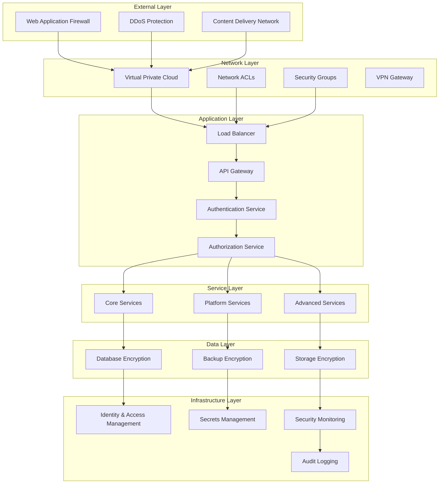
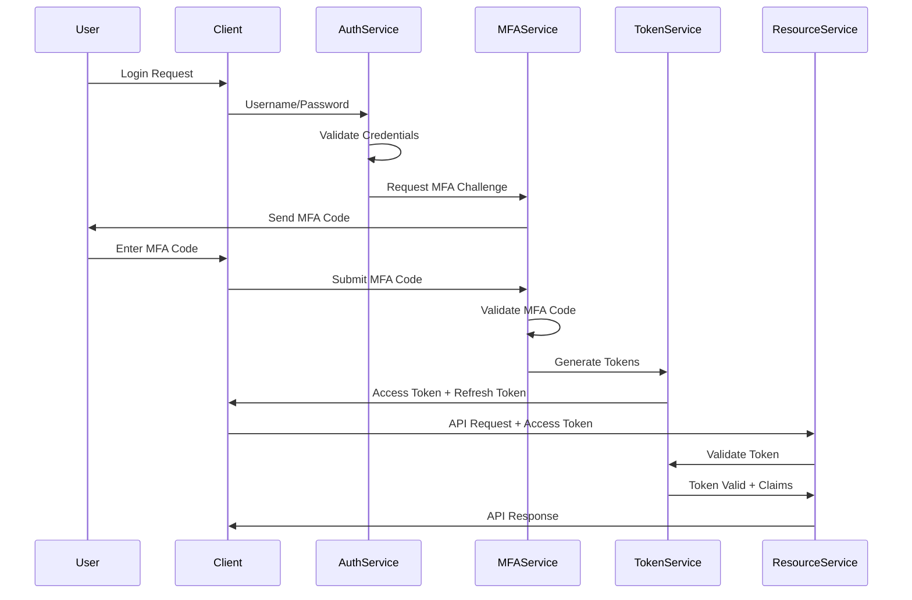
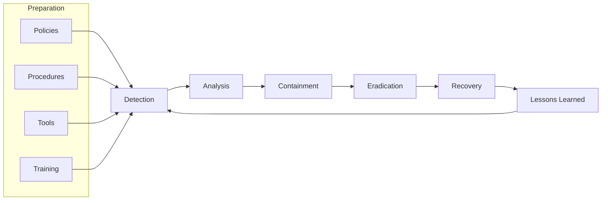

# Comprehensive CRM Platform Security Documentation

## Table of Contents

1. [Overview](#overview)
2. [Security Architecture](#security-architecture)
3. [Authentication and Authorization](#authentication-and-authorization)
4. [Data Protection](#data-protection)
5. [Network Security](#network-security)
6. [Application Security](#application-security)
7. [Infrastructure Security](#infrastructure-security)
8. [Compliance and Governance](#compliance-and-governance)
9. [Security Monitoring](#security-monitoring)
10. [Incident Response](#incident-response)
11. [Security Testing](#security-testing)
12. [Security Policies](#security-policies)
13. [Training and Awareness](#training-and-awareness)
14. [Appendices](#appendices)

---

## Overview

### Security Philosophy
The Comprehensive CRM Platform implements a defense-in-depth security strategy, incorporating multiple layers of security controls to protect customer data, ensure system integrity, and maintain service availability. Security is built into every aspect of the platform, from design to deployment and operations.

### Security Objectives
- **Confidentiality**: Protect sensitive customer and business data from unauthorized access
- **Integrity**: Ensure data accuracy and prevent unauthorized modifications
- **Availability**: Maintain system uptime and service accessibility
- **Accountability**: Provide comprehensive audit trails and access logging
- **Compliance**: Meet regulatory requirements (GDPR, SOC 2, HIPAA, etc.)

### Security Principles
- **Zero Trust Architecture**: Never trust, always verify
- **Principle of Least Privilege**: Minimum necessary access rights
- **Defense in Depth**: Multiple layers of security controls
- **Security by Design**: Security integrated from the beginning
- **Continuous Monitoring**: Real-time threat detection and response

---

## Security Architecture

### Multi-Layer Security Model



### Security Domains

#### 1. Identity and Access Management (IAM)
```yaml
IAM Components:
  Authentication:
    - Multi-factor authentication (MFA)
    - Single sign-on (SSO) integration
    - OAuth 2.0 / OpenID Connect
    - JWT token management
    - Session management
  
  Authorization:
    - Role-based access control (RBAC)
    - Attribute-based access control (ABAC)
    - Resource-level permissions
    - API-level authorization
    - Dynamic policy evaluation
  
  Identity Providers:
    - Internal identity store
    - Active Directory integration
    - SAML 2.0 support
    - Social login providers
    - Enterprise identity providers
```

#### 2. Data Security
```yaml
Data Protection:
  Encryption at Rest:
    - AES-256 encryption for databases
    - Encrypted file storage
    - Encrypted backup storage
    - Key management service integration
  
  Encryption in Transit:
    - TLS 1.3 for all communications
    - mTLS for service-to-service communication
    - VPN for administrative access
    - Encrypted message queues
  
  Data Classification:
    - Public data
    - Internal data
    - Confidential data
    - Restricted data (PII, PHI)
  
  Data Loss Prevention:
    - Content inspection
    - Data masking in non-production
    - Egress monitoring
    - Anomaly detection
```

#### 3. Network Security
```yaml
Network Controls:
  Perimeter Security:
    - Web Application Firewall (WAF)
    - DDoS protection
    - Intrusion detection/prevention
    - Geographic blocking
  
  Internal Segmentation:
    - Virtual private clouds (VPC)
    - Network access control lists (NACLs)
    - Security groups
    - Microsegmentation
  
  Traffic Monitoring:
    - Network flow analysis
    - Deep packet inspection
    - Anomaly detection
    - Threat intelligence integration
```

---

## Authentication and Authorization

### Multi-Factor Authentication (MFA)

#### MFA Implementation
```yaml
MFA Methods:
  Time-based OTP (TOTP):
    - Google Authenticator
    - Authy
    - Microsoft Authenticator
    - Custom TOTP implementation
  
  SMS-based OTP:
    - Twilio integration
    - AWS SNS integration
    - Fallback method only
    - Rate limiting applied
  
  Email-based OTP:
    - Secure email delivery
    - Time-limited codes
    - Backup method
    - Audit trail maintained
  
  Hardware Tokens:
    - FIDO2/WebAuthn support
    - YubiKey integration
    - Hardware security keys
    - Biometric authentication

MFA Policies:
  Enforcement Rules:
    - Required for all admin accounts
    - Required for privileged operations
    - Risk-based authentication
    - Device trust evaluation
  
  Bypass Conditions:
    - Trusted devices (limited time)
    - Emergency access codes
    - Administrative override
    - Service accounts (certificate-based)
```

#### Authentication Flow


### Role-Based Access Control (RBAC)

#### Role Hierarchy
```yaml
System Roles:
  Super Admin:
    Description: "Full system access across all tenants"
    Permissions:
      - system:*
      - tenant:*
      - user:*
      - audit:read
    Scope: Global
    Assignment: Manual only
    MFA Required: true
  
  System Operator:
    Description: "System monitoring and maintenance"
    Permissions:
      - system:read
      - system:monitor
      - system:backup
      - audit:read
    Scope: Global
    Assignment: Manual only
    MFA Required: true

Tenant Roles:
  Tenant Admin:
    Description: "Full tenant administration"
    Permissions:
      - tenant:read,update
      - user:create,read,update,delete
      - role:assign,revoke
      - data:*
      - integration:*
      - billing:read
    Scope: Tenant-specific
    Assignment: Super Admin or Tenant Admin
    MFA Required: true
  
  Sales Manager:
    Description: "Sales team management and reporting"
    Permissions:
      - contact:*
      - deal:*
      - lead:*
      - activity:*
      - account:read,update
      - report:read,create
      - dashboard:read,create
      - team:read
    Scope: Team or territory-specific
    Assignment: Tenant Admin
    MFA Required: false
  
  Sales Representative:
    Description: "Individual sales activities"
    Permissions:
      - contact:read,update,create
      - deal:read,update,create
      - lead:read,update,create
      - activity:*
      - account:read
      - report:read
    Scope: Owned records only
    Assignment: Sales Manager or Tenant Admin
    MFA Required: false
  
  Marketing User:
    Description: "Marketing campaigns and lead management"
    Permissions:
      - lead:*
      - campaign:*
      - contact:read,update
      - analytics:read
      - report:read,create
    Scope: Marketing data only
    Assignment: Tenant Admin
    MFA Required: false
  
  Read-Only User:
    Description: "View-only access to CRM data"
    Permissions:
      - contact:read
      - deal:read
      - lead:read
      - activity:read
      - account:read
      - report:read
    Scope: Assigned records only
    Assignment: Any manager role
    MFA Required: false
```

#### Permission Matrix
```yaml
Resource Permissions:
  Contact:
    - contact:create
    - contact:read
    - contact:update
    - contact:delete
    - contact:export
    - contact:import
    - contact:merge
    - contact:assign
  
  Deal:
    - deal:create
    - deal:read
    - deal:update
    - deal:delete
    - deal:close
    - deal:reopen
    - deal:forecast
    - deal:assign
  
  Lead:
    - lead:create
    - lead:read
    - lead:update
    - lead:delete
    - lead:convert
    - lead:assign
    - lead:score
    - lead:qualify
  
  Account:
    - account:create
    - account:read
    - account:update
    - account:delete
    - account:merge
    - account:hierarchy
    - account:territory
    - account:assign
  
  Activity:
    - activity:create
    - activity:read
    - activity:update
    - activity:delete
    - activity:complete
    - activity:schedule
    - activity:assign
  
  System:
    - system:read
    - system:monitor
    - system:configure
    - system:backup
    - system:restore
    - system:upgrade
  
  Tenant:
    - tenant:create
    - tenant:read
    - tenant:update
    - tenant:delete
    - tenant:configure
    - tenant:billing
  
  User:
    - user:create
    - user:read
    - user:update
    - user:delete
    - user:activate
    - user:deactivate
    - user:reset_password
  
  Report:
    - report:create
    - report:read
    - report:update
    - report:delete
    - report:execute
    - report:schedule
    - report:export
```

### API Security

#### API Authentication
```yaml
Authentication Methods:
  JWT Bearer Tokens:
    - RS256 signature algorithm
    - Short-lived access tokens (15 minutes)
    - Long-lived refresh tokens (30 days)
    - Token rotation on refresh
    - Revocation support
  
  API Keys:
    - Service-to-service authentication
    - Scoped permissions
    - Rate limiting per key
    - Rotation policies
    - Usage monitoring
  
  OAuth 2.0:
    - Authorization code flow
    - Client credentials flow
    - PKCE for public clients
    - Scope-based authorization
    - Token introspection

Token Validation:
  Validation Steps:
    1. Signature verification
    2. Expiration check
    3. Issuer validation
    4. Audience validation
    5. Scope verification
    6. Revocation check
  
  Caching Strategy:
    - Token validation results cached
    - 5-minute cache TTL
    - Distributed cache for scalability
    - Cache invalidation on revocation
```

#### API Authorization
```yaml
Authorization Patterns:
  Resource-Based:
    - URL path authorization
    - HTTP method restrictions
    - Resource ownership validation
    - Hierarchical permissions
  
  Attribute-Based:
    - User attributes (role, department)
    - Resource attributes (sensitivity, type)
    - Environmental attributes (time, location)
    - Dynamic policy evaluation
  
  Context-Aware:
    - Request context analysis
    - Risk-based decisions
    - Adaptive authentication
    - Behavioral analysis

Policy Engine:
  Policy Language: Open Policy Agent (OPA) Rego
  Policy Storage: Git-based version control
  Policy Evaluation: Real-time decision engine
  Policy Testing: Automated policy validation
  
  Example Policy:
    ```rego
    package crm.authz
    
    default allow = false
    
    # Allow users to read their own profile
    allow {
        input.method == "GET"
        input.path == ["users", input.user.id]
    }
    
    # Allow sales reps to manage their own contacts
    allow {
        input.method in ["GET", "POST", "PUT", "PATCH"]
        input.path[0] == "contacts"
        input.user.role == "sales_rep"
        contact_owner == input.user.id
    }
    
    # Allow managers to access team data
    allow {
        input.user.role == "sales_manager"
        team_member in input.user.team_members
        resource_owner == team_member
    }
    ```
```

---

## Data Protection

### Encryption Strategy

#### Encryption at Rest
```yaml
Database Encryption:
  PostgreSQL:
    - Transparent Data Encryption (TDE)
    - Column-level encryption for PII
    - Encrypted tablespaces
    - Encrypted WAL files
    - Key rotation policies
  
  Redis:
    - Encrypted data structures
    - Encrypted persistence files
    - Memory encryption
    - Network encryption
  
  Elasticsearch:
    - Index-level encryption
    - Snapshot encryption
    - Transport encryption
    - Field-level encryption

File Storage Encryption:
  S3/Object Storage:
    - Server-side encryption (SSE-S3)
    - Customer-managed keys (SSE-KMS)
    - Client-side encryption
    - Bucket-level encryption policies
  
  Local Storage:
    - Encrypted volumes
    - File-level encryption
    - Temporary file encryption
    - Log file encryption

Key Management:
  Key Hierarchy:
    - Master keys (HSM-protected)
    - Data encryption keys (DEK)
    - Key encryption keys (KEK)
    - Tenant-specific keys
  
  Key Rotation:
    - Automatic rotation schedule
    - Manual rotation capability
    - Version management
    - Backward compatibility
  
  Key Storage:
    - Hardware Security Modules (HSM)
    - AWS KMS integration
    - HashiCorp Vault
    - Azure Key Vault
```

#### Encryption in Transit
```yaml
Network Encryption:
  External Communications:
    - TLS 1.3 for all HTTPS traffic
    - Perfect Forward Secrecy (PFS)
    - Strong cipher suites only
    - Certificate pinning
    - HSTS headers
  
  Internal Communications:
    - mTLS for service-to-service
    - Encrypted message queues
    - Encrypted database connections
    - VPN for administrative access
  
  Certificate Management:
    - Automated certificate provisioning
    - Certificate rotation
    - Certificate monitoring
    - Certificate revocation

Protocol Security:
  TLS Configuration:
    - Minimum TLS 1.2
    - Preferred TLS 1.3
    - Disabled weak ciphers
    - OCSP stapling
    - Certificate transparency
  
  Cipher Suites:
    Allowed:
      - TLS_AES_256_GCM_SHA384
      - TLS_CHACHA20_POLY1305_SHA256
      - TLS_AES_128_GCM_SHA256
      - ECDHE-RSA-AES256-GCM-SHA384
      - ECDHE-RSA-AES128-GCM-SHA256
    
    Disabled:
      - All RC4 ciphers
      - All DES/3DES ciphers
      - All export-grade ciphers
      - All anonymous ciphers
      - All NULL ciphers
```

### Data Classification and Handling

#### Data Classification Levels
```yaml
Classification Levels:
  Public:
    Description: "Information that can be freely shared"
    Examples:
      - Marketing materials
      - Public documentation
      - Press releases
    Handling:
      - No special protection required
      - Standard backup procedures
      - Normal retention policies
  
  Internal:
    Description: "Information for internal use only"
    Examples:
      - Internal procedures
      - System documentation
      - Non-sensitive business data
    Handling:
      - Access control required
      - Standard encryption
      - Normal backup procedures
  
  Confidential:
    Description: "Sensitive business information"
    Examples:
      - Customer data
      - Financial information
      - Business strategies
    Handling:
      - Strong access controls
      - Encryption required
      - Audit logging
      - Secure backup
  
  Restricted:
    Description: "Highly sensitive regulated data"
    Examples:
      - Personal identifiable information (PII)
      - Protected health information (PHI)
      - Payment card data (PCI)
      - Social security numbers
    Handling:
      - Strict access controls
      - Strong encryption
      - Comprehensive audit logging
      - Secure backup and retention
      - Data masking in non-production
```

#### Data Handling Procedures
```yaml
Data Lifecycle Management:
  Data Creation:
    - Automatic classification
    - Metadata tagging
    - Access control assignment
    - Audit trail initiation
  
  Data Processing:
    - Purpose limitation
    - Processing lawfulness
    - Data minimization
    - Accuracy maintenance
  
  Data Storage:
    - Appropriate security controls
    - Geographic restrictions
    - Retention period enforcement
    - Regular access reviews
  
  Data Sharing:
    - Authorization required
    - Data sharing agreements
    - Purpose specification
    - Recipient verification
  
  Data Retention:
    - Automated retention policies
    - Legal hold procedures
    - Secure deletion
    - Disposal verification
  
  Data Destruction:
    - Secure deletion methods
    - Certificate of destruction
    - Audit trail maintenance
    - Verification procedures
```

### Privacy and Compliance

#### GDPR Compliance
```yaml
GDPR Implementation:
  Legal Basis:
    - Consent management
    - Legitimate interest assessment
    - Contract performance
    - Legal obligation compliance
    - Vital interest protection
    - Public task execution
  
  Data Subject Rights:
    Right to Access:
      - Data export functionality
      - Structured data formats
      - Response within 30 days
      - Identity verification
    
    Right to Rectification:
      - Data correction mechanisms
      - Automated propagation
      - Notification to third parties
      - Audit trail maintenance
    
    Right to Erasure:
      - Data deletion workflows
      - Cascading deletions
      - Backup purging
      - Third-party notifications
    
    Right to Portability:
      - Machine-readable formats
      - Direct transmission capability
      - Standard data formats
      - Secure transfer methods
    
    Right to Object:
      - Opt-out mechanisms
      - Processing cessation
      - Legitimate interest override
      - Marketing suppression
  
  Privacy by Design:
    - Data protection impact assessments
    - Privacy-preserving technologies
    - Default privacy settings
    - Minimal data collection
  
  Breach Notification:
    - 72-hour authority notification
    - Individual notification procedures
    - Breach assessment criteria
    - Documentation requirements
```

#### SOC 2 Type II Compliance
```yaml
SOC 2 Controls:
  Security:
    - Access controls implementation
    - Logical and physical access
    - System operations monitoring
    - Change management procedures
    - Risk assessment processes
  
  Availability:
    - System monitoring procedures
    - Incident response plans
    - Backup and recovery testing
    - Capacity management
    - Performance monitoring
  
  Processing Integrity:
    - Data validation controls
    - Error handling procedures
    - Processing completeness
    - Data accuracy verification
    - System processing monitoring
  
  Confidentiality:
    - Data classification procedures
    - Encryption implementation
    - Access restriction controls
    - Confidentiality agreements
    - Data handling procedures
  
  Privacy:
    - Privacy notice procedures
    - Consent management
    - Data collection limitation
    - Data retention policies
    - Data disposal procedures

Control Testing:
  - Annual independent audits
  - Continuous monitoring
  - Control effectiveness testing
  - Exception reporting
  - Remediation tracking
```

---

## Network Security

### Perimeter Security

#### Web Application Firewall (WAF)
```yaml
WAF Configuration:
  Rule Sets:
    OWASP Core Rule Set:
      - SQL injection protection
      - Cross-site scripting (XSS) prevention
      - Remote file inclusion blocking
      - Local file inclusion blocking
      - Command injection prevention
    
    Custom Rules:
      - API rate limiting
      - Geographic blocking
      - IP reputation filtering
      - Bot detection and mitigation
      - Application-specific protections
  
  Protection Modes:
    Detection Mode:
      - Log security events
      - No blocking action
      - Baseline establishment
      - Rule tuning
    
    Prevention Mode:
      - Block malicious requests
      - Real-time protection
      - Automated responses
      - Alert generation
  
  Monitoring:
    - Real-time dashboards
    - Attack pattern analysis
    - False positive tracking
    - Performance impact monitoring
```

#### DDoS Protection
```yaml
DDoS Mitigation:
  Layer 3/4 Protection:
    - Volumetric attack mitigation
    - Protocol attack prevention
    - Connection flood protection
    - Packet rate limiting
  
  Layer 7 Protection:
    - Application-layer attack mitigation
    - HTTP flood protection
    - Slowloris attack prevention
    - Request rate limiting
  
  Mitigation Strategies:
    - Traffic scrubbing
    - Rate limiting
    - Geographic filtering
    - Behavioral analysis
    - Challenge-response mechanisms
  
  Response Procedures:
    - Automated mitigation activation
    - Traffic diversion
    - Upstream provider coordination
    - Incident documentation
    - Post-incident analysis
```

### Network Segmentation

#### Virtual Private Cloud (VPC) Design
```yaml
VPC Architecture:
  Network Topology:
    - Multi-tier architecture
    - Public and private subnets
    - Multiple availability zones
    - Dedicated tenancy options
  
  Subnet Design:
    Public Subnets:
      - Load balancers
      - NAT gateways
      - Bastion hosts
      - Internet gateways
    
    Private Subnets:
      - Application servers
      - Database servers
      - Internal services
      - Backend processing
    
    Isolated Subnets:
      - Sensitive data processing
      - Compliance workloads
      - High-security applications
      - Audit systems
  
  Routing Configuration:
    - Route table management
    - Internet gateway routing
    - NAT gateway routing
    - VPC peering routes
    - VPN connection routes
```

#### Network Access Control
```yaml
Security Groups:
  Stateful Firewall Rules:
    - Inbound traffic control
    - Outbound traffic control
    - Protocol-specific rules
    - Port-based restrictions
    - Source/destination filtering
  
  Rule Examples:
    Web Tier:
      - Allow HTTP (80) from Internet
      - Allow HTTPS (443) from Internet
      - Allow SSH (22) from bastion hosts
      - Deny all other inbound traffic
    
    Application Tier:
      - Allow HTTP (8080) from web tier
      - Allow database connections to data tier
      - Allow inter-service communication
      - Deny direct Internet access
    
    Database Tier:
      - Allow database connections from app tier
      - Allow backup connections from backup systems
      - Deny all other connections
      - No Internet access

Network ACLs:
  Stateless Firewall Rules:
    - Subnet-level protection
    - Additional security layer
    - Protocol and port filtering
    - Source and destination control
  
  Default Deny Policy:
    - Explicit allow rules required
    - Numbered rule priority
    - Separate inbound/outbound rules
    - Regular rule review
```

### Microsegmentation

#### Service Mesh Security
```yaml
Istio Service Mesh:
  mTLS Configuration:
    - Automatic certificate provisioning
    - Certificate rotation
    - Strong encryption algorithms
    - Identity-based authentication
  
  Authorization Policies:
    - Service-to-service authorization
    - Request-level authorization
    - JWT token validation
    - Custom authorization logic
  
  Traffic Management:
    - Encrypted service communication
    - Traffic routing policies
    - Load balancing security
    - Circuit breaker patterns
  
  Observability:
    - Security metrics collection
    - Access logging
    - Distributed tracing
    - Security event monitoring
```

#### Network Policies
```yaml
Kubernetes Network Policies:
  Default Deny:
    - Block all traffic by default
    - Explicit allow rules required
    - Namespace isolation
    - Pod-to-pod restrictions
  
  Ingress Rules:
    - Allow specific inbound traffic
    - Source pod/namespace selection
    - Port and protocol specification
    - Label-based selection
  
  Egress Rules:
    - Control outbound traffic
    - Destination restrictions
    - External service access
    - DNS resolution control
  
  Policy Examples:
    Database Access:
      - Only application pods can connect
      - Specific database ports only
      - No cross-namespace access
      - Audit all connections
    
    External API Access:
      - Only specific services allowed
      - HTTPS connections only
      - Rate limiting applied
      - Connection monitoring
```

---

## Application Security

### Secure Development Lifecycle (SDLC)

#### Security Requirements
```yaml
Security Requirements Phase:
  Threat Modeling:
    - STRIDE methodology
    - Attack surface analysis
    - Trust boundary identification
    - Data flow analysis
    - Risk assessment
  
  Security Controls:
    - Authentication requirements
    - Authorization specifications
    - Data protection needs
    - Audit logging requirements
    - Compliance obligations
  
  Security Architecture:
    - Security pattern selection
    - Component security design
    - Integration security
    - Third-party security assessment
```

#### Secure Coding Practices
```yaml
Coding Standards:
  Input Validation:
    - Server-side validation
    - Input sanitization
    - Type checking
    - Length restrictions
    - Format validation
  
  Output Encoding:
    - Context-aware encoding
    - HTML entity encoding
    - URL encoding
    - JavaScript encoding
    - SQL parameter binding
  
  Error Handling:
    - Generic error messages
    - Detailed logging
    - No sensitive data exposure
    - Graceful degradation
    - Security event logging
  
  Session Management:
    - Secure session tokens
    - Session timeout
    - Session invalidation
    - CSRF protection
    - Session fixation prevention
  
  Cryptography:
    - Strong algorithms only
    - Proper key management
    - Secure random generation
    - Certificate validation
    - Cryptographic agility
```

### Application Security Testing

#### Static Application Security Testing (SAST)
```yaml
SAST Tools:
  SonarQube:
    - Code quality analysis
    - Security vulnerability detection
    - Technical debt assessment
    - Code coverage analysis
    - Custom rule configuration
  
  Checkmarx:
    - Source code analysis
    - Vulnerability identification
    - Remediation guidance
    - IDE integration
    - CI/CD pipeline integration
  
  Veracode:
    - Binary code analysis
    - Third-party library scanning
    - Compliance reporting
    - Developer training
    - Policy enforcement

SAST Process:
  - Automated scanning in CI/CD
  - Developer IDE integration
  - Pull request analysis
  - Baseline establishment
  - Trend analysis
  - False positive management
```

#### Dynamic Application Security Testing (DAST)
```yaml
DAST Tools:
  OWASP ZAP:
    - Automated security scanning
    - Manual penetration testing
    - API security testing
    - Authentication testing
    - Session management testing
  
  Burp Suite:
    - Web application testing
    - API security assessment
    - Manual testing capabilities
    - Extension ecosystem
    - Collaboration features
  
  Nessus:
    - Vulnerability scanning
    - Configuration assessment
    - Compliance checking
    - Network security testing
    - Reporting capabilities

DAST Process:
  - Staging environment testing
  - Production monitoring
  - Authenticated scanning
  - API endpoint testing
  - Regular scan scheduling
  - Vulnerability tracking
```

#### Interactive Application Security Testing (IAST)
```yaml
IAST Implementation:
  Runtime Analysis:
    - Real-time vulnerability detection
    - Code execution monitoring
    - Data flow analysis
    - Attack simulation
    - Performance impact monitoring
  
  Integration Points:
    - Application runtime
    - Testing frameworks
    - CI/CD pipelines
    - Development environments
    - Production monitoring
  
  Benefits:
    - Low false positive rates
    - Precise vulnerability location
    - Runtime context awareness
    - Continuous monitoring
    - Developer-friendly reporting
```

### API Security

#### API Security Controls
```yaml
Authentication:
  - OAuth 2.0 implementation
  - JWT token validation
  - API key management
  - Client certificate authentication
  - Multi-factor authentication

Authorization:
  - Scope-based access control
  - Resource-level permissions
  - Rate limiting per client
  - IP whitelisting
  - Geographic restrictions

Input Validation:
  - Schema validation
  - Parameter sanitization
  - Request size limits
  - Content type validation
  - Injection attack prevention

Output Security:
  - Response filtering
  - Sensitive data masking
  - Error message sanitization
  - Information disclosure prevention
  - CORS policy enforcement
```

#### API Security Testing
```yaml
Security Test Cases:
  Authentication Testing:
    - Token validation bypass
    - Session management flaws
    - Privilege escalation
    - Authentication bypass
    - Brute force protection
  
  Authorization Testing:
    - Horizontal privilege escalation
    - Vertical privilege escalation
    - Resource access control
    - Function-level authorization
    - Data access validation
  
  Input Validation Testing:
    - SQL injection
    - NoSQL injection
    - Command injection
    - LDAP injection
    - XML injection
    - JSON injection
  
  Business Logic Testing:
    - Workflow bypass
    - Race conditions
    - Time-of-check vulnerabilities
    - State manipulation
    - Process flow violations
```

---

## Infrastructure Security

### Container Security

#### Container Image Security
```yaml
Image Security Practices:
  Base Image Selection:
    - Minimal base images (Alpine, Distroless)
    - Official images preferred
    - Regular base image updates
    - Vulnerability scanning
    - Image signing verification
  
  Dockerfile Security:
    - Non-root user execution
    - Minimal package installation
    - Multi-stage builds
    - Secret management
    - Layer optimization
  
  Image Scanning:
    - Vulnerability assessment
    - Malware detection
    - Configuration analysis
    - License compliance
    - Policy enforcement
  
  Registry Security:
    - Private registry usage
    - Access control implementation
    - Image signing
    - Vulnerability monitoring
    - Retention policies
```

#### Runtime Security
```yaml
Container Runtime Security:
  Security Contexts:
    - Non-root user enforcement
    - Read-only root filesystem
    - Capability dropping
    - SELinux/AppArmor profiles
    - Seccomp profiles
  
  Resource Limits:
    - CPU limits
    - Memory limits
    - Storage limits
    - Network bandwidth limits
    - Process limits
  
  Network Security:
    - Network policies
    - Service mesh integration
    - Encrypted communication
    - Traffic monitoring
    - Ingress/egress control
  
  Monitoring:
    - Runtime behavior analysis
    - Anomaly detection
    - File integrity monitoring
    - Process monitoring
    - Network traffic analysis
```

### Kubernetes Security

#### Cluster Security
```yaml
Control Plane Security:
  API Server:
    - TLS encryption
    - Authentication mechanisms
    - Authorization policies
    - Admission controllers
    - Audit logging
  
  etcd Security:
    - Encryption at rest
    - Client certificate authentication
    - Network isolation
    - Backup encryption
    - Access logging
  
  Node Security:
    - OS hardening
    - Kubelet security
    - Container runtime security
    - Network security
    - Monitoring agents
```

#### Pod Security Standards
```yaml
Pod Security Policies:
  Restricted Profile:
    - Non-root containers
    - Read-only root filesystem
    - Dropped capabilities
    - No privileged containers
    - Seccomp profiles
  
  Baseline Profile:
    - Basic security restrictions
    - Limited capabilities
    - No host network access
    - No privileged escalation
    - Volume type restrictions
  
  Privileged Profile:
    - Minimal restrictions
    - Administrative access
    - Host resource access
    - Privileged operations
    - System-level access
```

### Cloud Security

#### AWS Security Configuration
```yaml
IAM Security:
  Principle of Least Privilege:
    - Minimal permissions
    - Role-based access
    - Temporary credentials
    - Regular access reviews
    - Permission boundaries
  
  Multi-Factor Authentication:
    - MFA for all users
    - Hardware tokens preferred
    - Virtual MFA devices
    - SMS backup method
    - Emergency access procedures
  
  Access Keys Management:
    - Programmatic access only
    - Regular rotation
    - Secure storage
    - Usage monitoring
    - Deactivation procedures

VPC Security:
  Network Isolation:
    - Private subnets
    - Security groups
    - NACLs
    - VPC endpoints
    - NAT gateways
  
  Monitoring:
    - VPC Flow Logs
    - CloudTrail logging
    - GuardDuty threat detection
    - Config compliance
    - Security Hub integration
```

---

## Security Monitoring

### Security Information and Event Management (SIEM)

#### Log Collection and Analysis
```yaml
Log Sources:
  Application Logs:
    - Authentication events
    - Authorization failures
    - API access logs
    - Error logs
    - Performance logs
  
  Infrastructure Logs:
    - System logs
    - Network logs
    - Database logs
    - Container logs
    - Cloud service logs
  
  Security Logs:
    - Firewall logs
    - IDS/IPS logs
    - Antivirus logs
    - Vulnerability scan logs
    - Penetration test logs

Log Processing:
  Normalization:
    - Common event format
    - Field mapping
    - Data enrichment
    - Timestamp standardization
    - Source identification
  
  Correlation:
    - Event correlation rules
    - Pattern recognition
    - Anomaly detection
    - Threat intelligence integration
    - Risk scoring
```

#### Security Metrics and KPIs
```yaml
Security Metrics:
  Incident Metrics:
    - Mean time to detection (MTTD)
    - Mean time to response (MTTR)
    - Mean time to recovery (MTTR)
    - Incident severity distribution
    - False positive rate
  
  Vulnerability Metrics:
    - Vulnerability discovery rate
    - Time to patch
    - Vulnerability severity distribution
    - Remediation effectiveness
    - Risk exposure trends
  
  Compliance Metrics:
    - Policy compliance rate
    - Audit finding trends
    - Control effectiveness
    - Remediation timeliness
    - Certification status
  
  Operational Metrics:
    - Security tool availability
    - Log collection completeness
    - Alert response time
    - Training completion rate
    - Security awareness metrics
```

### Threat Detection and Response

#### Threat Intelligence Integration
```yaml
Threat Intelligence Sources:
  Commercial Feeds:
    - Threat intelligence platforms
    - Vendor-specific feeds
    - Industry-specific intelligence
    - Government sources
    - Open source intelligence
  
  Internal Intelligence:
    - Historical incident data
    - Attack pattern analysis
    - Vulnerability assessments
    - Penetration test results
    - Security research findings
  
  Intelligence Processing:
    - IOC extraction
    - Attribution analysis
    - TTPs identification
    - Risk assessment
    - Actionable intelligence generation
```

#### Automated Response
```yaml
Response Automation:
  Incident Classification:
    - Severity assessment
    - Impact analysis
    - Urgency determination
    - Escalation criteria
    - Response team assignment
  
  Automated Actions:
    - Account lockout
    - IP blocking
    - Traffic redirection
    - System isolation
    - Evidence collection
  
  Workflow Integration:
    - Ticketing system integration
    - Communication automation
    - Stakeholder notification
    - Documentation generation
    - Metrics collection
```

---

## Incident Response

### Incident Response Framework

#### Incident Response Process


#### Incident Classification
```yaml
Severity Levels:
  Critical (P1):
    Description: "Complete system outage or data breach"
    Response Time: "15 minutes"
    Escalation: "Immediate C-level notification"
    Examples:
      - Complete system unavailability
      - Confirmed data breach
      - Ransomware attack
      - Critical infrastructure compromise
  
  High (P2):
    Description: "Significant service degradation or security incident"
    Response Time: "1 hour"
    Escalation: "Management notification within 2 hours"
    Examples:
      - Partial system outage
      - Suspected data breach
      - Malware infection
      - Unauthorized access attempt
  
  Medium (P3):
    Description: "Minor service impact or security concern"
    Response Time: "4 hours"
    Escalation: "Team lead notification"
    Examples:
      - Performance degradation
      - Security policy violation
      - Failed login attempts
      - Suspicious network activity
  
  Low (P4):
    Description: "Minimal impact or informational security event"
    Response Time: "24 hours"
    Escalation: "Standard reporting"
    Examples:
      - Minor configuration issues
      - Routine security alerts
      - Informational events
      - Maintenance notifications
```

### Incident Response Procedures

#### Detection and Analysis
```yaml
Detection Methods:
  Automated Detection:
    - SIEM alerts
    - IDS/IPS notifications
    - Anomaly detection systems
    - Vulnerability scanners
    - Monitoring tools
  
  Manual Detection:
    - User reports
    - Security team observations
    - Third-party notifications
    - Vendor alerts
    - Media reports
  
  Analysis Process:
    - Initial triage
    - Evidence collection
    - Impact assessment
    - Root cause analysis
    - Attribution investigation
```

#### Containment and Eradication
```yaml
Containment Strategies:
  Short-term Containment:
    - System isolation
    - Network segmentation
    - Account disabling
    - Service shutdown
    - Traffic blocking
  
  Long-term Containment:
    - System rebuilding
    - Patch deployment
    - Configuration changes
    - Security control implementation
    - Monitoring enhancement
  
  Eradication Actions:
    - Malware removal
    - Vulnerability patching
    - Account cleanup
    - System hardening
    - Evidence preservation
```

#### Recovery and Post-Incident
```yaml
Recovery Process:
  System Restoration:
    - Service restoration
    - Data recovery
    - Functionality testing
    - Performance validation
    - Security verification
  
  Monitoring:
    - Enhanced monitoring
    - Anomaly detection
    - Threat hunting
    - Vulnerability assessment
    - Compliance verification
  
  Post-Incident Activities:
    - Incident documentation
    - Lessons learned session
    - Process improvement
    - Training updates
    - Policy revisions
```

---

*This comprehensive security documentation provides detailed guidance on all aspects of security for the CRM platform, from architecture and implementation to monitoring and incident response. It serves as the definitive security reference for the entire platform.*