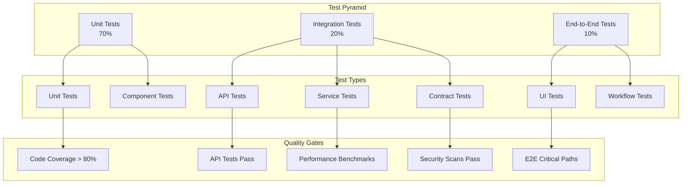

# Comprehensive CRM Platform Testing Documentation

## Table of Contents

1. [Overview](#overview)
2. [Testing Strategy](#testing-strategy)
3. [Test Planning](#test-planning)
4. [Unit Testing](#unit-testing)
5. [Integration Testing](#integration-testing)
6. [API Testing](#api-testing)
7. [End-to-End Testing](#end-to-end-testing)
8. [Performance Testing](#performance-testing)
9. [Security Testing](#security-testing)
10. [Accessibility Testing](#accessibility-testing)
11. [Mobile Testing](#mobile-testing)
12. [Test Automation](#test-automation)
13. [Test Data Management](#test-data-management)
14. [Test Environment Management](#test-environment-management)
15. [Quality Metrics](#quality-metrics)
16. [Appendices](#appendices)

---

## Overview

### Testing Philosophy
The Comprehensive CRM Platform follows a quality-first approach with comprehensive testing at every level. Our testing strategy ensures reliability, performance, security, and user experience across all components and integrations.

### Testing Objectives
- **Functional Correctness**: Verify all features work as specified
- **Performance Assurance**: Ensure system meets performance requirements
- **Security Validation**: Confirm security controls are effective
- **Reliability Testing**: Validate system stability and availability
- **User Experience**: Ensure intuitive and accessible user interfaces
- **Integration Verification**: Confirm seamless component interactions

### Testing Principles
- **Shift-Left Testing**: Early testing in development lifecycle
- **Test Automation**: Automated testing for efficiency and consistency
- **Risk-Based Testing**: Focus on high-risk areas and critical paths
- **Continuous Testing**: Integrated testing in CI/CD pipelines
- **Data-Driven Testing**: Comprehensive test data coverage
- **Exploratory Testing**: Human insight for edge cases and usability

---

## Testing Strategy

### Test Pyramid



### Testing Levels

#### 1. Unit Testing (70%)
```yaml
Scope:
  - Individual functions and methods
  - Class-level testing
  - Business logic validation
  - Error handling verification
  - Edge case coverage

Tools:
  - Jest (JavaScript/TypeScript)
  - PyTest (Python)
  - JUnit (Java)
  - Go Test (Go)
  - PHPUnit (PHP)

Coverage Targets:
  - Line Coverage: >90%
  - Branch Coverage: >85%
  - Function Coverage: >95%
  - Statement Coverage: >90%
```

#### 2. Integration Testing (20%)
```yaml
Scope:
  - Service-to-service communication
  - Database integration
  - External API integration
  - Message queue integration
  - Cache integration

Types:
  - Component Integration
  - System Integration
  - API Integration
  - Database Integration
  - Third-party Integration

Tools:
  - Postman/Newman
  - REST Assured
  - Testcontainers
  - WireMock
  - Pact (Contract Testing)
```

#### 3. End-to-End Testing (10%)
```yaml
Scope:
  - Complete user workflows
  - Cross-service functionality
  - Business process validation
  - User interface testing
  - Critical path verification

Tools:
  - Playwright
  - Cypress
  - Selenium WebDriver
  - Puppeteer
  - TestCafe

Focus Areas:
  - User registration and login
  - Contact management workflows
  - Deal creation and progression
  - Lead conversion processes
  - Reporting and analytics
```

### Testing Environments

#### Environment Strategy
```yaml
Development Environment:
  Purpose: "Developer testing and debugging"
  Data: "Synthetic test data"
  Deployment: "Feature branches"
  Testing: "Unit and component tests"
  Access: "Development team"

Integration Environment:
  Purpose: "Service integration testing"
  Data: "Realistic test data"
  Deployment: "Integration branches"
  Testing: "Integration and API tests"
  Access: "Development and QA teams"

Staging Environment:
  Purpose: "Pre-production validation"
  Data: "Production-like data (anonymized)"
  Deployment: "Release candidates"
  Testing: "Full test suite execution"
  Access: "QA, Product, and Stakeholders"

Production Environment:
  Purpose: "Live system monitoring"
  Data: "Real production data"
  Deployment: "Stable releases"
  Testing: "Smoke tests and monitoring"
  Access: "Operations and support teams"
```

---

## Test Planning

### Test Plan Template

#### Test Plan Structure
```yaml
Test Plan Components:
  1. Test Objectives:
     - Functional requirements validation
     - Non-functional requirements verification
     - Risk mitigation strategies
     - Quality criteria definition
  
  2. Scope Definition:
     - Features to be tested
     - Features not to be tested
     - Test environment requirements
     - Test data requirements
  
  3. Test Approach:
     - Testing methodology
     - Test design techniques
     - Test execution strategy
     - Defect management process
  
  4. Test Schedule:
     - Test planning timeline
     - Test execution phases
     - Milestone definitions
     - Dependency management
  
  5. Resource Planning:
     - Team structure and roles
     - Skill requirements
     - Tool requirements
     - Infrastructure needs
  
  6. Risk Assessment:
     - Technical risks
     - Schedule risks
     - Resource risks
     - Mitigation strategies
```

### Test Case Design

#### Test Case Template
```yaml
Test Case Structure:
  Test Case ID: "TC_CONTACTS_001"
  Test Case Title: "Create new contact with valid data"
  
  Prerequisites:
    - User is logged in
    - User has contact creation permissions
    - Test data is available
  
  Test Steps:
    1. Navigate to Contacts page
    2. Click "New Contact" button
    3. Fill in required fields (First Name, Email)
    4. Fill in optional fields (Last Name, Phone, Company)
    5. Click "Save" button
  
  Expected Results:
    - Contact is created successfully
    - Success message is displayed
    - Contact appears in contacts list
    - Contact details are saved correctly
  
  Test Data:
    - First Name: "John"
    - Last Name: "Doe"
    - Email: "john.doe@example.com"
    - Phone: "+1-555-0123"
    - Company: "Test Company"
  
  Priority: High
  Severity: Critical
  Test Type: Functional
  Automation: Yes
```

#### Test Design Techniques
```yaml
Black Box Techniques:
  Equivalence Partitioning:
    - Valid input classes
    - Invalid input classes
    - Boundary value analysis
    - Error guessing
  
  Decision Table Testing:
    - Complex business rules
    - Multiple input combinations
    - Condition-action relationships
    - Complete coverage verification
  
  State Transition Testing:
    - Workflow testing
    - Status change validation
    - State-dependent behavior
    - Invalid transition handling

White Box Techniques:
  Statement Coverage:
    - All code statements executed
    - Dead code identification
    - Code path verification
    - Logic flow validation
  
  Branch Coverage:
    - All decision branches tested
    - Conditional logic verification
    - Loop testing
    - Exception handling
  
  Path Coverage:
    - Independent path testing
    - Cyclomatic complexity analysis
    - Control flow verification
    - Integration point testing
```

---

## Unit Testing

### Unit Testing Framework

#### JavaScript/TypeScript Testing
```javascript
// Example: Contact service unit tests
import { ContactService } from '../src/services/ContactService';
import { ContactRepository } from '../src/repositories/ContactRepository';
import { ValidationError } from '../src/errors/ValidationError';

describe('ContactService', () => {
  let contactService: ContactService;
  let mockContactRepository: jest.Mocked<ContactRepository>;

  beforeEach(() => {
    mockContactRepository = {
      create: jest.fn(),
      findById: jest.fn(),
      findByEmail: jest.fn(),
      update: jest.fn(),
      delete: jest.fn(),
      findAll: jest.fn(),
    } as jest.Mocked<ContactRepository>;
    
    contactService = new ContactService(mockContactRepository);
  });

  describe('createContact', () => {
    it('should create a contact with valid data', async () => {
      // Arrange
      const contactData = {
        firstName: 'John',
        lastName: 'Doe',
        email: 'john.doe@example.com',
        phone: '+1-555-0123',
        company: 'Test Company'
      };
      
      const expectedContact = {
        id: 'contact_123',
        ...contactData,
        createdAt: new Date(),
        updatedAt: new Date()
      };
      
      mockContactRepository.findByEmail.mockResolvedValue(null);
      mockContactRepository.create.mockResolvedValue(expectedContact);

      // Act
      const result = await contactService.createContact(contactData);

      // Assert
      expect(mockContactRepository.findByEmail).toHaveBeenCalledWith(contactData.email);
      expect(mockContactRepository.create).toHaveBeenCalledWith(contactData);
      expect(result).toEqual(expectedContact);
    });

    it('should throw ValidationError for invalid email', async () => {
      // Arrange
      const contactData = {
        firstName: 'John',
        lastName: 'Doe',
        email: 'invalid-email',
        phone: '+1-555-0123'
      };

      // Act & Assert
      await expect(contactService.createContact(contactData))
        .rejects
        .toThrow(ValidationError);
      
      expect(mockContactRepository.create).not.toHaveBeenCalled();
    });

    it('should throw error for duplicate email', async () => {
      // Arrange
      const contactData = {
        firstName: 'John',
        lastName: 'Doe',
        email: 'john.doe@example.com'
      };
      
      const existingContact = {
        id: 'contact_existing',
        email: 'john.doe@example.com'
      };
      
      mockContactRepository.findByEmail.mockResolvedValue(existingContact);

      // Act & Assert
      await expect(contactService.createContact(contactData))
        .rejects
        .toThrow('Contact with this email already exists');
      
      expect(mockContactRepository.create).not.toHaveBeenCalled();
    });
  });

  describe('updateContact', () => {
    it('should update existing contact', async () => {
      // Arrange
      const contactId = 'contact_123';
      const updateData = {
        firstName: 'Jane',
        phone: '+1-555-0124'
      };
      
      const existingContact = {
        id: contactId,
        firstName: 'John',
        lastName: 'Doe',
        email: 'john.doe@example.com',
        phone: '+1-555-0123'
      };
      
      const updatedContact = {
        ...existingContact,
        ...updateData,
        updatedAt: new Date()
      };
      
      mockContactRepository.findById.mockResolvedValue(existingContact);
      mockContactRepository.update.mockResolvedValue(updatedContact);

      // Act
      const result = await contactService.updateContact(contactId, updateData);

      // Assert
      expect(mockContactRepository.findById).toHaveBeenCalledWith(contactId);
      expect(mockContactRepository.update).toHaveBeenCalledWith(contactId, updateData);
      expect(result).toEqual(updatedContact);
    });

    it('should throw error for non-existent contact', async () => {
      // Arrange
      const contactId = 'contact_nonexistent';
      const updateData = { firstName: 'Jane' };
      
      mockContactRepository.findById.mockResolvedValue(null);

      // Act & Assert
      await expect(contactService.updateContact(contactId, updateData))
        .rejects
        .toThrow('Contact not found');
      
      expect(mockContactRepository.update).not.toHaveBeenCalled();
    });
  });
});
```

#### Python Testing Example
```python
# Example: Lead scoring service unit tests
import pytest
from unittest.mock import Mock, patch
from src.services.lead_scoring_service import LeadScoringService
from src.models.lead import Lead
from src.exceptions.validation_error import ValidationError

class TestLeadScoringService:
    
    def setup_method(self):
        self.mock_lead_repository = Mock()
        self.mock_scoring_rules_repository = Mock()
        self.lead_scoring_service = LeadScoringService(
            self.mock_lead_repository,
            self.mock_scoring_rules_repository
        )
    
    def test_calculate_lead_score_with_valid_data(self):
        # Arrange
        lead_data = {
            'id': 'lead_123',
            'email': 'test@example.com',
            'company': 'Test Company',
            'job_title': 'Manager',
            'industry': 'Technology',
            'employee_count': 100
        }
        
        scoring_rules = [
            {'field': 'industry', 'value': 'Technology', 'score': 20},
            {'field': 'job_title', 'value': 'Manager', 'score': 15},
            {'field': 'employee_count', 'operator': '>', 'value': 50, 'score': 10}
        ]
        
        self.mock_scoring_rules_repository.get_active_rules.return_value = scoring_rules
        
        # Act
        score = self.lead_scoring_service.calculate_lead_score(lead_data)
        
        # Assert
        assert score == 45  # 20 + 15 + 10
        self.mock_scoring_rules_repository.get_active_rules.assert_called_once()
    
    def test_calculate_lead_score_with_no_matching_rules(self):
        # Arrange
        lead_data = {
            'id': 'lead_123',
            'email': 'test@example.com',
            'company': 'Test Company'
        }
        
        self.mock_scoring_rules_repository.get_active_rules.return_value = []
        
        # Act
        score = self.lead_scoring_service.calculate_lead_score(lead_data)
        
        # Assert
        assert score == 0
    
    def test_update_lead_score_success(self):
        # Arrange
        lead_id = 'lead_123'
        new_score = 75
        
        lead = Lead(id=lead_id, email='test@example.com', lead_score=50)
        self.mock_lead_repository.find_by_id.return_value = lead
        
        # Act
        result = self.lead_scoring_service.update_lead_score(lead_id, new_score)
        
        # Assert
        assert result.lead_score == new_score
        self.mock_lead_repository.update.assert_called_once_with(lead_id, {'lead_score': new_score})
    
    def test_update_lead_score_lead_not_found(self):
        # Arrange
        lead_id = 'lead_nonexistent'
        new_score = 75
        
        self.mock_lead_repository.find_by_id.return_value = None
        
        # Act & Assert
        with pytest.raises(ValidationError, match="Lead not found"):
            self.lead_scoring_service.update_lead_score(lead_id, new_score)
        
        self.mock_lead_repository.update.assert_not_called()
    
    @patch('src.services.lead_scoring_service.datetime')
    def test_batch_score_update(self, mock_datetime):
        # Arrange
        mock_datetime.now.return_value = '2024-01-15T10:30:00Z'
        
        leads = [
            {'id': 'lead_1', 'industry': 'Technology'},
            {'id': 'lead_2', 'industry': 'Healthcare'},
            {'id': 'lead_3', 'industry': 'Finance'}
        ]
        
        scoring_rules = [
            {'field': 'industry', 'value': 'Technology', 'score': 20},
            {'field': 'industry', 'value': 'Healthcare', 'score': 15}
        ]
        
        self.mock_lead_repository.find_all_unscored.return_value = leads
        self.mock_scoring_rules_repository.get_active_rules.return_value = scoring_rules
        
        # Act
        result = self.lead_scoring_service.batch_score_update()
        
        # Assert
        assert result['processed'] == 3
        assert result['updated'] == 2  # Only Technology and Healthcare leads scored
        assert result['skipped'] == 1   # Finance lead has no matching rule
```

### Test Coverage Requirements

#### Coverage Metrics
```yaml
Coverage Targets:
  Unit Tests:
    - Line Coverage: >90%
    - Branch Coverage: >85%
    - Function Coverage: >95%
    - Statement Coverage: >90%
  
  Integration Tests:
    - API Endpoint Coverage: >95%
    - Service Integration Coverage: >80%
    - Database Operation Coverage: >90%
  
  End-to-End Tests:
    - Critical Path Coverage: 100%
    - User Journey Coverage: >80%
    - Business Process Coverage: >90%

Coverage Tools:
  JavaScript/TypeScript:
    - Istanbul/NYC
    - Jest Coverage
    - Codecov
  
  Python:
    - Coverage.py
    - Pytest-cov
    - Codecov
  
  Java:
    - JaCoCo
    - Cobertura
    - SonarQube
  
  Go:
    - Go Cover
    - Gocov
    - Codecov
```

---

## Integration Testing

### API Integration Testing

#### REST API Testing
```javascript
// Example: API integration tests using Jest and Supertest
import request from 'supertest';
import { app } from '../src/app';
import { DatabaseHelper } from './helpers/DatabaseHelper';
import { AuthHelper } from './helpers/AuthHelper';

describe('Contacts API Integration Tests', () => {
  let authToken: string;
  let testTenantId: string;

  beforeAll(async () => {
    await DatabaseHelper.setupTestDatabase();
    const authResult = await AuthHelper.createTestUser();
    authToken = authResult.token;
    testTenantId = authResult.tenantId;
  });

  afterAll(async () => {
    await DatabaseHelper.cleanupTestDatabase();
  });

  beforeEach(async () => {
    await DatabaseHelper.clearTestData();
  });

  describe('POST /api/v1/contacts', () => {
    it('should create a new contact with valid data', async () => {
      // Arrange
      const contactData = {
        firstName: 'John',
        lastName: 'Doe',
        email: 'john.doe@example.com',
        phone: '+1-555-0123',
        company: 'Test Company'
      };

      // Act
      const response = await request(app)
        .post('/api/v1/contacts')
        .set('Authorization', `Bearer ${authToken}`)
        .set('X-Tenant-ID', testTenantId)
        .send(contactData)
        .expect(201);

      // Assert
      expect(response.body.success).toBe(true);
      expect(response.body.data).toMatchObject({
        firstName: contactData.firstName,
        lastName: contactData.lastName,
        email: contactData.email,
        phone: contactData.phone,
        company: contactData.company
      });
      expect(response.body.data.id).toBeDefined();
      expect(response.body.data.createdAt).toBeDefined();
      expect(response.body.data.updatedAt).toBeDefined();
    });

    it('should return 400 for invalid email format', async () => {
      // Arrange
      const contactData = {
        firstName: 'John',
        lastName: 'Doe',
        email: 'invalid-email-format'
      };

      // Act
      const response = await request(app)
        .post('/api/v1/contacts')
        .set('Authorization', `Bearer ${authToken}`)
        .set('X-Tenant-ID', testTenantId)
        .send(contactData)
        .expect(400);

      // Assert
      expect(response.body.success).toBe(false);
      expect(response.body.errors).toContainEqual(
        expect.objectContaining({
          code: 'VALIDATION_ERROR',
          field: 'email',
          message: expect.stringContaining('Invalid email format')
        })
      );
    });

    it('should return 409 for duplicate email', async () => {
      // Arrange
      const contactData = {
        firstName: 'John',
        lastName: 'Doe',
        email: 'john.doe@example.com'
      };

      // Create first contact
      await request(app)
        .post('/api/v1/contacts')
        .set('Authorization', `Bearer ${authToken}`)
        .set('X-Tenant-ID', testTenantId)
        .send(contactData)
        .expect(201);

      // Act - Try to create duplicate
      const response = await request(app)
        .post('/api/v1/contacts')
        .set('Authorization', `Bearer ${authToken}`)
        .set('X-Tenant-ID', testTenantId)
        .send(contactData)
        .expect(409);

      // Assert
      expect(response.body.success).toBe(false);
      expect(response.body.errors).toContainEqual(
        expect.objectContaining({
          code: 'DUPLICATE_EMAIL',
          message: expect.stringContaining('already exists')
        })
      );
    });

    it('should return 401 for missing authentication', async () => {
      // Arrange
      const contactData = {
        firstName: 'John',
        lastName: 'Doe',
        email: 'john.doe@example.com'
      };

      // Act
      const response = await request(app)
        .post('/api/v1/contacts')
        .set('X-Tenant-ID', testTenantId)
        .send(contactData)
        .expect(401);

      // Assert
      expect(response.body.success).toBe(false);
      expect(response.body.errors).toContainEqual(
        expect.objectContaining({
          code: 'UNAUTHORIZED',
          message: expect.stringContaining('Authentication required')
        })
      );
    });
  });

  describe('GET /api/v1/contacts', () => {
    beforeEach(async () => {
      // Create test contacts
      const contacts = [
        { firstName: 'John', lastName: 'Doe', email: 'john.doe@example.com', company: 'Company A' },
        { firstName: 'Jane', lastName: 'Smith', email: 'jane.smith@example.com', company: 'Company B' },
        { firstName: 'Bob', lastName: 'Johnson', email: 'bob.johnson@example.com', company: 'Company A' }
      ];

      for (const contact of contacts) {
        await request(app)
          .post('/api/v1/contacts')
          .set('Authorization', `Bearer ${authToken}`)
          .set('X-Tenant-ID', testTenantId)
          .send(contact);
      }
    });

    it('should return paginated list of contacts', async () => {
      // Act
      const response = await request(app)
        .get('/api/v1/contacts?page=1&limit=2')
        .set('Authorization', `Bearer ${authToken}`)
        .set('X-Tenant-ID', testTenantId)
        .expect(200);

      // Assert
      expect(response.body.success).toBe(true);
      expect(response.body.data).toHaveLength(2);
      expect(response.body.meta.pagination).toMatchObject({
        page: 1,
        limit: 2,
        total: 3,
        hasNext: true,
        hasPrev: false
      });
    });

    it('should filter contacts by company', async () => {
      // Act
      const response = await request(app)
        .get('/api/v1/contacts?company=Company%20A')
        .set('Authorization', `Bearer ${authToken}`)
        .set('X-Tenant-ID', testTenantId)
        .expect(200);

      // Assert
      expect(response.body.success).toBe(true);
      expect(response.body.data).toHaveLength(2);
      expect(response.body.data.every(contact => contact.company === 'Company A')).toBe(true);
    });

    it('should search contacts by name', async () => {
      // Act
      const response = await request(app)
        .get('/api/v1/contacts?search=john')
        .set('Authorization', `Bearer ${authToken}`)
        .set('X-Tenant-ID', testTenantId)
        .expect(200);

      // Assert
      expect(response.body.success).toBe(true);
      expect(response.body.data).toHaveLength(2); // John Doe and Bob Johnson
    });
  });
});
```

#### Database Integration Testing
```python
# Example: Database integration tests using pytest and testcontainers
import pytest
import asyncio
from testcontainers.postgres import PostgresContainer
from sqlalchemy import create_engine
from sqlalchemy.orm import sessionmaker
from src.database.models import Contact, Deal, Lead
from src.repositories.contact_repository import ContactRepository
from src.database.database import Base

class TestContactRepository:
    
    @pytest.fixture(scope="class")
    def postgres_container(self):
        with PostgresContainer("postgres:15") as postgres:
            yield postgres
    
    @pytest.fixture(scope="class")
    def database_engine(self, postgres_container):
        connection_url = postgres_container.get_connection_url()
        engine = create_engine(connection_url)
        Base.metadata.create_all(engine)
        return engine
    
    @pytest.fixture
    def database_session(self, database_engine):
        Session = sessionmaker(bind=database_engine)
        session = Session()
        yield session
        session.rollback()
        session.close()
    
    @pytest.fixture
    def contact_repository(self, database_session):
        return ContactRepository(database_session)
    
    def test_create_contact_success(self, contact_repository):
        # Arrange
        contact_data = {
            'tenant_id': 'tenant_123',
            'first_name': 'John',
            'last_name': 'Doe',
            'email': 'john.doe@example.com',
            'phone': '+1-555-0123',
            'company': 'Test Company'
        }
        
        # Act
        contact = contact_repository.create(contact_data)
        
        # Assert
        assert contact.id is not None
        assert contact.first_name == contact_data['first_name']
        assert contact.last_name == contact_data['last_name']
        assert contact.email == contact_data['email']
        assert contact.phone == contact_data['phone']
        assert contact.company == contact_data['company']
        assert contact.created_at is not None
        assert contact.updated_at is not None
    
    def test_find_by_email_existing_contact(self, contact_repository):
        # Arrange
        contact_data = {
            'tenant_id': 'tenant_123',
            'first_name': 'John',
            'last_name': 'Doe',
            'email': 'john.doe@example.com'
        }
        created_contact = contact_repository.create(contact_data)
        
        # Act
        found_contact = contact_repository.find_by_email('john.doe@example.com')
        
        # Assert
        assert found_contact is not None
        assert found_contact.id == created_contact.id
        assert found_contact.email == contact_data['email']
    
    def test_find_by_email_nonexistent_contact(self, contact_repository):
        # Act
        found_contact = contact_repository.find_by_email('nonexistent@example.com')
        
        # Assert
        assert found_contact is None
    
    def test_update_contact_success(self, contact_repository):
        # Arrange
        contact_data = {
            'tenant_id': 'tenant_123',
            'first_name': 'John',
            'last_name': 'Doe',
            'email': 'john.doe@example.com'
        }
        contact = contact_repository.create(contact_data)
        
        update_data = {
            'first_name': 'Jane',
            'phone': '+1-555-0124'
        }
        
        # Act
        updated_contact = contact_repository.update(contact.id, update_data)
        
        # Assert
        assert updated_contact.first_name == 'Jane'
        assert updated_contact.phone == '+1-555-0124'
        assert updated_contact.last_name == 'Doe'  # Unchanged
        assert updated_contact.email == 'john.doe@example.com'  # Unchanged
        assert updated_contact.updated_at > updated_contact.created_at
    
    def test_delete_contact_success(self, contact_repository):
        # Arrange
        contact_data = {
            'tenant_id': 'tenant_123',
            'first_name': 'John',
            'last_name': 'Doe',
            'email': 'john.doe@example.com'
        }
        contact = contact_repository.create(contact_data)
        
        # Act
        result = contact_repository.delete(contact.id)
        
        # Assert
        assert result is True
        deleted_contact = contact_repository.find_by_id(contact.id)
        assert deleted_contact is None
    
    def test_find_all_with_pagination(self, contact_repository):
        # Arrange
        contacts_data = [
            {'tenant_id': 'tenant_123', 'first_name': f'User{i}', 'email': f'user{i}@example.com'}
            for i in range(1, 11)  # Create 10 contacts
        ]
        
        for contact_data in contacts_data:
            contact_repository.create(contact_data)
        
        # Act
        result = contact_repository.find_all(page=1, limit=5)
        
        # Assert
        assert len(result['data']) == 5
        assert result['total'] == 10
        assert result['page'] == 1
        assert result['limit'] == 5
        assert result['has_next'] is True
        assert result['has_prev'] is False
    
    def test_find_all_with_filters(self, contact_repository):
        # Arrange
        contacts_data = [
            {'tenant_id': 'tenant_123', 'first_name': 'John', 'company': 'Company A', 'email': 'john@companya.com'},
            {'tenant_id': 'tenant_123', 'first_name': 'Jane', 'company': 'Company B', 'email': 'jane@companyb.com'},
            {'tenant_id': 'tenant_123', 'first_name': 'Bob', 'company': 'Company A', 'email': 'bob@companya.com'}
        ]
        
        for contact_data in contacts_data:
            contact_repository.create(contact_data)
        
        # Act
        result = contact_repository.find_all(filters={'company': 'Company A'})
        
        # Assert
        assert len(result['data']) == 2
        assert all(contact.company == 'Company A' for contact in result['data'])
```

### Service Integration Testing

#### Message Queue Integration
```javascript
// Example: Message queue integration tests
import { MessageQueueService } from '../src/services/MessageQueueService';
import { ContactEventHandler } from '../src/handlers/ContactEventHandler';
import { TestMessageBroker } from './helpers/TestMessageBroker';

describe('Contact Event Integration Tests', () => {
  let messageQueueService: MessageQueueService;
  let contactEventHandler: ContactEventHandler;
  let testBroker: TestMessageBroker;

  beforeAll(async () => {
    testBroker = new TestMessageBroker();
    await testBroker.start();
    
    messageQueueService = new MessageQueueService(testBroker.getConnectionString());
    contactEventHandler = new ContactEventHandler();
    
    await messageQueueService.connect();
  });

  afterAll(async () => {
    await messageQueueService.disconnect();
    await testBroker.stop();
  });

  beforeEach(async () => {
    await testBroker.clearQueues();
  });

  it('should publish and consume contact created event', async () => {
    // Arrange
    const contactCreatedEvent = {
      eventType: 'contact.created',
      eventId: 'event_123',
      tenantId: 'tenant_123',
      timestamp: new Date().toISOString(),
      data: {
        contactId: 'contact_123',
        firstName: 'John',
        lastName: 'Doe',
        email: 'john.doe@example.com',
        company: 'Test Company'
      }
    };

    let receivedEvent = null;
    const eventPromise = new Promise((resolve) => {
      contactEventHandler.on('contact.created', (event) => {
        receivedEvent = event;
        resolve(event);
      });
    });

    // Act
    await messageQueueService.publish('contact.events', contactCreatedEvent);
    await messageQueueService.subscribe('contact.events', contactEventHandler.handleEvent.bind(contactEventHandler));
    
    // Wait for event processing
    await eventPromise;

    // Assert
    expect(receivedEvent).not.toBeNull();
    expect(receivedEvent.eventType).toBe('contact.created');
    expect(receivedEvent.data.contactId).toBe('contact_123');
    expect(receivedEvent.data.email).toBe('john.doe@example.com');
  });

  it('should handle event processing failures gracefully', async () => {
    // Arrange
    const invalidEvent = {
      eventType: 'contact.created',
      eventId: 'event_invalid',
      // Missing required fields
    };

    let errorHandled = false;
    const errorPromise = new Promise((resolve) => {
      contactEventHandler.on('error', (error) => {
        errorHandled = true;
        resolve(error);
      });
    });

    // Act
    await messageQueueService.publish('contact.events', invalidEvent);
    await messageQueueService.subscribe('contact.events', contactEventHandler.handleEvent.bind(contactEventHandler));
    
    // Wait for error handling
    await errorPromise;

    // Assert
    expect(errorHandled).toBe(true);
    
    // Verify message was moved to dead letter queue
    const deadLetterMessages = await testBroker.getDeadLetterMessages('contact.events');
    expect(deadLetterMessages).toHaveLength(1);
    expect(deadLetterMessages[0].eventId).toBe('event_invalid');
  });

  it('should maintain event ordering for same tenant', async () => {
    // Arrange
    const events = [
      {
        eventType: 'contact.created',
        eventId: 'event_1',
        tenantId: 'tenant_123',
        timestamp: '2024-01-15T10:00:00Z',
        data: { contactId: 'contact_1', action: 'create' }
      },
      {
        eventType: 'contact.updated',
        eventId: 'event_2',
        tenantId: 'tenant_123',
        timestamp: '2024-01-15T10:01:00Z',
        data: { contactId: 'contact_1', action: 'update' }
      },
      {
        eventType: 'contact.deleted',
        eventId: 'event_3',
        tenantId: 'tenant_123',
        timestamp: '2024-01-15T10:02:00Z',
        data: { contactId: 'contact_1', action: 'delete' }
      }
    ];

    const processedEvents = [];
    const processingPromise = new Promise((resolve) => {
      let processedCount = 0;
      contactEventHandler.on('event.processed', (event) => {
        processedEvents.push(event);
        processedCount++;
        if (processedCount === events.length) {
          resolve(processedEvents);
        }
      });
    });

    // Act
    for (const event of events) {
      await messageQueueService.publish('contact.events', event, { partitionKey: event.tenantId });
    }
    
    await messageQueueService.subscribe('contact.events', contactEventHandler.handleEvent.bind(contactEventHandler));
    await processingPromise;

    // Assert
    expect(processedEvents).toHaveLength(3);
    expect(processedEvents[0].eventId).toBe('event_1');
    expect(processedEvents[1].eventId).toBe('event_2');
    expect(processedEvents[2].eventId).toBe('event_3');
  });
});
```

---

## API Testing

### REST API Testing Framework

#### Postman/Newman Integration
```json
{
  "info": {
    "name": "CRM Platform API Tests",
    "description": "Comprehensive API test suite for CRM platform",
    "version": "1.0.0"
  },
  "variable": [
    {
      "key": "baseUrl",
      "value": "https://api.crm-platform.com/v1",
      "type": "string"
    },
    {
      "key": "authToken",
      "value": "",
      "type": "string"
    },
    {
      "key": "tenantId",
      "value": "",
      "type": "string"
    }
  ],
  "auth": {
    "type": "bearer",
    "bearer": [
      {
        "key": "token",
        "value": "{{authToken}}",
        "type": "string"
      }
    ]
  },
  "event": [
    {
      "listen": "prerequest",
      "script": {
        "exec": [
          "// Set common headers",
          "pm.request.headers.add({",
          "  key: 'X-Tenant-ID',",
          "  value: pm.variables.get('tenantId')",
          "});",
          "",
          "pm.request.headers.add({",
          "  key: 'X-API-Version',",
          "  value: 'v1'",
          "});",
          "",
          "pm.request.headers.add({",
          "  key: 'Content-Type',",
          "  value: 'application/json'",
          "});"
        ]
      }
    },
    {
      "listen": "test",
      "script": {
        "exec": [
          "// Common response validations",
          "pm.test('Response time is less than 2000ms', function () {",
          "  pm.expect(pm.response.responseTime).to.be.below(2000);",
          "});",
          "",
          "pm.test('Response has required headers', function () {",
          "  pm.expect(pm.response.headers.get('Content-Type')).to.include('application/json');",
          "  pm.expect(pm.response.headers.get('X-Request-ID')).to.exist;",
          "});",
          "",
          "if (pm.response.code === 200 || pm.response.code === 201) {",
          "  pm.test('Response body has success field', function () {",
          "    const responseJson = pm.response.json();",
          "    pm.expect(responseJson).to.have.property('success');",
          "    pm.expect(responseJson.success).to.be.true;",
          "  });",
          "",
          "  pm.test('Response body has meta field', function () {",
          "    const responseJson = pm.response.json();",
          "    pm.expect(responseJson).to.have.property('meta');",
          "    pm.expect(responseJson.meta).to.have.property('timestamp');",
          "    pm.expect(responseJson.meta).to.have.property('version');",
          "  });",
          "}"
        ]
      }
    }
  ],
  "item": [
    {
      "name": "Authentication",
      "item": [
        {
          "name": "Login",
          "event": [
            {
              "listen": "test",
              "script": {
                "exec": [
                  "pm.test('Login successful', function () {",
                  "  pm.response.to.have.status(200);",
                  "  const responseJson = pm.response.json();",
                  "  pm.expect(responseJson.data).to.have.property('accessToken');",
                  "  pm.expect(responseJson.data).to.have.property('refreshToken');",
                  "  pm.expect(responseJson.data).to.have.property('user');",
                  "  ",
                  "  // Store tokens for subsequent requests",
                  "  pm.collectionVariables.set('authToken', responseJson.data.accessToken);",
                  "  pm.collectionVariables.set('tenantId', responseJson.data.user.tenantId);",
                  "});"
                ]
              }
            }
          ],
          "request": {
            "method": "POST",
            "header": [],
            "body": {
              "mode": "raw",
              "raw": "{\n  \"email\": \"test@example.com\",\n  \"password\": \"TestPassword123!\"\n}",
              "options": {
                "raw": {
                  "language": "json"
                }
              }
            },
            "url": {
              "raw": "{{baseUrl}}/auth/login",
              "host": ["{{baseUrl}}"],
              "path": ["auth", "login"]
            }
          }
        }
      ]
    },
    {
      "name": "Contacts",
      "item": [
        {
          "name": "Create Contact",
          "event": [
            {
              "listen": "test",
              "script": {
                "exec": [
                  "pm.test('Contact created successfully', function () {",
                  "  pm.response.to.have.status(201);",
                  "  const responseJson = pm.response.json();",
                  "  pm.expect(responseJson.data).to.have.property('id');",
                  "  pm.expect(responseJson.data.firstName).to.eql('John');",
                  "  pm.expect(responseJson.data.lastName).to.eql('Doe');",
                  "  pm.expect(responseJson.data.email).to.eql('john.doe@example.com');",
                  "  ",
                  "  // Store contact ID for subsequent tests",
                  "  pm.collectionVariables.set('contactId', responseJson.data.id);",
                  "});",
                  "",
                  "pm.test('Contact has required fields', function () {",
                  "  const responseJson = pm.response.json();",
                  "  pm.expect(responseJson.data).to.have.property('createdAt');",
                  "  pm.expect(responseJson.data).to.have.property('updatedAt');",
                  "  pm.expect(responseJson.data).to.have.property('tenantId');",
                  "});"
                ]
              }
            }
          ],
          "request": {
            "method": "POST",
            "header": [],
            "body": {
              "mode": "raw",
              "raw": "{\n  \"firstName\": \"John\",\n  \"lastName\": \"Doe\",\n  \"email\": \"john.doe@example.com\",\n  \"phone\": \"+1-555-0123\",\n  \"company\": \"Test Company\"\n}",
              "options": {
                "raw": {
                  "language": "json"
                }
              }
            },
            "url": {
              "raw": "{{baseUrl}}/contacts",
              "host": ["{{baseUrl}}"],
              "path": ["contacts"]
            }
          }
        },
        {
          "name": "Get Contact",
          "event": [
            {
              "listen": "test",
              "script": {
                "exec": [
                  "pm.test('Contact retrieved successfully', function () {",
                  "  pm.response.to.have.status(200);",
                  "  const responseJson = pm.response.json();",
                  "  pm.expect(responseJson.data.id).to.eql(pm.collectionVariables.get('contactId'));",
                  "  pm.expect(responseJson.data.firstName).to.eql('John');",
                  "  pm.expect(responseJson.data.lastName).to.eql('Doe');",
                  "});"
                ]
              }
            }
          ],
          "request": {
            "method": "GET",
            "header": [],
            "url": {
              "raw": "{{baseUrl}}/contacts/{{contactId}}",
              "host": ["{{baseUrl}}"],
              "path": ["contacts", "{{contactId}}"]
            }
          }
        }
      ]
    }
  ]
}
```

#### Contract Testing with Pact
```javascript
// Example: Consumer contract tests
import { Pact } from '@pact-foundation/pact';
import { ContactsApiClient } from '../src/clients/ContactsApiClient';

describe('Contacts API Consumer Contract Tests', () => {
  const provider = new Pact({
    consumer: 'CRM-Web-App',
    provider: 'Contacts-Service',
    port: 1234,
    log: path.resolve(process.cwd(), 'logs', 'pact.log'),
    dir: path.resolve(process.cwd(), 'pacts'),
    logLevel: 'INFO'
  });

  const contactsClient = new ContactsApiClient('http://localhost:1234');

  beforeAll(() => provider.setup());
  afterEach(() => provider.verify());
  afterAll(() => provider.finalize());

  describe('Create Contact', () => {
    it('should create a contact with valid data', async () => {
      // Arrange
      const contactRequest = {
        firstName: 'John',
        lastName: 'Doe',
        email: 'john.doe@example.com',
        phone: '+1-555-0123',
        company: 'Test Company'
      };

      const expectedResponse = {
        success: true,
        data: {
          id: 'contact_123',
          firstName: 'John',
          lastName: 'Doe',
          email: 'john.doe@example.com',
          phone: '+1-555-0123',
          company: 'Test Company',
          createdAt: '2024-01-15T10:30:00Z',
          updatedAt: '2024-01-15T10:30:00Z'
        },
        meta: {
          timestamp: '2024-01-15T10:30:00Z',
          version: 'v1',
          requestId: 'req_123'
        }
      };

      await provider.addInteraction({
        state: 'user is authenticated and has contact creation permissions',
        uponReceiving: 'a request to create a contact',
        withRequest: {
          method: 'POST',
          path: '/contacts',
          headers: {
            'Authorization': 'Bearer token123',
            'X-Tenant-ID': 'tenant_123',
            'Content-Type': 'application/json'
          },
          body: contactRequest
        },
        willRespondWith: {
          status: 201,
          headers: {
            'Content-Type': 'application/json'
          },
          body: expectedResponse
        }
      });

      // Act
      const result = await contactsClient.createContact(contactRequest, {
        authorization: 'Bearer token123',
        tenantId: 'tenant_123'
      });

      // Assert
      expect(result.success).toBe(true);
      expect(result.data.id).toBe('contact_123');
      expect(result.data.firstName).toBe('John');
      expect(result.data.email).toBe('john.doe@example.com');
    });

    it('should return validation error for invalid email', async () => {
      // Arrange
      const invalidContactRequest = {
        firstName: 'John',
        lastName: 'Doe',
        email: 'invalid-email-format'
      };

      const expectedErrorResponse = {
        success: false,
        data: null,
        errors: [
          {
            code: 'VALIDATION_ERROR',
            message: 'Invalid email format',
            field: 'email'
          }
        ],
        meta: {
          timestamp: '2024-01-15T10:30:00Z',
          version: 'v1',
          requestId: 'req_124'
        }
      };

      await provider.addInteraction({
        state: 'user is authenticated',
        uponReceiving: 'a request to create a contact with invalid email',
        withRequest: {
          method: 'POST',
          path: '/contacts',
          headers: {
            'Authorization': 'Bearer token123',
            'X-Tenant-ID': 'tenant_123',
            'Content-Type': 'application/json'
          },
          body: invalidContactRequest
        },
        willRespondWith: {
          status: 400,
          headers: {
            'Content-Type': 'application/json'
          },
          body: expectedErrorResponse
        }
      });

      // Act & Assert
      await expect(contactsClient.createContact(invalidContactRequest, {
        authorization: 'Bearer token123',
        tenantId: 'tenant_123'
      })).rejects.toThrow('Invalid email format');
    });
  });
});
```

---

*This comprehensive testing documentation provides detailed guidance on all aspects of testing for the CRM platform, from unit tests to end-to-end testing, performance testing, and test automation strategies.*