# Comprehensive CRM Platform - Java Spring Boot Implementation Guide

## Table of Contents

1. [Overview](#overview)
2. [Technology Stack](#technology-stack)
3. [Microservices Architecture](#microservices-architecture)
4. [Service Implementation Structure](#service-implementation-structure)
5. [Core Services Implementation](#core-services-implementation)
6. [Advanced Services Implementation](#advanced-services-implementation)
7. [Platform Services Implementation](#platform-services-implementation)
8. [System Services Implementation](#system-services-implementation)
9. [Database Implementation](#database-implementation)
10. [Security Implementation](#security-implementation)
11. [Testing Implementation](#testing-implementation)
12. [Deployment Configuration](#deployment-configuration)
13. [UML Diagrams](#uml-diagrams)
14. [Complete Project Structure](#complete-project-structure)

---

## Overview

### System Analysis Summary
This comprehensive implementation guide provides complete Java Spring Boot microservices architecture for the CRM platform:

- **18 Spring Boot Microservices** with complete implementation
- **380+ REST API Endpoints** using Spring WebMVC
- **100+ JPA Entity Classes** with relationships
- **Complete Maven Project Structures** for each service
- **Spring Security Configuration** for authentication/authorization
- **Spring Cloud Configuration** for service discovery and configuration
- **Docker and Kubernetes** deployment configurations
- **Comprehensive Testing** with JUnit 5 and TestContainers

### Key Features
- Multi-tenant SaaS architecture
- Event-driven communication with Apache Kafka
- Microservices with Spring Cloud
- JWT-based authentication with Spring Security
- JPA/Hibernate for data persistence
- Redis for caching and sessions
- Elasticsearch for search capabilities
- Comprehensive API documentation with OpenAPI 3

---

## Technology Stack

### Core Technologies
```yaml
Backend Framework:
  - Java 17+ (LTS)
  - Spring Boot 3.2+
  - Spring Framework 6+
  - Maven 3.9+ (Build Tool)

Spring Ecosystem:
  - Spring WebMVC (REST APIs)
  - Spring Data JPA (Data Access)
  - Spring Security (Authentication/Authorization)
  - Spring Cloud Gateway (API Gateway)
  - Spring Cloud Config (Configuration Management)
  - Spring Cloud Netflix Eureka (Service Discovery)
  - Spring Cloud OpenFeign (Inter-service Communication)
  - Spring Kafka (Event Streaming)
  - Spring Cache (Caching Abstraction)
  - Spring Validation (Input Validation)
  - Spring Actuator (Monitoring)

Databases:
  - PostgreSQL 15+ (Primary Database)
  - Redis 7+ (Caching and Sessions)
  - Elasticsearch 8+ (Search and Analytics)
  - H2 (Testing Database)

Message Brokers:
  - Apache Kafka (Event Streaming)
  - RabbitMQ (Message Queues)

Testing:
  - JUnit 5 (Unit Testing)
  - Mockito (Mocking Framework)
  - TestContainers (Integration Testing)
  - WireMock (API Mocking)
  - Spring Boot Test (Integration Testing)

Documentation:
  - OpenAPI 3 / Swagger (API Documentation)
  - Spring REST Docs (Documentation Generation)

Monitoring:
  - Micrometer (Metrics)
  - Zipkin (Distributed Tracing)
  - Prometheus (Metrics Collection)
  - Grafana (Monitoring Dashboards)

Infrastructure:
  - Docker (Containerization)
  - Kubernetes (Orchestration)
  - AWS/Azure (Cloud Platform)
  - Terraform (Infrastructure as Code)
```

---

## Microservices Architecture

### System Architecture Diagram

```mermaid
graph TB
    subgraph "Client Applications"
        WEB[Web Application<br/>React/Angular]
        MOBILE[Mobile Apps<br/>React Native/Flutter]
        API_CLIENTS[Third-party Clients<br/>REST/GraphQL]
    end
    
    subgraph "API Gateway & Discovery"
        GATEWAY[Spring Cloud Gateway<br/>API Gateway & Load Balancer]
        EUREKA[Netflix Eureka<br/>Service Discovery]
        CONFIG[Spring Cloud Config<br/>Configuration Server]
    end
    
    subgraph "Core CRM Services"
        CONTACTS[Contacts Service<br/>Spring Boot + JPA]
        DEALS[Deals Service<br/>Spring Boot + JPA]
        LEADS[Leads Service<br/>Spring Boot + JPA]
        ACCOUNTS[Accounts Service<br/>Spring Boot + JPA]
        ACTIVITIES[Activities Service<br/>Spring Boot + JPA]
        PIPELINES[Pipelines Service<br/>Spring Boot + JPA]
    end
    
    subgraph "Advanced Services"
        ANALYTICS[Analytics Service<br/>Spring Boot + JPA]
        AI_INSIGHTS[AI Insights Service<br/>Spring Boot + Python ML]
        CUSTOM_OBJECTS[Custom Objects Service<br/>Spring Boot + JPA]
        WORKFLOWS[Workflow Service<br/>Spring Boot + Activiti]
        MARKETPLACE[Marketplace Service<br/>Spring Boot + JPA]
        INTEGRATIONS[Integration Service<br/>Spring Boot + Camel]
    end
    
    subgraph "Platform Services"
        AUTH[Authentication Service<br/>Spring Security + OAuth2]
        USER_MGMT[User Management<br/>Spring Boot + JPA]
        TENANT_MGMT[Tenant Management<br/>Spring Boot + JPA]
        NOTIFICATIONS[Notification Service<br/>Spring Boot + Kafka]
        FILES[File Management<br/>Spring Boot + S3]
        AUDIT[Audit Service<br/>Spring Boot + JPA]
    end
    
    subgraph "System Services"
        SEARCH[Search Service<br/>Spring Boot + Elasticsearch]
        REPORTING[Reporting Service<br/>Spring Boot + JasperReports]
        DASHBOARDS[Dashboard Service<br/>Spring Boot + JPA]
        COMMUNICATION[Communication Service<br/>Spring Boot + JavaMail]
        SOCIAL[Social CRM Service<br/>Spring Boot + Social APIs]
        COLLABORATION[Collaboration Service<br/>Spring Boot + WebSocket]
    end
    
    subgraph "Data Layer"
        POSTGRES[(PostgreSQL 15+<br/>Primary Database)]
        REDIS[(Redis 7+<br/>Cache & Sessions)]
        ELASTICSEARCH[(Elasticsearch 8+<br/>Search & Analytics)]
        S3[(Object Storage<br/>Files & Documents)]
    end
    
    subgraph "Message Bus"
        KAFKA[Apache Kafka<br/>Event Streaming]
        RABBITMQ[RabbitMQ<br/>Message Queues]
    end
    
    WEB --> GATEWAY
    MOBILE --> GATEWAY
    API_CLIENTS --> GATEWAY
    
    GATEWAY --> EUREKA
    GATEWAY --> CONFIG
    GATEWAY --> AUTH
    
    GATEWAY --> CONTACTS
    GATEWAY --> DEALS
    GATEWAY --> LEADS
    GATEWAY --> ACCOUNTS
    GATEWAY --> ACTIVITIES
    GATEWAY --> PIPELINES
    GATEWAY --> ANALYTICS
    GATEWAY --> AI_INSIGHTS
    GATEWAY --> CUSTOM_OBJECTS
    GATEWAY --> WORKFLOWS
    GATEWAY --> MARKETPLACE
    GATEWAY --> INTEGRATIONS
    GATEWAY --> USER_MGMT
    GATEWAY --> TENANT_MGMT
    GATEWAY --> NOTIFICATIONS
    GATEWAY --> FILES
    GATEWAY --> AUDIT
    GATEWAY --> SEARCH
    GATEWAY --> REPORTING
    GATEWAY --> DASHBOARDS
    GATEWAY --> COMMUNICATION
    GATEWAY --> SOCIAL
    GATEWAY --> COLLABORATION
    
    CONTACTS --> POSTGRES
    DEALS --> POSTGRES
    LEADS --> POSTGRES
    ACCOUNTS --> POSTGRES
    ACTIVITIES --> POSTGRES
    PIPELINES --> POSTGRES
    ANALYTICS --> POSTGRES
    AI_INSIGHTS --> POSTGRES
    CUSTOM_OBJECTS --> POSTGRES
    WORKFLOWS --> POSTGRES
    MARKETPLACE --> POSTGRES
    INTEGRATIONS --> POSTGRES
    AUTH --> POSTGRES
    USER_MGMT --> POSTGRES
    TENANT_MGMT --> POSTGRES
    NOTIFICATIONS --> POSTGRES
    FILES --> POSTGRES
    AUDIT --> POSTGRES
    REPORTING --> POSTGRES
    DASHBOARDS --> POSTGRES
    COMMUNICATION --> POSTGRES
    SOCIAL --> POSTGRES
    COLLABORATION --> POSTGRES
    
    SEARCH --> ELASTICSEARCH
    
    CONTACTS --> REDIS
    DEALS --> REDIS
    LEADS --> REDIS
    ACCOUNTS --> REDIS
    AUTH --> REDIS
    
    FILES --> S3
    
    CONTACTS --> KAFKA
    DEALS --> KAFKA
    LEADS --> KAFKA
    ACCOUNTS --> KAFKA
    ACTIVITIES --> KAFKA
    
    KAFKA --> ANALYTICS
    KAFKA --> AI_INSIGHTS
    KAFKA --> NOTIFICATIONS
    KAFKA --> AUDIT
    
    WORKFLOWS --> RABBITMQ
    INTEGRATIONS --> RABBITMQ
```



---

## Service Implementation Structure

### Standard Spring Boot Service Structure
Each microservice follows the standard Spring Boot project structure:

```
service-name/
├── src/
│   ├── main/
│   │   ├── java/
│   │   │   └── com/
│   │   │       └── crm/
│   │   │           └── service/
│   │   │               ├── ServiceNameApplication.java
│   │   │               ├── config/
│   │   │               │   ├── DatabaseConfig.java
│   │   │               │   ├── SecurityConfig.java
│   │   │               │   ├── KafkaConfig.java
│   │   │               │   ├── RedisConfig.java
│   │   │               │   └── OpenApiConfig.java
│   │   │               ├── controller/
│   │   │               │   ├── EntityController.java
│   │   │               │   ├── EntityRelationshipController.java
│   │   │               │   └── EntityBulkController.java
│   │   │               ├── service/
│   │   │               │   ├── EntityService.java
│   │   │               │   ├── EntityServiceImpl.java
│   │   │               │   ├── EntityValidationService.java
│   │   │               │   ├── EntitySearchService.java
│   │   │               │   └── EntityEventService.java
│   │   │               ├── repository/
│   │   │               │   ├── EntityRepository.java
│   │   │               │   ├── EntityCustomRepository.java
│   │   │               │   └── EntityCustomRepositoryImpl.java
│   │   │               ├── entity/
│   │   │               │   ├── Entity.java
│   │   │               │   ├── EntityRelationship.java
│   │   │               │   └── BaseEntity.java
│   │   │               ├── dto/
│   │   │               │   ├── request/
│   │   │               │   │   ├── CreateEntityRequest.java
│   │   │               │   │   ├── UpdateEntityRequest.java
│   │   │               │   │   └── EntitySearchRequest.java
│   │   │               │   ├── response/
│   │   │               │   │   ├── EntityResponse.java
│   │   │               │   │   ├── EntityListResponse.java
│   │   │               │   │   └── EntitySearchResponse.java
│   │   │               │   └── mapper/
│   │   │               │       └── EntityMapper.java
│   │   │               ├── exception/
│   │   │               │   ├── EntityNotFoundException.java
│   │   │               │   ├── EntityValidationException.java
│   │   │               │   └── GlobalExceptionHandler.java
│   │   │               ├── event/
│   │   │               │   ├── EntityEvent.java
│   │   │               │   ├── EntityEventPublisher.java
│   │   │               │   └── EntityEventListener.java
│   │   │               ├── security/
│   │   │               │   ├── JwtAuthenticationFilter.java
│   │   │               │   ├── TenantContext.java
│   │   │               │   └── SecurityUtils.java
│   │   │               ├── validation/
│   │   │               │   ├── EntityValidator.java
│   │   │               │   └── ValidationGroups.java
│   │   │               └── util/
│   │   │                   ├── DateUtils.java
│   │   │                   ├── StringUtils.java
│   │   │                   └── JsonUtils.java
│   │   └── resources/
│   │       ├── application.yml
│   │       ├── application-dev.yml
│   │       ├── application-prod.yml
│   │       ├── db/
│   │       │   └── migration/
│   │       │       ├── V1__Create_entity_table.sql
│   │       │       └── V2__Add_entity_indexes.sql
│   │       └── static/
│   │           └── api-docs/
│   └── test/
│       ├── java/
│       │   └── com/
│       │       └── crm/
│       │           └── service/
│       │               ├── ServiceNameApplicationTests.java
│       │               ├── controller/
│       │               │   └── EntityControllerTest.java
│       │               ├── service/
│       │               │   └── EntityServiceTest.java
│       │               ├── repository/
│       │               │   └── EntityRepositoryTest.java
│       │               └── integration/
│       │                   ├── EntityIntegrationTest.java
│       │                   └── TestContainersConfig.java
│       └── resources/
│           ├── application-test.yml
│           └── test-data/
│               └── entity-test-data.sql
├── docker/
│   ├── Dockerfile
│   └── docker-compose.yml
├── k8s/
│   ├── deployment.yaml
│   ├── service.yaml
│   ├── configmap.yaml
│   └── secret.yaml
├── pom.xml
├── README.md
└── .gitignore
```

---

## Core Services Implementation

### 1. Contacts Service Implementation

#### Maven Configuration (pom.xml)
```xml
<?xml version="1.0" encoding="UTF-8"?>
<project xmlns="http://maven.apache.org/POM/4.0.0"
         xmlns:xsi="http://www.w3.org/2001/XMLSchema-instance"
         xsi:schemaLocation="http://maven.apache.org/POM/4.0.0 
         http://maven.apache.org/xsd/maven-4.0.0.xsd">
    <modelVersion>4.0.0</modelVersion>
    
    <parent>
        <groupId>org.springframework.boot</groupId>
        <artifactId>spring-boot-starter-parent</artifactId>
        <version>3.2.0</version>
        <relativePath/>
    </parent>
    
    <groupId>com.crm</groupId>
    <artifactId>contacts-service</artifactId>
    <version>1.0.0</version>
    <name>contacts-service</name>
    <description>CRM Contacts Microservice</description>
    
    <properties>
        <java.version>17</java.version>
        <spring-cloud.version>2023.0.0</spring-cloud.version>
        <mapstruct.version>1.5.5.Final</mapstruct.version>
        <testcontainers.version>1.19.3</testcontainers.version>
    </properties>
    
    <dependencies>
        <!-- Spring Boot Starters -->
        <dependency>
            <groupId>org.springframework.boot</groupId>
            <artifactId>spring-boot-starter-web</artifactId>
        </dependency>
        <dependency>
            <groupId>org.springframework.boot</groupId>
            <artifactId>spring-boot-starter-data-jpa</artifactId>
        </dependency>
        <dependency>
            <groupId>org.springframework.boot</groupId>
            <artifactId>spring-boot-starter-data-redis</artifactId>
        </dependency>
        <dependency>
            <groupId>org.springframework.boot</groupId>
            <artifactId>spring-boot-starter-security</artifactId>
        </dependency>
        <dependency>
            <groupId>org.springframework.boot</groupId>
            <artifactId>spring-boot-starter-validation</artifactId>
        </dependency>
        <dependency>
            <groupId>org.springframework.boot</groupId>
            <artifactId>spring-boot-starter-actuator</artifactId>
        </dependency>
        <dependency>
            <groupId>org.springframework.boot</groupId>
            <artifactId>spring-boot-starter-cache</artifactId>
        </dependency>
        
        <!-- Spring Cloud -->
        <dependency>
            <groupId>org.springframework.cloud</groupId>
            <artifactId>spring-cloud-starter-netflix-eureka-client</artifactId>
        </dependency>
        <dependency>
            <groupId>org.springframework.cloud</groupId>
            <artifactId>spring-cloud-starter-config</artifactId>
        </dependency>
        <dependency>
            <groupId>org.springframework.cloud</groupId>
            <artifactId>spring-cloud-starter-openfeign</artifactId>
        </dependency>
        <dependency>
            <groupId>org.springframework.cloud</groupId>
            <artifactId>spring-cloud-starter-circuitbreaker-resilience4j</artifactId>
        </dependency>
        
        <!-- Kafka -->
        <dependency>
            <groupId>org.springframework.kafka</groupId>
            <artifactId>spring-kafka</artifactId>
        </dependency>
        
        <!-- Database -->
        <dependency>
            <groupId>org.postgresql</groupId>
            <artifactId>postgresql</artifactId>
            <scope>runtime</scope>
        </dependency>
        <dependency>
            <groupId>org.flywaydb</groupId>
            <artifactId>flyway-core</artifactId>
        </dependency>
        
        <!-- JSON Processing -->
        <dependency>
            <groupId>com.fasterxml.jackson.core</groupId>
            <artifactId>jackson-databind</artifactId>
        </dependency>
        <dependency>
            <groupId>com.fasterxml.jackson.datatype</groupId>
            <artifactId>jackson-datatype-jsr310</artifactId>
        </dependency>
        
        <!-- Mapping -->
        <dependency>
            <groupId>org.mapstruct</groupId>
            <artifactId>mapstruct</artifactId>
            <version>${mapstruct.version}</version>
        </dependency>
        <dependency>
            <groupId>org.mapstruct</groupId>
            <artifactId>mapstruct-processor</artifactId>
            <version>${mapstruct.version}</version>
            <scope>provided</scope>
        </dependency>
        
        <!-- Documentation -->
        <dependency>
            <groupId>org.springdoc</groupId>
            <artifactId>springdoc-openapi-starter-webmvc-ui</artifactId>
            <version>2.2.0</version>
        </dependency>
        
        <!-- Monitoring -->
        <dependency>
            <groupId>io.micrometer</groupId>
            <artifactId>micrometer-registry-prometheus</artifactId>
        </dependency>
        <dependency>
            <groupId>io.micrometer</groupId>
            <artifactId>micrometer-tracing-bridge-brave</artifactId>
        </dependency>
        
        <!-- Testing -->
        <dependency>
            <groupId>org.springframework.boot</groupId>
            <artifactId>spring-boot-starter-test</artifactId>
            <scope>test</scope>
        </dependency>
        <dependency>
            <groupId>org.springframework.security</groupId>
            <artifactId>spring-security-test</artifactId>
            <scope>test</scope>
        </dependency>
        <dependency>
            <groupId>org.springframework.kafka</groupId>
            <artifactId>spring-kafka-test</artifactId>
            <scope>test</scope>
        </dependency>
        <dependency>
            <groupId>org.testcontainers</groupId>
            <artifactId>junit-jupiter</artifactId>
            <version>${testcontainers.version}</version>
            <scope>test</scope>
        </dependency>
        <dependency>
            <groupId>org.testcontainers</groupId>
            <artifactId>postgresql</artifactId>
            <version>${testcontainers.version}</version>
            <scope>test</scope>
        </dependency>
        <dependency>
            <groupId>com.h2database</groupId>
            <artifactId>h2</artifactId>
            <scope>test</scope>
        </dependency>
    </dependencies>
    
    <dependencyManagement>
        <dependencies>
            <dependency>
                <groupId>org.springframework.cloud</groupId>
                <artifactId>spring-cloud-dependencies</artifactId>
                <version>${spring-cloud.version}</version>
                <type>pom</type>
                <scope>import</scope>
            </dependency>
        </dependencies>
    </dependencyManagement>
    
    <build>
        <plugins>
            <plugin>
                <groupId>org.springframework.boot</groupId>
                <artifactId>spring-boot-maven-plugin</artifactId>
            </plugin>
            <plugin>
                <groupId>org.apache.maven.plugins</groupId>
                <artifactId>maven-compiler-plugin</artifactId>
                <version>3.11.0</version>
                <configuration>
                    <source>17</source>
                    <target>17</target>
                    <annotationProcessorPaths>
                        <path>
                            <groupId>org.mapstruct</groupId>
                            <artifactId>mapstruct-processor</artifactId>
                            <version>${mapstruct.version}</version>
                        </path>
                    </annotationProcessorPaths>
                </configuration>
            </plugin>
        </plugins>
    </build>
</project>
```

#### Main Application Class
```java
// src/main/java/com/crm/contacts/ContactsServiceApplication.java
package com.crm.contacts;

import org.springframework.boot.SpringApplication;
import org.springframework.boot.autoconfigure.SpringBootApplication;
import org.springframework.cloud.netflix.eureka.EnableEurekaClient;
import org.springframework.cloud.openfeign.EnableFeignClients;
import org.springframework.data.jpa.repository.config.EnableJpaAuditing;
import org.springframework.kafka.annotation.EnableKafka;
import org.springframework.cache.annotation.EnableCaching;
import org.springframework.scheduling.annotation.EnableAsync;
import org.springframework.transaction.annotation.EnableTransactionManagement;

@SpringBootApplication
@EnableEurekaClient
@EnableFeignClients
@EnableJpaAuditing
@EnableKafka
@EnableCaching
@EnableAsync
@EnableTransactionManagement
public class ContactsServiceApplication {
    
    public static void main(String[] args) {
        SpringApplication.run(ContactsServiceApplication.class, args);
    }
}
```

#### Base Entity Class
```java
// src/main/java/com/crm/contacts/entity/BaseEntity.java
package com.crm.contacts.entity;

import jakarta.persistence.*;
import org.springframework.data.annotation.CreatedBy;
import org.springframework.data.annotation.CreatedDate;
import org.springframework.data.annotation.LastModifiedBy;
import org.springframework.data.annotation.LastModifiedDate;
import org.springframework.data.jpa.domain.support.AuditingEntityListener;

import java.time.LocalDateTime;
import java.util.UUID;

@MappedSuperclass
@EntityListeners(AuditingEntityListener.class)
public abstract class BaseEntity {
    
    @Id
    @GeneratedValue(strategy = GenerationType.UUID)
    @Column(name = "id", updatable = false, nullable = false)
    private UUID id;
    
    @Column(name = "tenant_id", nullable = false, updatable = false)
    private UUID tenantId;
    
    @CreatedDate
    @Column(name = "created_at", nullable = false, updatable = false)
    private LocalDateTime createdAt;
    
    @LastModifiedDate
    @Column(name = "updated_at", nullable = false)
    private LocalDateTime updatedAt;
    
    @CreatedBy
    @Column(name = "created_by", nullable = false, updatable = false)
    private UUID createdBy;
    
    @LastModifiedBy
    @Column(name = "updated_by")
    private UUID updatedBy;
    
    @Version
    @Column(name = "version", nullable = false)
    private Long version = 1L;
    
    // Constructors
    protected BaseEntity() {}
    
    protected BaseEntity(UUID tenantId) {
        this.tenantId = tenantId;
    }
    
    // Getters and Setters
    public UUID getId() { return id; }
    public void setId(UUID id) { this.id = id; }
    
    public UUID getTenantId() { return tenantId; }
    public void setTenantId(UUID tenantId) { this.tenantId = tenantId; }
    
    public LocalDateTime getCreatedAt() { return createdAt; }
    public void setCreatedAt(LocalDateTime createdAt) { this.createdAt = createdAt; }
    
    public LocalDateTime getUpdatedAt() { return updatedAt; }
    public void setUpdatedAt(LocalDateTime updatedAt) { this.updatedAt = updatedAt; }
    
    public UUID getCreatedBy() { return createdBy; }
    public void setCreatedBy(UUID createdBy) { this.createdBy = createdBy; }
    
    public UUID getUpdatedBy() { return updatedBy; }
    public void setUpdatedBy(UUID updatedBy) { this.updatedBy = updatedBy; }
    
    public Long getVersion() { return version; }
    public void setVersion(Long version) { this.version = version; }
    
    @PrePersist
    protected void onCreate() {
        if (createdAt == null) {
            createdAt = LocalDateTime.now();
        }
        if (updatedAt == null) {
            updatedAt = LocalDateTime.now();
        }
    }
    
    @PreUpdate
    protected void onUpdate() {
        updatedAt = LocalDateTime.now();
    }
}
```